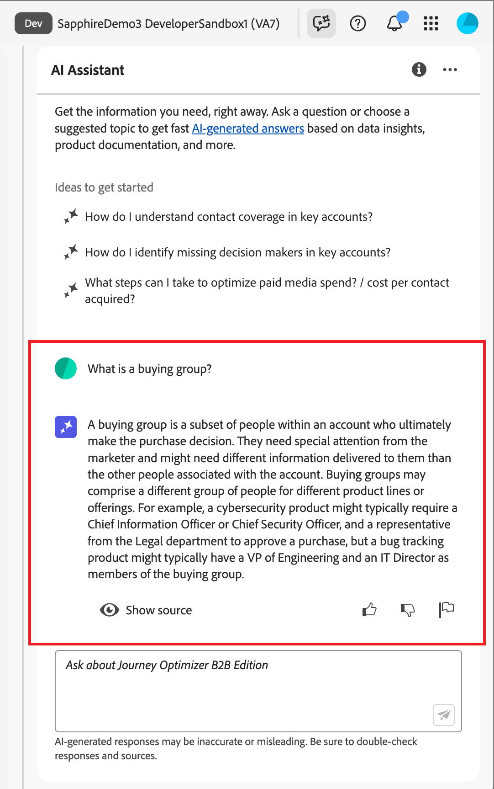

# 在 Journey Optimizer B2B Edition 中使用 AI 助手

在 Journey Optimizer B2B Edition 中，AI Assistant 是一項用戶介面功能，可用於了解產品概念、快速導航和了解 Journey Optimizer B2B Edition 功能，以及獲取特定環境的運營見解。 Adobe Experience Cloud的多個產品中也提供此功能。

>[!IMPORTANT]
>
>您必須先取得Adobe Experience Cloud Generative AI使用者指南的合約，才能使用AI助理。 如需有關本合約及使用方法的詳細資訊，請參閱[Adobe Experience Cloud Generative AI使用准則](https://www.adobe.com/tw/legal/licenses-terms/adobe-dx-gen-ai-user-guidelines.html)。

若要存取AI助理，請按一下標題中的圖示。 AI助理會在右側的面板中開啟。

{width="420" zoomable="yes"}

AI Assistant介面隨即顯示，立即為您提供開始使用的資訊。 您可以使用&#x200B;_Ideas下提供的選項開始使用_，以回答問題和命令，例如：

* 我帳戶的哪些歷程已發佈？
* 產生了哪些解決方案興趣？
* 告訴我 Journey Optimizer B2B 版的主要優點。

在 Adobe Systems Journey Optimizer B2B 版中，AI Assistant 支援以下用例：

## 產品知識

產品知識問題與Journey Optimizer B2B edition概念有關，與Adobe Journey Optimizer的各個方面相關。 產品知識問題的一些範例包括：

* 如何設定SMS提供者帳戶？
* 如何在帳戶歷程中傳送電子郵件？
* 如何個人化我的電子郵件內容？

若要詢問產品問題，請在面板底部的欄位中輸入，然後按Enter鍵。

{width="420" zoomable="yes"}

您可以檢閱每個產品知識答案中可用的引文，以驗證AI助理傳回的回應。

要視圖引文並驗證 AI 助手的回應，請選擇 **[!UICONTROL 顯示來源]**。

{width="420" zoomable="yes"}

AI 助手更新介面，併為你提供指向證實初始回應的文檔的連結。 此外，啟用引文後，AI Assistant 會更新回應以包含腳註，以指示引用所提供文檔的答案的特定部分。

使用向上或向下縮圖來評定答案的品質。

## 營運分析

操作insight問題與您的組織沙箱中的歷程物件有關。 insight操作問題或提示的一些範例包括：

* Adobe Journey Optimizer B2B edition中有多少個即時歷程？
* 提供所有已排程歷程的清單
* 過去7天內已建立多少歷程？

您必須在AI助理的有效沙箱中，才能針對有關您營運深入分析的問題提供足夠回應。

>[!NOTE]
>
>AI 助手運營見解問題支援的唯一 Adobe Systems Journey Optimizer B2B Edition 物件列在 [運營見解域表中](./ai-assistant-overview.md#operational-insights)。 它只能訪問您當前所在的沙箱的數據。

<!-- Select to view an example of an operational insights question.

In the following example, AI Assistant receives the following query: _Show me dataflows that were created using the Amazon S3 source._

screen

AI Assistant responds with a table list of your dataflows and their corresponding IDs. Click the _Download_ icon ( Download icon ) to download the table as a CSV file. To view the entire table, click the _Expand_ icon ( Expand icon ).

screen

An expanded view of the table appears, providing you with a more comprehensive list of dataflows based on the parameters of your query.

screen

When prompted with an operational insights question, AI Assistant provides an explanation of how it computed the answer. In the following example, AI Assistant outlines the steps it took in order to identify the dataflows that were created using the Amazon S3 source.

screen

You can also provide filters and modifications to your questions, and you can instruct AI Assistant to render its findings based on the filters that you include. For example, you can ask AI Assistant to show you a trend of the count of segment definitions in the order of their created date, remove segment definitions with zero total profiles, and use month names instead of integers when displaying the data.

### Verify operational insights responses

You can verify each response related to operational insights questions using an SQL query that AI Assistant provides.

Select to view example of verifying operational insights responses

After receiving an answer for an operational insights question, click **[!UICONTROL Show sources]** and then select **[!UICONTROL View source query]**.

screen

When queried with an operational insights question, AI Assistant provides an SQL query that you can use to verify the process that it took to compute its answer. This source query is for verification purposes only and is not supported on Query Service.

screen  

 -->
