# 在Journey Optimizer B2B edition中使用AI助理

在Journey Optimizer B2B edition中，AI Assistant是使用者介面功能，可用於瞭解產品概念、快速導覽並瞭解產品功能，以及取得您環境的營運見解。 Adobe Experience Cloud的多個產品中也提供此功能。

>[!IMPORTANT]
>
>您必須先取得Adobe Experience Cloud Generative AI使用者指南的合約，才能使用AI助理。 如需有關本合約及使用方法的詳細資訊，請參閱[Adobe Experience Cloud Generative AI使用准則](https://www.adobe.com/tw/legal/licenses-terms/adobe-dx-gen-ai-user-guidelines.html)。

若要存取AI助理，請按一下標題中的圖示。 AI助理會在右側的面板中開啟。

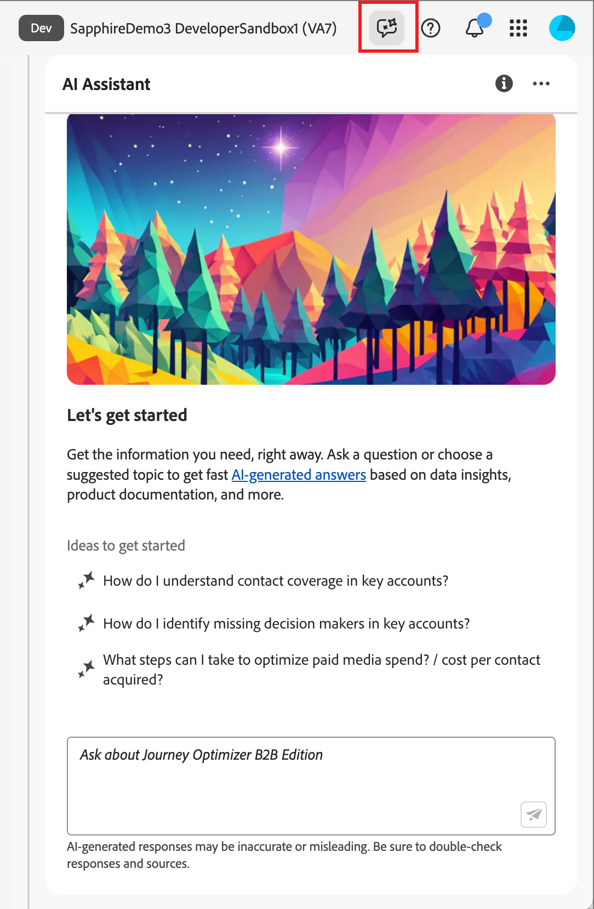{width="420"}

AI Assistant介面隨即顯示，立即為您提供開始使用的資訊。 您可以使用&#x200B;_Ideas下提供的選項開始使用_，以回答問題和命令，例如：

* 已發佈哪些歷程？
* 已建立哪些解決方案興趣？
* 告訴我Journey Optimizer B2B edition的主要優點。

在Adobe Journey Optimizer B2B edition中，AI Assistant支援下列使用案例：

## 提出產品知識問題

產品知識問題與Journey Optimizer B2B edition概念和操作說明資訊有關。 產品知識問題的一些範例包括：

* 如何設定SMS提供者帳戶？
* 如何在歷程中傳送電子郵件？
* 如何個人化我的電子郵件內容？

若要詢問產品問題，請在面板底部的欄位中輸入，然後按Enter鍵。 例如，當您需要瞭解如何在歷程中使用購買群組時。 在此情況下，請輸入&#x200B;_如何在歷程中使用購買群組？_&#x200B;在您提交問題之後，AI Assistant會查詢其知識庫，並在幾秒鐘內編譯答案。

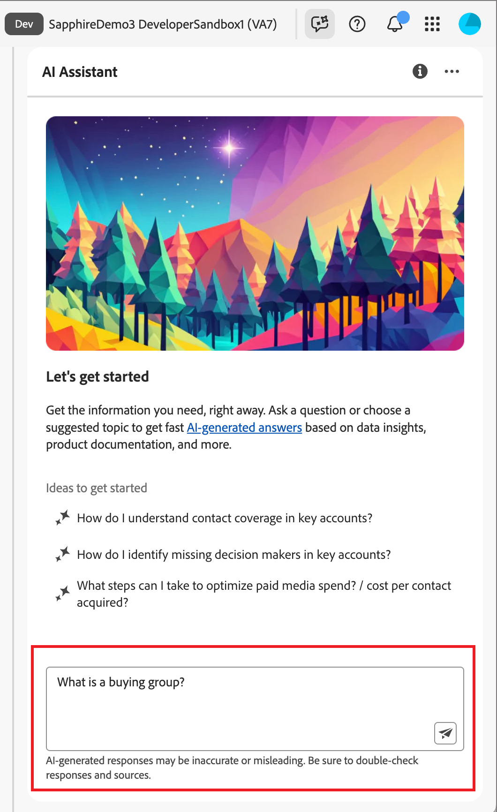{width="420"}

+++檢視範例答案

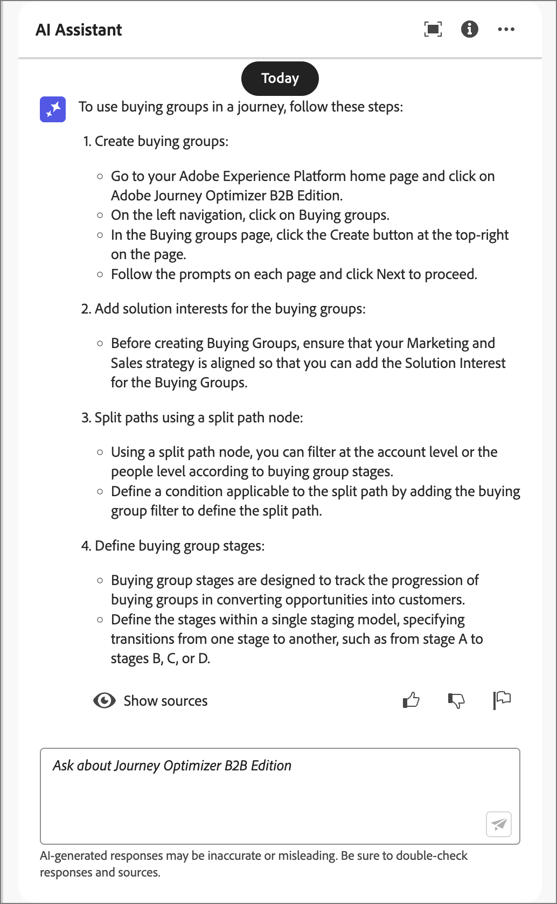{width="420"}

+++

## 提出營運見解問題

營運見解問題與組織沙箱中的歷程物件有關。 您可以詢問有關操作成品的問題，例如帳戶對象、帳戶歷程、解決方案興趣和購買群組範本。 營運見解問題或提示的一些範例包括：

* Adobe Journey Optimizer B2B edition中有多少個即時歷程？
* 提供所有已排程歷程的清單
* 過去7天內已建立多少歷程？

您必須在AI助理的有效沙箱中，才能針對有關您營運深入分析的問題提供足夠回應。

>[!NOTE]
>
>唯一受AI助理作業深入分析問題支援的Adobe Journey Optimizer B2B edition物件列在[作業深入分析網域表格](./ai-assistant-overview.md#operational-insights)中。 它只能存取您目前所在沙箱的資料。

若要提出營運見解問題，請在面板底部的欄位中輸入，然後按Enter鍵。 例如，當您想知道沙箱的對象時。 在此情況下，請輸入&#x200B;_有多少對象？_。  AI Assistant會提供沙箱中的對象計數，以及它如何計算答案的說明。 在下列範例回應中，AI助理提供存取UI中對象的連結，並概述識別對象數量所採取的步驟。

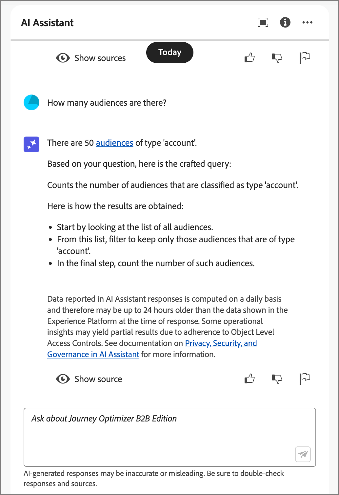{width="420"}

您可以透過要求成品清單來追蹤初始查詢，例如&#x200B;_依大小列出前5名_。 AI Assistant會傳回一個表格，其中包含查詢中的前五個專案及其對應的ID。 按一下「_下載_」（「）圖示，將表格下載為CSV檔案。

即時歷程清單的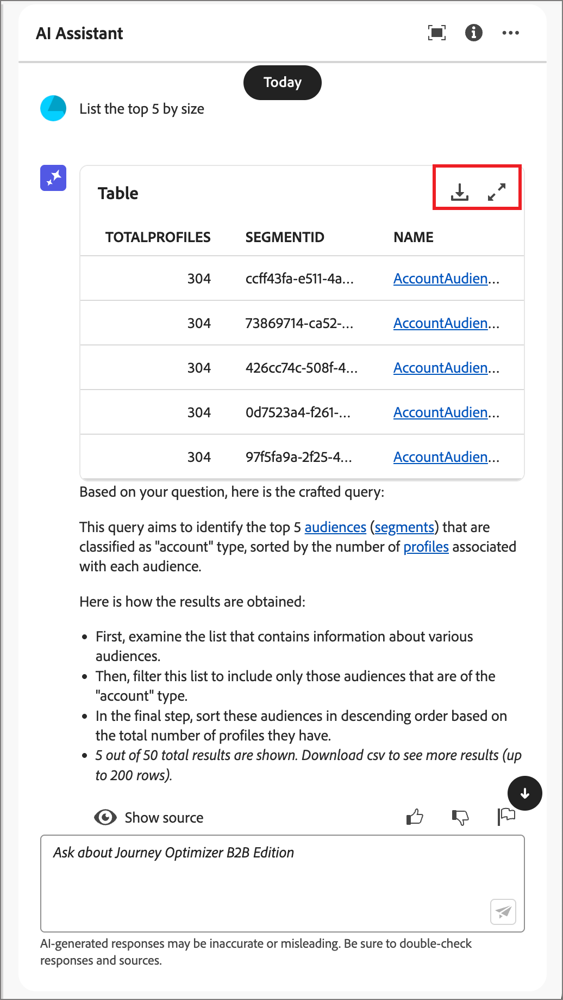{width="420"}

若要在AI助理中檢視整個表格，請按一下&#x200B;_最大化_ （  ）圖示。 在展開的表格檢視中，按一下&#x200B;**[!UICONTROL 下載CSV]**&#x200B;以將資訊儲存為CSV檔案。

即時歷程清單的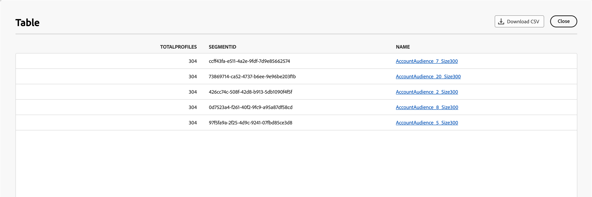{width="600" zoomable="yes"}

## 驗證回應

AI Assistant包含可用來驗證回應的工具。

### 產品知識來源

收到產品問題的回應後，請選取&#x200B;**[!UICONTROL 顯示來源]**&#x200B;以檢視用來產生AI助理回應之產品知識來源引文。

AI Assistant提供可證實初始回應的檔案連結。 它也會在回應中新增註腳，以指出參照連結檔案來源的回應的特定部分。

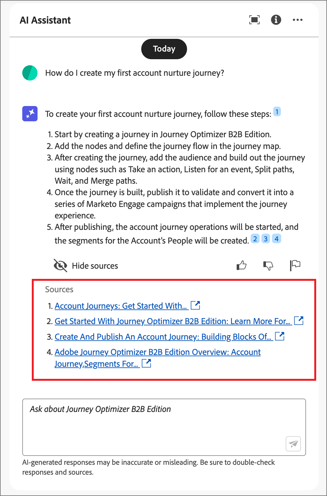{width="420"}

### 營運見解來源

收到作業性深入分析問題的回應之後，請按一下[顯示來源] **，然後選取[檢視來源查詢]**&#x200B;**。**

您可以使用AI助理提供的SQL查詢來驗證與操作深入分析問題相關的每個回應。 在查詢操作深入分析問題時，「AI助理」會提供SQL查詢，供您用來驗證計算答案所花費的程式。 此來源查詢僅供驗證之用，查詢服務不支援。

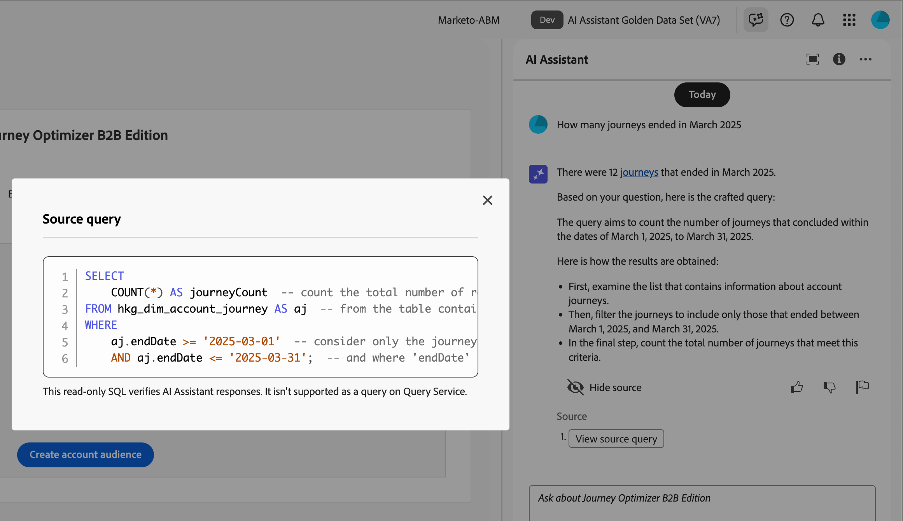{width="550" zoomable="yes"}

## 提供意見反應

使用&#x200B;_Thumb up_ ()或&#x200B;_Thumb down_ ()圖示來評價回應的實用性和品質。 根據您的經驗填寫簡短的問卷表單，然後按一下&#x200B;**[!UICONTROL 提交]**。 您提供的資訊會用於改善AI助理。

如果您發現回應中有問題，請按一下&#x200B;_標幟_ （  ）圖示。 使用表單描述問題，然後按一下&#x200B;**[!UICONTROL 提交]**&#x200B;報告問題。

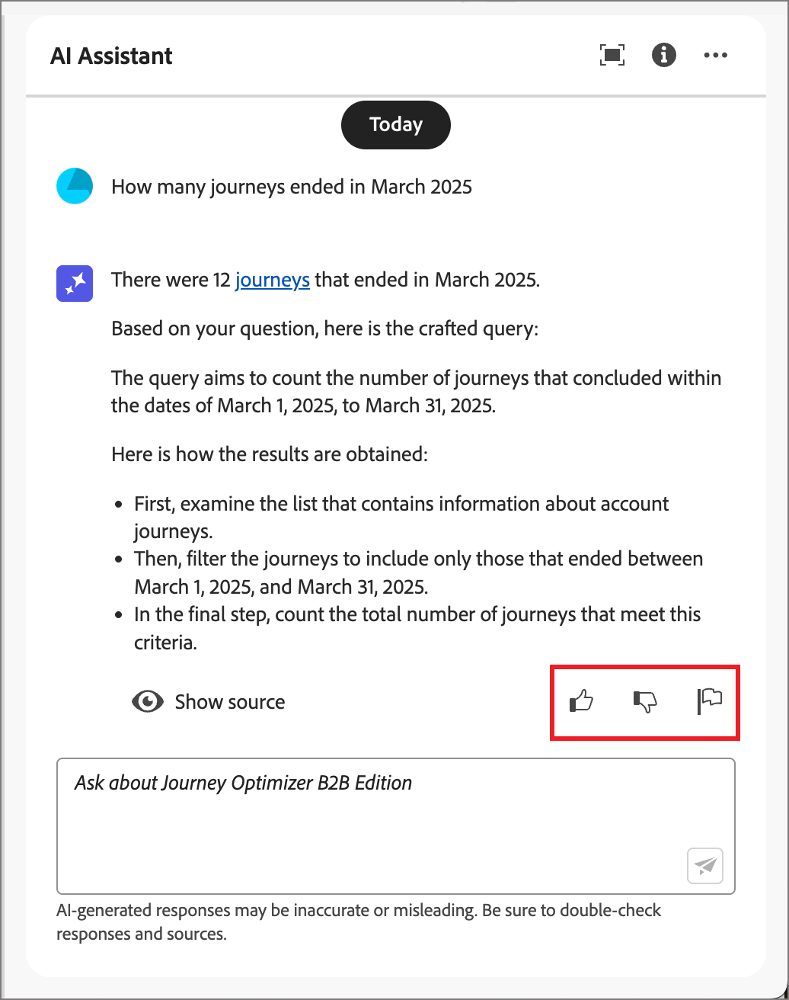{width="420"}

+++檢視表單

>[!BEGINTABS]

>[!TAB 向上縮圖]

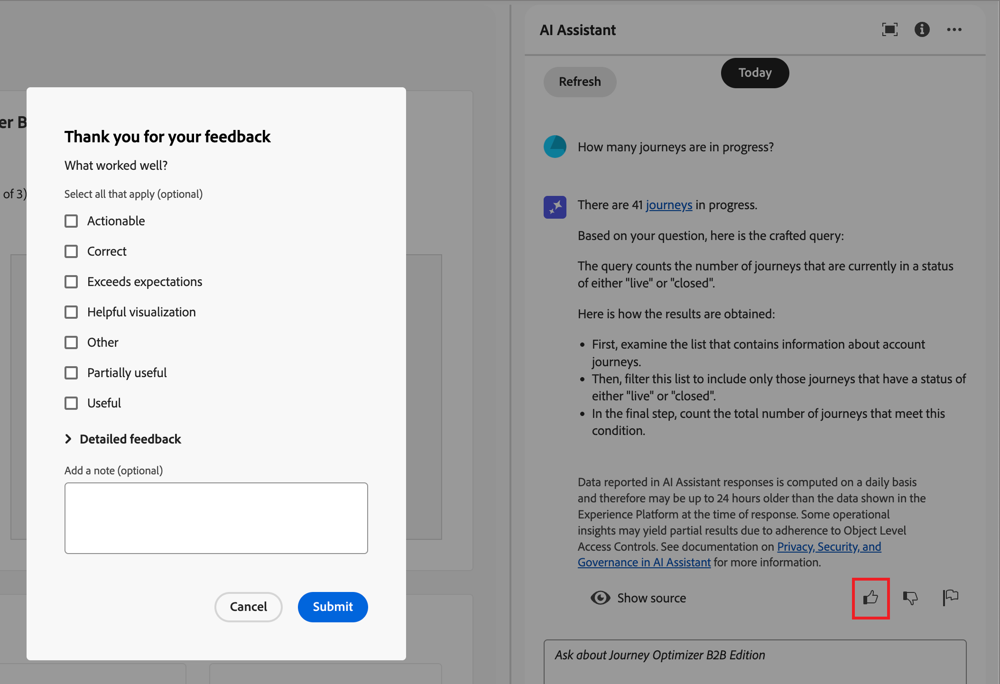{width="600" zoomable="yes"}

>[!TAB 按住縮圖]

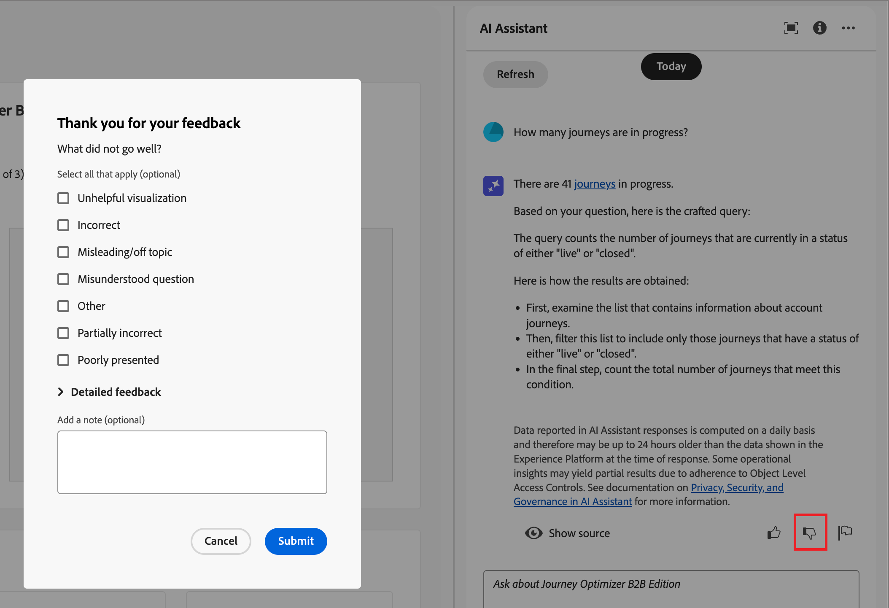{width="600" zoomable="yes"}

>[!TAB 旗標]

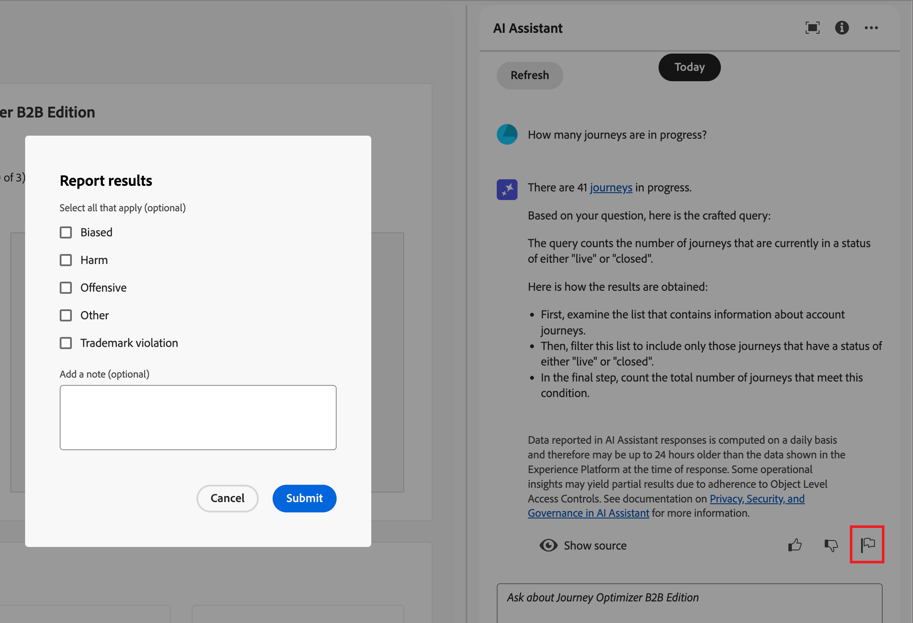{width="600" zoomable="yes"}

>[!ENDTABS]

+++
