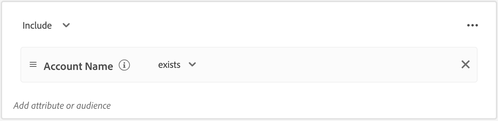

# 帳戶客群

客群是具有相似行為和/或特徵的一組人員。Journey Optimizer B2B Edition 使用 Adobe Real-Time Customer Data Platform B2B 和 B2P 版本中的帳戶細分功能。使用帳戶細分，使用者可以透過系統內任何 B2B 實體的資料來產生帳戶客群。這些帳戶客群將會成為 Journey Optimizer B2B Edition 帳戶歷程的輸入資料，以利順利啟用和提供個人化功能。

請參閱 [Adobe Experience Platform 細分服務文件](https://experienceleague.adobe.com/zh-hant/docs/experience-platform/segmentation/types/account-audiences){target="_blank"}，以了解帳戶客群及其定義方式。

## 帳戶客群工作流程

您可以將 Journey Optimizer B2B Edition 視為未出現在目標目錄中的 Experience Platform (AEP) 目標。使用以下步驟，在 Journey Optimizer B2B Edition 中啟用帳戶客群：

1. 在 AEP 中為您的資料建立結構描述。
1. 將您的資料收錄至 AEP。
1. 建立帳戶區段來評估您的資料。
1. 在 Journey Optimizer B2B Edition 中啟用您的評估資料。

在 Journey Optimizer B2B Edition 中，帳戶客群是基於帳戶的歷程之輸入資料，可讓您在這些帳戶中選擇目標人員。例如，您可以使用帳戶客群來獲取並不包含任何具有營運長 (COO) 或行銷長 (CMO) 職稱之人員聯絡資訊的帳戶記錄。

您可以使用 Journey Optimizer B2B Edition，直接從左側導覽建置 Adobe Experience Platform (AEP) 帳戶客群，並將其納入您的帳戶歷程中。

{width="800" zoomable="yes"}

## 建立帳戶客群

透過建立帳戶細分來定義帳戶客群。您可以選擇直接在 Journey Optimizer B2B Edition 應用程式中建立帳戶細分，或者可以使用 [客戶細分工具使用者介面](https://experienceleague.adobe.com/zh-hant/docs/experience-platform/segmentation/ui/segment-builder){target="_blank"}。您可以使用以下步驟，在 Journey Optimizer B2B Edition 中建立帳戶細分。

1. 在左側導覽中，選擇「**[!UICONTROL 帳戶]** > **[!UICONTROL 客群]**」。

1. 按一下右上角的「**[!UICONTROL 建立客群]**」。

1. 建置細分定義。

   左側導覽列顯示帳戶屬性和客群。在「_[!UICONTROL 屬性]_」索引標籤下，您可以新增 Platform 建立和自訂的屬性。拖曳每個屬性來建置此細分的邏輯。

   >[!TIP]
   >
   >建立帳戶客群時，請注意列在「_[!UICONTROL 人員]_」下的事件，因為這些屬性與人員相關。 
   >
   >在「_[!UICONTROL 客群]_」索引標籤下，您可以新增先前建立的基於人員的客群，並以此為基礎建立自己的帳戶客群。

   以下範例定義使用 `Country Code`、`Revenue Amount`，以及 `Market segment` 所建立的客群。其查詢內容將會是：「我想要美國境內屬於金融產業且收入超過 100 萬美元的所有帳戶」。

   {width="700" zoomable="yes"}
    

   >[!IMPORTANT]
   >
   >帳戶記錄的 `Account Name` 屬性必須包含要納入帳戶歷程中的值。如果此屬性為空 (null)，則排除此帳戶記錄。 
   >若要確保僅包含帳戶名稱非空白的帳戶，請新增「**[!UICONTROL 帳戶名稱]**」屬性，並選取「_[!UICONTROL 存在]_」做為相符的條件。 
   >{width="600"}
   > 如果您的帳戶名稱使用自訂屬性，請使用自訂屬性名稱取代「_[!UICONTROL 帳戶名稱]_」。

1. 按一下右上角的「**[!UICONTROL 儲存並關閉]**」。

若要啟用 Journey Optimizer B2B Edition 的帳戶客群，您必須[將其新增至帳戶歷程](../journeys/journey-overview.md#add-the-account-audience-for-your-journey)，並[發佈此歷程](../journeys/journey-overview.md)。
