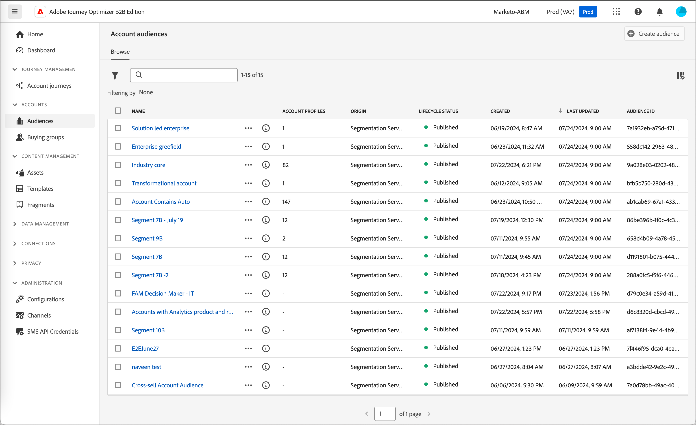
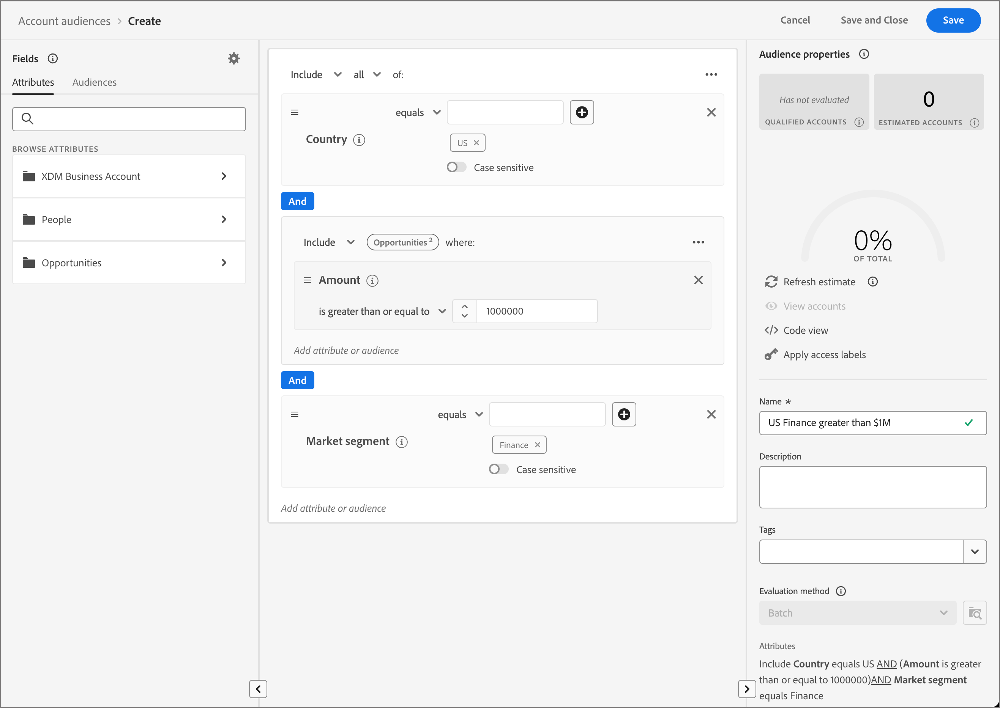

# 帳戶客群

受眾是指一組具有類似行為和/或特徵的人。 Journey Optimizer B2B版本使用Adobe Real-time Customer Data Platform B2B和B2P版本中的帳戶細分功能。 透過帳戶劃分，使用者可以利用系統內任何B2B實體的資料來產生帳戶受眾。 這些帳戶對象可作為Journey Optimizer B2B Edition帳戶歷程的輸入專案，促進順暢的啟動和個人化功能。

在[Adobe Experience Platform Segmentation Service檔案](https://experienceleague.adobe.com/en/docs/experience-platform/segmentation/ui/account-audiences)中進一步瞭解帳戶對象以及如何定義它們。

## 帳戶對象工作流程

您可以將Journey Optimizer B2B Edition視為未出現在目的地目錄中的Experience Platform(AEP)目的地。 使用下列步驟在Journey Optimizer B2B Edition啟用帳戶對象：

1. 在AEP中為您的資料建立結構描述。
1. 將您的資料內嵌至AEP。
1. 建立帳戶區段以評估您的資料。
1. 將評估過的資料啟用至Journey Optimizer B2B版本。

在Journey Optimizer B2B Edition中，帳戶受眾會用作帳戶型歷程的輸入，可讓您鎖定這些帳戶內的人員。 例如，您可以使用帳戶受眾來擷取所有帳戶的記錄，這些帳戶沒有任何職銜為首席營運官(COO)或首席行銷官(CMO)之人員的聯絡資訊。

Journey Optimizer B2B Edition可讓您直接從左側導覽建立Adobe Experience Platform (AEP)帳戶對象，並將其合併到您的帳戶歷程中。

{width="800" zoomable="yes"}

## 建立帳戶對象

透過建立帳戶細分來定義帳戶對象。 您可以選擇直接在Journey Optimizer B2B Edition應用程式中建立帳戶細分，或使用[區段產生器UI](https://experienceleague.adobe.com/en/docs/experience-platform/segmentation/ui/segment-builder)。 以下是您可以在Journey Optimizer B2B Edition中建立帳戶細分的步驟。

1. 在左側導覽列中，選擇&#x200B;**[!UICONTROL 帳戶]** > **[!UICONTROL 對象]**。

1. 按一下右上方的&#x200B;**[!UICONTROL 建立對象]**。

1. 建立區段定義。

   帳戶屬性和對象會顯示在左側導覽列上。 在&#x200B;_[!UICONTROL 屬性]_&#x200B;標籤下，您可以同時新增Platform建立和自訂屬性。 拖曳每個屬性以建立區段的邏輯。

   >[!TIP]
   >
   >建立帳戶對象時，請注意事件列在&#x200B;_[!UICONTROL 人員]_&#x200B;下，因為這些屬性與人員相關聯。 
   >
   >在&#x200B;_[!UICONTROL 對象]_&#x200B;標籤下方，您可以新增先前建立的以人物為基礎的對象，以便在建立您自己的帳戶對象時建置。

   下列範例定義使用`Country Code`、`Revenue Amount`和`Market segment`建立的對象。 英文的查詢是：「我想要美國收入超過$100萬美元且處於「財務區段」的所有帳戶。」

   {width="700" zoomable="yes"}

1. 按一下右上角的&#x200B;**[!UICONTROL 儲存並關閉]**。

若要啟用Journey Optimizer B2B Edition的帳戶對象，您必須[將其新增至帳戶歷程](../journeys/journey-overview.md#add-the-account-audience-for-your-journey)，然後[發佈歷程](../journeys/journey-overview.md)。
