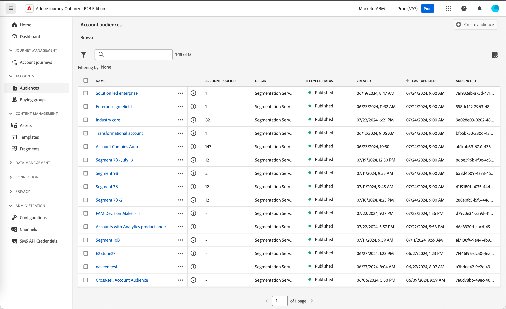
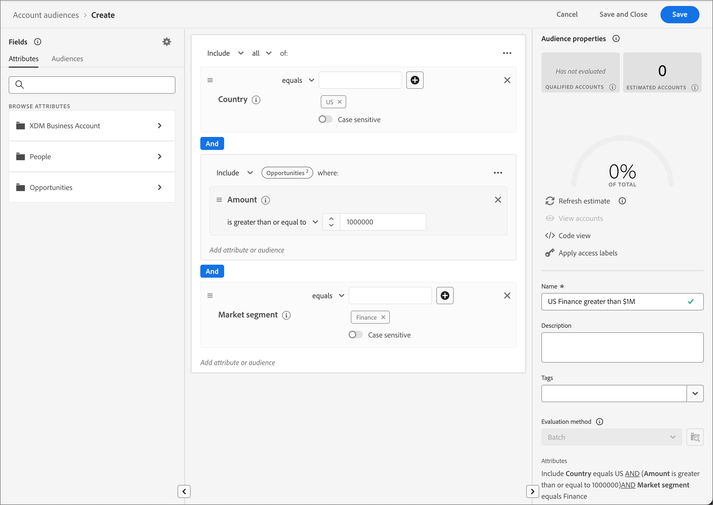
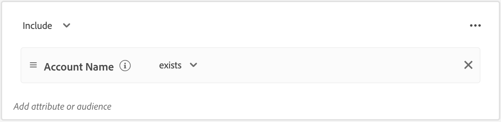

# 帳戶客群

客群是具有相似行為和/或特徵的一組人員。 Journey Optimizer B2B Edition 使用 Adobe Real-Time Customer Data Platform B2B 和 B2P 版本中的帳戶細分功能。 使用帳戶細分，使用者可以透過系統內任何 B2B 實體的資料來產生帳戶客群。 這些帳戶客群將會成為 Journey Optimizer B2B Edition 帳戶歷程的輸入資料，以利順利啟用和提供個人化功能。

請參閱 [Adobe Experience Platform 細分服務文件](https://experienceleague.adobe.com/zh-hant/docs/experience-platform/segmentation/types/account-audiences){target="_blank"}，以了解帳戶客群及其定義方式。

## 帳戶客群工作流程

Journey Optimizer B2B edition可當作不會出現在目的地目錄中的Experience Platform (AEP)目的地。 使用以下步驟，在 Journey Optimizer B2B Edition 中啟用帳戶客群：

1. 在 AEP 中為您的資料建立結構描述。
1. 將您的資料收錄至 AEP。
1. 建立帳戶區段來評估您的資料。
1. 在 Journey Optimizer B2B Edition 中啟用您的評估資料。

在 Journey Optimizer B2B Edition 中，帳戶客群是基於帳戶的歷程之輸入資料，可讓您在這些帳戶中選擇目標人員。 例如，您可以使用帳戶客群來獲取並不包含任何具有營運長 (COO) 或行銷長 (CMO) 職稱之人員聯絡資訊的帳戶記錄。

您可以使用 Journey Optimizer B2B Edition，直接從左側導覽建置 Adobe Experience Platform (AEP) 帳戶客群，並將其納入您的帳戶歷程中。

{width="800" zoomable="yes"}

## 建立帳戶客群

透過建立帳戶區段來定義帳戶對象。 您可以選擇直接在Journey Optimizer B2B edition應用程式中建立帳戶區段，也可以使用[區段產生器UI](https://experienceleague.adobe.com/zh-hant/docs/experience-platform/segmentation/ui/segment-builder){target="_blank"}。 以下是您可以在Journey Optimizer B2B edition中建立帳戶區段的步驟。

1. 在左側導覽中，選擇「**[!UICONTROL 帳戶]** > **[!UICONTROL 客群]**」。

1. 按一下右上角的「**[!UICONTROL 建立客群]**」。

1. 建置區段定義。

   左側導覽列顯示帳戶屬性和客群。 在「_[!UICONTROL 屬性]_」索引標籤下，您可以新增 Platform 建立和自訂的屬性。 若要建立區段的邏輯，請拖曳每個屬性。

   >[!TIP]
   >
   >建立帳戶客群時，請注意列在「_[!UICONTROL 人員]_」下的事件，因為這些屬性與人員相關。 
   >
   >在「_[!UICONTROL 客群]_」索引標籤下，您可以新增先前建立的基於人員的客群，並以此為基礎建立自己的帳戶客群。

   下列範例定義使用`Country Code`、`Revenue Amount`和`Market segment`建立的對象。 英文的查詢是：「我想要財務區段中收入超過$100萬美元的所有美國帳戶。」

   {width="700" zoomable="yes"}
    

   >[!IMPORTANT]
   >
   >帳戶記錄的 `Account Name` 屬性必須包含要納入帳戶歷程中的值。 如果此屬性是空的(null)，則會排除帳戶記錄。 
   >若要確保只包含具有非空白帳號名稱的帳號，請新增&#x200B;**[!UICONTROL 帳號名稱]**&#x200B;屬性，並選取&#x200B;_[!UICONTROL 存在]_&#x200B;做為符合條件。 
   >{width="600"}
   > 如果您的帳戶名稱使用自訂屬性，請使用自訂屬性名稱取代「_[!UICONTROL 帳戶名稱]_」。

1. 按一下右上角的「**[!UICONTROL 儲存並關閉]**」。

若要啟用 Journey Optimizer B2B Edition 的帳戶客群，您必須[將其新增至帳戶歷程](../journeys/account-audience-nodes.md)，並[發佈此歷程](../journeys/journeys-overview.md)。
