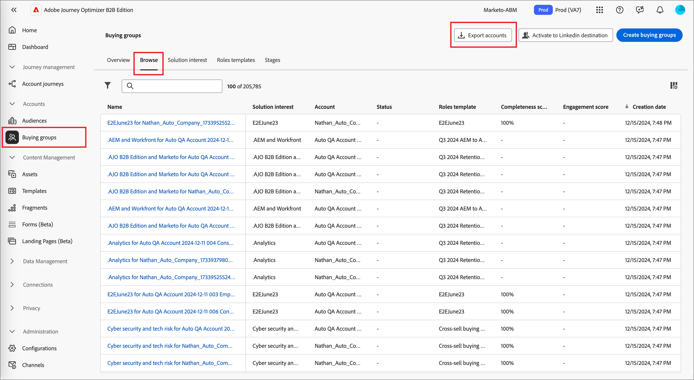
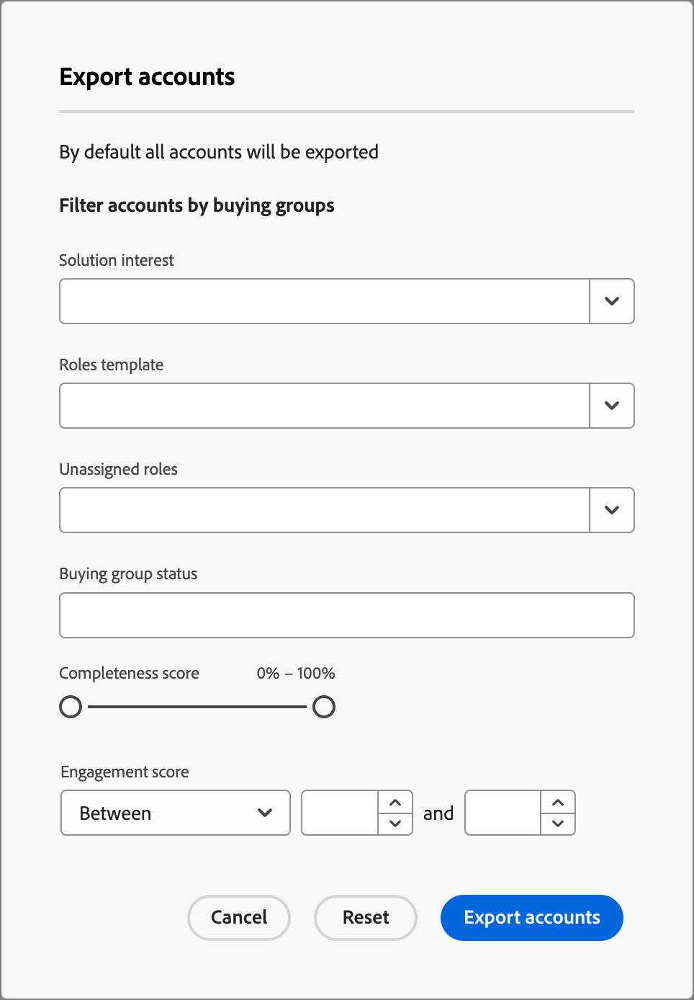
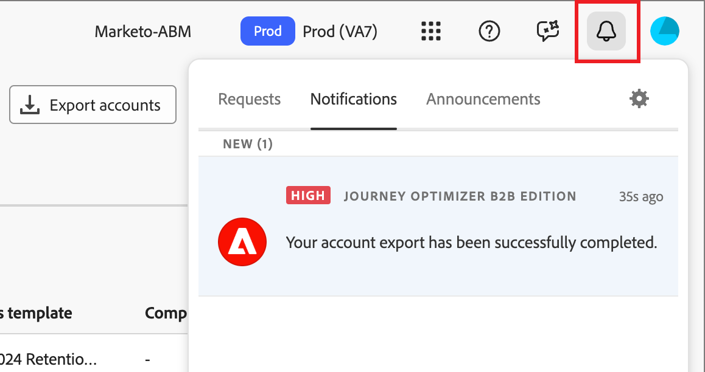

# 匯出帳戶

使用&#x200B;_匯出帳戶_&#x200B;功能，根據您定義的篩選器匯出所有帳戶或一組帳戶。匯出流程會產生一個 CSV 檔案，並透過即時簡短通知傳送所儲存檔案的 URL。在需要時，您可以使用此功能將帳戶移動至第三方平台。

1. 在 Journey Optimizer B2B Edition，前往左側導覽中的「**[!UICONTROL 帳戶]** > **[!UICONTROL 購買群組]**」。

1. 選取「**[!UICONTROL 瀏覽]**」索引標籤。

1. 按一下右上角的「**[!UICONTROL 匯出帳戶]**」。

   {width="800" zoomable="yes"}

1. 在對話框中，定義要匯出的帳戶客群參數。

   {width="400"}

   在「**[!UICONTROL 參與度分數]**」中，`Between` 運算子是包含性的，百分比範圍亦同。例如，5.1 和 5 均是在 5 和 6 _之間_。

   空白篩選參數被視為 `Is Any`。

1. 按一下「**[!UICONTROL 匯出帳戶]**」，使用特定篩選器來產生 CSV 檔案。

1. 當您收到匯出完成的通知時，按一下通知連結即可存取該 CSV 檔案。

   {width="425"}

   >[!NOTE]
   >
   >如果您已在 Adobe 使用者帳戶偏好設定中設定了電子郵件訂閱通知，便可能會收到電子郵件通知。

   應用程式頁面將重新導向至「_購買群組_」瀏覽索引標籤，且系統會顯示儲存檔案對話框來提示您將檔案儲存至系統。如需共用資料，可以使用團隊的檔案分享系統。
