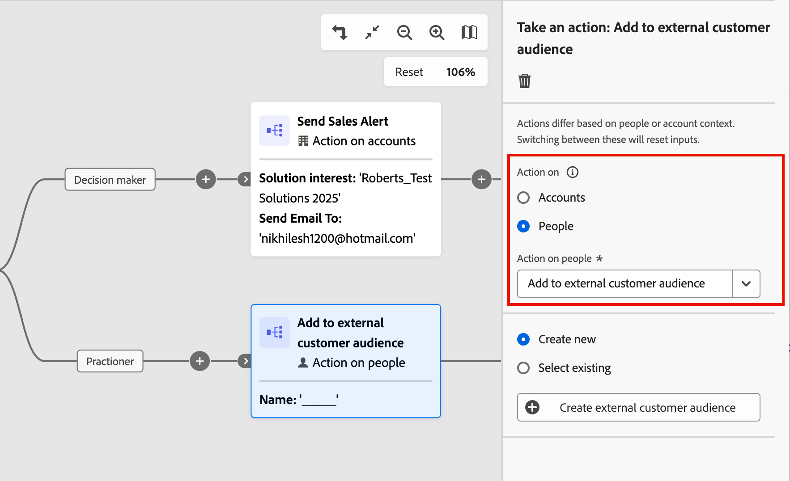
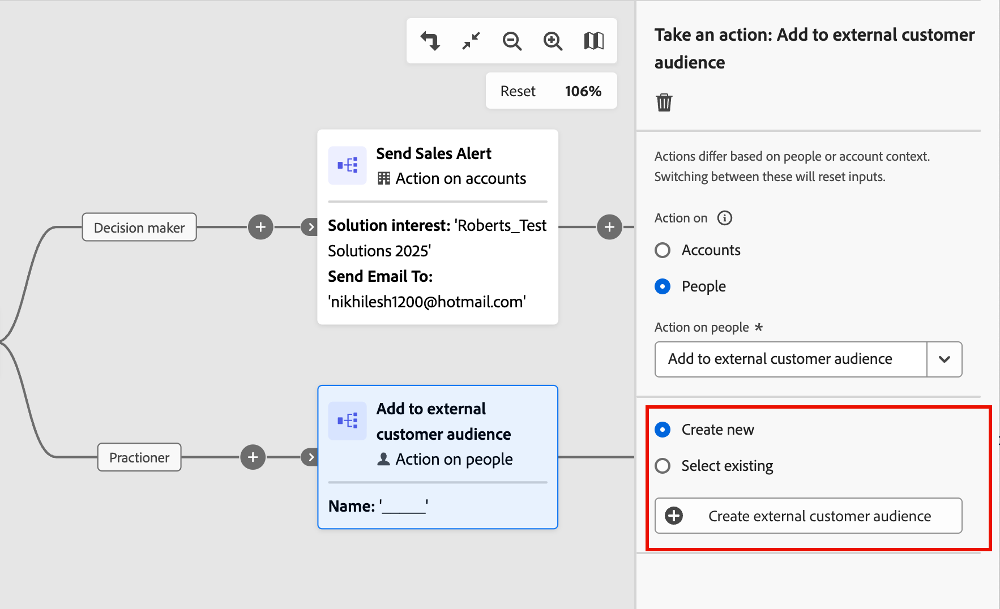
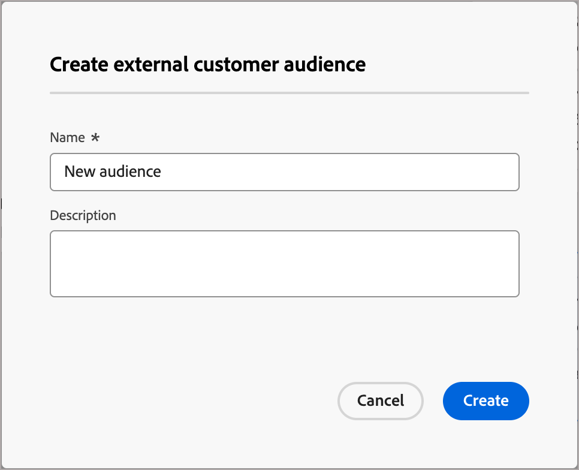
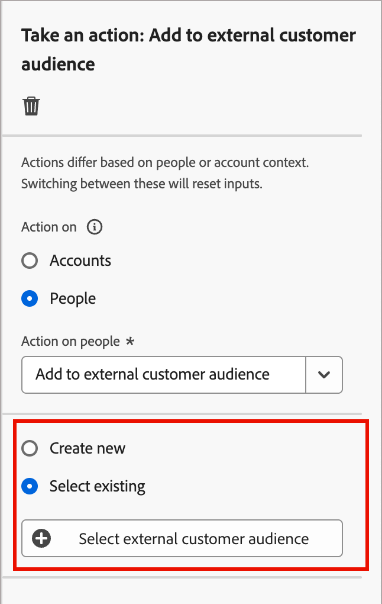
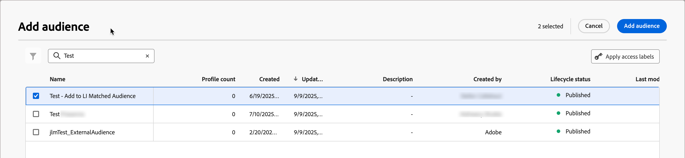
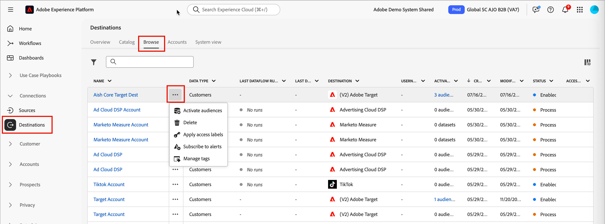
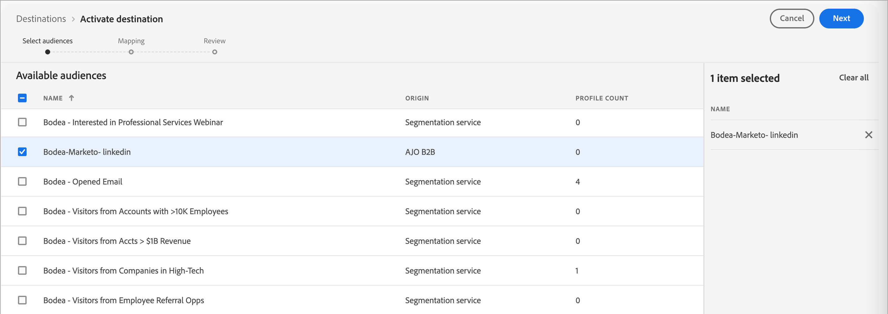
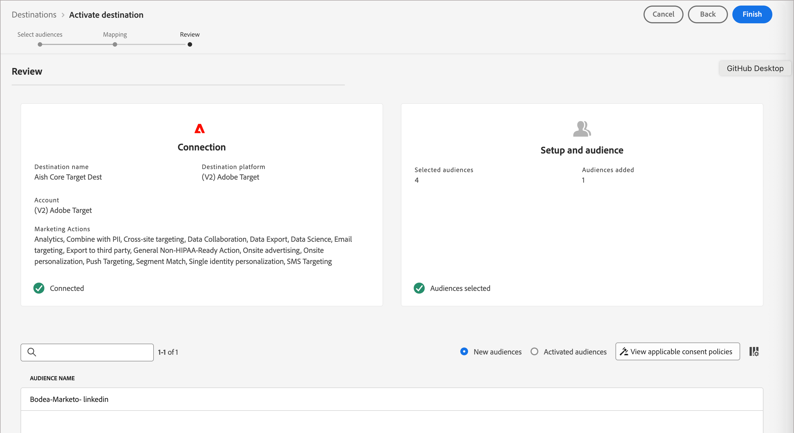

# [!DNL Adobe Target]個外部對象

您可以透過帳戶歷程在[!DNL Adobe Target]中啟用及個人化外部對象的體驗。 使用此整合來達成進階和量身打造的個人化，以提升參與度，並維持[!DNL Target]和[!DNL Journey Optimizer B2B Edition]的跨平台一致性。 這種一致性確保團隊在整個B2B購買者歷程中，針對購買群組調整並個人化網路管道。

透過Adobe Target啟用外部對象有兩個步驟的工作流程：

1. [從歷程新增至外部客戶對象](#add-to-customer-external-audience-from-a-journey)。
2. [啟用外部對象](#activate-the-external-audience-to-target-as-a-destination)至[!DNL Target]，作為Experience Platform中的目的地。

## 從歷程新增至客戶外部對象

在您的歷程中，[新增&#x200B;_採取動作_&#x200B;節點](../journeys/action-nodes.md)以執行&#x200B;_[!UICONTROL 新增至外部客戶對象]_&#x200B;動作。 動作通常是您因某種觸發器（例如事件或之前的動作）而想要發生的動作。 歷程會在具有人員設定檔的合格帳戶到達節點時執行動作。

>[!NOTE]
>
>當具有人員設定檔的合格帳戶到達已發佈歷程中的&#x200B;_新增到外部客戶對象_&#x200B;節點時，這些設定檔可能需要48小時才能填入外部對象中。

1. 在歷程畫布中選取&#x200B;_採取動作_&#x200B;節點，選擇&#x200B;__&#x200B;人員&#x200B;**[!UICONTROL 上的]**&#x200B;動作選項。

1. 若要對人員&#x200B;_[!UICONTROL 執行]_&#x200B;動作，請選擇&#x200B;**[!UICONTROL 新增至外部客戶對象]**。

   {width="550" zoomable="yes"}

1. 從右側的節點屬性中，設定外部對象。

   * 如果已經建立一或多個外部對象，您可以選擇&#x200B;**[!UICONTROL 選取現有]**&#x200B;和[選取您要使用的對象](#choose-an-external-audience)。

   * 如果您要[建立對象](#create-an-external-audience)以用於節點，請選擇&#x200B;**[!UICONTROL 新建]**。

### 建立外部對象

1. 在節點屬性中選擇&#x200B;**[!UICONTROL 新建]**&#x200B;選項後，按一下&#x200B;**[!UICONTROL 建立外部客戶對象]**。

   {width="400"}

1. 在對話方塊中，為新對象輸入&#x200B;**[!UICONTROL Name]** （必要）和&#x200B;**[!UICONTROL Description]** （選用）。

   {width="400"}

1. 按一下&#x200B;**[!UICONTROL 建立]**。

   系統會建立新對象並顯示確認訊息。 然後，您可以繼續將它用作節點動作的現有對象。

### 選取外部對象

1. 在節點屬性中選擇&#x200B;**[!UICONTROL 選取現有]**&#x200B;選項後，按一下&#x200B;**[!UICONTROL 選取外部客戶對象]**。

   {width="300"}

1. 在&#x200B;_[!UICONTROL 新增對象]_&#x200B;對話方塊中，選取您要使用的對象。

   您可以在&#x200B;_搜尋_&#x200B;欄位中輸入文字，以篩選顯示的專案以符合對象名稱。

   {width="700" zoomable="yes"}

1. 按一下&#x200B;**[!UICONTROL 新增對象]**。

## 將外部對象啟用至Target作為目的地

若要啟用外部對象至Adobe Target，您必須將[!DNL Adobe Target]設定為[!DNL Real-time Customer Data Platform (RTCDP)]中的目的地。 如需此設定的詳細資訊，請參閱[RTCDP檔案](https://experienceleague.adobe.com/zh-hant/docs/platform-learn/tutorials/destinations/target/configure-the-target-destination){target="_blank"}。

>[!IMPORTANT]
>
>若要透過歷程使用啟用，您的RTCDP實作需要使用電子郵件地址作為身分。

啟用程式需要您將[!DNL Adobe Target]新增為外部對象或外部目的地。 首先，請在對象產生器中建立[!DNL Target]對象。 您也可以建立預留位置對象並新增外部對象功能。

>[!BEGINSHADEBOX]

這些步驟需要您指派之使用者角色的下列許可權：

* **[!UICONTROL Experience Platform]** — 針對&#x200B;_[!UICONTROL 目的地]_&#x200B;資源： `Activate Destinations`、`Manage and Activate Dataset Destination`和`View Destination`
* **[!DNL Target]** - `Approver`

>[!ENDSHADEBOX]

1. 在Experience Platform中，前往左側導覽中的&#x200B;**[!UICONTROL 連線]** > **[!UICONTROL 目的地]**。

1. 選取「**[!UICONTROL 瀏覽]**」索引標籤。

1. 找到您要用來啟用區段的目的地連線，按一下名稱旁的&#x200B;_更多功能表_ ( **...** )圖示，然後選擇&#x200B;**[!UICONTROL 啟用對象]**。

   在&#x200B;_[!UICONTROL 搜尋]_&#x200B;欄位中輸入文字，依名稱篩選顯示的相符專案。

   {width="800" zoomable="yes"}

1. 在&#x200B;_[!UICONTROL 可用對象]_&#x200B;清單中，選取您的外部對象，然後按一下&#x200B;**[!UICONTROL 下一步]**。

   {width="700" zoomable="yes"}

1. 執行任何其他欄位對應到目的地（選擇性），然後按一下&#x200B;**[!UICONTROL 下一步]**。

1. 檢閱新的對象引數，然後按一下&#x200B;**[!UICONTROL 完成]**。

   {width="700" zoomable="yes"}

啟用後，您可以在[Adobe Target對象](https://experienceleague.adobe.com/zh-hant/docs/target/using/audiences/create-audiences/audiences#use-list){target="_blank"}中看到對象，並在Adobe Target活動中使用這些對象。

