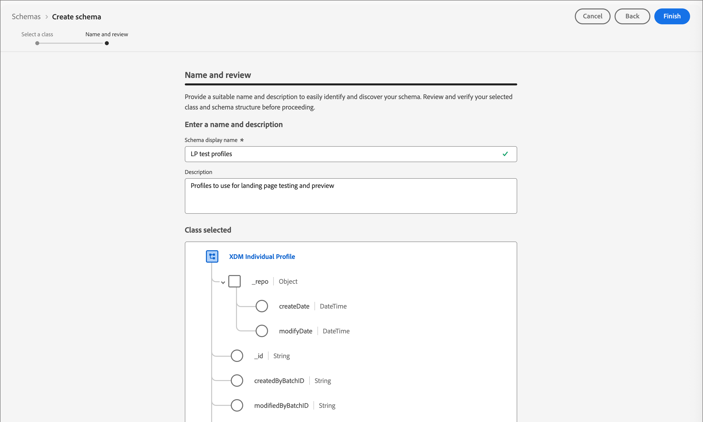
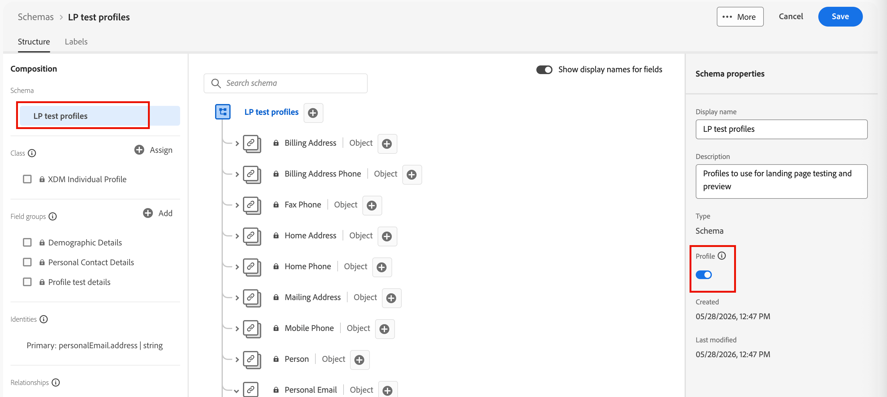

# 測試設定檔 {#test-profiles}

在Journey Optimizer B2B edition中[預覽和測試登入頁面內容](../content/landing-pages-create-publish.md#test-landing-page)需要測試設定檔。 您可以透過建立結構、建立資料集及上傳CSV檔案來定義一組測試設定檔。

<!--
>[!NOTE]
>
>[!DNL Journey Optimizer B2B Edition] allows testing different variants of your content by previewing it and sending proofs using sample input data uploaded from a CSV or JSON file, or added manually. 
-->

建立測試設定檔類似於在[!DNL Adobe Experience Platform]中建立一般設定檔。 如需詳細資訊，請參閱[即時客戶個人檔案檔案](https://experienceleague.adobe.com/docs/experience-platform/profile/home.html?lang=zh-Hant){target="_blank"}。


## 建立結構描述 {#create-schema}

若要建立設定檔，您必須先在[!DNL Journey Optimizer B2B Edition]中建立結構描述。

1. 展開左側導覽中的&#x200B;**[!UICONTROL 資料管理]**，選取&#x200B;**[!UICONTROL 結構描述]**，然後按一下右上方的&#x200B;**[!UICONTROL 建立結構描述]**。

   ![具有[建立結構描述]按鈕的結構描述功能表](./assets/create-schema.png){width="800" zoomable="yes"}

1. 選取&#x200B;**[!UICONTROL Standard]**&#x200B;作為結構描述建立選項。

1. 選取結構描述型別，例如&#x200B;**[!UICONTROL 手動]**，然後按一下&#x200B;**[!UICONTROL 選取]**。

   ![已選取[手動]建立選項的結構描述型別選擇](./assets/create-schema-options.png){width="500"}

1. 選取結構描述型別，例如&#x200B;**[!UICONTROL 個別設定檔]**，然後按一下&#x200B;**[!UICONTROL 下一步]**。

   {width="700" zoomable="yes"}

1. 輸入結構描述的名稱（必要）和說明（選用），然後按一下&#x200B;**[!UICONTROL 完成]**。

   {width="700" zoomable="yes"}

   結構描述結構已顯示，左邊有&#x200B;_[!UICONTROL 構成]_&#x200B;面板。

1. 在&#x200B;**[!UICONTROL 欄位群組]**&#x200B;區段中，按一下&#x200B;**[!UICONTROL 新增]**&#x200B;並選取適當的欄位群組。

   使用搜尋工具來尋找並選取&#x200B;**[!UICONTROL 設定檔測試詳細資料]**&#x200B;欄位群組。

   {width="700" zoomable="yes"}

   完成後，按一下&#x200B;**[!UICONTROL 新增欄位群組]**，然後欄位群組清單會顯示在結構描述概觀畫面上。

   重複此步驟以新增您想要用於測試設定檔的其他欄位群組，例如&#x200B;**[!UICONTROL 個人聯絡詳細資訊]**&#x200B;和&#x200B;**[!UICONTROL 工作聯絡詳細資訊]**。

1. 在欄位清單中，按一下要定義為主要身分的欄位。

1. 在&#x200B;_[!UICONTROL 欄位屬性]_&#x200B;右側窗格中，檢查&#x200B;**[!UICONTROL 身分]**&#x200B;和&#x200B;**[!UICONTROL 主要身分]**&#x200B;選項，並選取名稱空間。

   如果您希望主要身分識別是電子郵件地址，請選擇&#x200B;**[!UICONTROL 電子郵件]**&#x200B;名稱空間。

   用於選取主要身分的{width="700" zoomable="yes"}

   按一下&#x200B;**[!UICONTROL 套用]**。

1. 選取結構描述並啟用&#x200B;**[!UICONTROL 結構描述屬性]**&#x200B;窗格中的&#x200B;**[!UICONTROL 設定檔]**&#x200B;選項。

   {width="700" zoomable="yes"}

1. 按一下&#x200B;**[!UICONTROL 儲存]**。

如需建立結構描述的詳細資訊，請參閱[XDM檔案](https://experienceleague.adobe.com/docs/experience-platform/xdm/ui/resources/schemas.html#prerequisites){target="_blank"}。

>[!IMPORTANT]
>
>建立或取代測試設定檔擷取的資料集時，請確保結構描述具有套用至預定名稱空間之主要身分欄位(`/personID`)的正確身分描述項。 如果身分描述項遺失或設定不正確，即使擷取程式成功完成，擷取至此資料集的設定檔可能不會標示為測試設定檔(`testProfile = true`)。
>
>如果您的測試設定檔在擷取後未正確標幟：
>
>1. 檢閱與資料集相關聯的結構描述。
>1. 確認主要身分欄位具有適用於您名稱空間的正確身分描述項。
>1. 如果缺少描述項，請更新結構描述以新增身分描述項並重新內嵌資料。

## 建立資料集 {#create-dataset}

建立結構描述後，請建立用來匯入設定檔的資料集。 如需建立資料集的詳細資訊，請參閱[目錄服務檔案](https://experienceleague.adobe.com/docs/experience-platform/catalog/datasets/user-guide.html#getting-started){target="_blank"}。

1. 在左側導覽的&#x200B;_[!UICONTROL 資料管理]_&#x200B;下，選取&#x200B;**[!UICONTROL 資料集]**。

1. 按一下右上角的&#x200B;**[!UICONTROL 建立資料集]**。

   ![資料集功能表包含[建立資料集]按鈕](./assets/create-dataset.png){width="800" zoomable="yes"}

1. 選擇&#x200B;**[!UICONTROL 從結構描述建立資料集]**。

   {width="500"}

1. 選取先前建立的結構描述，然後按一下&#x200B;**[!UICONTROL 下一步]**。

1. 選擇名稱並按一下&#x200B;**[!UICONTROL 完成]**。

   {width="700" zoomable="yes"}

1. 在右側面板中，啟用&#x200B;**[!UICONTROL 設定檔]**&#x200B;選項。

## 使用CSV檔案建立測試設定檔 {#create-test-profiles-csv}

在[!DNL Adobe Experience Platform]中，您可以上傳包含不同設定檔欄位的CSV檔案來建立設定檔。 這是最簡單的方法。

1. 使用試算表軟體建立簡單的CSV檔案。

1. 為每個必要欄位新增一欄。

   請確定您新增主要身分欄位(`personID`)，並將`testProfile`欄位設為`true`。

1. 為每個設定檔新增一行，並為每個欄位新增值。

   {width="600" zoomable="yes"}

1. 將試算表儲存為csv檔案，並請務必使用逗號做為分隔符號。

1. 在[!DNL Adobe Experience Platform]中，導覽至&#x200B;**[!UICONTROL 工作流程]**。

1. 選擇&#x200B;**[!UICONTROL 將CSV對應到XDM結構描述]**，然後按一下&#x200B;**[!UICONTROL 啟動]**。

   {width="800" zoomable="yes"}

1. 選取要用於匯入的資料集，然後按一下&#x200B;**[!UICONTROL 下一步]**。

   {width="700" zoomable="yes"}

1. 按一下&#x200B;**[!UICONTROL 選擇檔案]**&#x200B;並選取CSV檔案，或從您的系統拖放檔案。

   檔案上傳完成之後，按一下&#x200B;**[!UICONTROL 下一步]**。

   {width="700" zoomable="yes"}

1. 將來源csv欄位對應到結構描述欄位，然後按一下&#x200B;**[!UICONTROL 完成]**。

   {width="700" zoomable="yes"}

   資料匯入隨即開始。 狀態從&#x200B;_處理_&#x200B;移至&#x200B;_成功_。

1. 在右上方，按一下&#x200B;**[!UICONTROL 預覽資料集]**，然後檢查新增至資料集的測試設定檔是否正確。

   {width="700" zoomable="yes"}

   然後可以使用測試設定檔來[測試登入頁面內容](../content/landing-pages-create-publish.md#test-landing-page)。

>[!NOTE]
>
>如需CSV資料匯入的詳細資訊，請參閱[資料擷取檔案](https://experienceleague.adobe.com/docs/experience-platform/ingestion/tutorials/map-a-csv-file.html#tutorials){target="_blank"}。

<!--
## Create test profiles using API calls {#create-test-profiles-api}

You can also create test profiles via API calls. Learn more in [[!DNL Adobe Experience Platform] documentation](https://experienceleague.adobe.com/docs/experience-platform/profile/home.html){target="_blank"}.

You must use a Profile schema that contains the **[!UICONTROL Profile test details]** field group. The `testProfile` flag is part of this field group.
When creating a profile, make sure you pass the value: `testProfile = true`.

You can also update an existing profile to change its `testProfile` flag to `true`.

Here is an example of an API call to create a test profile:

```bash
curl -X POST \
'https://dcs.adobedc.net/collection/xxxxxxxxxxxxxx' \
-H 'Cache-Control: no-cache' \
-H 'Content-Type: application/json' \
-H 'Postman-Token: xxxxx' \
-H 'cache-control: no-cache' \
-H 'x-api-key: xxxxx' \
-H 'x-gw-ims-org-id: xxxxx' \
-d '{
"header": {
"msgType": "xdmEntityCreate",
"msgId": "xxxxx",
"msgVersion": "xxxxx",
"xactionid":"xxxxx",
"datasetId": "xxxxx",
"imsOrgId": "xxxxx",
"source": {
"name": "Postman"
},
"schemaRef": {
"id": "https://example.adobe.com/mobile/schemas/xxxxx",
"contentType": "application/vnd.adobe.xed-full+json;version=1"
}
},
"body": {
"xdmMeta": {
"schemaRef": {
"contentType": "application/vnd.adobe.xed-full+json;version=1"
}
},
"xdmEntity": {
"_id": "xxxxx",
"_mobile":{
"ECID": "xxxxx"
},
"testProfile":true
}
}
}'
```
-->
