# 購買群組詳細資料

當您在Journey Optimizer B2B edition的任何位置按一下購買群組名稱時，都會顯示購買群組的詳細資訊。 此概觀提供有關購買群組的實用資訊，包括創作AI摘要。 您也可以針對與帳戶關聯的連絡人執行[動作](#buying-group-actions)。

{width="800" zoomable="yes"}

使用「**[!UICONTROL 總覽]**」標籤來檢閱帳戶的相關資訊，並使用「**[!UICONTROL 成員]**」標籤來存取購買群組成員的清單。

## 概觀標籤

「概述」標籤包含三個主要區段：

### 購買群組摘要

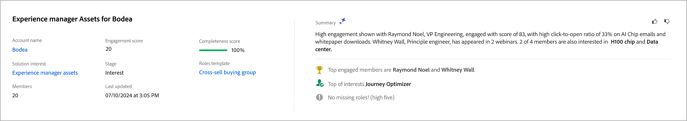{zoomable="yes"}

購買群組摘要區段包含下列購買群組資訊：

* 購買群組名稱
* 帳戶名稱（按一下名稱以開啟[帳戶詳細資料](../accounts/account-details.md)）
* 購買群組中的成員人數
* 參與度分數
* 完整性分數
* 目前購買群組階段
* 角色範本（按一下名稱以開啟[角色範本](buying-groups-role-templates.md#access-and-browse-role-templates)）
* 上次修改/更新日期
* 購買群組的創作AI摘要

### 帳戶總覽

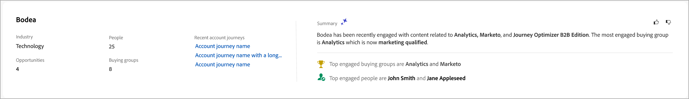{zoomable="yes"}

帳戶概觀區段包含下列帳戶資訊：

* 帳戶名稱（按一下名稱即可開啟帳戶詳細資料）
* 帳戶中的人數
* 行業
* 開啟機會
* 帳戶目前正在使用的最新三個帳戶歷程（按一下名稱以開啟歷程詳細資料）
* 帳戶的產生AI摘要

### 意圖資料

在Journey Optimizer B2B edition中，意圖偵測模型會根據購買群組的活動，預測具有足夠高信賴度的感興趣解決方案/產品。 購買群組的意向可解譯為對產品感興趣的可能性。

{{intent-data-note}}

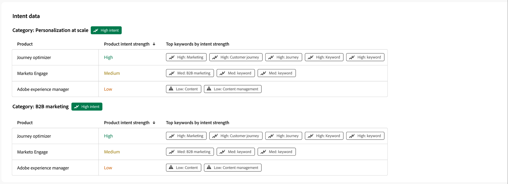{width="700" zoomable="yes"}

* 意圖層級
* 意圖訊號型別 — 關鍵字、產品和解決方案

### 購買群組成員

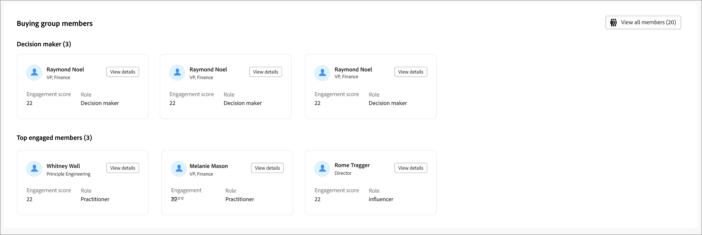{width="800" zoomable="yes"}

_[!UICONTROL 購買群組成員]_&#x200B;區段會顯示兩個列來強調購買群組成員：

* **[!UICONTROL 決策者]** — 根據人員參與分數的前三名決策者
* **[!UICONTROL 最常參與的成員]** — 根據個人參與分數的其他最常參與的成員

每個成員卡都包含下列詳細資訊：

* 名稱
* 標題
* 角色
* 潛在客戶參與分數

按一下&#x200B;**[!UICONTROL 檢視詳細資料]**&#x200B;以存取下列成員資訊：

* Generative AI摘要
* 上一個關鍵時刻
* 最近活動（兩個）
* 潛在客戶為成員的其他購買群組（根據最近新增的專案，僅限於三個購買群組）。
* 電子郵件地址
* 電話號碼

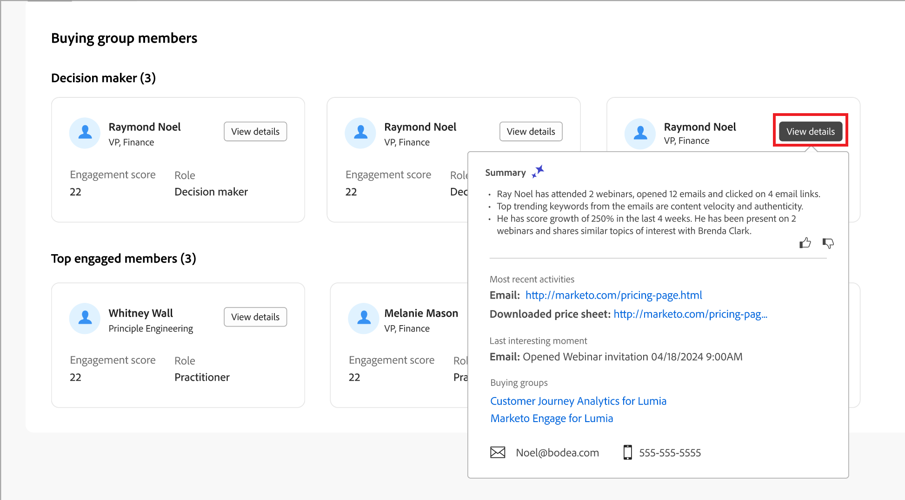{width="600" zoomable="yes"}

## 「成員」標籤

選取&#x200B;**[!UICONTROL 成員]**&#x200B;標籤，以檢視所有購買群組成員的清單。 每個成員清單包括名稱、角色、職稱、電子郵件地址、電話號碼和來源。

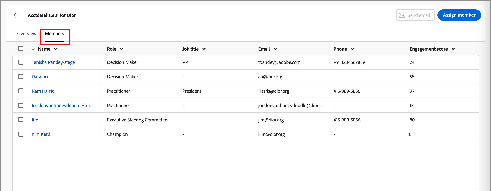{width="700" zoomable="yes"}

您可以從&#x200B;_成員_&#x200B;索引標籤執行多個動作：

### 指派新成員

帳戶可以有一或多個相關聯的購買群組，而購買群組成員通常是帳戶中聯絡人的子集。 您可以手動將關聯帳戶中的任何連絡人新增至購買群組。

1. 按一下右上角的&#x200B;**[!UICONTROL 指派新成員]**。

1. 在&#x200B;_[!UICONTROL 指派成員]_&#x200B;對話方塊中，選取您要新增至購買群組的帳戶銷售機會，然後按一下&#x200B;**[!UICONTROL 下一步]**。

   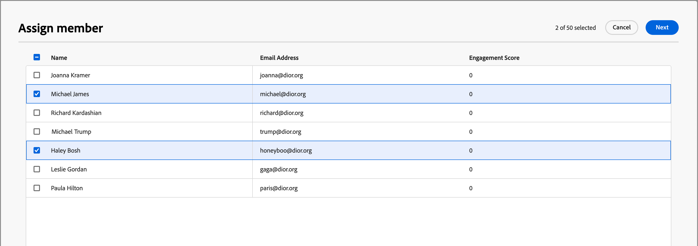{width="700" zoomable="yes"}

1. 在&#x200B;_[!UICONTROL 編輯新成員角色]_&#x200B;對話方塊中，選取要指派給每個新成員的角色。

   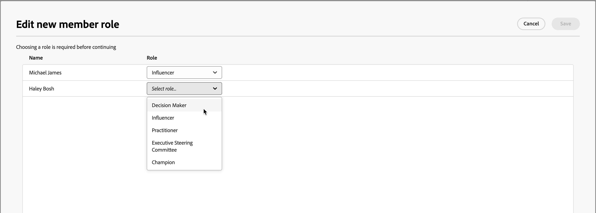{width="700" zoomable="yes"}

1. 按一下&#x200B;**[!UICONTROL 儲存]**。

### 移除成員

您可以從購買群組移除一或多個選取的成員（一次最多50個）。

1. 選取您要移除之成員的核取方塊。

1. 在底部的選取列中，按一下&#x200B;**[!UICONTROL 移除成員]**。

   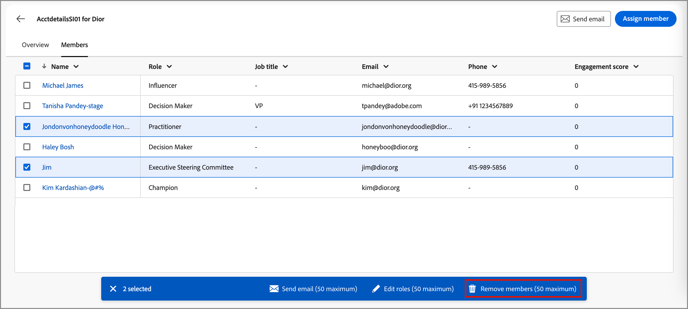{width="700" zoomable="yes"}

1. 在確認對話方塊中，按一下&#x200B;**[!UICONTROL 移除]**。

### 編輯角色

您可以變更購買群組的一或多個選定成員（一次最多50個）的角色。

1. 選取您要變更角色之成員的核取方塊。

1. 在底部的選取列中，按一下&#x200B;**[!UICONTROL 編輯角色]**。

   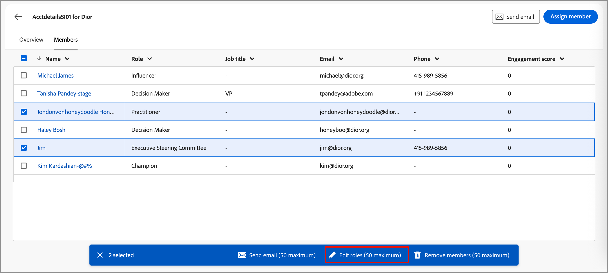{width="700" zoomable="yes"}

1. 在&#x200B;_[!UICONTROL 編輯成員角色]_&#x200B;對話方塊中，選取要指派給每個成員的角色。

   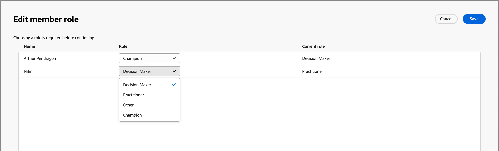{width="700" zoomable="yes"}

1. 按一下&#x200B;**[!UICONTROL 儲存]**。

### 傳送電子郵件

您可以將行銷人員核准的電子郵件傳送給購買群組的一或多個選定成員（一次最多50名）。 可用電子郵件清單僅限於來自已連線Marketo Engage執行個體的已核准電子郵件。

1. 選取您要接收電子郵件的成員核取方塊。

1. 按一下右上角或底部選取列中的&#x200B;**[!UICONTROL 傳送電子郵件]**。

   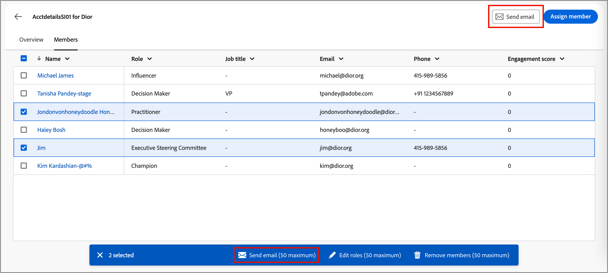{width="700" zoomable="yes"}

1. 在&#x200B;_[!UICONTROL 傳送電子郵件]_&#x200B;對話方塊中，選取Marketo Engage工作區，然後選取您要傳送之電子郵件的核取方塊。

   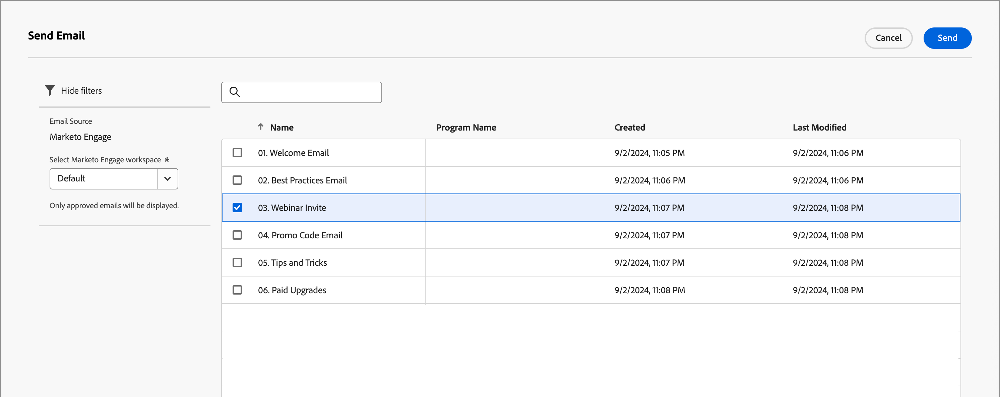{width="700" zoomable="yes"}的電子郵件

1. 按一下&#x200B;**[!UICONTROL 傳送]**。
