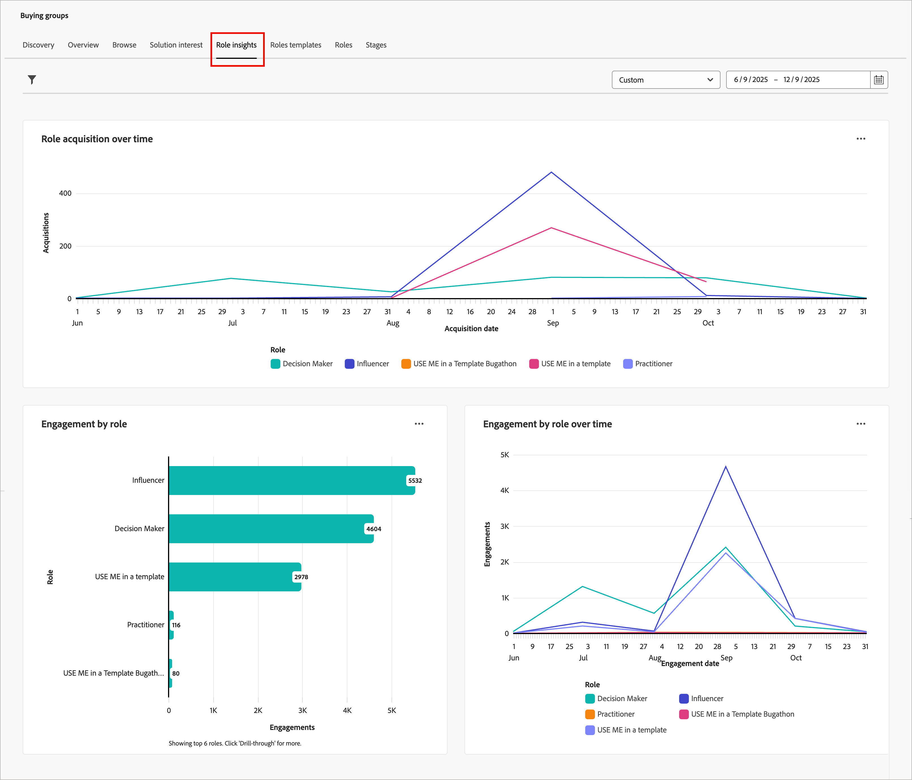
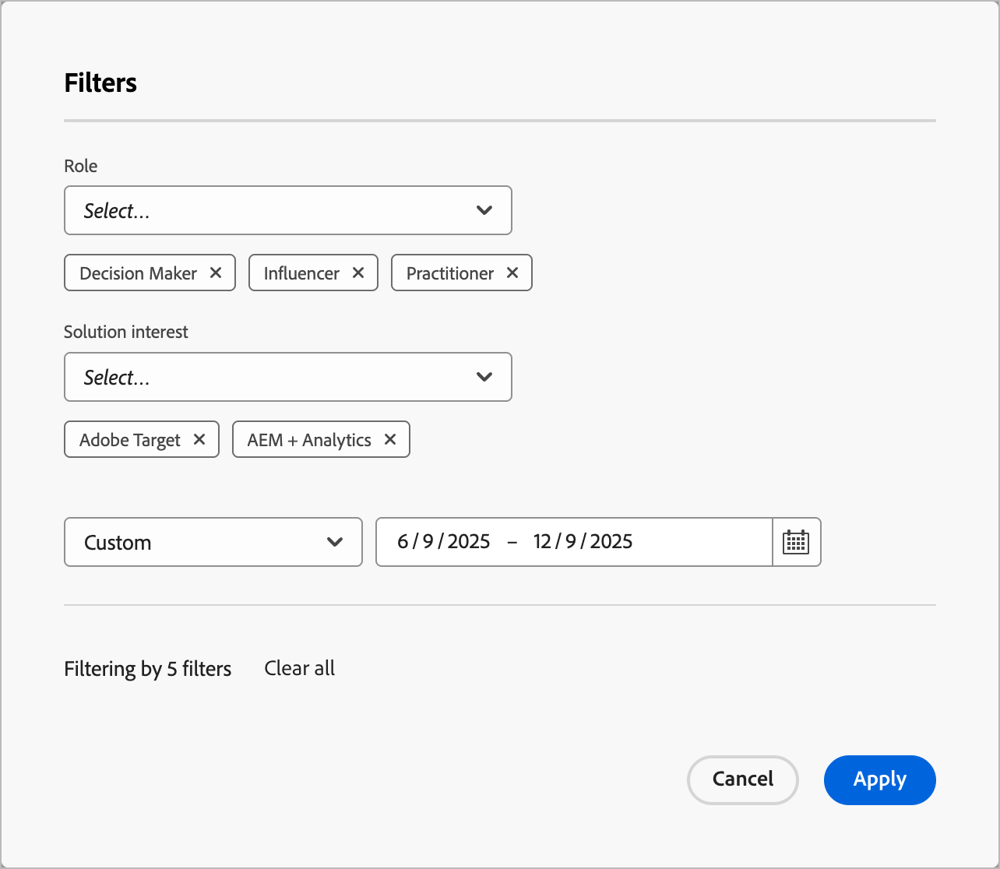
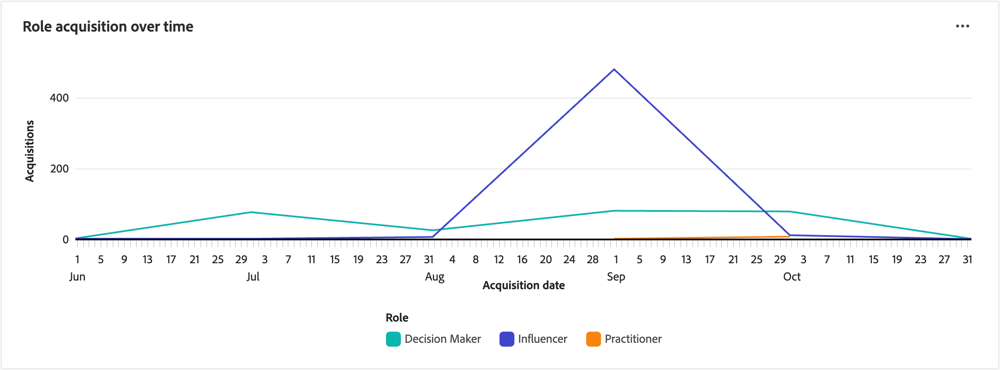
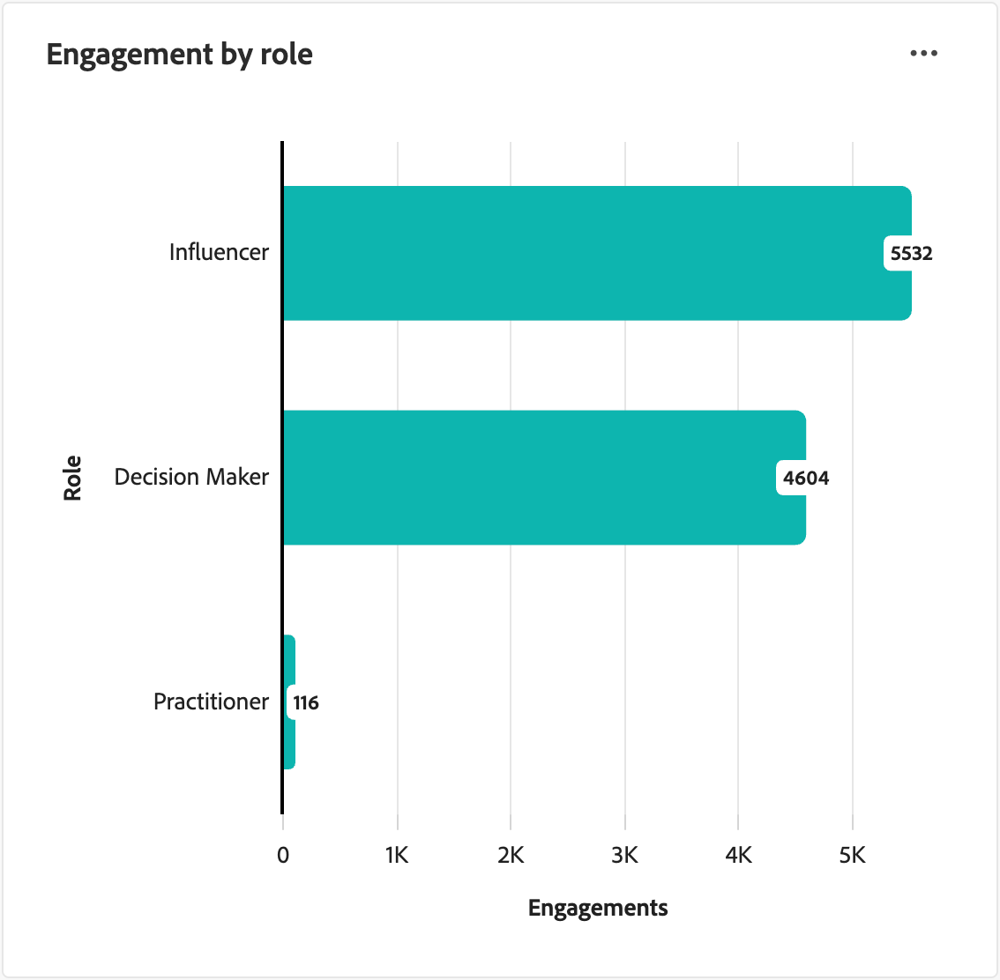
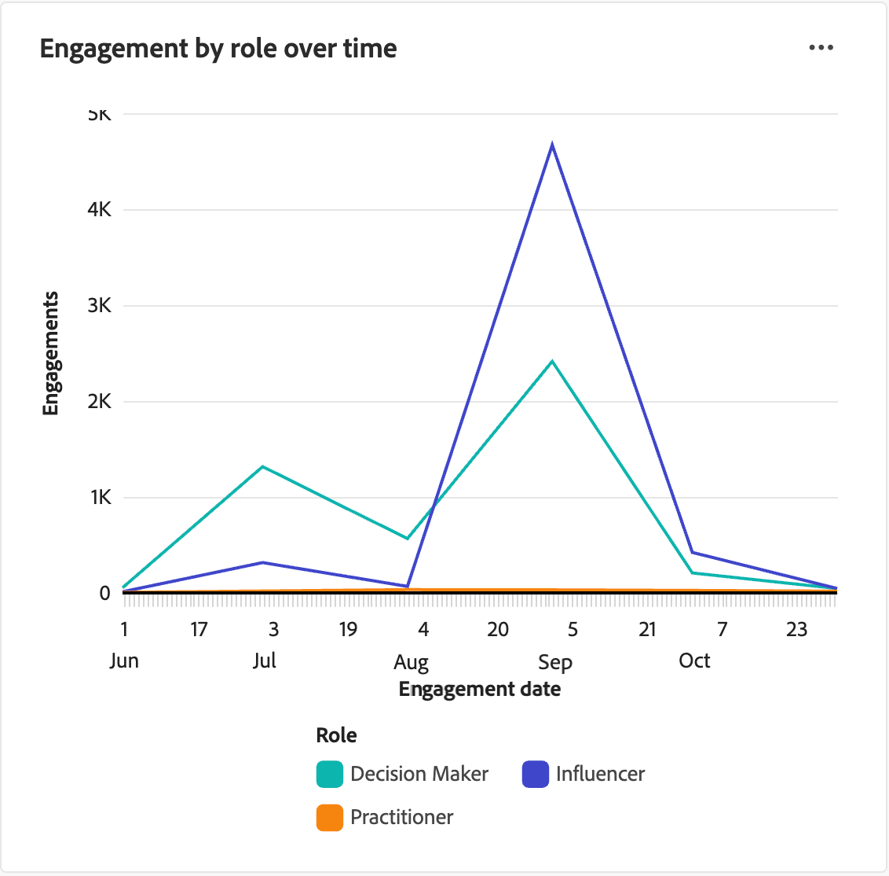

# 角色分析控制面板

「角色深入分析」儀表板可讓您檢視購買群組角色在一段時間內的演變和參與程度。 它可協助行銷人員瞭解角色贏取趨勢、參與模式，以及最近的行銷活動如何促進購買群組內不同角色的參與。

若要存取此儀表板，請展開左側導覽中的&#x200B;**[!UICONTROL 帳戶]**，然後選取&#x200B;**[!UICONTROL 購買群組]**。 選取「**[!UICONTROL 角色分析]**」標籤。

{width="800" zoomable="yes"}

儀表板包含三個檢視：

| 檢視 | 說明 |
| ---- | ----------- |
| [!UICONTROL 一段時間內的角色贏取] | 以視覺效果呈現一段時間內新增至購買群組的成員數量，此數量會依角色分段，並按月份分組。 |
| [!UICONTROL 依角色的參與] | 顯示購買群組角色的總參與活動計數（例如電子郵件開啟、點按和表單提交）。 |
| [!UICONTROL 一段時間內依角色區分的參與] | 追蹤一段時間內的購買群組參與活動，依角色顯示每月參與趨勢。 |

## 篩選資料

按一下左上方的&#x200B;_篩選器_ （ ）圖示，使用下列任一屬性來篩選顯示的資料：

* **[!UICONTROL 角色]** — 依一或多個選取的購買群組角色篩選資料。
* **[!UICONTROL 解決方案興趣]** — 依一或多個選取的解決方案興趣來篩選資料，以專注於特定產品線或方案。
* **[!UICONTROL 日期範圍]** — 將資料限制在特定時段（預設為過去一年）。

角色深入分析的{width="400"}

針對每個屬性，選取您要用來篩選資料的值，然後按一下[套用]。**&#x200B;**

## [!UICONTROL 一段時間內的角色贏取]

隨著行銷和銷售團隊獲得新人員、促進參與度並豐富資料，購買群組的新成員將獲得資格。 此報表顯示這些努力如何轉換為依角色劃分的新合格購買群組成員。 每次將某人新增至購買群組時，報表都會將該新增記錄在對應的角色下。

{width="600" zoomable="yes"}

圖表上的每條線代表一個角色。 將滑鼠懸停線上上的繪圖點上可檢視詳細資訊，包括：

* 贏取日期
* 贏取計數

若要檢視詳細資訊，請按一下右上角的&#x200B;**...**&#x200B;功能表圖示。

## [!UICONTROL 依角色的參與]

此報表會依購買群組角色彙總所選期間內的參與活動總量。 使用此報告可掌握每個角色對行銷工作的回應情況。

{width="500" zoomable="yes"}

圖表上的每個長條代表一個角色。 將滑鼠指標暫留在長條圖上，即可檢視顯示的計數詳細資料，包括：

* 角色名稱
* 參與計數

若要檢視詳細資訊，請按一下右上角的&#x200B;**...**&#x200B;功能表圖示。

## [!UICONTROL 一段時間內依角色區分的參與]

此報表會追蹤一段時間內的購買群組活動，協助您瞭解最近的行銷活動如何促進不同角色間的參與。 使用這些資訊來最佳化您的行銷策略，並更有效地鎖定特定角色。

{width="500" zoomable="yes"}

圖表上的每條線代表一個角色。 將滑鼠懸停線上上的繪圖點上可檢視詳細資訊，包括：

* 日期
* 參與計數

若要檢視詳細資訊，請按一下右上角的&#x200B;**...**&#x200B;功能表圖示。

## 與資料互動

若要與資料互動，請使用每個圖表右上方的&#x200B;_更多_ (**...**)功能表。

### [!UICONTROL 鑽研]

若要依角色&#x200B;_[!UICONTROL 進行]_&#x200B;參與，請選擇&#x200B;**[!UICONTROL 鑽研]**，依角色和解決方案興趣深入分析參與。

套用至控制面板的全域篩選器會移轉過來。 按一下左上方的&#x200B;_篩選器_ （）圖示至[變更鑽研檢視的屬性篩選器](#filter-the-data)。

### [!UICONTROL 檢視更多]

選擇&#x200B;**[!UICONTROL 檢視更多]**&#x200B;以檢視擴充的資料和深入分析。

顯示的快顯視窗包括圖表和顯示資料劃分的表格。

<!-- To download the data, click **[!UICONTROL Download CSV]** at the top right of the data table. -->
