# 購買群組階段

購買群組階段的設計目的，是為了追蹤購買群組將機會轉換為客戶時的進度。 使用此功能來追蹤購買群組進度，並識別購買群組的下一個最佳動作。

定義單一暫存模型內的階段，定義多個階段以及它們之間的轉換流程。 一個或多個階段被指定進入生命週期。 模型也允許非線性漸層，您可以在此指定從一個階段到另一個階段的轉變，例如從階段A到階段B、C或D。必須指定一個階段作為成功階段，例如購買或簽署的合約。 您可以選擇將另一個階段指定為失敗階段，例如拒絕的合約或向其他廠商購買競爭解決方案。 這是透過[智慧型儀表板](../dashboards/intelligent-dashboard.md)達成的，顯示購買群組在完成銷售機會或將機會轉換為客戶方面的進度。

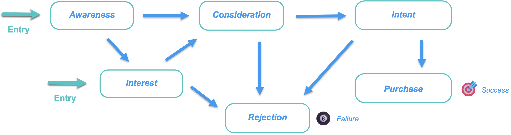{width="800" zoomable="yes"}

{width="30"}[觀看概觀影片](#overview-video)

## 定義您的購買群組階段模型

建立及設定購買群組階段模型，方法如下：

* 新增生命週期階段
* 定義轉換流程
* 指定專案階段和目的地階段

僅支援一個模型，因此您的行銷和銷售團隊務必先為您的組織規劃最佳模型，然後再在Journey Optimizer B2B edition中建立並發佈。<!-- Initially, only one stage model can be created, but future releases will support multiple stage models, allowing users to select which model to use in a journey. -->

當您建立購買群組階段模型時，模型會自動顯示為&#x200B;_草稿_&#x200B;狀態，且無法刪除或重新命名。 當您定義階段並設定階段之間的轉換流程時，它會保持此狀態。 當模型處於已發佈（_即時_）狀態時，無法變更。

### 建立模型

1. 在左側導覽列上，前往&#x200B;**[!UICONTROL 帳戶]** > **[!UICONTROL 購買群組]**。

1. 在「購買群組」頁面中，選取「**[!UICONTROL 階段]**」標籤。

   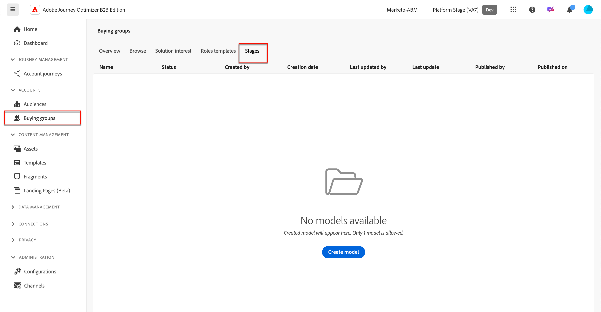{width="800" zoomable="yes"}

   此&#x200B;_[!UICONTROL 階段]_&#x200B;索引標籤目前處於&#x200B;_空白_&#x200B;狀態，直到您建立模型為止。

1. 按一下頁面中央的&#x200B;**[!UICONTROL 建立模型]**。

1. 在對話方塊中，輸入模型的&#x200B;**[!UICONTROL Name]** （必要）和&#x200B;**[!UICONTROL Description]** （選用）。

   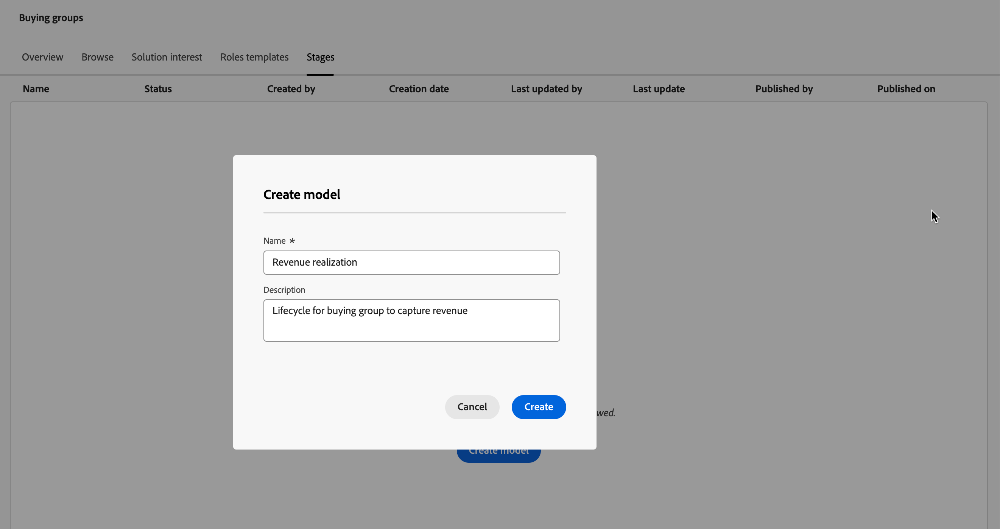{width="700" zoomable="yes"}

   如果您在此對話方塊中按一下&#x200B;_[!UICONTROL 取消]_，則會返回&#x200B;_空白_&#x200B;狀態的&#x200B;_[!UICONTROL 階段]_&#x200B;索引標籤。

1. 按一下&#x200B;**[!UICONTROL 建立]**。

### 定義階段

建立模型後，它會在工作區中開啟，系統會提示您建立模型的階段。

1. 按一下&#x200B;**[!UICONTROL 編輯階段]**。

   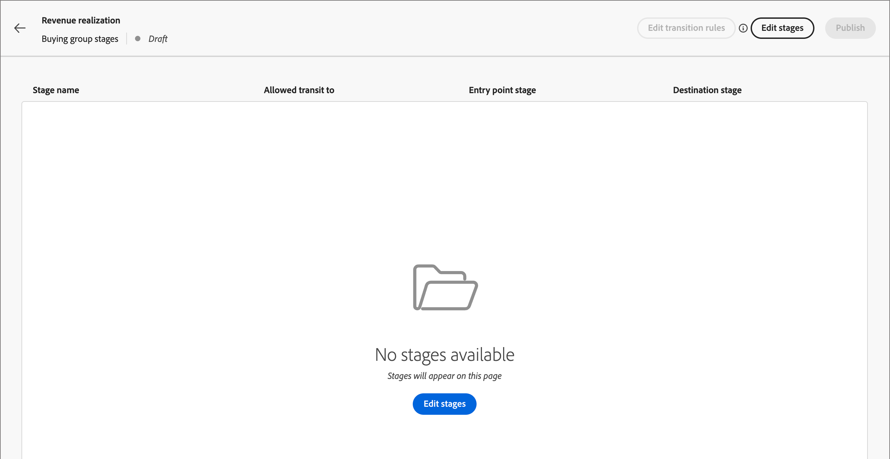{width="700" zoomable="yes"}

1. 輸入&#x200B;**[!UICONTROL Name]** （必要）和&#x200B;**[!UICONTROL Description]** （選用）以定義第一個階段。

   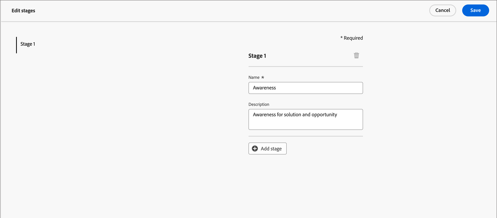{width="700" zoomable="yes"}

   階段不必以特定順序新增，但可決定階段在模型詳細資訊頁面中的列示方式。 定義轉變規則時，您可以指定進入階段以及階段之間的流量。

1. 按一下&#x200B;**[!UICONTROL 新增階段]**&#x200B;並重複步驟2以定義另一個階段。

   重複此步驟，直到您具備模型所需的階段為止。

   為模型](assets/stages-model-stages-added.png){width="700" zoomable="yes"}定義的![階段

1. 在您滿意已定義的階段後，請按一下[儲存]。****

   >[!IMPORTANT]
   >
   >**在儲存購買群組階段後，這些階段便無法移除。**&#x200B;不過，只要模型仍處於&#x200B;_草稿_&#x200B;狀態，您就可以變更任何階段的名稱和描述。

### 設定工作流程和轉變規則

儲存階段後，它會帶您回到模型工作區。 _[!UICONTROL 允許傳輸至]_&#x200B;資料行是空的，這表示尚未定義模型階段的轉換規則。

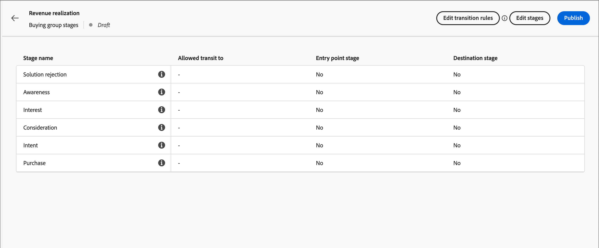{width="700" zoomable="yes"}

轉換規則決定購買群組如何從一個階段移至另一個階段。 例如，它可以從進入階段移動到中間階段，並從中間階段移動到各種其他階段。 進入階段是購買群組可以從空白狀態進入的初始階段，而目的地階段會分類為成功或失敗階段。

1. 按一下右上方的&#x200B;**[!UICONTROL 編輯轉變規則]**。

   此動作會開啟&#x200B;_[!UICONTROL 編輯階段規則]_&#x200B;對話方塊，您可以在其中定義流程的邏輯。

   當您設定選項時，有一些內建的護欄和傳訊功能，可協助您避免流程中出現邏輯錯誤。 您可以按一下[取消]__&#x200B;關閉對話方塊並返回[階段]]_索引標籤頁，而不進行任何變更。_[!UICONTROL 

1. 在&#x200B;_[!UICONTROL 選取階段]_&#x200B;區段中，指定流程的開始和結束階段：

   * **[!UICONTROL 進入點階段]** （必要） — 為購買群組商機指定一或多個進入階段。

   * **[!UICONTROL 成功階段]** （必要） — 指定表示購買群組機會成功的階段（目的地）。

   * **[!UICONTROL 失敗階段]** （選擇性） — 指定一或多個階段，指出購買群組商機已到達失敗點（目的地）。

   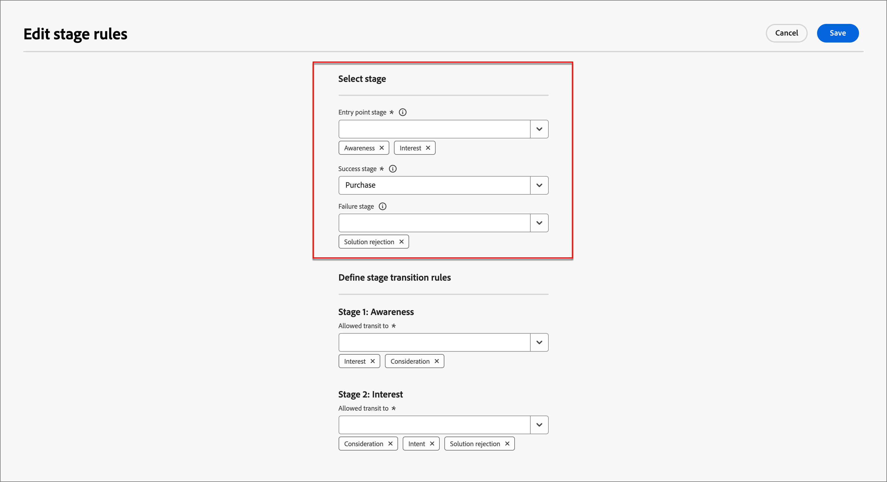{width="700" zoomable="yes"}

1. 針對每個非目的地階段，定義一或多個進入流程（轉換）的階段。

   所有非目的地階段都必須至少選取一個&#x200B;**[!UICONTROL 允許傳輸至]**&#x200B;階段。 否則，模型邏輯無效，帳戶可能會在該階段卡住&#x200B;__，無法取得成功或失敗。

   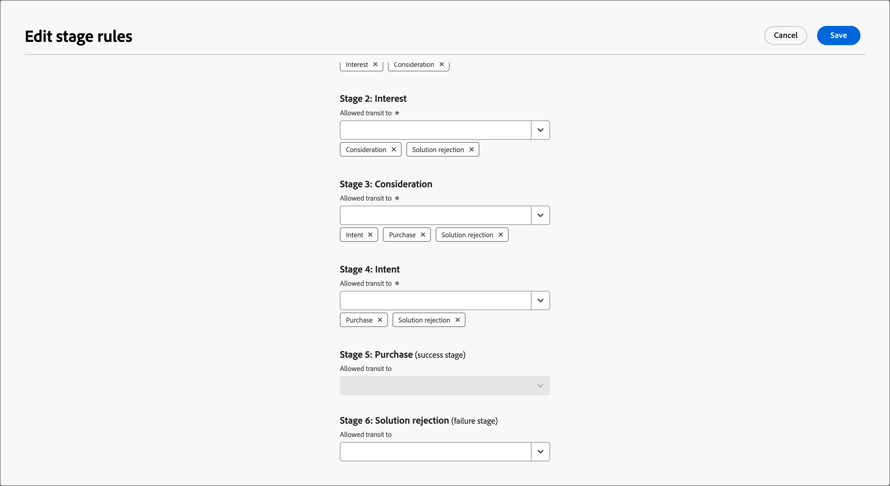{width="700" zoomable="yes"}

   您可以選擇從失敗階段指定轉變。 例如，您可以將名為&#x200B;_無回應_&#x200B;的階段指定為失敗階段。 但也指定名為&#x200B;_Resurgence_&#x200B;的階段作為可能的轉換，以識別休眠帳戶重新啟動的情況。

1. 按一下&#x200B;**[!UICONTROL 儲存]**。

   返回模型詳細資訊頁面後，階段會列在表格中，其中包含允許的轉變，以及目的地和專案屬性。

| 欄 | 說明 |
| ------ | ---------- |
| **[!UICONTROL 階段名稱]** | 階段名稱。 按一下資訊圖示可檢視階段的說明。 |
| **[!UICONTROL 已允許傳輸至]** | 列出對模型內的&#x200B;_移至_&#x200B;動作有效的階段。 |
| **[!UICONTROL 進入點階段]** | 指示階段是否可作為進入點階段（[!UICONTROL 是]或[!UICONTROL 否]）。 |
| **[!UICONTROL 目標]** | 指示階段是否指定為目的地階段（[!UICONTROL 成功]或[!UICONTROL 失敗]）。 |

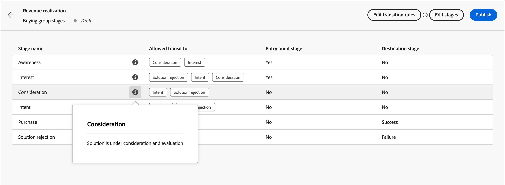{width="700" zoomable="yes"}

## 編輯草稿模型

只要購買群組階段模型仍處於&#x200B;_草稿_&#x200B;狀態，您就可以編輯階段和轉換規則。

_若要檢視草稿模型：_

1. 在左側導覽列上，前往&#x200B;**[!UICONTROL 帳戶]** > **[!UICONTROL 購買群組]**。

1. 在&#x200B;_購買群組_&#x200B;頁面中，選取&#x200B;**[!UICONTROL 階段]**&#x200B;標籤。

1. 按一下模型名稱以開啟模型細節。

### 變更模型中的階段

1. 按一下&#x200B;**[!UICONTROL 編輯階段]**。

   在&#x200B;_[!UICONTROL 編輯階段]_&#x200B;對話方塊中，您可以新增階段或變更現有階段的名稱和描述。

   * 視需要變更任何階段的&#x200B;**[!UICONTROL Name]**&#x200B;或&#x200B;**[!UICONTROL Description]**。

   * 捲動至底部，然後按一下&#x200B;**[!UICONTROL 新增階段]**，視需要為模型定義新的階段。

1. 在您滿意已定義的階段後，請按一下[儲存]。****

   您也可以按一下&#x200B;_[!UICONTROL 取消]_&#x200B;關閉對話方塊，並返回模型詳細資訊頁面，而不做任何變更。

### 編輯模型的轉變規則

1. 按一下&#x200B;**[!UICONTROL 編輯轉換規則]**。

1. 在&#x200B;_編輯階段規則_&#x200B;對話方塊中，視需要變更流程選項。

   請參閱[設定工作流程和轉換規則](#configure-the-workflow-and-transition-rules)，以取得有關這些選項以及它們如何影響模型流程的詳細資訊。

1. 當您對已定義的轉換規則感到滿意時，請按一下[儲存]。****

   您也可以按一下&#x200B;_[!UICONTROL 取消]_&#x200B;關閉對話方塊，並返回模型詳細資訊頁面，而不做任何變更。

## 發佈購買群組階段模型

如果沒有驗證錯誤，則可發佈模型。 發佈後，其會變更為&#x200B;_即時_&#x200B;狀態，並可用於在帳戶歷程中繼續購買群組階段。

>[!IMPORTANT]
>
>**模型發佈後，將無法更新或刪除。**&#x200B;在發佈模型之前，請先確認您擁有的內容正確無誤。

1. 請仔細檢閱定義的階段和轉變。

   如果需要修訂，請編輯模型階段。

1. 按一下&#x200B;**[!UICONTROL 發佈]**。

1. 在確認對話方塊中，按一下&#x200B;**[!UICONTROL 發佈]**。

   返回模型詳細資訊頁面後，模型被指定為&#x200B;_[!UICONTROL 即時]_。 按一下左上方的&#x200B;_上一步_&#x200B;箭頭，返回&#x200B;_[!UICONTROL 階段]_&#x200B;分頁頁面。

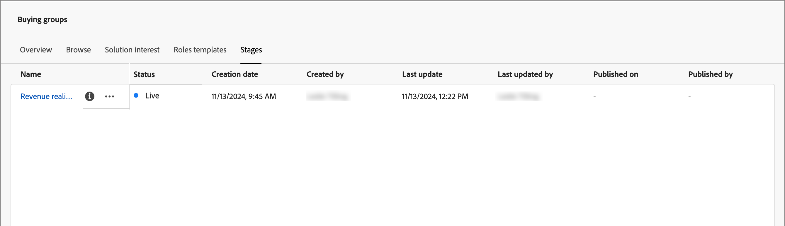{width="700" zoomable="yes"}
<!-- list these later when the Published columns are working correctly

Columns - Name, Status, Created by, Created date, Last updated by, Last update, Published by, Published on.
Name - Name of the stage model, hyperlinked. Clicking on it will navigate to the stage inventory page. 
Info icon beside the name - display the description on click.
Status - Live, Draft. If a draft stage model is Published, then its status is updated to Live. -->

## 刪除購買群組階段模型

您可以刪除處於草稿或已發佈狀態的購買群組階段模型。如果檔案已發佈（即時），您只能在檔案與解決方案興趣無關時將其刪除。

1. 在左側導覽列上，前往&#x200B;**[!UICONTROL 帳戶]** > **[!UICONTROL 購買群組]**。

1. 在&#x200B;_購買群組_&#x200B;頁面中，選取&#x200B;**[!UICONTROL 階段]**&#x200B;標籤。

1. 按一下階段模型名稱旁的&#x200B;_更多_&#x200B;功能表圖示(**...**)，然後選擇&#x200B;**[!UICONTROL 刪除]**。

   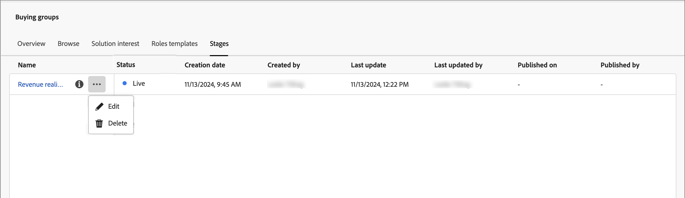{width="700"}

1. 在對話方塊中，按一下&#x200B;**[!UICONTROL 刪除]**&#x200B;以進行確認。

## 在帳戶歷程中使用模型

當購買階段模型處於&#x200B;_即時_&#x200B;狀態（已發佈）時，請將模型新增至您想要用來追蹤購買群組進度的方案興趣。 在您的帳戶歷程中，您可以包含將帳戶轉換為指定階段的動作，並將階段轉換新增為決定帳戶如何在歷程中移動的事件。

### 解決方案興趣關聯

針對您想要與購買群組階段模式產生關聯的每個現有解決方案興趣，請開啟解決方案興趣詳細資料並新增模式。 當您[建立感興趣的解決方案](./solution-interests.md#create-a-solution-interest)時，您也可以將模型新增到屬性中。

1. 選取&#x200B;_[!UICONTROL 方案興趣]_&#x200B;標籤。

1. 使用下列其中一種方法開啟解決方案興趣，以開啟您要編輯之解決方案興趣的屬性：

   * 按一下解決方案興趣名稱。
   * 按一下旁邊的省略符號(**...**)，然後選擇&#x200B;**[!UICONTROL 編輯]**。

   {width="500" zoomable="no"}

1. 選取&#x200B;**[!UICONTROL 購買群組階段模型]**&#x200B;以使用購買群組階段進度（選擇性）。

   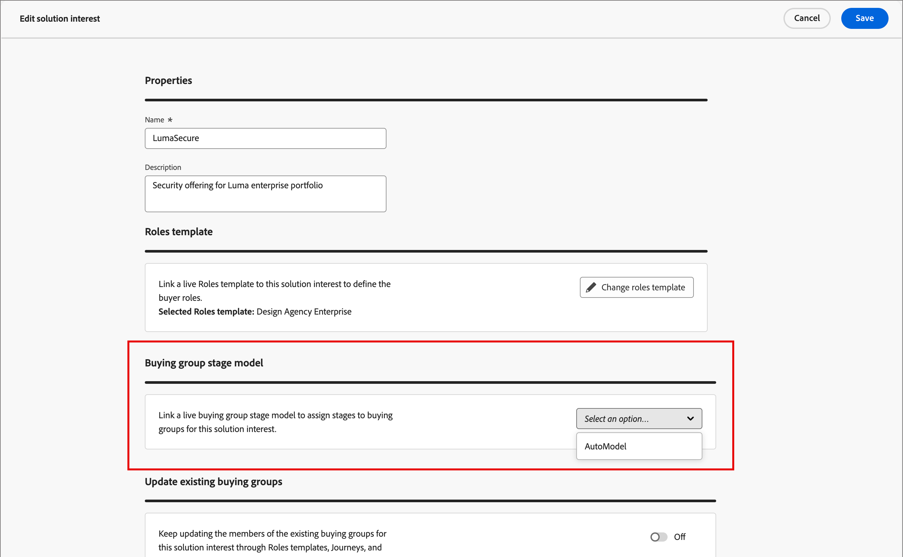{width="700" zoomable="yes"}

1. 如有需要，請變更&#x200B;**[!UICONTROL 更新現有的購買群組]**&#x200B;設定。

   啟用此選項後，與解決方案相關的所有現有購買群組都會透過24小時同步週期更新。

1. 按一下&#x200B;**[!UICONTROL 儲存]**。

### 分割路徑

使用[分割路徑節點](../journeys/journey-nodes.md#split-paths)，您可以根據購買群組階段，在帳戶層級或人員層級進行篩選。 例如，透過購買群組成員來分割路徑時，新增購買群組階段作為路徑條件。

>[!BEGINTABS]

>[!TAB 帳戶層級]

1. 在編輯器中開啟帳戶歷程。

1. 按一下路徑上的加號( **+** )圖示，然後選擇&#x200B;**[!UICONTROL 分割路徑]**。

   {width="300"}

1. 在右側的節點屬性中，選擇&#x200B;**[!UICONTROL 帳戶]**&#x200B;進行分割。

1. 若要定義適用於&#x200B;_[!UICONTROL 路徑1]_&#x200B;的條件，請按一下&#x200B;**[!UICONTROL 套用條件]**。

   {width="500"}

1. 在條件編輯器中，新增購買群組篩選器以定義分割路徑。

   * 在左側，展開底部的&#x200B;**[!UICONTROL 特殊篩選器]**，並將&#x200B;**[!UICONTROL 有購買群組]**&#x200B;屬性拖曳至篩選器工作區。

   * 將&#x200B;**[!UICONTROL 方案興趣]**&#x200B;設定為與購買群組階段模型相關聯的興趣。

   * 按一下&#x200B;**[!UICONTROL 新增限制]**&#x200B;並選擇&#x200B;**[!UICONTROL 購買群組階段]**。

     {width="700" zoomable="yes"}

   * 按一下&#x200B;**[!UICONTROL 「完成」]**。

   分割路徑會在右側的節點屬性中定義。

   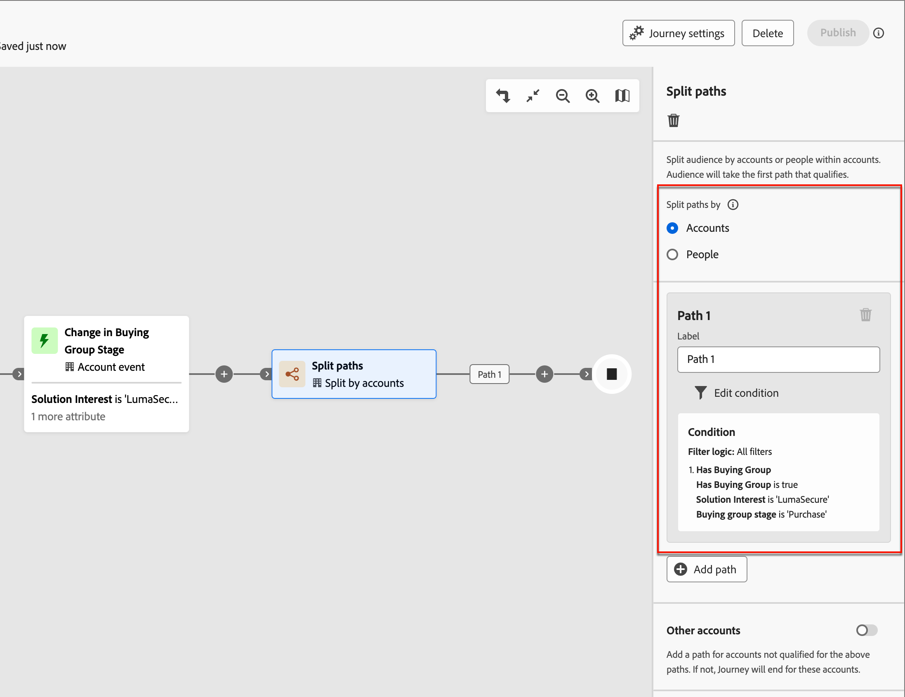{width="600" zoomable="yes"}

1. 繼續定義分割節點的其他路徑，並儲存歷程。

>[!TAB 人員層級]

1. 在編輯器中開啟帳戶歷程。

1. 按一下路徑上的加號( **+** )圖示，然後選擇&#x200B;**[!UICONTROL 分割路徑]**。

   {width="300"}

1. 在右側的節點屬性中，選擇&#x200B;**[!UICONTROL 人員]**&#x200B;進行分割。

   保留用於條件&#x200B;]_的_[!UICONTROL &#x200B;屬性的預設值&#x200B;**[!UICONTROL 僅保留為]**&#x200B;人員屬性。

1. 若要定義適用於&#x200B;_[!UICONTROL 路徑1]_&#x200B;的條件，請按一下&#x200B;**[!UICONTROL 套用條件]**。

   {width="500"}

1. 在條件編輯器中，新增購買群組篩選器以定義分割路徑。

   * 在左側，展開底部的&#x200B;**[!UICONTROL 特殊篩選器]**，並將&#x200B;**[!UICONTROL 購買群組成員]**&#x200B;屬性拖曳至篩選器工作區。

   * 將&#x200B;**[!UICONTROL 方案興趣]**&#x200B;設定為與購買群組階段模型相關聯的興趣。

   * 按一下&#x200B;**[!UICONTROL 新增限制]**&#x200B;並選擇&#x200B;**[!UICONTROL 購買群組階段]**。

     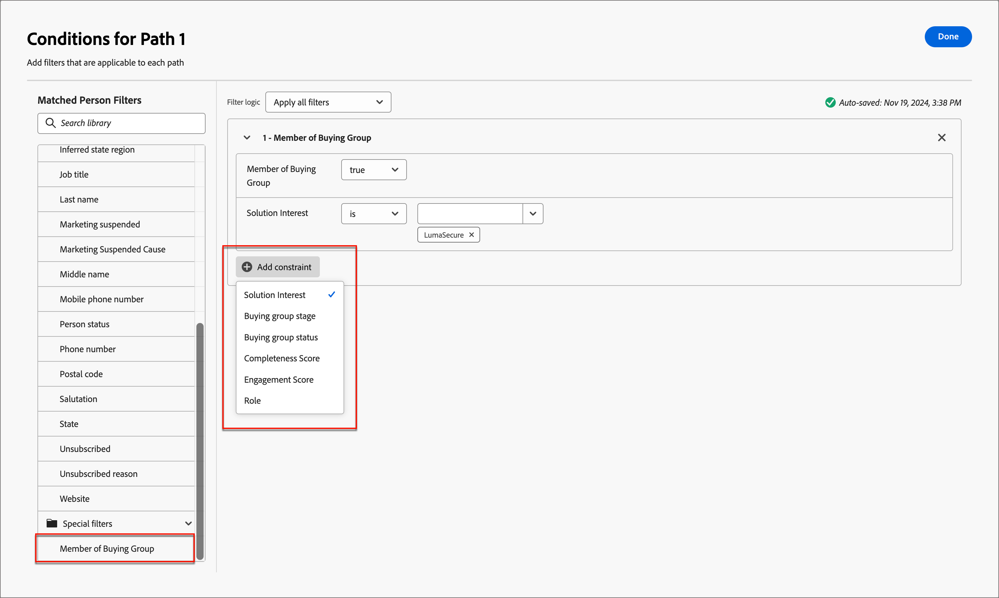{width="700" zoomable="yes"}

   * 按一下&#x200B;**[!UICONTROL 「完成」]**。

   分割路徑會在右側的節點屬性中定義。

   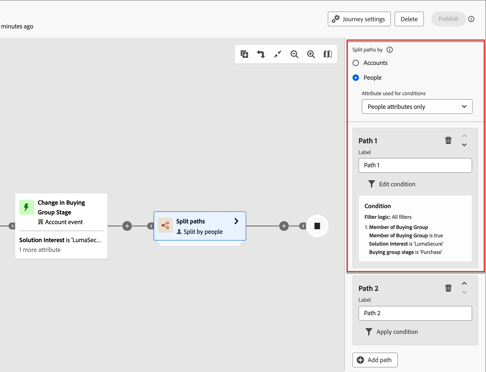{width="600" zoomable="yes"}上的事件

1. 繼續定義分割節點的其他路徑，並儲存歷程。

>[!ENDTABS]

### 更新購買群組階段帳戶動作

使用[帳戶動作節點](../journeys/journey-nodes.md#add-an-account-action)，您可以更新購買群組階段。 定義此節點包括選取解決方案興趣，以及定義購買群組的新階段。

>[!NOTE]
>
>如果新階段不是有效的轉變（如模型中的定義），則動作不會套用至帳戶。

1. 在編輯器中開啟帳戶歷程。

1. 按一下路徑上的加號( **+** )圖示，然後選擇&#x200B;**[!UICONTROL 執行動作]**。

   {width="400"}

1. 在右側的節點屬性中，選擇動作的&#x200B;**[!UICONTROL 帳戶]**。

1. 定義動作以更新購買群組階段。

   * 若要在帳戶&#x200B;]**上執行**[!UICONTROL &#x200B;動作，請選取&#x200B;**[!UICONTROL 更新購買群組階段]**。

   * 針對&#x200B;**[!UICONTROL 選取方案興趣]**，選取與購買群組階段模型相關聯的方案。

   * 對於&#x200B;**[!UICONTROL 新階段]**，請選取階段以轉換帳戶。

   動作會在右側的節點屬性中定義。

   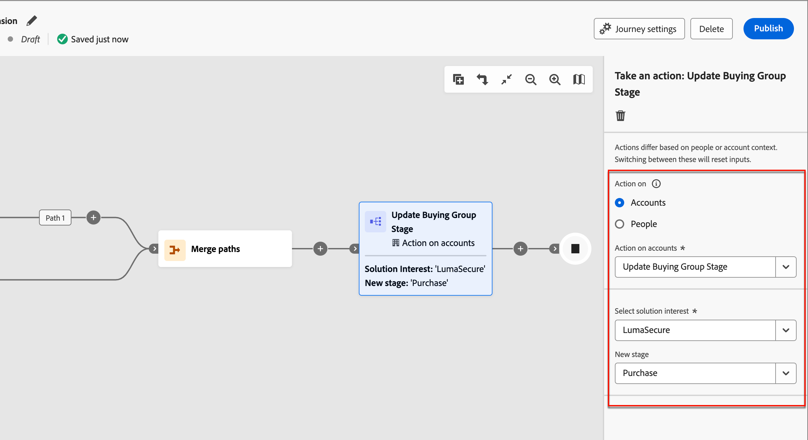{width="600" zoomable="yes"}

1. 繼續其他變更並儲存歷程。

### 帳戶事件

使用發生購買群組階段變更的情況，將帳戶前進到歷程中的下一個步驟。 定義此節點包括選取解決方案興趣和滿足事件觸發的其他限制。

1. 在編輯器中開啟帳戶歷程。

1. 按一下路徑上的加號( **+** )圖示，然後選擇&#x200B;**[!UICONTROL 接聽事件]**。

   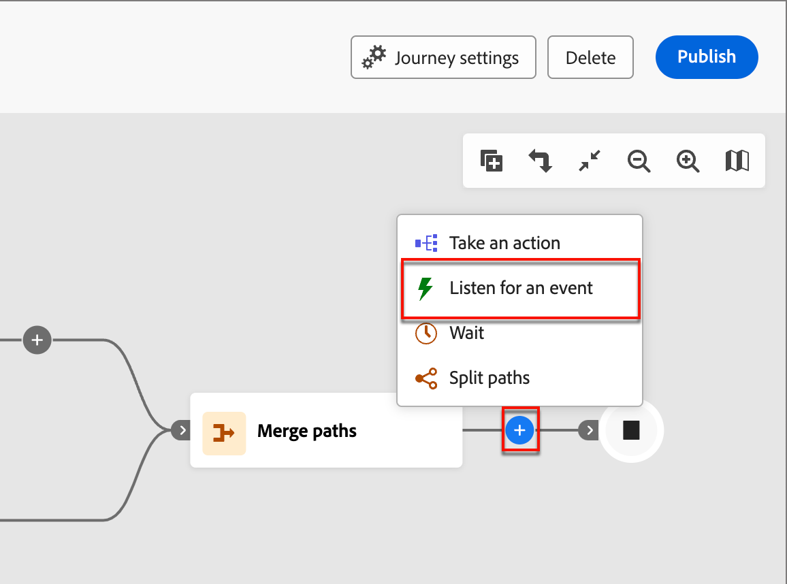{width="400"}

1. 在右側的節點屬性中，為事件型別選擇&#x200B;**[!UICONTROL 帳戶]**。

1. 針對&#x200B;**[!UICONTROL 選取帳戶事件]**，請選擇&#x200B;**[!UICONTROL 購買群組階段中的變更]**。

1. 按一下&#x200B;**[!UICONTROL 編輯事件]**&#x200B;並定義事件的詳細資料。

   * 針對&#x200B;**[!UICONTROL 方案興趣]**，請符合與購買群組階段模型相關的方案興趣條件。

   * 按一下&#x200B;**[!UICONTROL 新增限制]**，然後選取您要用來觸發事件的購買群組階段變更。

     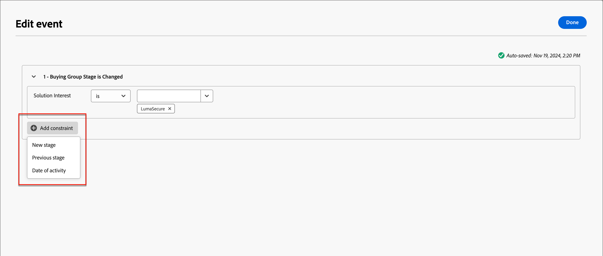{width="700" zoomable="yes"}上的事件

   * 按一下&#x200B;**[!UICONTROL 「完成」]**。

   事件會在右側的節點屬性中定義。

   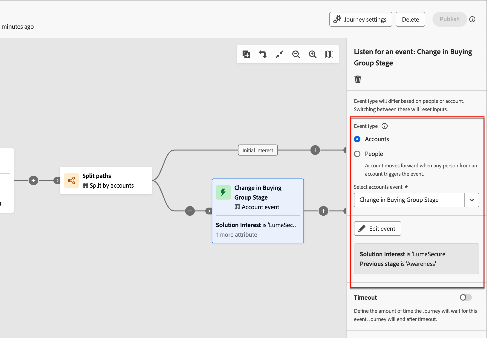{width="700" zoomable="yes"}上的事件

1. 繼續其他變更並儲存歷程。

## 概觀影片

>[!VIDEO](https://video.tv.adobe.com/v/3448634/?learn=on)
