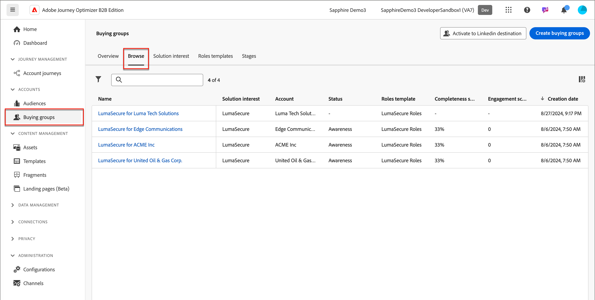
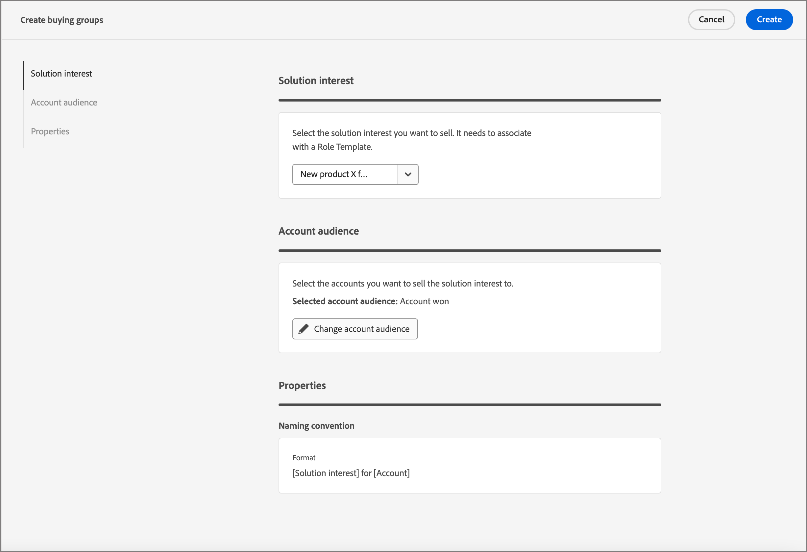
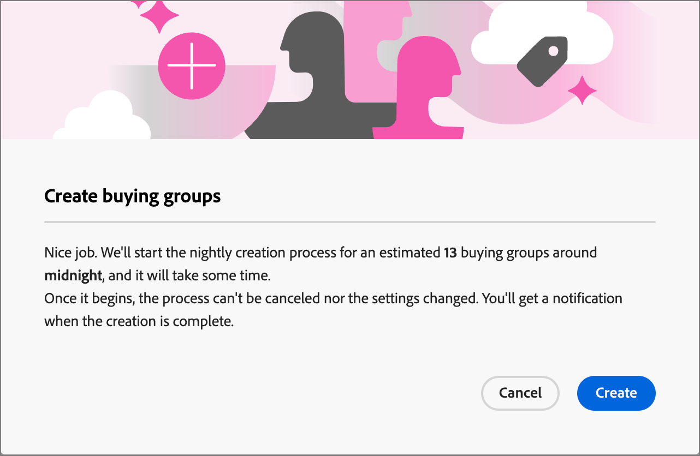
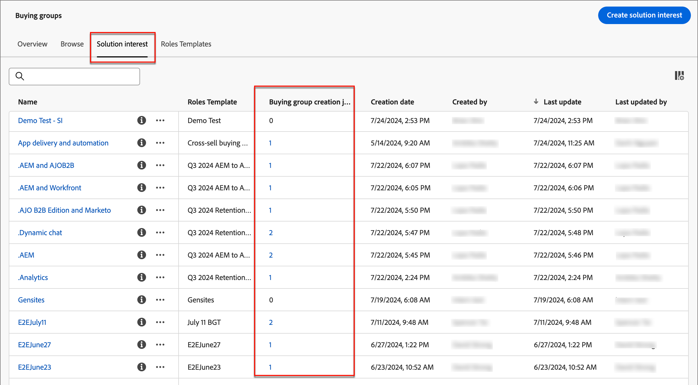

# 建立購買群組

建立購買群組後，便可在透過[解決方案興趣](./solution-interests.md)的帳戶歷程中使用。

1. 在左側導覽列中，按一下&#x200B;**[!UICONTROL 購買群組]**。

1. 在&#x200B;_[!UICONTROL 購買群組]_&#x200B;頁面中，按一下頁面右上角的&#x200B;**[!UICONTROL 建立購買群組]**。

   {width="700" zoomable="yes"}

1. 按照每個頁面上的提示進行，然後按一下[下一步]&#x200B;**[!UICONTROL 以繼續。]**

{width="30"} [觀看作法影片](#how-to-video)

## 指導頁面

第一頁提供建立購買群組所需之先決條件/元件的相關指引。 如果您知道已具備必要的元件，請按一下[下一步] **&#x200B;**。

## 元件

1. 選取您要使用的每個元件：

   * **[!UICONTROL 方案興趣]** — 從清單中選取方案興趣。

   * **[!UICONTROL 帳戶對象]** — 按一下#並從清單中選取帳戶對象。

   在&#x200B;_[!UICONTROL 屬性]_&#x200B;下，購買群組的名稱會自動產生（唯讀），成為&lt;帳戶名稱>的&lt;解決方案興趣名稱>。

   {width="700" zoomable="yes"}

1. 在您選取方案興趣和帳戶對象後，按一下[建立]。**&#x200B;**

## 確認

確認對話方塊提供購買群組流程的摘要，以及預估完成時間。 若要確認並啟動程式，請按一下[建立]。**&#x200B;**

{width="400" zoomable="yes"}

## 購買群組建立工作

建立工作會自動為帳戶對象中的每個新帳戶建立購買群組。 您可以導覽至&#x200B;_[!UICONTROL 方案興趣]_&#x200B;標籤，該標籤會顯示為每個方案興趣所建立的建立工作計數。 按一下&#x200B;**[!UICONTROL 購買群組建立工作]**&#x200B;欄中的數字，即可檢視建立工作清單。

{width="700" zoomable="yes"}

<!-- Other buying group activities:

Member of buying group.
Assign a member of the buying group.
Remove a member of the buying group. -->

## 作法影片

>[!VIDEO](https://video.tv.adobe.com/v/3451772/?learn=on&captions=chi_hant)
