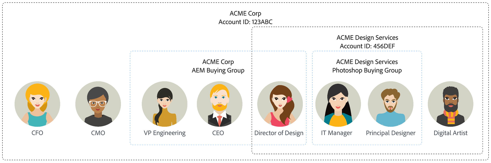
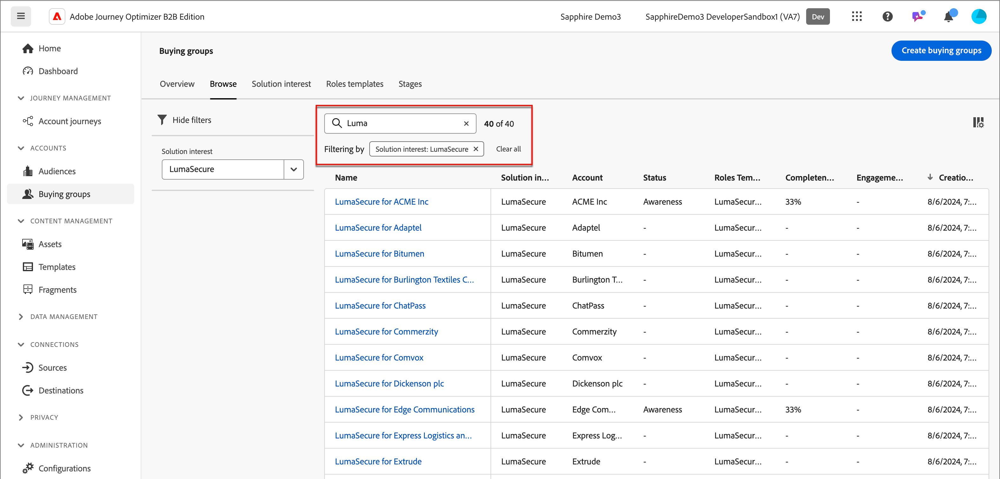
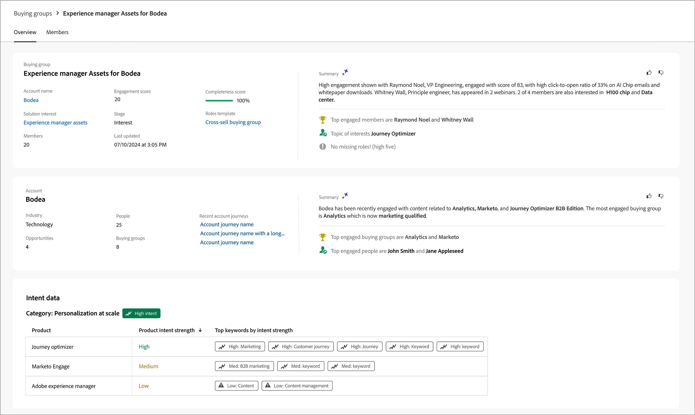

# 購買群組

對 B2B 銷售和行銷活動而言，帳戶是任何策略的關鍵所在。每個帳戶均與一組人員相關聯，這些人員可能是該帳戶的員工，或是與該帳戶合作的承包商。帳戶採用階層式結構，因此可能針對階層中的不同層級銷售不同的產品。例如，可能在企業層級把 Adobe Experience Platform 銷售給高階帳戶。而可能把 Adobe Photoshop 銷售給代表組織內某個部門的帳戶，例如大型企業內的設計部門。

{width="800"}

在帳戶中，可能有一小群人員組成&#x200B;_購買群組_。最終會由這些人員做出購買決定，因此行銷人員必須特別留意其動向，並且傳送給他們的資訊，可能需要與和該帳戶關聯的其他人員不同。不同產品線或產品方案的購買群組可能由不同的人員組成。例如，購買網路安全性產品通常需要資訊長或資安長，以及法務部門的代表核准。錯誤追蹤產品的採購群組成員通常會包含工程副總裁與 IT 總監。

{width="30"}[觀看影片概觀](#overview-video)

## 關鍵元件

您可以透過建立購買群組，針對銷售團隊負責銷售的解決方案找出適合您的目標帳戶清單的成員，藉此提高行銷效益。在您和您的行銷團隊開始建立購買群組之前，請確保已經定義其關鍵元件。這些元件是您達成業務目標與目的之關鍵所在。

| 元件 | 用途 |
| --------- | ------- |
| 解決方案興趣 | 此元件可以回答以下問題： <ul><li>作為一個行銷組織，您銷售什麼商品？</li><li>哪一種產品或產品系列是您的銷售目標？</li></ul>  **範例:_**&#x200B;向現有客戶交叉銷售新產品 X |
| 帳戶客群 | 此元件可以回答以下問題： <ul><li>您的銷售對象是誰？</li><li>哪一些帳戶清單是您的目標選擇？</li></ul> **範例:_**&#x200B;由收入超過 100 萬且擁有產品 Y 的帳戶所定義的帳戶區段 |
| 購買群組角色範本 | 此元件可以回答以下問題： <ul><li>哪一些角色是您的目標選擇？</li><li>使用哪一組規則來決定被指派購買群組角色的人員？</li></ul>  **範例:_**&#x200B;將具有 CMO 職稱的人員指派為決策者角色 |
| 購買群組階段 | (選用) 此元件可以回答以下問題：追蹤購買群組邁向成功或失敗的情形？ |

## 成員指派

有三種方式可以將成員指派到採購群組或從中移除。以下清單按優先順序說明這些新增和移除方法。最上層的方法具有最高優先權，且較低層級的方法無法將其覆寫。

1. **_手動動作_** - 由銷售使用者為採購群組手動新增成員或移除成員的動作
2. **_歷程動作_** - 針對購買群組成員會籍的歷程[動作節點](../journeys/action-nodes.md#add-a-people-based-action) (_指派到購買群組_&#x200B;或&#x200B;_從購買群組中移除_)
3. **_系統工作_** - [建立](../buying-groups/buying-groups-create.md#buying-group-creation-jobs)採購群組和維護工作。

為了避免錯誤覆寫購買群組的成員指派，此清單依照系統中的優先順序排列，以確保正確的成員指派。例如，當銷售使用者手動新增成員至購買群組時，他們不希望有維護工作會更動該新增成員。使用優先順序，便會強制執行以下情境：

* 如果使用者手動指派成員至某個購買群組，而接著執行的購買群組維護工作試圖從購買群組移除同一名成員，則維護工作&#x200B;**不會移除**&#x200B;該名成員，且無法覆寫該手動指派的結果。
* 如果使用者手動將某位成員指派至某個購買群組，而接下來觸發的歷程節點試圖從購買群組移除該名成員，則該節點的動作&#x200B;**不會移除**&#x200B;該名成員，且無法覆寫該手動指派的結果
* 如果某個觸發的歷程動作節點將成員新增至購買群組，而接著執行的購買群組維護工作試圖從購買群組移除同一名成員，維護工作&#x200B;**不會移除**&#x200B;該名成員，且無法覆寫歷程動作指派。

## 購買群組工作流程

1. 建立購買群組。

   * 定義[解決方案興趣](./solution-interests.md)和[角色範本](./buying-groups-role-templates.md)
   * [建立購買群組](./buying-groups-create.md#create-buying-groups)並指派[購買群組階段](./buying-group-stages.md)。

1. 依據完整性確認缺少的人員。

   使用篩選器分析購買群組。

   **範例:_**&#x200B;缺少決策者角色，且完整性分數 &lt; 50

1. 完成購買群組定義。
<!--
   * Acquire missing people
   * Send to LinkedIn Destination
   * Enrich with Zoominfo -->

1. 將購買群組動作新增至您的帳戶歷程。

## 檢視購買群組和元件

在左側導覽中，展開「**[!UICONTROL 帳戶]**」，然後按一下「**[!UICONTROL 購買群組]**」。

_[!UICONTROL 購買群組]_&#x200B;頁面被整理成多個索引標籤：

| 標記 | 說明 |
| --- | ----------- |
| [!UICONTROL 概觀] | 此索引標籤為預設，並且顯示[購買群組儀表板](../dashboards/buying-groups-dashboard.md)。 |
| [!UICONTROL 瀏覽] | 此索引標籤支援下列活動： <ul><li>檢視現有購買群組清單。 </li><li>使用購買群組名稱進行搜尋。 </li><li>根據解決方案興趣進行篩選。 </li><li>深入了解購買群組詳細資訊。 </li><li>建立購買群組。 </li></ul> |
| [!UICONTROL 解決方案興趣] | 此索引標籤支援下列活動： <ul><li>檢視現有購買群組清單。 </li><li>使用購買群組名稱進行搜尋。 </li><li>存取並編輯解決方案興趣屬性。 </li><li>建立解決方案興趣。 </li><li>刪除解決方案興趣。 </li><li>檢視和刪除購買群組工作。 </li></ul> |
| [!UICONTROL 角色範本] | 此索引標籤支援下列活動： <ul><li>檢視現有角色範本的清單。 </li><li>根據角色範本名稱搜尋。 </li><li>存取並編輯角色範本屬性和條件。 </li><li>建立角色範本。 </li><li>刪除角色範本。 </li></ul> |
| [!UICONTROL 階段] | 此索引標籤支援下列活動： <ul><li>檢視現有的購買群組階段模型。 </li><li>存取並編輯購買群組階段模型草稿。 </li><li>建立購買群組階段模型。 </li></ul> |

## 購買群組搜尋和篩選

使用「_[!UICONTROL 瀏覽]_」索引標籤來檢視購買群組清單。您可以根據名稱搜尋清單，並根據解決方案興趣篩選清單。

{width="800" zoomable="yes"}

## 購買群組詳細資訊

若要存取購買群組的詳細資訊，請在「_[!UICONTROL 瀏覽]_」索引標籤中按一下購買群組名稱。[了解更多](./buying-group-details.md)

{width="600" zoomable="yes"}

### 購買群組完整性分數

我們使用完整性分數來確認購買群組是否已為適當的成員指派角色，而且準備好供帳戶歷程使用。此分數是根據購買群組內的角色數量，以及至少被指派一個商機的角色數量所得出的百分比。

例如，如果購買群組內有四個角色，其中三個角色至少被指派一個商機，則此購買群組完整性為 75%。

每次建立或更新購買群組時，均會重新計算購買群組完整性分數。

### 購買群組參與度分數 {#engagement-score}

參與度分數是以購買群組成員活動、加權動作和加權角色為根據。產生的分數會在租戶/實例內進行標準化，以便採用一致的標準進行比較，並提供可操作洞察。

初始參與度分數的計算會在您建立購買群組後立即開始，且每天重新計算一次。

請參閱 [參與度分數](./engagement-scores.md)，以了解有關參與度分數活動和計算的詳細資訊。

## 概觀影片

>[!VIDEO](https://video.tv.adobe.com/v/3452952/?learn=on&captions=chi_hant)
