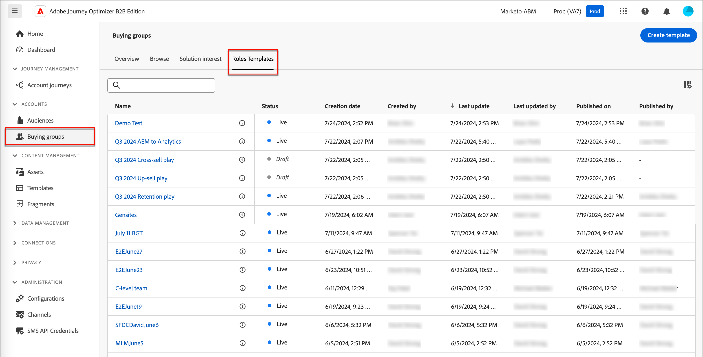
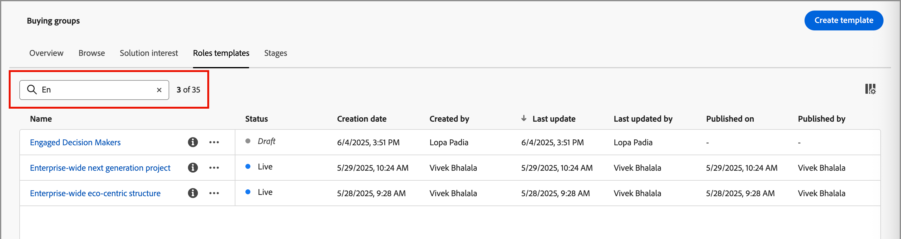
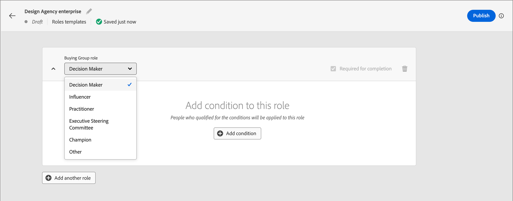
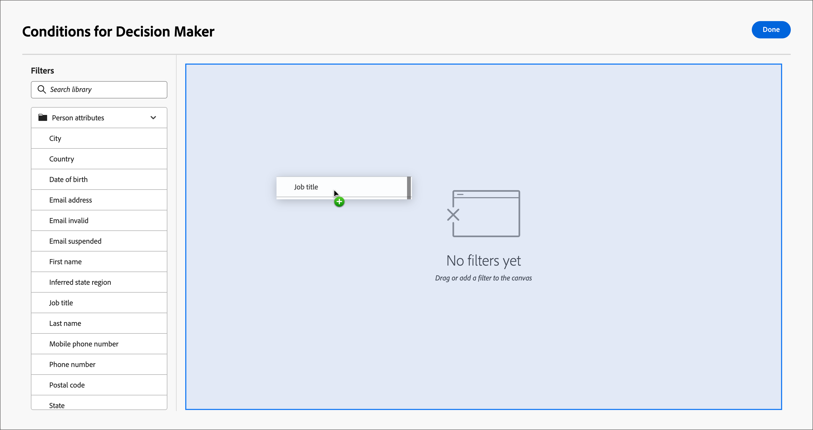
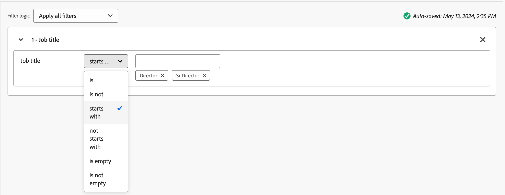
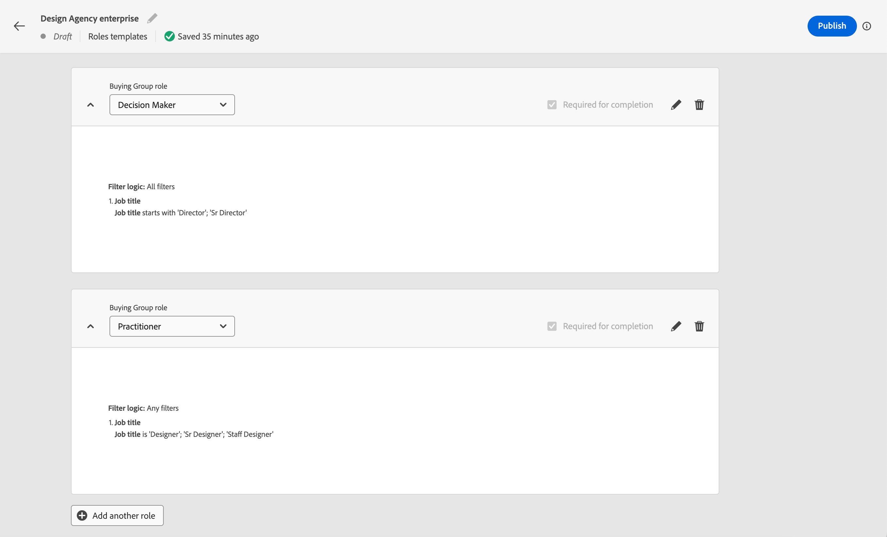
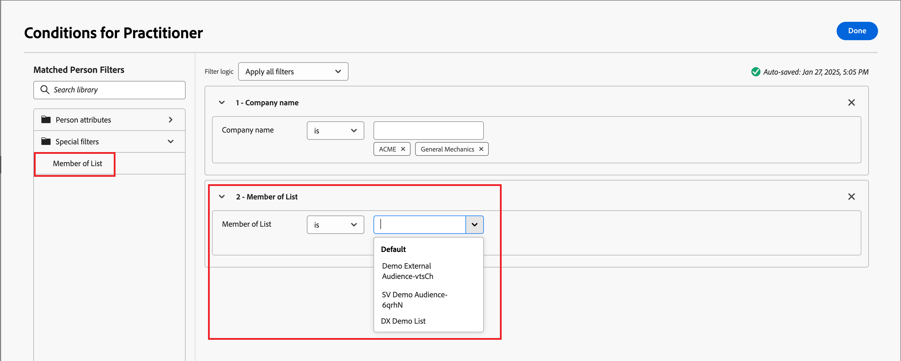
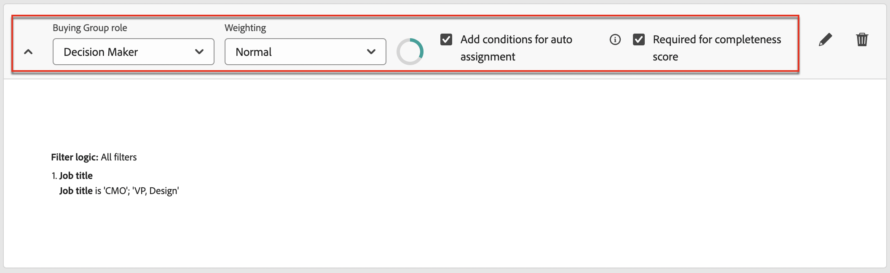
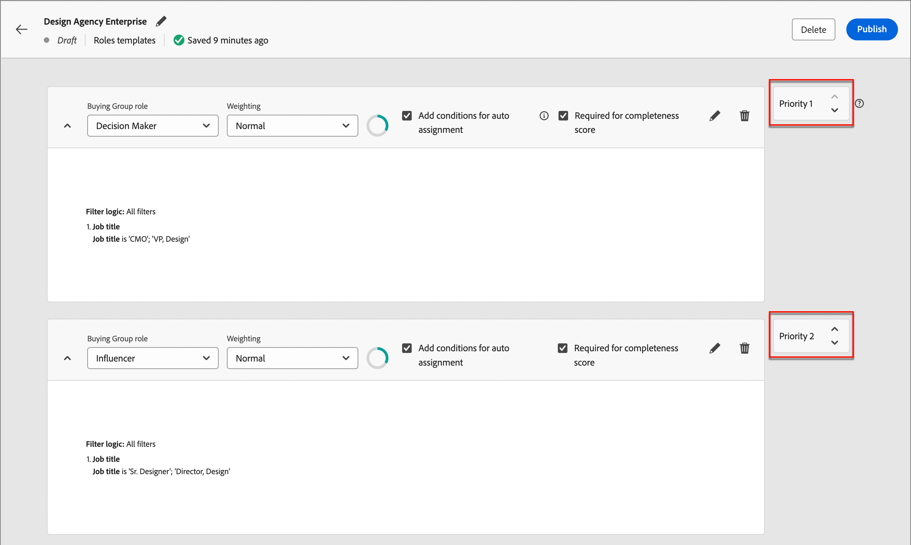
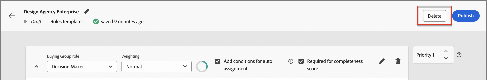

# 購買群組角色範本

在B2B市場中，購買決策通常由多人做出。 這些個人會根據其在組織內的角色參與決策過程。 根據每個產品供應專案型別或帳戶使用案例，建立包含一組角色定義的購買群組角色範本。

{width="30"} [觀看概觀影片](#overview-video)

## 存取和瀏覽角色範本

1. 在左側導覽列中，按一下&#x200B;**[!UICONTROL 購買群組]**。

1. 在&#x200B;_[!UICONTROL 購買群組]_&#x200B;頁面中，選取&#x200B;**[!UICONTROL 角色範本]**&#x200B;標籤。

   {width="800" zoomable="yes"}

   索引標籤提供所有現有角色範本的詳細目錄清單，並以欄格式顯示下列資訊：

   * [!UICONTROL 名稱]
   * [!UICONTROL 狀態]
   * [!UICONTROL 建立日期]
   * [!UICONTROL 建立者]
   * [!UICONTROL 上次更新]
   * [!UICONTROL 上次更新者]
   * [!UICONTROL 發佈日期]
   * [!UICONTROL 發佈者]

   清單依預設會依&#x200B;_[!UICONTROL 上次更新]_&#x200B;排序。 所有角色範本的狀態都是`Draft`或`Live`。

1. 若要依名稱篩選清單，請使用清單頂端的搜尋欄位。

   輸入名稱的前幾個字元，將顯示的清單縮減為符合的專案。

   按搜尋字串篩選的{width="700" zoomable="yes"}

## 建立角色範本

1. 從&#x200B;_[!UICONTROL 角色範本]_&#x200B;索引標籤，按一下右上角的&#x200B;**[!UICONTROL 建立範本]**。

1. 在對話方塊中，輸入範本的唯一&#x200B;**[!UICONTROL Name]** （必要）和&#x200B;**[!UICONTROL Description]** （選用）。

   {width="400"}

1. 按一下&#x200B;**[!UICONTROL 建立]**。

### 新增範本角色

建立範本後，它會在工作區中開啟，並提示您新增角色。 預設會顯示第一個角色卡。

您為範本定義的每個角色都使用一組篩選器（或&#x200B;_條件_）來決定指派給角色的成員。 使用下列篩選型別來定義角色的條件：

| 類型 | 條件 |
| ---- | --------- |
| 個人屬性 | <li>電子郵件地址 <li>電子郵件無效 <li>電子郵件已暫停 <li>傳真號碼 <li>名字 <li>推斷的狀態區域 <li>職稱 <li>姓氏 <li>中間名 <li>行動電話號碼 <li>個人參與分數 <li>電話號碼 <li>郵遞區號 <li>狀態 <li>已取消訂閱 <li>取消訂閱的原因 |
| 特殊篩選 | <li>清單成員 <li>計畫成員 |
| 意圖資料 | 類別方法 <li>產品意圖 <li>關鍵字意圖 [瞭解意圖資料](../admin/intent-data.md)。 |

1. 對於第一個角色卡，定義角色屬性。

   * 從清單中選擇&#x200B;**[!UICONTROL 購買群組角色]**。

     有六個預設角色： `Decision Maker`、`Influencer`、`Practitioner`、`Executive Steering Committee`、`Champion`和`Other`。 此清單也包含在[角色&#x200B;_清單_&#x200B;中定義的任何](./default-custom-roles.md#custom-roles)自訂角色。

     {width="700" zoomable="yes"}

   * 設定用於計算參與分數的角色的&#x200B;**[!UICONTROL 加權]**。

     每個選項的值都會轉譯成分數計算的百分比： [!UICONTROL 一般] = 20，[!UICONTROL 次要] = 40，[!UICONTROL 一般] = 60，[!UICONTROL 重要] = 80，以及[!UICONTROL 重要] = 100。

     例如，角色範本中的角色使用Vital、Important和Normal，則會轉換成100/240、80/240、60/240。

   * **[!UICONTROL 新增自動指派的條件]** — 選取此核取方塊可新增條件，以便將成員自動指派給符合條件的購買群組。 如果未選取核取方塊，則不需要新增條件。

   * **[!UICONTROL 完整性分數所需]** — 如果您希望計算完整性分數需要角色，請選取此核取方塊。

1. 按一下&#x200B;**[!UICONTROL 新增條件]**&#x200B;並定義角色的條件規則。

   * 在&#x200B;_[!UICONTROL 條件]_&#x200B;對話方塊中，展開&#x200B;**[!UICONTROL 人員屬性]**&#x200B;的清單，並找出要用來比對角色的屬性。 將其拖曳至右側，並放置在篩選空間中。

     {width="700" zoomable="yes"}

     >[!NOTE]
     >
     >如果您在Experience Platform的帳戶對象結構描述中定義了自訂人員欄位，這些欄位也可在條件中作為人員屬性使用。

   * 使用屬性，以使用一或多個值建立相符篩選器。

     在下列範例中，職稱屬性用於識別決策者的相符專案。 任何以`Director`或`Sr Director`開頭的標題值，都會將條件的評估為true。

     使用職稱{width="700" zoomable="yes"}角色範本條件範例

   * 如有需要，請新增其他屬性和條件，進一步精簡符合角色的條件。

   * 按一下「**[!UICONTROL 完成]**」。

1. 針對您想要加入範本的每個其他角色，按一下[新增其他角色] **[!UICONTROL ，並重複步驟1和2來定義角色。]**

   已定義多個角色的{width="700" zoomable="yes"}

>[!BEGINSHADEBOX 「Marketo Engage清單成員資格」]

在Marketo Engage中，_智慧行銷活動_&#x200B;會檢查方案成員資格，以確保潛在客戶不會收到重複的電子郵件，而且不會同時成為多個電子郵件串流的成員。 在Journey Optimizer B2B中，您可以檢查Marketo Engage清單成員資格，作為您角色範本的條件，以協助消除購買群組成員資格和歷程活動中的重複專案。

若要使用清單成員資格做為角色條件，請展開&#x200B;**[!UICONTROL 特殊篩選器]**，並將&#x200B;**[!UICONTROL 清單成員]**&#x200B;條件拖曳到篩選器空間。 然後完成篩選器定義，以評估一或多個Marketo Engage清單中的成員資格。

Marketo Engage清單成員資格的{width="700" zoomable="yes"}

>[!ENDSHADEBOX]

您的變更會自動儲存為&#x200B;_草稿_&#x200B;狀態。 如果您尚未準備好發佈角色範本，請按一下頁面頂端的向左（後退）箭頭，並返回&#x200B;_[!UICONTROL 角色範本]_&#x200B;清單。

### 發佈角色範本

如果範本已可供使用，請按一下右上方的&#x200B;**[!UICONTROL 發佈]**。

發佈範本會將狀態設定為&#x200B;_即時_&#x200B;狀態，並使其可與解決方案興趣產生關聯。 至少必須有一個已定義的角色才能發佈角色範本。

## 編輯草稿角色範本

當角色範本處於&#x200B;_草稿_&#x200B;狀態時，您可以繼續編輯定義的角色。 您所做的任何變更都會自動儲存。

變更角色卡片標題中的任何設定，包括購買群組角色、權重、自動指派及完整性評分要求。

{width="600"}

### 修改角色的條件

若要變更任何角色的條件/篩選邏輯，請按一下角色卡片右上角的&#x200B;_編輯_ （  ）圖示。 此動作會開啟&#x200B;_[!UICONTROL 條件]_&#x200B;工作區，您可以在其中修改現有篩選器、新增或移除篩選器，或變更篩選器邏輯。

### 刪除角色卡

如果您想要從範本移除角色，請按一下角色卡片中的&#x200B;_刪除_ （  ）圖示。

### 設定角色的優先順序

您可以重新排序範本中的角色，這會決定指派銷售機會給角色的優先順序。 每個角色卡片右側都顯示有&#x200B;**[!UICONTROL 優先順序]**&#x200B;控制器。 按一下右側的&#x200B;_向上_&#x200B;或&#x200B;_向下_&#x200B;箭號，將角色卡優先向上或向下移動。

{width="700"}

## 刪除角色範本

如果角色範本處於&#x200B;_草稿_&#x200B;狀態，您可以將其刪除。

1. 從清單中選取角色範本以開啟它。

1. 按一下右上方的&#x200B;**[!UICONTROL 刪除]**。

   {width="700"}

1. 在對話方塊中，按一下&#x200B;**[!UICONTROL 刪除]**&#x200B;以進行確認。

## 概觀影片

>[!VIDEO](https://video.tv.adobe.com/v/3453312/?learn=on&captions=chi_hant)
