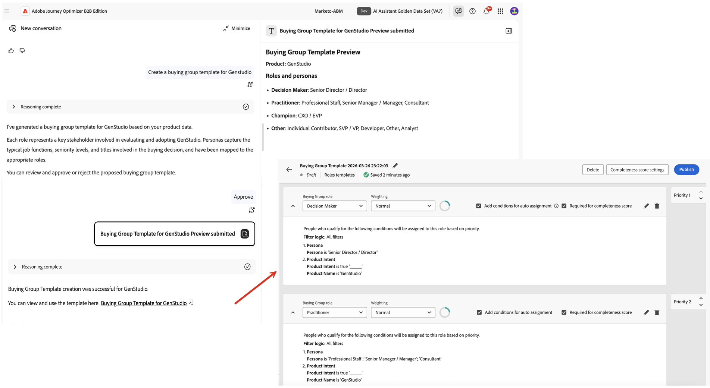
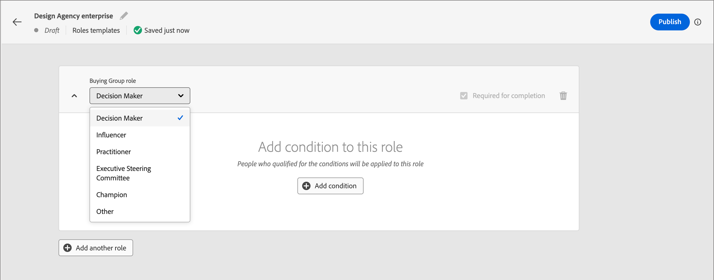
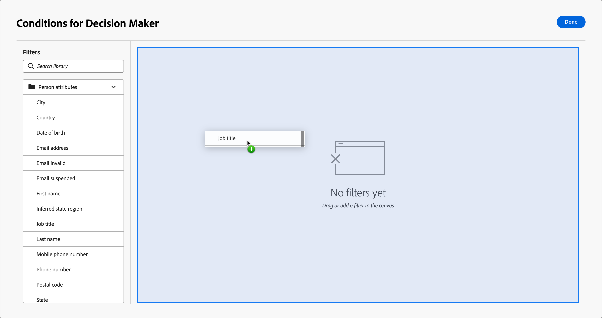
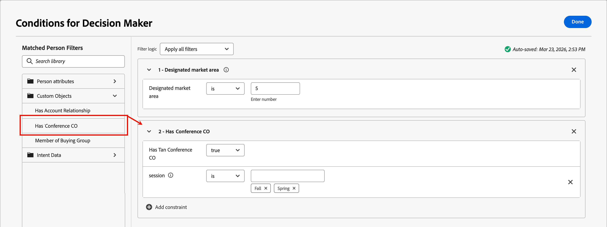
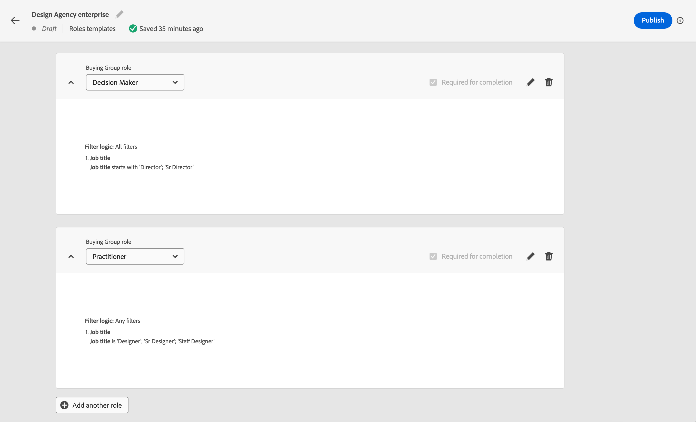
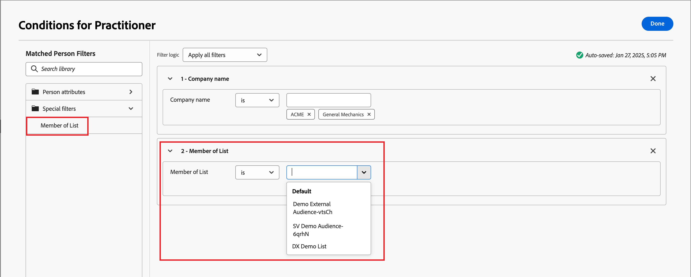
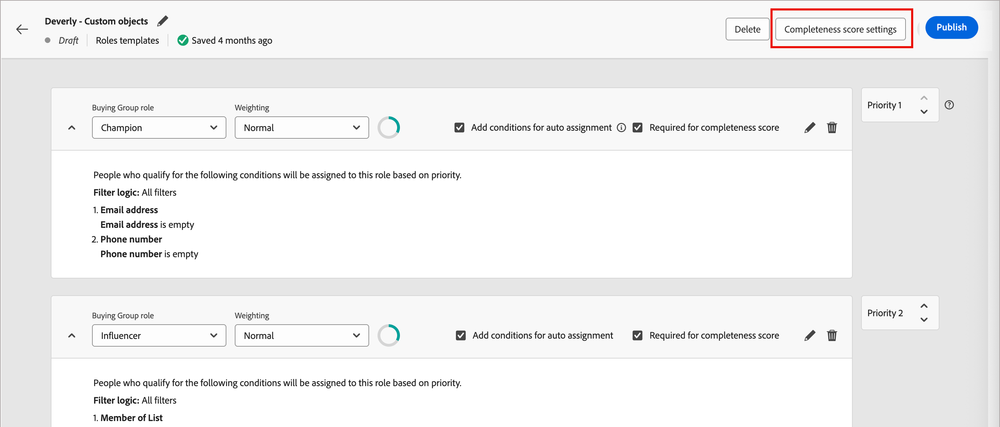
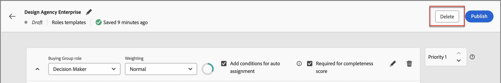

# 購買群組角色範本

在B2B市場中，通常會有多個人做出購買決定。 這些個人會根據其在組織內的角色參與決策過程。 根據每個產品供應專案型別或帳戶使用案例，建立包含一組角色定義的購買群組角色範本。

{width="30"} [觀看概觀影片](#overview-video)

>[!BEGINSHADEBOX]

## Audience Agent B2B

[Audience Agent B2B](../agents/audience-agent-b2b.md)可以透過第一方意向偵測和角色對應產生購買群組角色範本。 在引導式流程中，您可以識別連結至產品的角色、檢閱AI建議的角色與角色對應，並在發佈範本之前使用自然語言調整範本。

**提示嘗試：**

* 建立`<product>`的購買群組範本
* 新增對應至`<persona>`的`<role>`
* 移除`<role>` / `<persona>`

{width="800" zoomable="yes"}

>[!ENDSHADEBOX]

>[!PREREQUISITES]
>
>在建立角色範本之前，請先設定角色條件可使用的資料：
>
>* [個人資料欄位對應](../admin/field-mapping.md#xdm-business-person-attributes)個人屬性篩選器
>* 如果您在角色條件中使用意圖篩選器，則[意圖資料](../admin/intent-data.md)
>* 如果您需要超過六個預設值的角色，請[自訂購買群組角色](./default-custom-roles.md#custom-roles) （選擇性）

## 存取和瀏覽角色範本 {#access-and-browse-role-templates}

1. 在左側導覽列中，按一下&#x200B;**[!UICONTROL 購買群組]**。

1. 在&#x200B;_[!UICONTROL 購買群組]_&#x200B;頁面中，選取&#x200B;**[!UICONTROL 角色範本]**&#x200B;標籤。

   {width="800" zoomable="yes"}

   索引標籤提供所有現有角色範本的詳細目錄清單，並以欄格式顯示下列資訊：

   * [!UICONTROL 名稱]
   * [!UICONTROL 狀態]
   * [!UICONTROL 建立日期]
   * [!UICONTROL 建立者]
   * [!UICONTROL 上次更新]
   * [!UICONTROL 上次更新者]
   * [!UICONTROL 發佈日期]
   * [!UICONTROL 發佈者]

   清單依預設會依&#x200B;_[!UICONTROL 上次更新]_&#x200B;排序。 所有角色範本的狀態都是`Draft`或`Live`。

1. 若要依名稱篩選清單，請使用清單頂端的搜尋欄位。

   輸入名稱的前幾個字元，將顯示的清單縮減為符合的專案。

   按搜尋字串篩選的{width="700" zoomable="yes"}

## 建立角色範本

1. 從&#x200B;_[!UICONTROL 角色範本]_&#x200B;索引標籤，按一下右上角的&#x200B;**[!UICONTROL 建立範本]**。

1. 在對話方塊中，輸入範本的唯一&#x200B;**[!UICONTROL Name]** （必要）和&#x200B;**[!UICONTROL Description]** （選用）。

   {width="400"}

1. 按一下&#x200B;**[!UICONTROL 建立]**。

### 新增範本角色 {#add-the-template-roles}

建立範本後，它會在工作區中開啟，並提示您新增角色。 依預設，系統會顯示第一個角色卡。

#### 角色條件篩選型別

您為範本定義的每個角色都使用一組篩選器（或&#x200B;_條件_）來決定指派給角色的成員。 使用下列篩選型別來定義角色的條件：

| 類型 | 條件 |
| ---- | --------- |
| [!UICONTROL 個人屬性] | [個人檔案](../admin/field-mapping.md#xdm-business-person-attributes)中的屬性，包括： <li>城市 <li>國家/地區 <li>電子郵件地址 <li>電子郵件無效 <li>電子郵件中止 <li>名字 <li>推斷的州別區域 <li>職稱 <li>姓氏 <li>手機號碼 <li>個人參與分數 <li>電話號碼 <li>郵遞區號 <li>狀態 |
| [!UICONTROL 自訂物件] >有`<custom object>` | [!BADGE Beta]{type=Informative tooltip="Beta功能"}帳戶或人員沒有關聯式結構描述記錄。 也可以根據[XDM關聯式結構描述](../admin/xdm-field-management.md#relational-schemas)中設定的任何選取的自訂物件條件進行評估。 |
| 特殊篩選條件 | <li>清單成員（已棄用） <li>計畫成員（已棄用） |
| 意圖資料 | <li>類別方法 <li>產品意圖 <li>關鍵字比對方式 （請參閱&#x200B;[_比對方式資料_](../admin/intent-data.md)） |

#### 定義角色屬性

1. 對於第一個角色卡，定義角色屬性。

   * 從清單中選擇&#x200B;**[!UICONTROL 購買群組角色]**。

     有六個預設角色： `Decision Maker`、`Influencer`、`Practitioner`、`Executive Steering Committee`、`Champion`和`Other`。 此清單也包含在&#x200B;_角色_&#x200B;清單](./default-custom-roles.md#custom-roles)中定義的任何[自訂角色。

     {width="700" zoomable="yes"}

   * 設定用於計算參與分數的角色的&#x200B;**[!UICONTROL 加權]**。

     每個選項的值都會轉譯成分數計算的百分比： [!UICONTROL 一般] = 20，[!UICONTROL 次要] = 40，[!UICONTROL 一般] = 60，[!UICONTROL 重要] = 80，以及[!UICONTROL 重要] = 100。

     例如，具有Vital、Important和Normal角色的角色範本會轉換為100、80和60/240。

   * **[!UICONTROL 新增自動指派的條件]** — 選取此核取方塊可新增條件，以便將成員自動指派給符合條件的購買群組。 如果未選取核取方塊，則不需要新增條件。

   * **[!UICONTROL 完整性分數所需]** — 如果您希望計算完整性分數需要角色，請選取此核取方塊。

#### 新增自動指派條件

1. 按一下&#x200B;**[!UICONTROL 新增條件]**&#x200B;並定義角色的條件規則。

   * 在&#x200B;_[!UICONTROL 條件]_&#x200B;對話方塊中，展開&#x200B;**[!UICONTROL 人員屬性]**&#x200B;的清單，並找出要用來比對角色的屬性。 將其拖曳至右側，並放置在篩選空間中。

     {width="700" zoomable="yes"}

     >[!NOTE]
     >
     >如果您在Experience Platform企業人員綱要中定義了自訂人員欄位，則可以在條件中將這些欄位用作人員屬性。

     使用屬性，以使用一或多個值建立相符篩選器。

     在下列範例中，職稱屬性用於識別決策者的相符專案。 任何以`Director`或`Sr Director`開頭的標題值，都會將條件的評估為true。

     使用職稱](assets/roles-template-condition-example-job-title.png){width="700" zoomable="yes"}的中定義的人員[相關，請展開&#x200B;**[!UICONTROL 自訂物件]**&#x200B;清單以在角色條件中使用它們。

     {width="700" zoomable="yes"}

   * 如有需要，請新增其他屬性/物件和條件，進一步精簡符合角色的條件。

   * 按一下「**[!UICONTROL 完成]**」。

#### 新增更多角色

1. 針對您想要加入至範本的每個其他角色，按一下&#x200B;**[!UICONTROL 新增其他角色]**，並重複在&#x200B;**定義角色屬性**&#x200B;和&#x200B;**新增自動指派條件**&#x200B;下的步驟以定義角色。

   已定義多個角色的{width="700" zoomable="yes"}

   您的變更會自動儲存為&#x200B;_草稿_&#x200B;狀態。 如果您尚未準備好發佈角色範本，請按一下頁面頂端的向左（後退）箭頭，並返回&#x200B;_[!UICONTROL 角色範本]_&#x200B;清單。

>[!BEGINSHADEBOX 「Marketo Engage清單成員資格」]

在Marketo Engage中，_智慧行銷活動_&#x200B;會檢查方案成員資格，以確保潛在客戶不會收到重複的電子郵件，而且不會同時成為多個電子郵件串流的成員。 在Journey Optimizer B2B中，您可以檢查Marketo Engage清單成員資格，作為您角色範本的條件，以協助消除購買群組成員資格和歷程活動中的重複專案。

若要使用清單成員資格做為角色條件，請展開&#x200B;**[!UICONTROL 特殊篩選器]**，並將&#x200B;**[!UICONTROL 清單成員]**&#x200B;條件拖曳到篩選器空間。 然後完成篩選器定義，以評估一或多個Marketo Engage清單中的成員資格。

Marketo Engage清單成員資格的{width="700" zoomable="yes"}
 

>[!NOTE]
>
>**功能淘汰**
>
>在目前的Journey Optimizer B2B edition版本中，不再支援在Marketo Engage執行個體中根據清單或方案成員資格進行篩選。

>[!ENDSHADEBOX]

### 變更完整度分數設定 {#change-the-completeness-score-settings}

依預設，角色的完整性定義為指派給角色的一個成員。 使用購買群組完整性來指示銷售整備時，請使用這些設定來調整分數與關閉商機所需的成員數量。

例如，若要完成您的解決方案&#x200B;_X_&#x200B;的交易，必須識別並參與多個行銷決策者，因為一個組織的多個行銷團隊都會使用該解決方案。 在此情況下，您至少要有兩個行銷決策者，才能增加臨界值以計算&#x200B;_完整_&#x200B;購買群組。

若需有關完整性評分和計算的詳細資訊，請參閱[完整性分數](./completeness-scores.md)。

1. 按一下角色範本頁面右上角的&#x200B;**[!UICONTROL 完整度分數設定]**。

   {width="700" zoomable="yes"}

1. 在對話方塊中，視需要變更每個已定義角色所需的&#x200B;**[!UICONTROL 成員]**&#x200B;值。

   您可以輸入值，或按一下&#x200B;**&amp;plus；**&#x200B;或&#x200B;**−**&#x200B;來增加或減少值。

   {width="450"}

1. 按一下&#x200B;**[!UICONTROL 儲存]**。

### 發佈角色範本

如果範本已可供使用，請按一下右上方的&#x200B;**[!UICONTROL 發佈]**。

發佈範本會將狀態設定為&#x200B;_即時_，並使其可與解決方案興趣產生關聯。 至少必須有一個已定義的角色才能發佈角色範本。

發佈之後，**[!UICONTROL 角色範本]**&#x200B;標籤上的範本狀態為&#x200B;_即時_，而且您可以在[建立感興趣的解決方案](./solution-interests.md)時選取它。

## 編輯草稿角色範本

當角色範本處於&#x200B;_草稿_&#x200B;狀態時，您可以繼續編輯定義的角色。 您所做的任何變更都會自動儲存。

變更角色卡片標題設定，例如購買群組角色、加權、自動指派或完整性評分要求。

{width="600"}

### 修改角色的條件

若要變更任何角色的條件/篩選邏輯，請按一下角色卡片右上角的&#x200B;_編輯_ （  ）圖示。 此動作會開啟&#x200B;_[!UICONTROL 條件]_&#x200B;工作區，您可以在其中修改現有篩選器、新增或移除篩選器，或變更篩選器邏輯。

### 刪除角色卡

如果您想要從範本移除角色，請按一下角色卡片中的&#x200B;_刪除_ （  ）圖示。

### 設定角色的優先順序

您可以重新排序範本中的角色，這會決定指派銷售機會給角色的優先順序。 每個角色卡片右側都顯示有&#x200B;**[!UICONTROL 優先順序]**&#x200B;控制器。 按一下右側的&#x200B;_向上_&#x200B;或&#x200B;_向下_&#x200B;箭號，將角色卡優先向上或向下移動。

{width="700"}

## 刪除角色範本

如果角色範本處於&#x200B;_草稿_&#x200B;狀態，您可以將其刪除。

1. 從清單中選取角色範本以開啟它。

1. 按一下右上方的&#x200B;**[!UICONTROL 刪除]**。

   {width="700"}

1. 在對話方塊中，按一下&#x200B;**[!UICONTROL 刪除]**&#x200B;以進行確認。

   確認後，角色範本會從&#x200B;**[!UICONTROL 角色範本]**&#x200B;詳細目錄清單中移除。

## 概觀影片 {#overview-video}

>[!VIDEO](https://video.tv.adobe.com/v/3433079/?learn=on)
