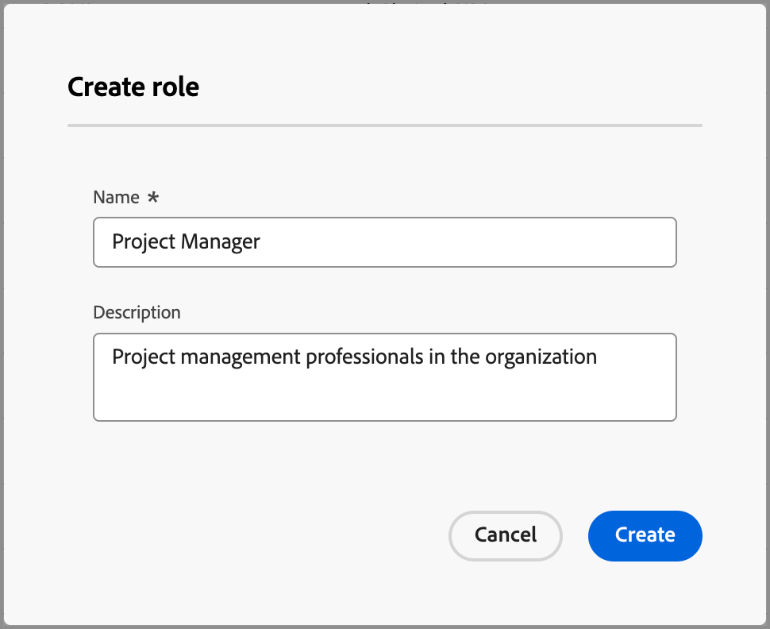
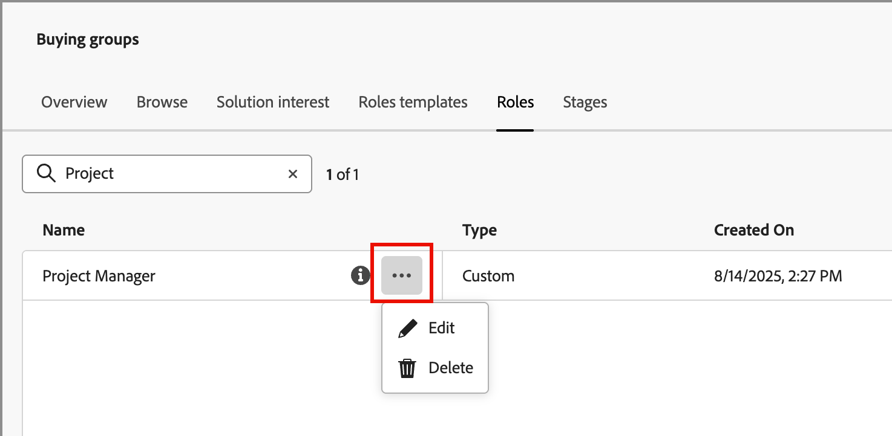

# 預設和自訂角色

Journey Optimizer B2B edition包含一組預設角色，用於購買群組的角色範本中。 但許多組織都需要自訂角色，以便根據其業務目標和策略進行定義。 您可以使用&#x200B;_[!UICONTROL 角色]_&#x200B;清單來建立您自己的角色定義，以支援購買群組。

## 存取角色

1. 在左側導覽列中，按一下&#x200B;**[!UICONTROL 購買群組]**。

1. 在&#x200B;_[!UICONTROL 購買群組]_&#x200B;頁面中，選取&#x200B;**[!UICONTROL 角色]**&#x200B;標籤。

   {width="700" zoomable="yes"}

   索引標籤提供所有現有角色的詳細目錄清單，並以欄格式顯示下列資訊：

   * [!UICONTROL 名稱] — 角色名稱。
   * [!UICONTROL 型別] — 所有角色的型別為`Default`或`Custom`。
   * [!UICONTROL 建立於] — 若為自訂角色，則為建立角色的日期和時間。
   * [!UICONTROL 建立者] — 若為自訂角色，則為建立該角色的使用者。
   * [!UICONTROL 上次更新日期] — 若為自訂角色，則為上次更新角色的日期和時間。
   * [!UICONTROL 更新者] — 若為自訂角色，則為上次更新角色的使用者。

   清單會在頂端顯示預設角色：

   * 決策者
   * 影響者
   * 從業人員
   * 執行指導委員會
   * 冠軍
   * 其他

   >[!NOTE]
   >
   >您無法變更或刪除預設角色。 包括預設和自訂角色在內的20個角色上限為。

## 建立自訂角色

1. 從&#x200B;_[!UICONTROL 角色]_&#x200B;索引標籤，按一下右上角的&#x200B;**[!UICONTROL 建立角色]**。

1. 在對話方塊中，輸入角色的唯一&#x200B;**[!UICONTROL Name]** （必要）和&#x200B;**[!UICONTROL Description]** （選用）。

   {width="400"}

1. 按一下&#x200B;**[!UICONTROL 建立]**。

## 管理自訂角色

您可以在&#x200B;_[!UICONTROL 角色]_&#x200B;標籤中管理自訂角色，包括編輯角色名稱和說明，以及從角色清單中移除角色。 按一下階段模型名稱旁的&#x200B;_更多_&#x200B;功能表圖示(**...**)，然後選擇&#x200B;**[!UICONTROL 編輯]**&#x200B;或&#x200B;**[!UICONTROL 刪除]**。

{width="600"}
