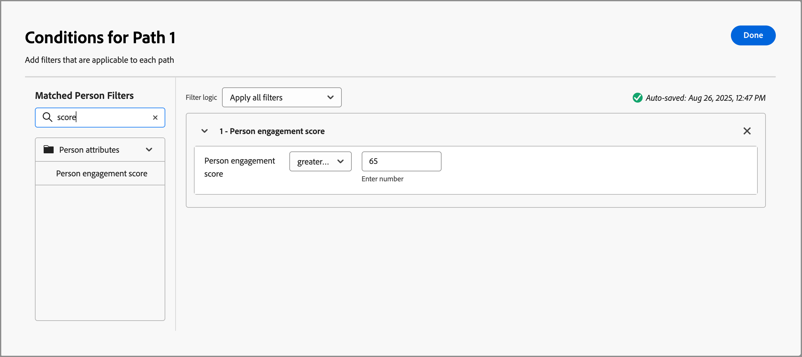
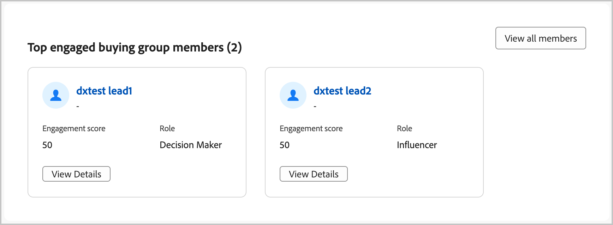
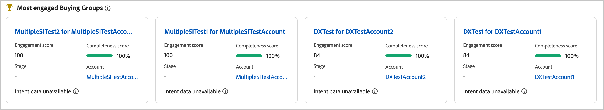
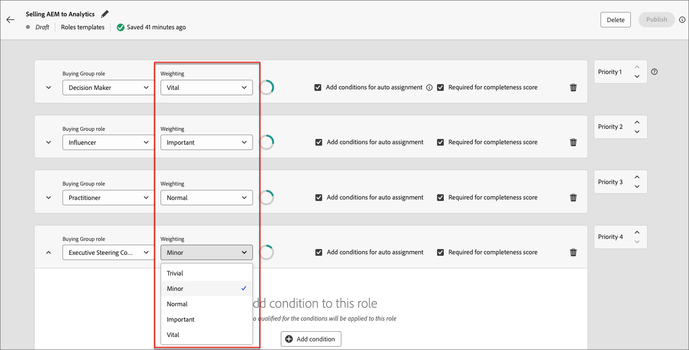

# 參與度分數 {#engagement-scores}

>[!CONTEXTUALHELP]
>id="ajo-b2b_buying_group_engagement_score"
>title="參與度分數"
>abstract="參與度分數會決定購買群組成員的參與度。"

參與分數是指示購買群組成員參與程度的數字。 這些分數是根據購買群組成員活動、加權動作和加權角色而定。 產生的分數會在租使用者（例項）中標準化，以啟用一致的比較，並允許可操作的深入分析。 分數計算在您建立購買群組時立即開始。 Journey Optimizer B2B edition資料中樞系統每天都會計算分數，並使用內嵌服務將其上傳至多級行銷(MLM) MySQL系統。

參與分數有兩種型別：

* **購買群組參與分數** — 購買群組參與分數是介於0到100之間的標準化分數，並以個人層級計算的參與分數為基礎。

  購買群組參與分數會顯示在[購買群組詳細資料](./buying-group-details.md)頁面中。 您也可以在Intelligent儀表板中檢視參與度最高的購買群組。

  {width="700" zoomable="yes"}

* **個人參與分數** — 個人參與分數是以個別購買群組成員的活動為基礎。

  每個購買群組成員的個人參與分數會顯示在購買群組詳細資訊頁面[_[!UICONTROL 成員&#x200B;]_標籤](./buying-group-details.md#buying-group-members)中。 這些分數也會顯示在頁面和儀表板中，其中包含最常參與的成員和重疊的聯絡人資訊。

  {width="550" zoomable="yes"}

>[!BEGINSHADEBOX]

人員參與分數是屬性，可用來篩選[角色範本](./buying-groups-role-templates.md#add-the-template-roles)和[依人員劃分歷程路徑](../journeys/split-merge-paths-nodes.md#people-path-conditions)。

{width="550" zoomable="yes"}

>[!ENDSHADEBOX]

購買群組成員在過去30天內執行的任何參與加權活動都會用來計算分數。 在30天視窗中，活動發生次數會過期，而分數可能會往下移（分數衰減）。 顯示的分數會四捨五入(例如，75.89999的分數會顯示為76)。

## 用於參與計分的活動

購買群組評分不是&#x200B;_觸髮型_。 這是每日程式，會評估購買群組所有成員的活動，並重新計算分數。 活動會使用&#x200B;_權重_，根據決定每個活動加權方式的主動加權模型，來通知購買群組得分。

每項活動的每日頻率上限為 20 次。如果購買群組的成員在一天內執行相同的活動超過20次，則活動的計數上限為20。

| 活動名稱 | 說明 | 參與類型 | 每日最大頻率計數 | 預設模型活動權重 |
|---------------|-------------|-----------------|---------------------------|-------------------------------|
| 參加活動 | 成員參加一項活動 | 活動 | 20 | 60 |
| 電子郵件已點按 | 成員點按電子郵件中的連結 | 電子郵件 | 20 | 30 |
| 電子郵件已開啟 | 成員開啟電子郵件 | 電子郵件 | 20 | 30 |
| 表單已填寫 | 成員在網頁上填寫並提交表單 | 網頁 | 20 | 40 |
| 關鍵時刻 | 成員有一個精彩時刻 | 監管型 | 20 | 60 |
| 連結點按次數 | 成員點按網頁上的連結 | 網頁 | 20 | 40 |
| 頁面檢視 | 成員檢視網頁 | 網頁 | 20 | 40 |
| 註冊參加活動 | 為事件註冊的成員 | 活動 | 20 | 60 |

<!-- old list

| Activity name | Description | Engagement type | Max daily frequency count | Activity weight |
| --- | --- | --- | --- | --- |
| [!UICONTROL Visit Webpage]| A member visits a web page | Web | 20 | 40 |
| [!UICONTROL Fill Out Form]| A member fills and submits a form on a web page | Web | 20 | 40 |
| [!UICONTROL Click Link] | A member clicks a link on a web page | Web | 20 | 40 |
| [!UICONTROL Open Email] | A member opens an email | Email | 20 | 30 |
| [!UICONTROL Click Email] | A member clicks a link in an email | Email | 20 | 30 |
| [!UICONTROL Open Sales Email] | A member opens a sales email | Email | 20 | 30 |
| [!UICONTROL Click Sales Email] | A member clicks a link in a sales email | Email | 20 | 30 |
| [!UICONTROL Interesting Moment] | A member has an interesting moment | Curated | 20 | 60 |
| [!UICONTROL Tap Push Notification] | A member receives a push notification | Mobile | 20 | 30 |
| [!UICONTROL Mobile App Activity] | A member performs an activity on a mobile app | Mobile | 20 | 30 |
| [!UICONTROL Mobile App Session] | A member is active on a mobile app session | Mobile | 20 | 30 |
| [!UICONTROL Fill Out Facebook Lead Ads Form] | A member fills and submits a Lead Ads form on a Facebook page | Social | 20 | 30 |
| [!UICONTROL Click RTP Call to Action] | A member clicks a personalized call to action | Web | 20 | 60 |
| [!UICONTROL View In-App Message] | A member views an in-app message | Mobile | 20 | 30 |
| [!UICONTROL Tap In-App Message] | A member taps an in-app message | Mobile | 20 | 30 |
| [!UICONTROL Subscribe SMS] | A member subscribes to SMS communications | SMS | 20 | 90 |
| [!UICONTROL Reply to Sales Email] | A member replies to a sales email | Email | 20 | 30 |
| [!UICONTROL Engaged with a Dialogue] | A member engages with a Dynamic Chat dialogue | Chat | 20 | 90 |
| [!UICONTROL Interacted with Document in Dialogue] | A member interacts with a document in a Dynamic Chat dialogue | Chat | 20 | 90 |
| [!UICONTROL Scheduled Meeting in Dialogue] | A member schedules an appointment in a Dynamic Chat dialogue | Chat | 20 | 90 |
| [!UICONTROL Reached Dialogue Goal] | A member reaches a goal in a Dynamic Chat dialogue |  |20 | 90 |
| [!UICONTROL Responded to a poll in webinar] | A member responds to a poll in a webinar event | Chat | 20 | 90 |
| [!UICONTROL Call to action clicked in webinar] | A member clicks a call-to-action link in a webinar event | Call | 20 | 30 |
| [!UICONTROL Asset downloads in webinar] | A member downloads a file/asset in a webinar event | Event | 20 | 60 |
| [!UICONTROL Asks questions in webinar] | A member asks questions in a webinar event | Event | 20 | 60 |
| [!UICONTROL Has attended event] | A member attended an event | Event | 20 | 60 |
| [!UICONTROL Engaged with an Agent in Dialogue] | A member engages with an agent in a Dynamic Chat dialogue | Chat | 20 | 90 |
| [!UICONTROL Clicked Link in Chat in Dialogue] | A member clicks a link in a Dynamic Chat dialogue | Chat | 20 | 90 |
| [!UICONTROL Engaged with a Conversational Flow] | A member engages with a Dynamic Chat conversational flow | Chat | 20 | 90 |
| [!UICONTROL Scheduled Meeting in Conversational Flow] | A member schedules an appointment in a Dynamic Chat conversational flow | Chat | 20 | 90 |
| [!UICONTROL Reached Conversational Flow Goal] | A member reaches a goal in a Dynamic Chat conversational flow | Chat | 20 | 90 |
| [!UICONTROL Interacted with Document in Conversational Flow] | A member interacts with a document in a Dynamic Chat conversational flow | Chat | 20 | 90 |
| [!UICONTROL Engaged with an Agent in Conversational Flow] | A member engages with an Agent in a Dynamic Chat conversational flow | Chat | 20 | 90 |
| [!UICONTROL Clicked Link in Chat in Conversational Flow] | A member clicks a link in a Dynamic Chat conversational flow | Chat | 20 | 90 |
| [!UICONTROL Click Link in SMS V2] | A member clicks a link in an SMS message | SMS | 20 | 90 | -->

>[!NOTE]
>
>參與分數活動會記錄在個人的Marketo Engage活動記錄中。 您可以在連線的Marketo Engage執行個體中存取此記錄檔。 如需詳細資訊，請參閱Marketo Engage檔案中的[尋找人員](https://experienceleague.adobe.com/zh-hant/docs/marketo/using/product-docs/core-marketo-concepts/smart-lists-and-static-lists/managing-people-in-smart-lists/locate-the-activity-log-for-a-person){target="_blank"}的活動記錄。

## 角色範本加權 {#engagement-score-weighting}

>[!CONTEXTUALHELP]
>id="ajo-b2b_buying_group_engagement_score_weighting"
>title="參與度分數角色加權"
>abstract="使用角色加權自訂參與度分數計算。"

使用者可以指派&#x200B;_加權_&#x200B;給[角色範本](./buying-groups-role-templates.md)中每個角色，以分配不同的角色權重。

{width="700" zoomable="yes"}

每個權重層級會轉譯為一個值，用於計算參與度分數：

* [!UICONTROL 不重要] = 20
* [!UICONTROL 輕微] = 40
* [!UICONTROL 正常] = 60
* [!UICONTROL 重要] = 80
* [!UICONTROL 極重要] = 100

角色範本擁有權重分別為「_[!UICONTROL 極重要]_」、「_[!UICONTROL 重要]_」以及「_[!UICONTROL 正常]_」的三個角色，轉換為下列加權百分比：

| 角色 | 加權 | 系統值 | 值計算 | 百分比 |
|-------------- |--------- |------------- |------------------ |---------- |
|               |          |              |                   |           |
| 決策者 | 極重要 | 100 | 100/240 | 41.67% |
| 影響者 | 重要 | 80 | 80/240 | 33.33% |
| 從業人員 | 正常 | 60 | 60/240 | 25% |
|               | 總計 | 240 |                   |           |

## 分數計算範例

下列範例說明預訂分數的計算。 它使用概述的角色權重百分比、每個購買群組成員的傳入活動計數，以及每個事件發生的每日上限20。

| 角色 | 成員 | 活動類型 | 昨日計數 | 今日計數 | 計算 | 總分 |
|-------------- |--------- |-------------|-----------------|-------------|------|-----------|
|               |          |             |                 |             |      |           |
| 決策者 | Adam | 造訪網站 | 37 | 15 | 20 + 15 | 35 |
|               |          | 點按電子郵件 | 1 | 1 | 1 + 1 | 2 |
|               |          |             |                 |             |      |           |
|               | Mark | 造訪網站 | 5 | 3 | 5 + 3 | 8 |
|               |          | 點按電子郵件 | 1 | 1 | 1 + 1 | 2 |
|               |          | 下載 pub | 3 | 2 | 3 + 2 | 5 |
| **決策者總分** |         |             |                 |             |      | **52** |
|               |          |             |                 |             |      |           |
| 影響者 | John | 造訪網站 | 19 | 9 | 19 + 9 | 28 |
| **影響者總分** |         |             |                 |             |      | **28** |
|               |          |             |                 |             |      |           |
| 從業人員 | Bob | 點按電子郵件 | 1 | 1 | 1 + 1 | 2 |
|               |          |             |                 |             |      |           |
|               | Paul | 點按電子郵件 | 1 | 1 | 1 + 1 | 2 |
|               |          |             |                 |             |      |           |
|               | Calvin | 點按電子郵件 | 1 | 1 | 1 + 1 | 2 |
|               |          | 造訪網站 | 1 | 7 | 1 + 7 | 8 |
|               |          | 下載 pub | 1 | 2 | 1 + 2 | 3 |
| **從業人員總分** |         |             |                 |             |      | **17** |

對每個角色分數套用加權，以計算出最終的參與度分數：

| 角色 | 角色總分 | 角色權重 % | 分數 X 權重 % |
|-------------- |---------------- |------------- |---------------- |
| 決策者 | 52 | 41.67% | 21.67 |
| 影響者 | 28 | 33.33% | 9.33 |
| 從業人員 | 17 | 25% | 4.25 |
| **最終參與度分數** |                |             | **35.25** |

## 評分邏輯

除了計算範例中概述的計算邏輯外，在系統中發生非常複雜的標準化分數，涵蓋您執行個體中的所有人員、購買群組和帳戶。 購買群組參與分數與人員參與分數的相依性如下：

### 個人參與分數計算邏輯

1. 識別具有相關權重和每日配額的所有&#x200B;_參與加權_&#x200B;活動型別，例如網站造訪、電子郵件點按和網路研討會出席次數。

1. 識別在活動回顧期間（目前硬式編碼為30天）內執行的所有人員&#x200B;_參與加權_&#x200B;動作。

1. 將步驟1中識別的所有&#x200B;_參與加權_&#x200B;活動型別權重的活動型別權重標準化，忽略回顧期間未發生的活動型別權重。

   此步驟運用&#x200B;_最小最大標準化_，並大幅減少未運用大部分活動型別的租使用者之活動型別權重的人工稀釋。

1. 套用每人每日配額篩選和活動型別。

   此步驟可避免低值/高容量活動扭曲分數，藉以緩解具有非常大離群值的情況。

1. 計算原始人員參與分數，方法是加總每個活動型態的每日活動，再乘以相關的加權，然後加總回顧期間所有天數的結果。

1. 使用&#x200B;_乘冪轉換_ （平方根）轉換，透過減少可能的離群值來穩定變異數。

   此轉換有助於減少偏斜，並讓資料中的圖案更加線性。

1. 套用額外的&#x200B;_縮放標準化_&#x200B;轉換，以確保分數利用0到100的整個範圍。

### 購買群組參與分數計算邏輯

1. 根據在角色範本中設定的權重，依角色將標準化權重套用至每個購買群組成員。

1. 將每個購買群組的購買群組角色權重標準化。

   如果購買群組未使用所有角色，此標準化可避免不必要的角色權重稀釋。

1. 將個人參與分數乘以個人角色標準化角色權重，彙總所有購買群組成員個人參與分數，並將它們相加。

1. 套用&#x200B;_乘冪轉換_ （平方根）轉換，減少可能的離群值以穩定變異，尤其是對於非常大的購買群組。

1. 套用額外的&#x200B;_縮放標準化_&#x200B;轉換，以確保分數利用0到100的整個範圍。
