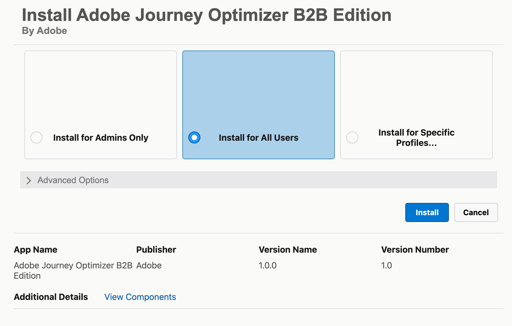
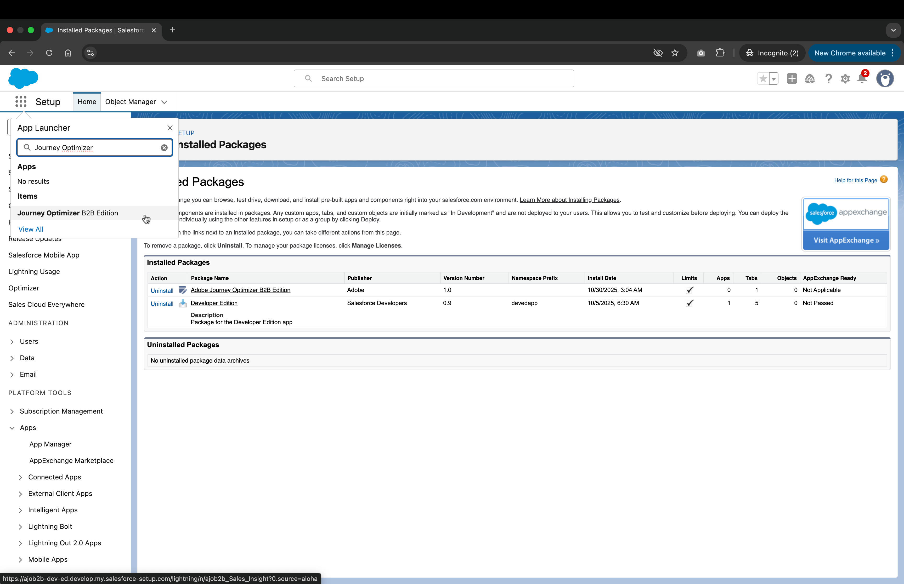
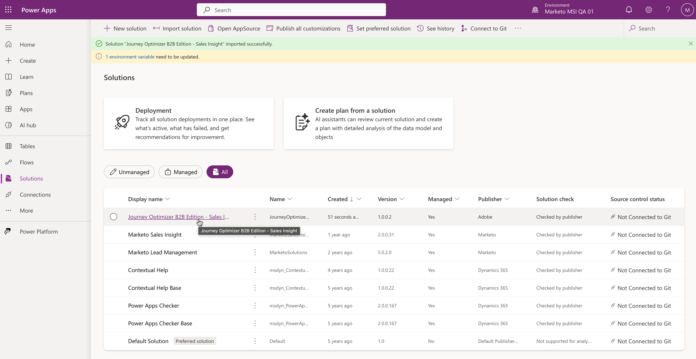

# In-CRM Insights

[!DNL In-CRM Insights]是整合至Salesforce和Microsoft Dynamics 365的網頁型應用程式，可讓您直接在您的CRM中存取[!DNL Journey Optimizer B2B Edition]個購買群組。 這項服務將銷售資料來源彙整在一起，可讓您更輕鬆地找出提升參與度和銷售潛力的機會。

[!DNL In-CRM Insights]應用程式可在[Marketo Sales Insights套件](https://experienceleague.adobe.com/zh-hant/docs/marketo/using/product-docs/marketo-sales-insight/msi-for-salesforce/installation/install-marketo-sales-insight-package-in-salesforce-appexchange)中使用。

## 安裝

安裝程式包括：

* 設定使用者許可權和群組
* 安裝軟體套件
* 透過您的CRM登入

### 設定許可權

安裝軟體的使用者必須擁有安裝Salesforce套件的許可權。

若要存取應用程式，使用者必須在角色中擁有&#x200B;**Sales Insights:View Sales Insights**&#x200B;許可權的成員資格。

如果您想要將使用者限製為僅[!DNL In-CRM Insights]：

1. 建立[自訂角色](https://experienceleague.adobe.com/zh-hant/docs/journey-optimizer-b2b/user/accounts/buying-groups/default-custom-roles#create-a-custom-role)，並為其指派&#x200B;**Sales Insights：檢視Sales Insights**&#x200B;許可權。
1. 建立新的[使用者群組](https://experienceleague.adobe.com/zh-hant/docs/journey-optimizer-b2b/user/admin/user-management#create-user-group)。
1. 將Experience Platform產品設定檔新增至群組。

### 安裝套件

若要安裝In-CRM Insights套件，請依照Salesforce或Microsoft Dynamics的步驟操作。

#### Salesforce

1. 下載[In-CRM Insights安裝程式套件](https://experience.adobe.com/solutions/OneAdobe-sales-workflow-optimizer-sales-insight-ui/install/sales-insight?crm=salesforce)。
1. 登入後，系統會將您重新導向至套件安裝頁面。
1. 選取&#x200B;**[!UICONTROL 為所有使用者安裝]**&#x200B;選項，然後按一下&#x200B;**[!UICONTROL 安裝]**。

   {width=500}

1. 在對話方塊中核准協力廠商存取權，然後按一下[繼續]。**&#x200B;**
1. 安裝完成時，按一下&#x200B;**[!UICONTROL 完成]**。

   它現在列在&#x200B;**已安裝的套件**&#x200B;頁面上，而&#x200B;**Journey Optimizer B2B edition**&#x200B;列在App啟動器中。

   {width=800 zoomable="yes"}

#### MS Dynamics

1. 下載[In-CRM Insights安裝程式套件](https://experience.adobe.com/solutions/OneAdobe-sales-workflow-optimizer-sales-insight-ui/install/sales-insight?crm=dynamics)。
1. 移至[Power Apps入口網站](https://make.powerapps.com/){target=_blank}。
1. 登入後，請選取封裝的環境，然後從左側功能表導覽至&#x200B;**[!UICONTROL 解決方案]**。
1. 按一下&#x200B;**[!UICONTROL 匯入方案]**。
1. 瀏覽並上傳安裝程式套件，然後按一下[下一步] **&#x200B;**。
1. 驗證封裝詳細資料，然後按一下&#x200B;**[!UICONTROL 下一步]**。
1. 在&#x200B;_環境變數_&#x200B;下，確認值已設定為`prod` （不要變更值），然後按一下&#x200B;**[!UICONTROL 匯入]**。
1. 安裝完成時，左側導覽列中會顯示&#x200B;**[!UICONTROL Journey Optimizer B2B edition]** > **[!UICONTROL 購買群組]**。

   在Microsoft Dynamics中可以使用{width=800 zoomable="yes"}

## 檢視您的購買群組

依照提示登入您的Adobe帳戶。 您的購買群組已載入並可供檢視。

選取購買群組後，您可以瀏覽[群組詳細資料](https://experienceleague.adobe.com/zh-hant/docs/journey-optimizer-b2b/user/accounts/sales-experience/buying-group-details#)。 這與Journey Optimizer B2B edition中顯示的資料和深入分析相同，但資料透過[!DNL In-CRM Insights]唯讀。
