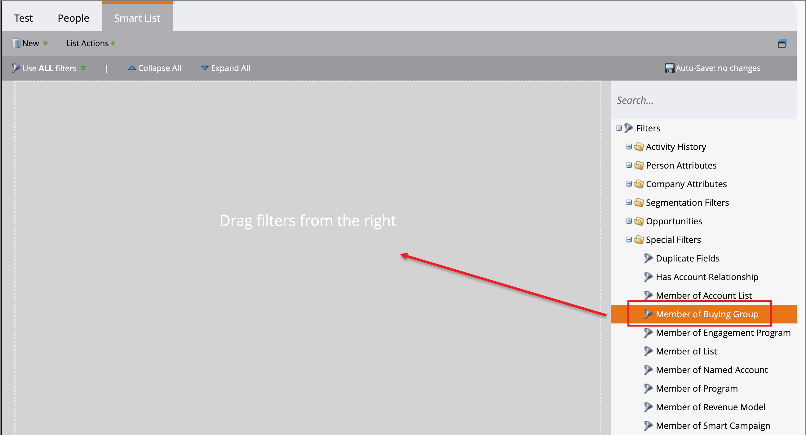
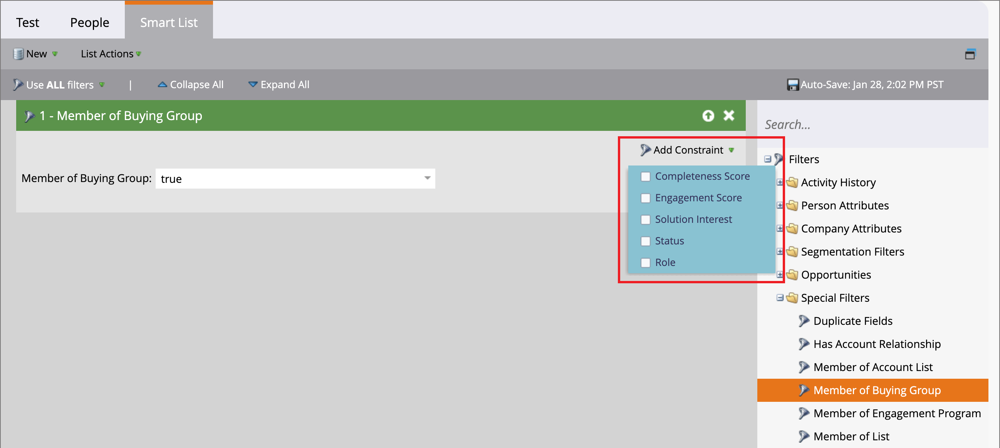
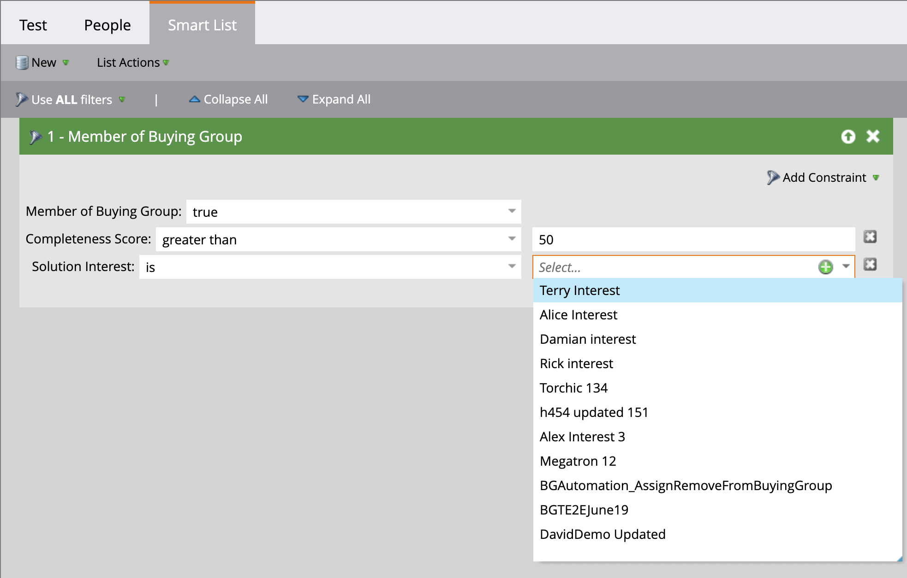
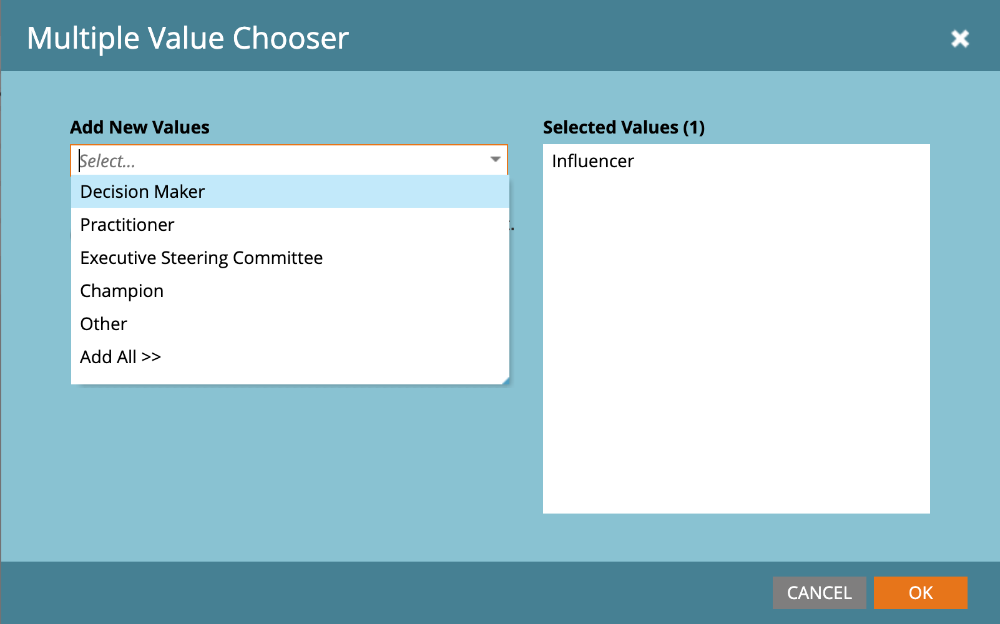

# Marketo Engage 中的購買群組篩選器

>[!IMPORTANT]
>
>**功能淘汰**  
>
>Journey Optimizer B2B edition的[簡化架構](../simplified-architecture.md)讓購買群組篩選器在連線的Marketo Engage執行個體中不再可用。  
>
>或者，您可以為每個解決方案興趣建立靜態清單，然後[使用歷程節點的&#x200B;_新增至Marketo清單_&#x200B;動作](../journeys/action-nodes.md#marketo-engage-actions)。 此動作會將購買群組成員新增至已連線Marketo Engage執行個體中的特定靜態清單。 然後，將解決方案以興趣為中心的靜態清單用於智慧清單篩選器。

行銷人員可能會想要針對Marketo Engage中屬於Journey Optimizer B2B edition購買群組的人員，抑制其行銷活動。 您也可以使用與購買群組相關聯潛在客戶的相關資訊，通知Marketo Engage中的潛在客戶評分工作流程。 例如：

* 此潛在客戶是否為購買群組的一部分？
* 購買群組是否完成並參與？

如果這些條件為真，您可能會選擇對銷售機會評分較高。 如果沒有，您可能會選擇不將其標示為行銷合格銷售機會(MQL)。

在連線至Journey Optimizer B2B edition的Marketo Engage執行個體中，您可以在智慧清單中使用&#x200B;_[!UICONTROL 購買群組成員]_&#x200B;篩選器，根據您的行銷活動策略來識別這些銷售機會。

1. 在您[在Marketo Engage](https://experienceleague.adobe.com/en/docs/marketo/using/product-docs/core-marketo-concepts/smart-lists-and-static-lists/creating-a-smart-list/create-a-smart-list){target="_blank"}中建立智慧列示後，請選取&#x200B;**[!UICONTROL 智慧列示]**&#x200B;索引標籤以開啟篩選器編輯器。

1. 在右側的篩選器清單中，向下捲動清單並展開&#x200B;**[!UICONTROL 特殊篩選器]**&#x200B;資料夾。

1. 按一下&#x200B;**[!UICONTROL 購買群組成員]**&#x200B;篩選器，並將其拖曳至篩選器定義區域。

   {width="700" zoomable="yes"}

1. 將&#x200B;_[!UICONTROL 購買群組成員]_&#x200B;選項設為&#x200B;**[!UICONTROL true]**&#x200B;或&#x200B;**[!UICONTROL false]**。

   定義需要此限制。

1. （選用）根據您要識別智慧列示潛在客戶的方式，將其他購買群組相關限制新增至篩選器。

   * 按一下篩選卡片右上角的&#x200B;**[!UICONTROL 新增限制]**。

     {width="700" zoomable="yes"}

   * 選取您要新增的限制條件，例如&#x200B;_完整度分數_&#x200B;或&#x200B;_方案興趣_。

   * 設定您要用於比對的評估。

     對於分數，您可以使用完全相符，或使用高於或低於您輸入數字的範圍。

     若要排除從購買群組移除的成員，請使用&#x200B;_[!UICONTROL Is Removed]_&#x200B;條件約束設為`false`。 您也可以將此限制設定為`true`，明確將已移除的成員包含在智慧清單中。

     針對分散式專案(例如Journey Optimizer B2B edition中定義的解決方案興趣)，您可以為清單選取一或多個專案。

     {width="600" zoomable="yes"}中選取限制的值

     選取第一個選取器，然後再次按一下選取器以開啟&#x200B;_[!UICONTROL 多值選取器]_&#x200B;對話方塊。

     {width="500" zoomable="yes"}

     將任何剩餘的專案移至右側，並在您有要用於限制的專案清單時，按一下&#x200B;**[!UICONTROL 確定]**。

   * 重複這些動作，以新增您需要的限制。

   {width="600" zoomable="yes"}
