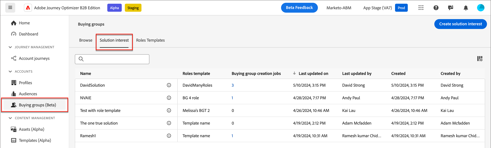
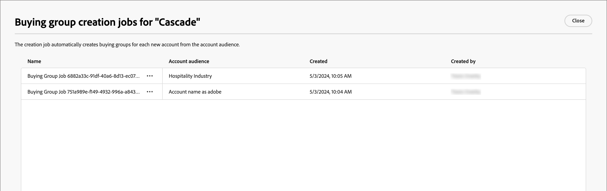
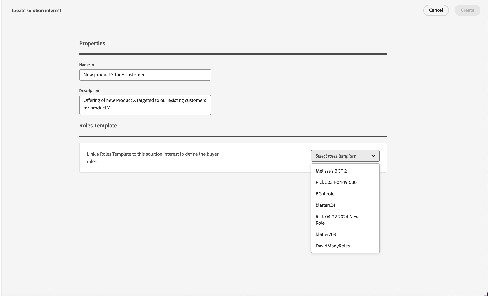
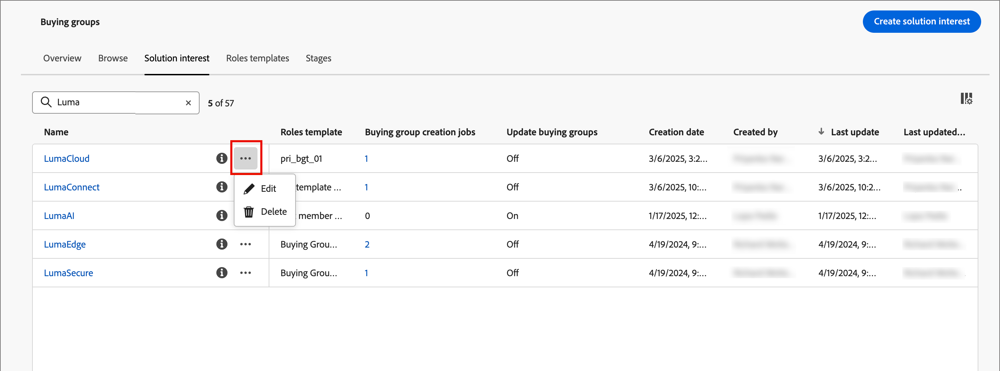

# 解決方案興趣

建立購買群組之前，您應該先瞭解銷售對象以及要鎖定對象。 您的行銷和銷售策略應該保持一致，以便您可以為購買群組新增解決方案興趣。

{width="30"} [觀看概觀影片](#overview-video)

## 存取和瀏覽解決方案興趣

1. 在左側導覽列中，按一下&#x200B;**[!UICONTROL 購買群組]**。

1. 在&#x200B;_[!UICONTROL 購買群組]_&#x200B;頁面中，選取&#x200B;**[!UICONTROL 方案興趣]**&#x200B;標籤。

   {width="700" zoomable="yes"}

   索引標籤提供所有現有解決方案興趣的詳細目錄清單。 它以欄格式顯示下列資訊： _[!UICONTROL 名稱]_、_[!UICONTROL 角色範本]_、_[!UICONTROL 購買群組建立工作]_、_[!UICONTROL 上次更新日期]_、_[!UICONTROL 更新者]_、_[!UICONTROL 建立日期]_，以及&#x200B;_[!UICONTROL 建立者]_

   清單依預設會依&#x200B;_[!UICONTROL 上次更新日期]_&#x200B;欄排序。 按一下標題中的欄標題，在遞減和遞增之間切換排序。

## 檢視及刪除購買群組工作

在&#x200B;_[!UICONTROL 方案興趣]_&#x200B;索引標籤上，**[!UICONTROL 購買群組建立工作]**&#x200B;欄會顯示針對每個方案興趣建立的工作計數。 按一下數字以開啟對話方塊，其中顯示針對解決方案興趣建立的作業清單。

{width="700" zoomable="yes"}

您可以按一下工作名稱旁邊的省略符號(...)，然後選擇&#x200B;**[!UICONTROL 刪除]**，刪除購買群組工作。

## 建立解決方案興趣

在建立解決方案興趣之前，您必須擁有即時（已發佈）角色範本，以定義您想要鎖定的角色。 請參閱[購買群組角色範本](./buying-groups-role-templates.md)，以取得有關建立角色範本和發佈角色範本的詳細資訊。

1. 從&#x200B;_[!UICONTROL 方案興趣]_&#x200B;索引標籤，按一下右上方的&#x200B;**[!UICONTROL 建立方案興趣]**。

1. 輸入唯一的&#x200B;**[!UICONTROL 名稱]** （必要）和&#x200B;**[!UICONTROL 描述]** （選用）。

1. 選擇&#x200B;**[!UICONTROL 角色範本]** （必要）。

   按一下&#x200B;**[!UICONTROL 選取角色範本]**，然後從對話方塊的清單中選擇即時角色範本。 您只能將一個即時角色範本與解決方案興趣建立關聯。 按一下[儲存]**[!UICONTROL 返回[建立方案興趣]]_頁面，其中顯示選取的角色範本。]**_[!UICONTROL 

   {width="700" zoomable="yes"}

1. 選取&#x200B;**[!UICONTROL 購買群組階段模型]**&#x200B;以使用購買群組階段進度（選擇性）。

   如需使用購買群組階段來追蹤帳戶進展的詳細資訊，請參閱[購買群組階段](./buying-group-stages.md)。

1. 啟用&#x200B;**[!UICONTROL 更新現有的購買群組]**&#x200B;設定（選擇性）。

   啟用此選項後，與解決方案相關的所有現有購買群組都會透過7天的同步週期更新。

1. 按一下右上角的「**[!UICONTROL 建立]**」。

   新的方案興趣會顯示在&#x200B;_[!UICONTROL 方案興趣]_&#x200B;清單中。

## 編輯解決方案興趣

您可以隨時變更解決方案興趣的名稱和說明。 無法變更角色範本，因為根據解決方案興趣和角色範本配對的購買群組相依性。 在這種情況下，您必須使用其他角色範本建立新的解決方案興趣。

1. 從&#x200B;_[!UICONTROL 方案興趣]_&#x200B;索引標籤，使用下列其中一個方法開啟您要編輯的方案興趣屬性：

   * 按一下解決方案興趣名稱。
   * 按一下旁邊的省略符號(**...**)，然後選擇&#x200B;**[!UICONTROL 編輯]**。

   {width="500" zoomable="no"}

1. 對解決方案興趣設定進行任何必要的更新：

   * 更新&#x200B;**[!UICONTROL 名稱]**&#x200B;和&#x200B;**[!UICONTROL 描述]**。

   * 選取用於追蹤購買群組階段進度的&#x200B;**[!UICONTROL 購買群組階段模型]**。

     如需使用購買群組階段來追蹤歷程進度與銷售的相關資訊，請參閱[購買群組階段](./buying-group-stages.md)。

   * 變更&#x200B;**[!UICONTROL 更新現有的購買群組]**&#x200B;設定。

     啟用此選項後，與解決方案相關的所有現有購買群組都會透過7天的同步週期更新。

1. 按一下&#x200B;**[!UICONTROL 儲存]**。

## 刪除解決方案興趣

無法刪除任何購買群組工作或帳戶歷程目前正在使用的任何解決方案興趣。 此外，也無法擷取已刪除的解決方案興趣。

1. 從&#x200B;_[!UICONTROL 方案興趣]_&#x200B;索引標籤，按一下方案興趣旁的省略符號(**...**)，然後選擇&#x200B;**[!UICONTROL 刪除]**。

   此動作會開啟確認對話方塊。

   如果帳戶歷程或購買群組工作目前正在使用解決方案興趣，動作會產生警報，指出無法刪除該解決方案。 按一下&#x200B;**[!UICONTROL 確定]**，這會中止刪除。

1. 按一下&#x200B;**[!UICONTROL 刪除]**&#x200B;以確認刪除，或者您可以按一下&#x200B;_[!UICONTROL 取消]_&#x200B;以中止程式。

## 概觀影片

>[!VIDEO](https://video.tv.adobe.com/v/3433080/?learn=on)
