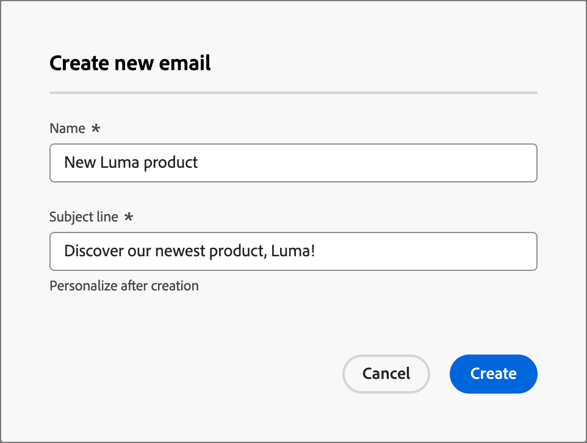

# 新增電子郵件至您的歷程

使用Adobe Journey Optimizer B2B edition透過帳戶歷程傳送電子郵件訊息給您的客戶。 您可以選擇在電子郵件設計空間建立、個人化和預覽訊息。 或者，您也可以選擇傳送已在連線的Marketo Engage執行個體中定義的電子郵件。

>[!NOTE]
>
>如果您是第一次傳送電子郵件，請務必從Adobe Marketo Engage中設定電子郵件頻道。 若要深入瞭解，請參閱[追蹤和電子郵件傳遞的通訊協定](../start/email-protocols.md)。

## 在歷程中新增電子郵件動作節點

當您[新增&#x200B;_[!UICONTROL 採取動作]_&#x200B;節點](../journeys/action-nodes.md)並執行下列動作時，您可以在歷程中設定電子郵件傳遞：

1. 針對&#x200B;_目標上的_&#x200B;動作，請選擇&#x200B;**[!UICONTROL 人員]**。

1. 針對人員&#x200B;_的_&#x200B;動作，請選擇&#x200B;**[!UICONTROL 傳送電子郵件]**。

1. 針對&#x200B;_[!UICONTROL 電子郵件來源]_，選擇您要如何取得要傳送的電子郵件。

   {width="700" zoomable="yes"}

   * 選擇&#x200B;**[!UICONTROL 建立新電子郵件]**，在Journey Optimizer B2B edition中以原生方式編寫電子郵件。

     此選項可讓您在Journey Optimizer B2B edition中以原生方式管理電子郵件內容。 按一下[建立電子郵件]&#x200B;**[!UICONTROL 以開啟[建立新電子郵件]_對話方塊_。]**&#x200B;您可以建立新的電子郵件內容資產<!-- or duplicate an existing email content asset-->。

     在對話方塊中，輸入電子郵件的唯一&#x200B;**[!UICONTROL 名稱]**&#x200B;和&#x200B;**[!UICONTROL 主旨列]**，然後按一下&#x200B;**[!UICONTROL 建立]**。

     {width="400"}

     在電子郵件內容頁面的&#x200B;_[!UICONTROL 電子郵件屬性]_&#x200B;區段中，_[!UICONTROL 寄件者電子郵件]_&#x200B;與&#x200B;_[!UICONTROL 回覆地址]_&#x200B;欄位已設定。 您可以輸入&#x200B;_[!UICONTROL From name]_&#x200B;和&#x200B;_[!UICONTROL Description]_ （選擇性）欄位的值。

     定義電子郵件[設定](#define-the-email-settings)並按一下&#x200B;**[!UICONTROL 編輯電子郵件內容]**&#x200B;以[設計內容](./email-authoring.md)。

     <!-- +++New email {#new-email}
     When you want to create an email using an empty canvas or an email template, use the _[!UICONTROL New email]_ option. 

     1. In the dialog, choose **[!UICONTROL New email]**.

     1. Enter a unique **[!UICONTROL Name]** for the email and a **[!UICONTROL Subject line]**.

        {width="400"}

     1. Click **[!UICONTROL Create]**.

       In the _[!UICONTROL Email properties]_ section of the email content page, the _[!UICONTROL From email]_ and _[!UICONTROL Reply to address]_ fields are already configured. You can enter values for the _[!UICONTROL From name]_ and _[!UICONTROL Description]_ (optional) fields.

     1. Click **[!UICONTROL Edit email]** to define the email [settings](#define-the-email-settings) and design the [content](./email-authoring.md).

     +++

     +++Duplicate existing email {#duplicate-email}
     When you want to create an email using an existing email from the current journey or from another journey, use the Duplicate existing journey option. You can make changes to the duplicated email according to your objective for the journey node.

     1. In the dialog, choose **[!UICONTROL Duplicate existing email]**.

     1. For **[!UICONTROL Existing email to duplicate]**, click the _Select email_ icon and select the email you want to duplicate and use for the journey node.

      You can filter the list of emails by entering a text string in the search field to match the email name.

      {width="600" zoomable="yes"}

      Select the checkbox for the email that you want to duplicate and click **[!UICONTROL Select]**. 

     1. Enter a unique **[!UICONTROL Name]** for the email and a **[!UICONTROL Subject line]**.

        {width="400"}

     1. Click **[!UICONTROL Create]**.

        In the _[!UICONTROL Email properties]_ section of the email content page, the _[!UICONTROL From email]_ and _[!UICONTROL Reply to address]_ fields are already configured. You can enter values for the _[!UICONTROL From name]_ and _[!UICONTROL Description]_ (optional) fields.

     1. If needed, click **[!UICONTROL Edit email]** to modify the email [settings](#define-the-email-settings) and [content](./email-authoring.md).

     +++
   —>
   * 選擇&#x200B;**[!UICONTROL 從Adobe Marketo Engage選取電子郵件]**&#x200B;以使用Marketo Engage中預先編寫的電子郵件之一，並將其作為歷程的一部分傳送。

     {width="500" zoomable="yes"}

     使用此選項，節點已設定，且電子郵件內容不需要在歷程中進一步定義。

## 定義電子郵件設定

在右側的&#x200B;_摘要_&#x200B;面板中選取&#x200B;**[!UICONTROL 詳細資料]**&#x200B;索引標籤後，捲動至底部以檢視並設定電子郵件選項。

{width="600" zoomable="yes"}

| 選項 | 說明 |
| ------ | ----------- |
| [!UICONTROL 來自名稱] | 電子郵件標頭中使用的寄件者名稱。 輸入您希望向收件者顯示的寄件者名稱。 按一下「_個人化_」圖示（「」）以在欄位中使用個人化權杖。 |
| [!UICONTROL 來自電子郵件] | 電子郵件標頭中使用的寄件者地址。 預設值是從[電子郵件通道傳遞設定](../admin/configure-channels-emails.md#delivery-settings)填入。 按一下「_個人化_」圖示（「」）以在欄位中使用個人化權杖。 |
| [!UICONTROL 回覆地址] | 電子郵件標頭中使用的寄件者地址。 預設值是從[電子郵件通道傳遞設定](../admin/configure-channels-emails.md#delivery-settings) （[!UICONTROL 來自標籤]）填入。 輸入當收件者使用回覆功能時，您想要填入的電子郵件地址（可能與寄件者地址不同或相同）。 按一下「_個人化_」圖示（「」）以在欄位中使用個人化權杖。 |
| [!UICONTROL 主旨列] | 顯示在電子郵件主旨欄位中的文字。 預設值是從您在&#x200B;_[!UICONTROL 建立新電子郵件]_&#x200B;對話方塊中輸入的文字填入。 您可以視需要變更文字。 按一下&#x200B;_個人化_&#x200B;圖示（）以在欄位中使用個人化權杖。<!-- Click the AI Assistant button ( {width="30" zoomable="no"} ) to generate the subject line based on the current email content.--> |
| [!UICONTROL 操作電子郵件] | 如果要將電子郵件指定為可操作，請選取核取方塊。 營運電子郵件會從選擇退出/取消訂閱清單及通訊限制中排除。 只有當收件者無法將電子郵件視為未經請求的商業郵件(SPAM)時，才選取此選項。 |
| [!UICONTROL 包含網頁檢視] | 選取核取方塊以包含從電子郵件內容產生的網頁連結。 電子郵件訊息的功能比網頁更為有限，因此對JavaScript、擴充式CSS和表單相當實用。 用來產生連結的文字已在[電子郵件通道傳遞設定](../admin/configure-channels-emails.md#delivery-settings)中設定([!UICONTROL 以網頁檢視HTML]和[!UICONTROL 以網頁文字檢視])。 |
| [!UICONTROL 停用開啟追蹤] | 選取當您不想追蹤電子郵件開啟活動時的核取方塊。 停用此功能後，只有在不重複人員開啟電子郵件時，電子郵件開啟活動計數才會增加。 當您設計電子郵件內文內容時，可以[管理電子郵件內容連結的追蹤](./email-authoring.md#content-authoring---link-tracking)。 |
| [!UICONTROL Preheader] | 選取核取方塊以包含預覽文字。 預覽文字是簡短摘要文字，顯示在部分電子郵件使用者端的主旨行後面。 它通常提供電子郵件的簡短摘要，通常是單句話。 在欄位<!-- , or click the AI Assistant button ( {width="30" zoomable="no"} ) to generate summary text based on the current email content -->中輸入摘要文字。 |
| [!UICONTROL 用作CC位址的欄位] | 如果可用，請選取最多25個在Marketo Engage中使用`Email`型別設定的潛在客戶或公司欄位。 |

## 檢查警報

當您設計電子郵件訊息內容時，當關鍵設定遺失時，警示會顯示在介面（頁面右上方）中。 如果沒有看見此按鈕，表示沒有偵測到的問題。

{width="600" zoomable="yes"}

可偵測到兩種型別的警報：

* **_警告_**&#x200B;參考建議與最佳實務的警告，例如：

   * `The opt-out link is not present in the email body`：將取消訂閱連結新增至您的電子郵件內文為最佳做法。

     >[!NOTE]
     >
     >行銷樣式的電子郵件訊息必須包含選擇退出連結，異動訊息不需要此連結。

   * `Text version of HTML is empty`：別忘了定義您的電子郵件內文的文字版本，此文字版本會在HTML內容無法顯示時使用。

   * `Empty link is present in email body`：檢查您電子郵件中的所有連結是否正確。

   * `Email size has exceeded the limit of 100KB`：若要取得最佳傳遞，請確定您的電子郵件大小不超過100KB。

* **_錯誤_**&#x200B;會阻止您測試或啟用歷程/行銷活動，只要這些錯誤尚未解決，例如：

   * `The subject line is missing`：電子郵件主旨列是必填欄位。

   * `The email version of the message is empty`：尚未設定電子郵件內容時，會顯示此錯誤。
