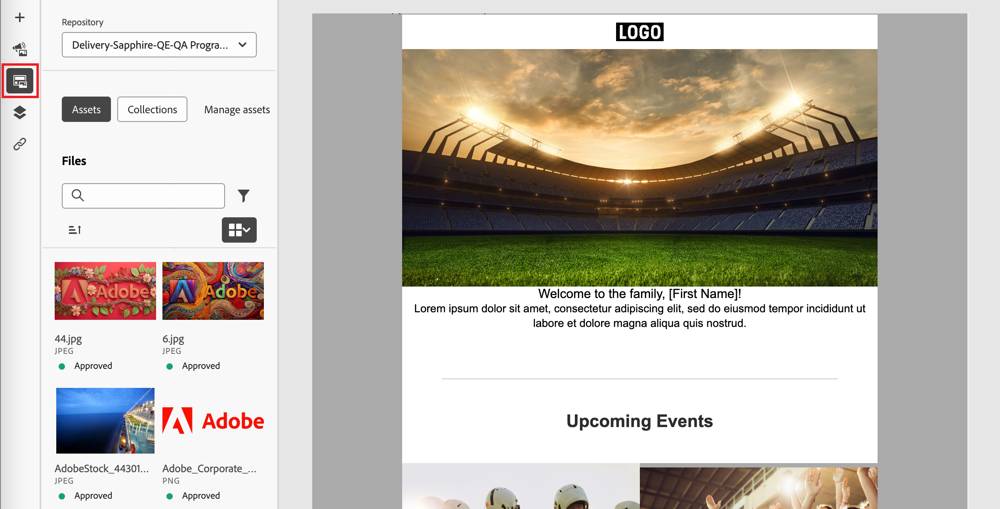
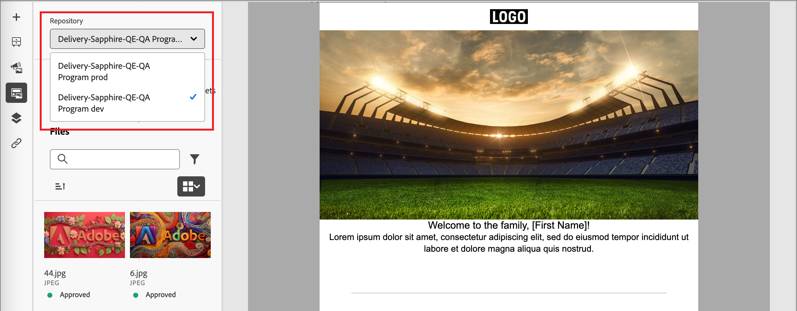
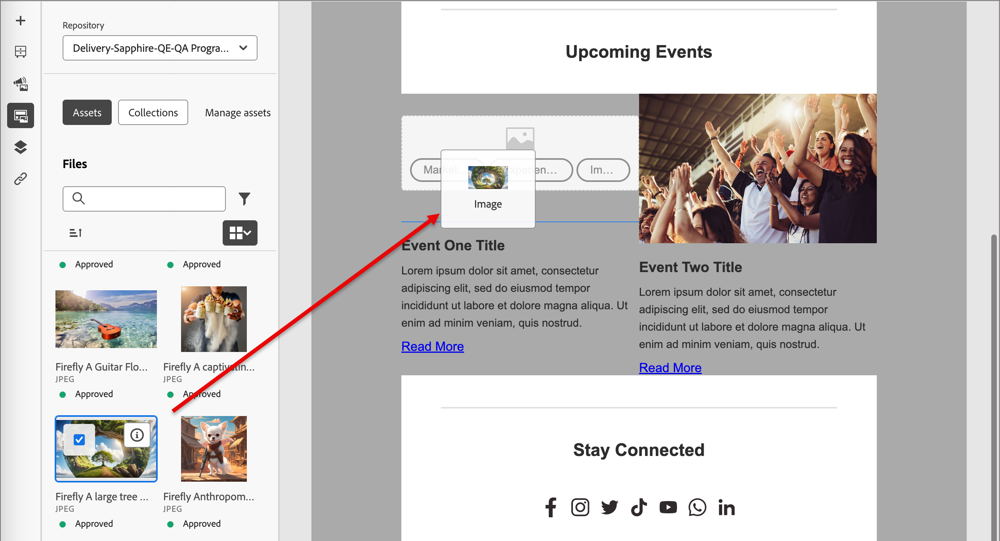
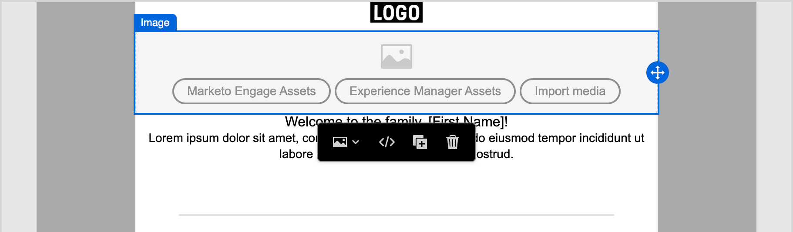

# 使用Experience Manager資產

當Adobe Experience Manager Assets as a Cloud Service與Adobe Journey Optimizer B2B edition整合時，您可以輕鬆探索和存取數位資產，以用於行銷內容。 當您編寫內容時，可以從左側導覽的&#x200B;_Experience Manager Assets_&#x200B;專案存取資產，以及在編寫帳戶歷程的電子郵件內容時也可存取資產。

{{aem-assets-licensing-note}}

當您使用這些數位資產時，Assets as a Cloud Service中的最新變更會透過連結的參考自動傳播到即時電子郵件行銷活動。 如果在Adobe Experience Manager Assetsas a Cloud Service中刪除影像，這些影像在電子郵件中顯示時會有中斷的參照。 當帳戶歷程中目前使用的資產被修改或刪除時，歷程作者會收到有關影像變更和使用影像的歷程清單的通知。 對資產的所有變更必須在Adobe Experience Manager Assets中央存放庫中完成。

當您的環境有一或多個[Assets存放庫連線](../admin/configure-aem-repositories.md)時，內容作者可在建立電子郵件、電子郵件範本或視覺片段時，使用AEM Assets作為資產的來源。

>[!IMPORTANT]
>
>管理員需要將存取Assets的使用者新增至Assets消費者使用者或/和Assets使用者產品設定檔。 [了解更多](https://experienceleague.adobe.com/en/docs/experience-manager-cloud-service/content/security/ims-support#managing-products-and-user-access-in-admin-console)

## 存取AEM Assets影像

在視覺內容編輯器中，按一下左側邊欄中的&#x200B;_Experience Manager Assets_ (  )圖示。 這會將工具面板變更為所選存放庫中的可用資產清單。

{width="700" zoomable="yes"}

>[!NOTE]
>
>目前，Adobe Journey Optimizer B2B edition僅支援Adobe Experience Manager Assets的影像資產。 必須從Adobe Experience Manager Assets中央存放庫變更資產。 [了解更多](https://experienceleague.adobe.com/en/docs/experience-manager-cloud-service/content/assets/manage/manage-digital-assets)

### 變更顯示的存放庫

如果您有多個連線的AEM存放庫，請按一下&#x200B;**[!UICONTROL 存放庫]**&#x200B;的功能表箭頭，以選擇要顯示在左側面板中的存放庫。

{width="700" zoomable="yes"}

將影像資產新增至視覺畫布的方法有很多種。

### 拖放影像

1. 瀏覽顯示在左側面板中的影像縮圖。

1. 拖曳影像縮圖，並將其拖放到您要新增影像元件的畫布中。

   {width="700" zoomable="yes"}

## 尋找並選取影像

1. 將影像元件新增至畫布，然後按一下&#x200B;**[!UICONTROL Experience Manager Assets]**&#x200B;以開啟&#x200B;_[!UICONTROL 選取Assets]_&#x200B;對話方塊。

   {width="600" zoomable="yes"}

1. 從對話方塊中，使用可用工具選擇影像，以找出您需要的資產：

   * 變更右上角的&#x200B;**[!UICONTROL 存放庫]**。

   * 按一下右上角的「**[!UICONTROL 管理資產]**」，在其他瀏覽器分頁中開啟Assets存放庫，並使用AEM Assets管理工具。

   * 按一下右上角的&#x200B;_檢視型別_&#x200B;選擇器，將顯示變更為&#x200B;**[!UICONTROL 清單檢視]**、**[!UICONTROL 格線檢視]**、**[!UICONTROL 相簿檢視]**&#x200B;或&#x200B;**[!UICONTROL 瀑布檢視]**。

   * 按一下&#x200B;_排序順序_&#x200B;圖示，以變更升序與降序之間的排序順序。

     {width="700" zoomable="yes"}

   * 按一下&#x200B;**[!UICONTROL 排序依據]**&#x200B;功能表箭頭，將排序條件變更為&#x200B;**[!UICONTROL 名稱]**、**[!UICONTROL 大小]**&#x200B;或&#x200B;**[!UICONTROL 已修改]**。

   * 按一下左上方的&#x200B;_篩選器_&#x200B;圖示，以根據您的條件篩選顯示的專案。

   * 在搜尋欄位中輸入文字，以篩選顯示的專案以符合資產名稱。

   {width="700" zoomable="yes"}

1. 按一下&#x200B;**[!UICONTROL 選取]**。
<!-- 

## Upload assets

To import files to Assets as a Cloud Service, you first need to browse or create the folder to be used for storage. You can then import an asset and add it to your email content. After assets are uploaded, you can [use the image assets as you author content](./assets-overview.md#add-assets-to-your-content).

1. While authoring your content in the email designer, drag an image element into the canvas. 

   The properties on the right reflect the image element selection. 

1. Click **[!UICONTROL Import media]** to open the _[!UICONTROL Upload image]_ dialog.

1. If your file system is open to your image file, drag and drop the file on the box in the dialog.

   {width="700" zoomable="yes"}

   You can also click the **[!UICONTROL Select a file from your computer]** link and use your file system to locate and select the image file. Click Open and the image file is displayed in the box.

1. Click **[!UICONTROL Import]**.
-->
