# 電子郵件編寫的 AI 助理

隨著行銷業的競爭日益激烈，品牌開始尋求有效率的方式，以快速且有效率的方式產生具影響力的內容。 適用於Adobe Journey Optimizer B2B edition中電子郵件製作的AI Assistant是Adobe的AI支援內容產生功能，徹底改變行銷人員建立專業且品牌一致電子郵件內容的方式。 透過進階GenAI模型和對品牌指導方針的深入瞭解，AI Assistant會根據行銷目標自動產生個人化、吸引人且有效的內容，其內容針對品牌概述的樣式、版面、色調等最佳化。 AI Assistant可讓電子郵件行銷活動的建立和執行直覺化、簡單且免費。 在工作流程中新增此功能，可以節省您的時間、提高效率並帶來更好的結果。

這項新功能提供提示式文字產生、完整電子郵件產生，以及電子郵件結構內的內容產生。 不會產生影像，但建議從輸入品牌資產的影像目錄內將影像新增至模型。 您也可以使用此功能來產生最佳化主旨明細行與預先表頭，以影響開啟率。

>[!NOTE]
>
>此功能在其Beta版本中提供，且可能會有所變更，恕不另行通知。

## 指引和限制

在Adobe Journey Optimizer B2B edition中開始使用AI助理來產生電子郵件內容之前，請檢閱下列准則：

* 您定義的行銷目標/提示是產生內容品質的關鍵決定因素。 使用定義明確的提示讓GenAI模型正確解譯。
* 上傳品牌資產，以便對品牌內容取得準確資訊。 如果沒有這些資產，內容就會以公開可得的資訊為基礎。
   * 上傳的資產格式如下：PDF、JPEG、PNG或ZIP檔案（包含支援的檔案格式）。
   * 已上傳品牌資產的大小上限為50 MB。 大型檔案或大量影像可能會運作，但處理時間會增加。
* 使用Adobe Journey Optimizer B2B edition編寫的電子郵件範本（最好是內建或範例範本）、品牌特定範本或自訂範本來建立您的電子郵件內容。 建議使用包含最多8至10個影像的電子郵件範本。
* 請務必針對產生的變體使用拇指按下或標幟圖示來報告任何有問題的輸出。
* 您使用AI小幫手須遵守[Adobe Generative AI使用者指南](https://www.adobe.com/tw/legal/licenses-terms/adobe-gen-ai-user-guidelines.html)。

下列限制適用於Adobe Journey Optimizer B2B edition中用於產生電子郵件內容的AI助理：

* 英文是唯一支援的語言。
* 它僅適用於電子郵件頻道。
* GenAI內容可能不準確 — 請分享您的意見，以便Adobe工程師可以調整模型。
* 您可以上傳多個品牌資產，但只能針對特定世代使用一個品牌資產。

>[!BEGINSHADEBOX]

## 提示程式庫

有效的提示是產生最佳內容的關鍵。 如果您在製作提示時需要協助，請存取&#x200B;_提示程式庫_。 此程式庫提供多種提示概念，可改善內容產生情況。

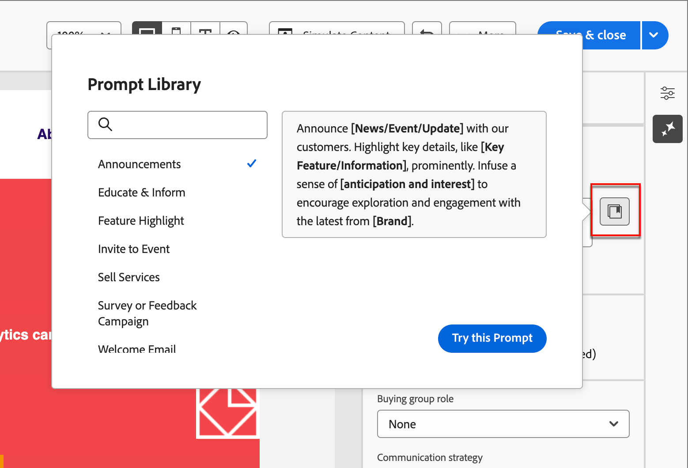{width="500" zoomable="no"}

選取最能反映您預期目標的提示，並新增指定您的品牌、方案、行銷活動及使用案例的必要值。

>[!ENDSHADEBOX]

## 購買群組角色

Adobe Journey Optimizer B2B edition提供五個現成可用的標準B2B購買團體角色。 每個購買團體角色都有不同的傳訊焦點：

| 角色 | 訊息焦點 |
| ---- | --------------- |
| 執行指導委員會 | 產品資訊 定價 技術整合詳細資料 產品特色與功能 |
| 影響者 | 品質證明 容易實作 主題專業知識 競爭優勢 |
| 決策者 | 投資報酬率 財務價值(RoI)  客戶案例 |
| 從業人員 | 容易使用 產品特色與功能 產品相容性 產品整合容易 |
| 冠軍 | 教育內容 思想領導力內容 客戶故事 |

選擇其中一個購買群組角色時，系統會根據每個購買群組角色的特點與興趣主題，自動自訂輸出。

## 使用AI助理產生電子郵件屬性

當您[新增電子郵件動作](./add-email.md#add-an-email-action-node-in-a-journey)至帳戶歷程時，您定義一組用於傳送電子郵件的電子郵件屬性。 AI助理可以針對電子郵件&#x200B;**主旨列**&#x200B;和&#x200B;**預覽文字**&#x200B;產生建議的內容，以協助達成更好的電子郵件參與。

1. 從帳戶歷程建立電子郵件，或從歷程節點開啟現有電子郵件。

   電子郵件預覽頁面會在右側顯示&#x200B;_[!UICONTROL 電子郵件屬性]_。

1. 選取下列任一標籤，瞭解如何在電子郵件屬性製作中使用AI助理。

>[!BEGINTABS]

>[!TAB 主旨列產生]

下列步驟說明使用AI助理產生電子郵件最佳化主旨行的工作順序：

1. 在&#x200B;_[!UICONTROL 電子郵件屬性]_&#x200B;中，按一下&#x200B;**[!UICONTROL 主旨列]**&#x200B;欄位右側的「AI小幫手」圖示（ {width="30" zoomable="no"}）。

   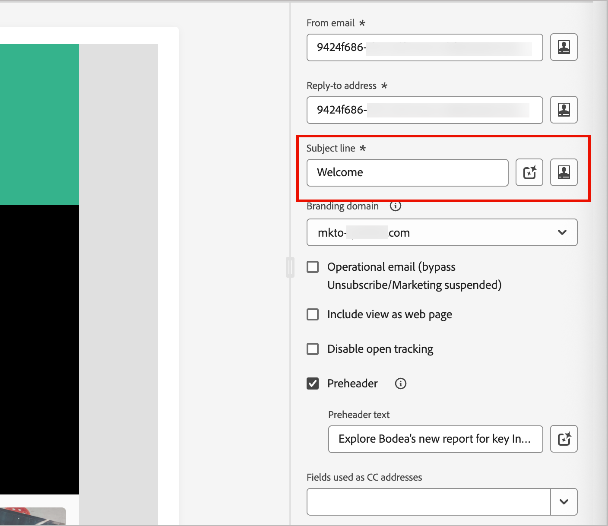{width="600" zoomable="yes"}的AI助理存取

   「AI助理」快顯視窗隨即開啟，其中包含電子郵件主旨行的產生設定。

   根據與電子郵件關聯的電子郵件內容，或您想要使用主旨行以符合您的用途，有幾個選項可產生主旨行文字：

   * 您可以立即按一下[產生&#x200B;**&#x200B;**]，而不需要提示或品牌資產，以使用現有的電子郵件內文作為主旨列產生的內容。

   * （建議）您可以提供提示、品牌資產和其他設定值，以提供上下文，產生最符合您需求的主旨行文字。 （步驟2到7）

1. 在&#x200B;**[!UICONTROL 提示]**&#x200B;欄位中，輸入要產生的專案說明。

   如果您需要一些協助來製作有效的提示，請使用[提示程式庫](#prompt-library)。

1. 指定包含作為文字產生來源之內容的品牌資產。

   * 從目錄中選取資產。

   * 按一下&#x200B;**[!UICONTROL 上傳品牌資產]**&#x200B;以新增品牌資產檔案。

   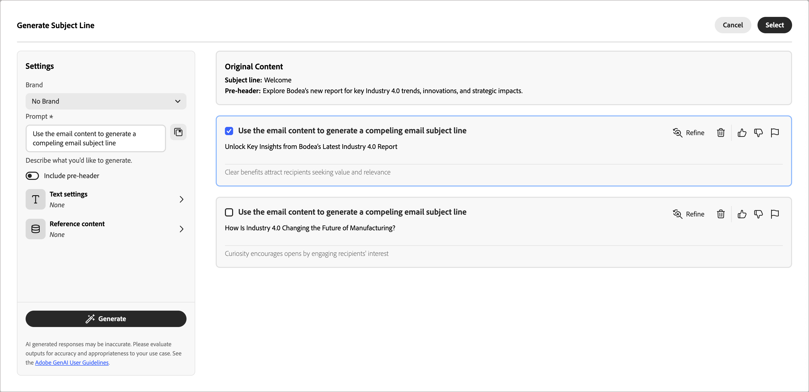{width="600" zoomable="yes"}

1. 視需要捲動並選取&#x200B;**[!UICONTROL 購買群組角色]**，以作為產生文字的目標對象。

1. 如有需要，請使用傳訊選項來量身打造您的內容：

   * **[!UICONTROL 通訊策略]** — 為您的產生的文字選擇最合適的通訊樣式。
   * **[!UICONTROL 語言]** — 選取您要產生內容的語言。
   * **[!UICONTROL 音調]** — 選擇可與您的觀眾產生共鳴的音調。 如果您指定想要提供資訊、好玩或有說服力的聲音，AI Assistant可以相應地調整訊息。

1. 如有需要，請使用滑桿來設定所要產生的文字長度。

1. 根據您的喜好變更&#x200B;**[!UICONTROL 使用表情符號]**&#x200B;選項（開啟或關閉）。

1. 當您的提示和設定就緒時，請按一下[產生]。**&#x200B;**

1. 捲動「AI輔助程式」面板，並瀏覽產生的變數來決定哪一個最適合。

   * 按一下&#x200B;**[!UICONTROL 預覽]**&#x200B;以檢視所選變數的全熒幕版本。

   * 按一下&#x200B;_Thumbs Up_、_Thumbs Down_&#x200B;或&#x200B;_Flag_&#x200B;圖示，為產生的變體提供意見回饋，並選擇最能摘要您的意見回饋的原因。

1. 導覽至「預覽」視窗中的&#x200B;_調整_&#x200B;選項，以存取其他自訂功能：

   * **[!UICONTROL 使用作為參考內容]** — 選取此選項以使用變體作為參考內容來產生其他結果。

   * **[!UICONTROL 重述]** - AI Assistant可以不同的方式重述您的訊息，讓您撰寫內容保持新鮮，並吸引不同受眾。

   * **[!UICONTROL 使用較簡單的語言]** — 利用AI Assistant簡化您的語言，確保更廣大的受眾擁有清晰度和可存取性。

   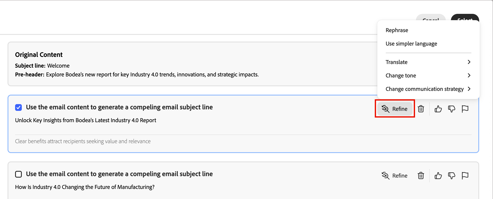{width="600" zoomable="yes"}

1. 按一下&#x200B;**[!UICONTROL 選取]**&#x200B;以選取的變體取代主旨行文字，並返回電子郵件內容。

>[!TAB 產生預覽文字]

電子郵件預告是在收件匣中檢視電子郵件時，主旨行之後的簡短摘要文字。 這是電子郵件的選用元素，但也是改善參與度的絕佳機會。 下列步驟說明使用AI Assistant為您的電子郵件產生最佳化預覽文字的工作順序：

1. 在電子郵件屬性中，選取&#x200B;**[!UICONTROL Preheader]**&#x200B;核取方塊，然後按一下右側的AI助理員圖示（ {width="30" zoomable="no"} ）。

   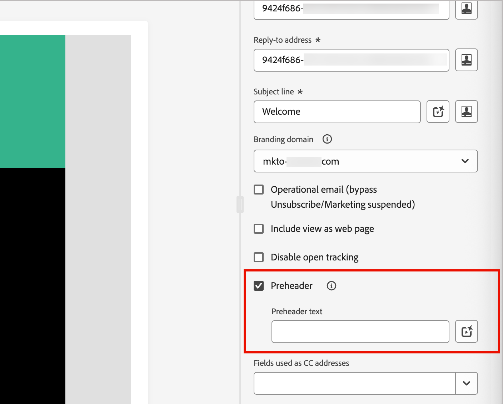{width="600" zoomable="yes"}

   AI Assistant快顯視窗隨即開啟，其中包含電子郵件預覽文字的產生設定。

   根據與電子郵件關聯的電子郵件內容或您想要鎖定電子郵件的方式，有幾個選項可產生預覽文字：

   * 您可以立即按一下&#x200B;**[!UICONTROL 產生]**，而不需要提示或品牌資產，以使用現有的電子郵件內文作為產生預先通知標題的內容。

   * （建議）您可以提供提示、品牌資產和其他設定值，以提供上下文來產生最符合您需求的最佳預先說明。 （步驟2到7）

1. 在&#x200B;**[!UICONTROL 提示]**&#x200B;欄位中，輸入要產生的專案說明。

   如果您需要一些協助來製作有效的提示，請使用[提示程式庫](#prompt-library)。

1. 指定包含作為文字產生來源之內容的品牌資產。

   * 從目錄中選取資產。

   * 按一下&#x200B;**[!UICONTROL 上傳品牌資產]**&#x200B;以新增品牌資產檔案。

   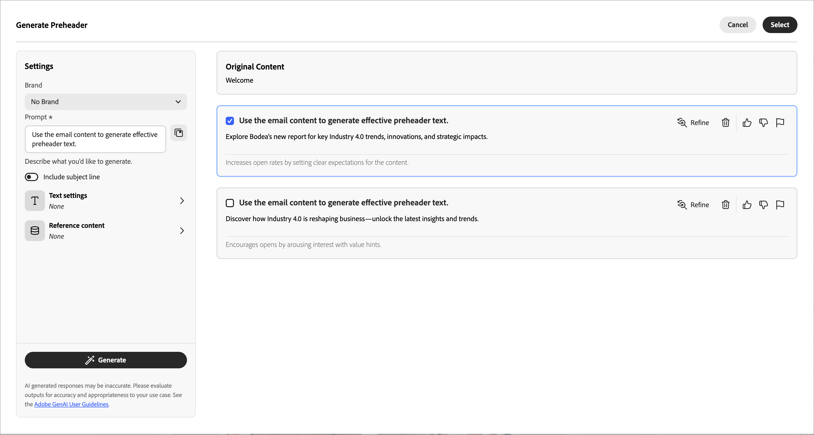{width="600" zoomable="yes"}

1. 視需要捲動並選取&#x200B;**[!UICONTROL 購買群組角色]**，以作為產生文字的目標對象。

1. 如有需要，請使用傳訊選項來量身打造您的內容：

   * **[!UICONTROL 通訊策略]** — 為您的產生的文字選擇最合適的通訊樣式。
   * **[!UICONTROL 語言]** — 選取您要產生內容的語言。
   * **[!UICONTROL 音調]** — 選擇可與您的觀眾產生共鳴的音調。 如果您指定想要提供資訊、好玩或有說服力的聲音，AI Assistant可以相應地調整訊息。

1. 如有需要，請使用滑桿來設定所要產生的文字長度。

1. 根據您的喜好變更&#x200B;**[!UICONTROL 使用表情符號]**&#x200B;選項（開啟或關閉）。

1. 當您的提示和設定就緒時，請按一下[產生]。**&#x200B;**

1. 捲動「AI輔助程式」面板，並瀏覽產生的變數來決定哪一個最適合。

   * 按一下&#x200B;**[!UICONTROL 預覽]**&#x200B;以檢視所選變數的全熒幕版本。

   * 按一下&#x200B;_Thumbs Up_、_Thumbs Down_&#x200B;或&#x200B;_Flag_&#x200B;圖示，為產生的變體提供意見回饋，並選擇最能摘要您的意見回饋的原因。

1. 導覽至「預覽」視窗中的&#x200B;_調整_&#x200B;選項，以存取其他自訂功能：

   * **[!UICONTROL 使用作為參考內容]** — 選取此選項以使用變體作為參考內容來產生其他結果。

   * **[!UICONTROL 重述]** - AI Assistant可以不同的方式重述您的訊息，讓您撰寫內容保持新鮮，並吸引不同受眾。

   * **[!UICONTROL 使用較簡單的語言]** — 利用AI Assistant簡化您的語言，確保更廣大的受眾擁有清晰度和可存取性。

   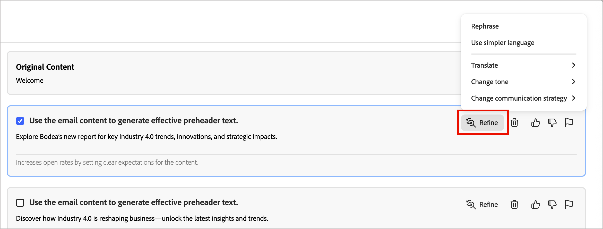{width="600" zoomable="yes"}

1. 按一下&#x200B;**[!UICONTROL 選取]**，以選取的變體取代預先標頭，並返回電子郵件屬性。

>[!ENDTABS]

## 使用AI助理產生電子郵件內文內容

在您[建立並個人化您的電子郵件](./email-authoring.md)後，請使用Adobe Journey Optimizer B2B edition中的AI小幫手（由創作AI提供技術支援），將您的電子郵件內文內容提升到新的境界。

在電子郵件設計工具中，AI Assistant可以產生完整的電子郵件內文、目標文字內容，以及吸引觀眾共鳴的影像建議，協助您最佳化傳送的影響。 這種電子郵件行銷活動最佳化是為了產生更好的參與度而設計。

1. 從帳戶歷程建立電子郵件，然後按一下&#x200B;**[!UICONTROL 開啟電子郵件Designer]**&#x200B;或&#x200B;**[!UICONTROL 新增電子郵件內容]**。

1. 在視覺化電子郵件設計工具中選取並開啟電子郵件範本。

1. 視需要個人化歷程節點的電子郵件。

1. 選取下列任一標籤，瞭解如何在電子郵件內文內容製作中使用AI助理。

>[!BEGINTABS]

>[!TAB 產生完整電子郵件]

下列步驟說明使用AI助理來調整現有電子郵件範本的工作順序：

1. 在電子郵件設計工具中，按一下右側的圖示（ {width="30" zoomable="no"} ）來存取AI助理功能表。

   電子郵件設計工具中的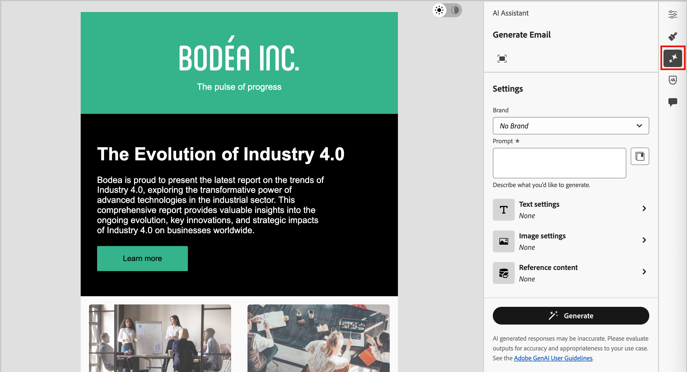{width="600" zoomable="yes"}

   右邊的AI助理設定反映&#x200B;_產生設定（完整電子郵件）_。

1. 在&#x200B;**[!UICONTROL 提示]**&#x200B;欄位中，輸入要產生的專案說明。

   如果您需要一些協助來製作有效的提示，請使用[提示程式庫](#prompt-library)。

   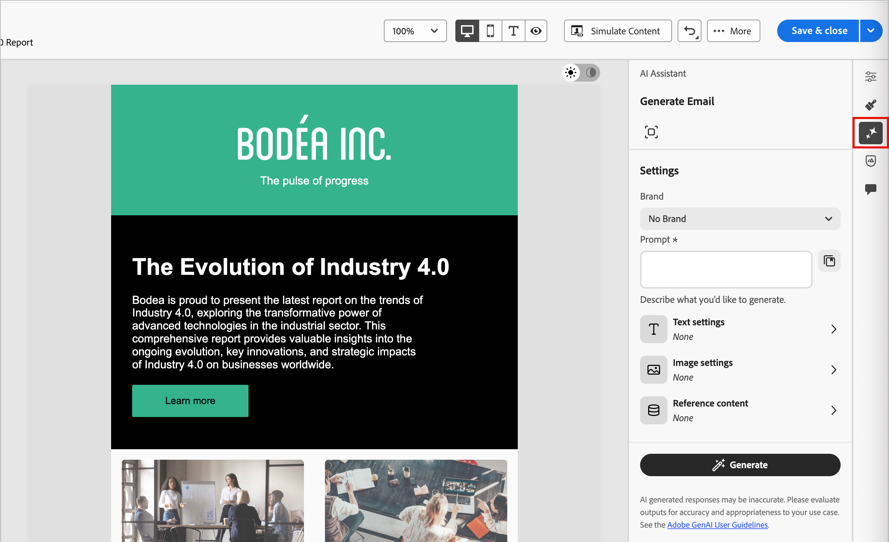{width="600" zoomable="yes"}

1. 指定品牌資產，該資產包含可為AI助理提供額外內容的內容。

   * 從目錄中選取資產。

   * 按一下&#x200B;**[!UICONTROL 上傳品牌資產]**&#x200B;以新增品牌資產檔案。

   此輸入資產可作為電子郵件中內容產生和影像建議的來源。

1. 選取&#x200B;**[!UICONTROL 購買群組角色]**，作為電子郵件通訊的目標對象。

1. 如有需要，請使用傳訊選項來量身打造您的內容：

   * **[!UICONTROL 通訊策略]** — 為您的產生的文字選擇最合適的通訊樣式。
   * **[!UICONTROL 語言]** — 選取您要產生內容的語言。
   * **[!UICONTROL 音調]** — 選擇可與您的觀眾產生共鳴的音調。 如果您指定想要提供資訊、好玩或有說服力的聲音，AI Assistant可以相應地調整訊息。
   * **內容型別** — 選擇可反映視覺元素性質的選項。 此設定可區分不同視覺呈現形式，例如像片、圖形或藝術品。

1. 當您的提示就緒時，請按一下[產生]。**&#x200B;**

1. 捲動「AI輔助程式」面板，並瀏覽產生的變數來決定哪一個最適合。

   * 按一下&#x200B;**[!UICONTROL 預覽]**&#x200B;以檢視所選變數的全熒幕版本。

   * 按一下&#x200B;_Thumbs Up_、_Thumbs Down_&#x200B;或&#x200B;_Flag_&#x200B;圖示，為產生的變體提供意見回饋，並選擇最能摘要您的意見回饋的原因。

     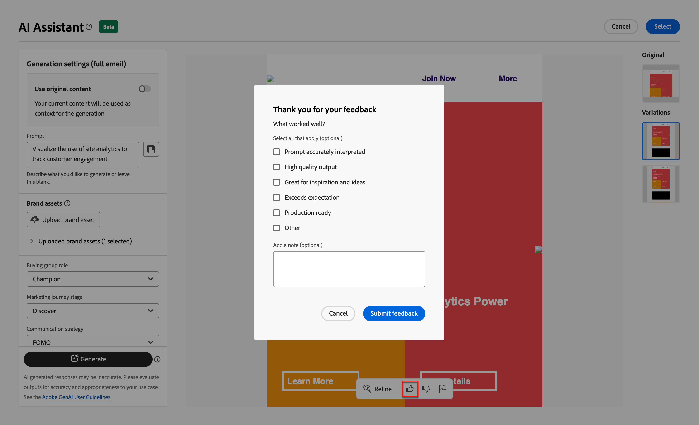{width="600" zoomable="yes"}

1. 按一下&#x200B;**[!UICONTROL 選取]**&#x200B;以選取的變體取代範本內容，並返回電子郵件設計工具。

   在電子郵件設計工具中，您可以使用畫布上的編輯和格式化工具來變更內容，以及右側的&#x200B;_[!UICONTROL 設定]_&#x200B;和&#x200B;_[!UICONTROL 樣式]_&#x200B;選項。

>[!TAB 文字產生]

下列步驟說明使用AI助理來調整或增強現有電子郵件文字內容的工作順序：

1. 在電子郵件設計工具中，按一下右側的圖示（ {width="30" zoomable="no"} ）來存取AI助理功能表。

   電子郵件設計工具中的{width="600" zoomable="yes"}

1. 選取&#x200B;_Text_&#x200B;元件以鎖定特定內容。

   右邊的AI助理設定反映&#x200B;_產生設定（文字）_。

1. 在&#x200B;**[!UICONTROL 提示]**&#x200B;欄位中，輸入要產生的專案說明。

   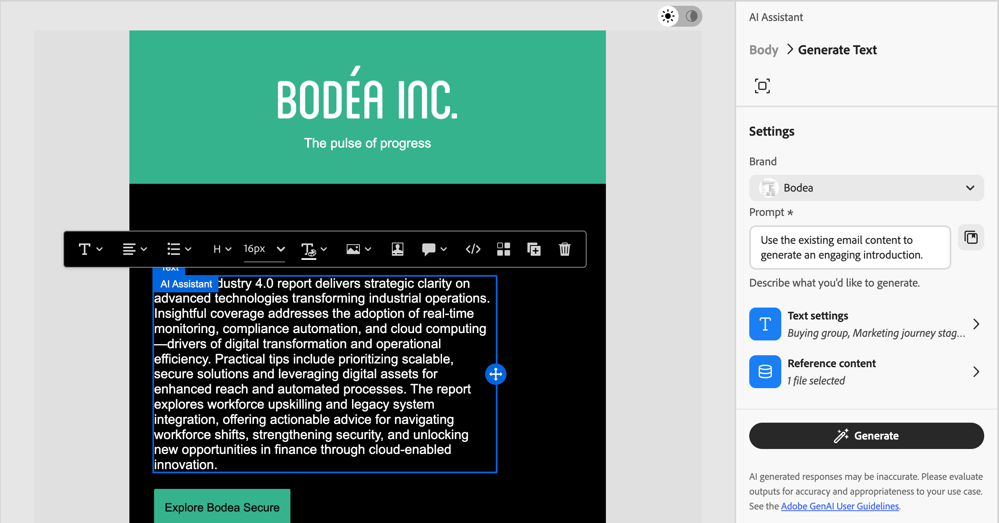{width="600" zoomable="yes"}

   如果您需要一些協助來製作有效的提示，請使用[提示程式庫](#prompt-library)。

1. 指定包含作為文字產生來源之內容的品牌資產。

   * 從目錄中選取資產。

   * 按一下&#x200B;**[!UICONTROL 上傳品牌資產]**&#x200B;以新增品牌資產檔案。

1. 選取&#x200B;**[!UICONTROL 購買群組角色]**，以作為產生文字的目標對象。

1. 如有需要，請使用語言和傳訊選項來量身打造您的內容：

   * **[!UICONTROL 通訊策略]** — 為您的產生的文字選擇最合適的通訊樣式。
   * **[!UICONTROL 語言]** — 選取您要產生內容的語言。
   * **[!UICONTROL 音調]** — 選擇可與您的觀眾產生共鳴的音調。 如果您指定想要提供資訊、好玩或有說服力的聲音，AI Assistant可以相應地調整訊息。

1. 如有需要，請使用滑桿來設定所要產生的文字長度。

1. 當您的提示就緒時，請按一下[產生]。**&#x200B;**

1. 瀏覽產生的&#x200B;_變數_，然後按一下&#x200B;**[!UICONTROL 預覽]**&#x200B;以檢視所選變數的全熒幕版本。

1. 導覽至「預覽」視窗中的&#x200B;_調整_&#x200B;選項，以存取其他自訂功能：

   * **[!UICONTROL 使用作為參考內容]** — 選取此選項以使用變體作為參考內容來產生其他結果。

   * **[!UICONTROL 精心設計]** - AI助理可以協助您展開特定主題，提供其他詳細資訊，以增進瞭解及參與。

   * **[!UICONTROL 摘要]** — 冗長的資訊可能會使電子郵件收件者超載。 使用AI Assistant將要點濃縮為清晰、簡潔的摘要，以吸引注意並鼓勵他們進一步閱讀。

   * **[!UICONTROL 重述]** - AI Assistant可以不同的方式重述您的訊息，讓您撰寫內容保持新鮮，並吸引不同受眾。

   * **[!UICONTROL 使用較簡單的語言]** — 利用AI Assistant簡化您的語言，確保更廣大的受眾擁有清晰度和可存取性。

   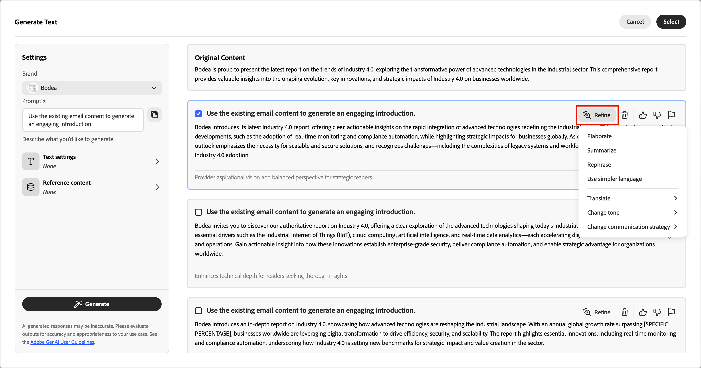{width="700" zoomable="yes"}

1. 當您有想要的內容時，請按一下&#x200B;**[!UICONTROL 選取]**&#x200B;以選取的變體取代文字，並返回電子郵件設計工具。

   在電子郵件設計工具中，您可以使用畫布上的編輯和格式化工具來變更文字，以及右側的&#x200B;_[!UICONTROL 設定]_&#x200B;和&#x200B;_[!UICONTROL 樣式]_&#x200B;選項。

>[!TAB 影像建議]

您可以使用AI Assistant來最佳化和改善資產，並確保獲得更方便好用的體驗。 下列步驟說明使用AI助理增強電子郵件影像內容的工作順序：

1. 按一下右側的圖示（{width="30" zoomable="no"} ），存取AI助理功能表。

   電子郵件設計工具中的{width="600" zoomable="yes"}

1. 選取&#x200B;_影像_&#x200B;元件以鎖定特定內容並存取AI助理功能表。

   右邊的設定反映&#x200B;_[!UICONTROL 產生設定（影像）]_。

1. 若要微調資產，請在&#x200B;**[!UICONTROL 提示]**&#x200B;欄位中輸入您想要的描述。

   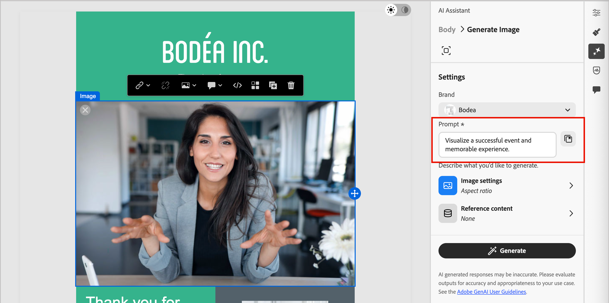{width="600" zoomable="yes"}

   如果您需要一些協助來製作有效的提示，請使用[提示程式庫](#prompt-library)。

1. 按一下&#x200B;**[!UICONTROL 上傳品牌資產]**，新增任何包含可為AI助理提供額外內容的品牌資產。

   如果需要的資產已經可用，請展開&#x200B;**[!UICONTROL 已上傳的品牌資產]**，然後選取資產。

   您的提示必須一律繫結至現有資產。

1. 使用影像設定來調整提示：

   * **[!UICONTROL 外觀比例]** — 此設定決定資產的寬度和高度。 您可以選擇一般比例，例如16:9、4:3、3:2或1:1，或者輸入自訂大小。
   * **[!UICONTROL 色彩和色調]** — 此設定會影響影像中顏色的整體外觀及其傳達的氣氛或氣氛。
   * **[!UICONTROL 內容型別]** — 此設定會分類視覺元素的性質，區分不同的視覺呈現形式，例如像片、圖形或藝術品。
   * **[!UICONTROL 照明]** — 此設定會調整影像中閃電的出現，進而塑造大氣層，並反白顯示特定元素。
   * **[!UICONTROL 構成]** — 此設定決定影像框架中元素的排列。

1. 如果您對提示組態感到滿意，請按一下[產生]。**&#x200B;**

   AI Assistant會處理請求，並根據提示和其他輸入從輸入品牌資產內建議最適合的影像。

   >[!IMPORTANT]
   >
   >如果輸入品牌資產中沒有影像，或者沒有與輸入提示相關的影像，則輸出是空的。

1. 瀏覽&#x200B;_[!UICONTROL 變數]_&#x200B;並選取最適合電子郵件的變數。

   若要檢視所選變數的全熒幕版本，請按一下[預覽]。**&#x200B;**

1. 反白顯示您想要的影像，然後按一下[選取&#x200B;**&#x200B;**]以選取的專案取代影像或預留位置，並返回電子郵件設計工具。

   在電子郵件設計工具中，您可以使用畫布上的編輯和格式化工具來變更內容，以及右側的&#x200B;_[!UICONTROL 設定]_&#x200B;和&#x200B;_[!UICONTROL 樣式]_&#x200B;選項。

>[!ENDTABS]
