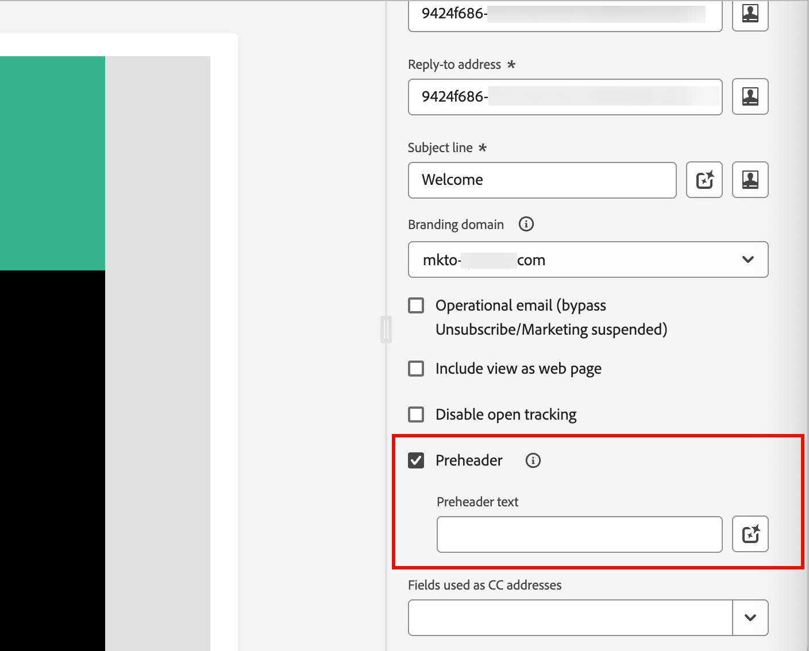
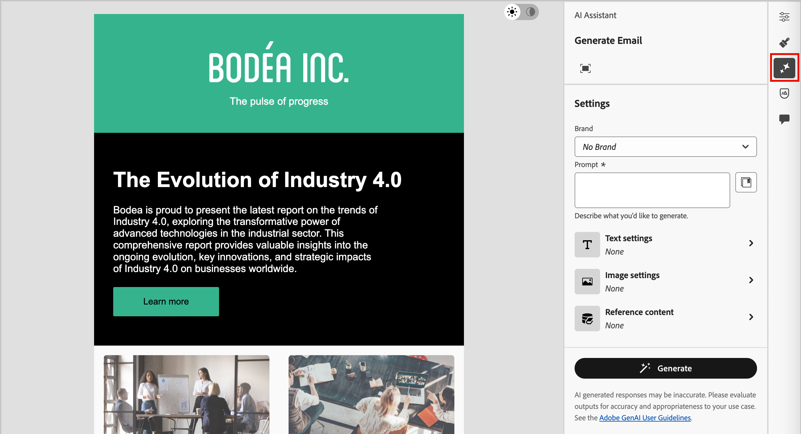
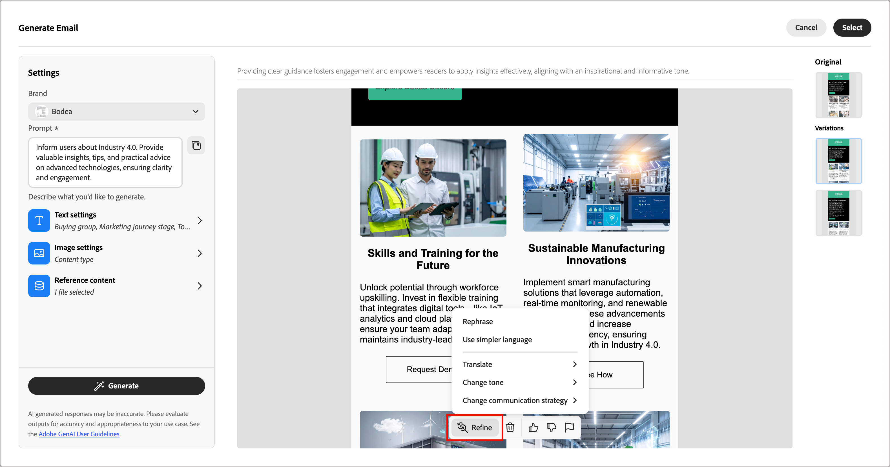

# 電子郵件內容的AI助理

隨著行銷業的競爭日益激烈，品牌開始尋求有效率的方式，以快速且有效率的方式產生具影響力的內容。 用於[!DNL Adobe Journey Optimizer B2B Edition]中電子郵件製作的AI Assistant是Adobe的AI支援內容產生功能，它徹底改變了行銷人員建立專業且品牌一致的電子郵件內容的方式。 AI Assistant透過進階的創作AI模型和對品牌指引的深入瞭解，自動產生個人化、吸引人且有效的內容。 它會運用您的行銷目標，並針對品牌概述的樣式、版面、色調等將內容最佳化。 AI Assistant可讓電子郵件行銷活動的建立和執行直覺化、簡單且免費。 在工作流程中新增此功能，可以節省您的時間、提高效率並帶來更好的結果。

這項新功能提供以提示為基礎的內容產生功能，適用於完整電子郵件產生或在電子郵件結構元件中定位。 針對影像，您可以產生新的影像資產，或只是從輸入品牌資產的影像目錄中產生建議。 您也可以使用此功能產生最佳主旨行和預先標題，以影響電子郵件開啟率。

>[!IMPORTANT]
>
>若要在Adobe Journey Optimizer B2B edition中存取這些功能，您必須擁有&#x200B;_[!UICONTROL AI小幫手]_ > _[!UICONTROL 產生內容]_&#x200B;許可權。 如需產品管理員如何授與功能許可權的詳細資訊，請參閱[編輯產品許可權的角色](../admin/user-management.md#edit-roles-for-product-permissions)。

## 指引和限制

開始使用此功能之前，請先檢閱[准則和限制](../ai-assistant/generative-ai-content.md#general-guidelines-and-limitations)。[在[!DNL Journey Optimizer B2B Edition]中使用AI功能之前，還需要使用者同意](https://www.adobe.com/tw/legal/licenses-terms/adobe-dx-gen-ai-user-guidelines.html){target="_blank"}。 如需詳細資訊，請聯絡您的 Adobe 代表。

由於Adobe承諾在媒體建立中使用創作AI工具時提高透明度，Adobe針對任何內容或專案套用[內容認證](https://helpx.adobe.com/firefly/web/get-started/learn-the-basics/content-credentials-overview.html){target="_blank"}，其中包含Firefly產生的資產（下載或匯出時）。

下列限制和准則適用於[!DNL Journey Optimizer B2B Edition]中用於產生電子郵件內容的AI助理功能：

* 英文是唯一支援的語言。
* 產生的內容可能不準確 — 請分享您的意見回饋，以便Adobe工程師可以調整模型。
* 您可以上傳多個內容參考資產，但僅能針對特定層代利用一個。
* 使用品牌特定或自訂範本來產生完整電子郵件的內容。 建議使用最多8至10個影像的電子郵件範本。
* 選擇產生的變體時，請務必使用向上縮圖、向下縮圖或標幟圖示來報告任何有問題的輸出。

## 用於產生內容的輸入和設定

您可以為電子郵件或電子郵件中選取的元件產生完整內容。 當您使用AI助理工具產生您需要的內容時，您可以提供輸入，包括提示和參考內容，以及文字和影像的設定。

### 提示

為產生式AI模型使用定義良好的提示，以精確解釋。 您提供的行銷目標/提示強烈會影響產生內容的品質。

{width="320"}

如需建立有效提示的詳細資訊，請參閱&#x200B;_[提示最佳實務](../ai-assistant/generative-ai-content.md#generative-ai-prompting-guide)_。

>[!BEGINSHADEBOX]

#### 提示程式庫

有效的提示是產生最佳內容的關鍵。 如果您想要協助您製作提示，請按一下&#x200B;_提示程式庫_ 圖示，以存取根據目標整理的提示想法程式庫。 在搜尋欄位中輸入文字，以根據關鍵字字串尋找提示。

{width="600" zoomable="no"}

選取最能反映您預期目標的提示，然後按一下&#x200B;**[!UICONTROL 嘗試此提示]**。 在&#x200B;_[!UICONTROL 提示]_&#x200B;欄位中，將任何預留位置（例如`[Key Feature/Information]`）取代為指定您的品牌、方案、行銷活動及使用案例所需的值。

>[!ENDSHADEBOX]

### 文字設定

展開右側面板中的&#x200B;**[!UICONTROL 文字設定]**，並設定產生文字的選項。

* **[!UICONTROL 購買群組]** — 選擇[購買群組角色](../buying-groups/buying-groups-role-templates.md)，以用於設定您的訊息目標。[!DNL Journey Optimizer B2B Edition] 提供五個現成可用的標準B2B購買群組角色。 每個購買團體角色都有不同的傳訊焦點：

  | 角色 | 訊息焦點 |
  | ---- | --------------- |
  | 執行指導委員會 | 產品資訊 定價 技術整合詳細資料 產品特色與功能 |
  | 影響者 | 品質證明 容易實作 主題專業知識 競爭優勢 |
  | 決策者 | 投資報酬率 財務價值(RoI)  客戶案例 |
  | 從業人員 | 容易使用 產品特色與功能 產品相容性 產品整合容易 |
  | 冠軍 | 教育內容 思想領導力內容 客戶故事 |

* **[!UICONTROL 行銷歷程階段]** — 選擇[購買群組階段](../buying-groups/buying-group-stages.md)，以用於訊息的目標定位。
* **[!UICONTROL 通訊策略]** — 為您的產生的文字選擇最合適的通訊樣式。
* **[!UICONTROL 語言]** — 選擇您產生內容的語言。
* **[!UICONTROL 音調]** — 此音調應該會與您的對象產生共鳴。 例如，您可以將訊息調整為提供豐富資訊、流暢有趣或具說服力。

{width="350" zoomable="yes"}

按一下向左箭號返回主要&#x200B;_[!UICONTROL 設定]_。

### 影像設定

若要在產生的內容中包含影像，請展開右側面板中的&#x200B;**[!UICONTROL 影像設定]**&#x200B;並設定選項。

預設會停用&#x200B;**[!UICONTROL 使用AI]**&#x200B;產生影像選項。 啟用此功能並設定下列選項，以在建議的內容變化中包含產生的影像：

<!-- * **[!UICONTROL Generative model]**: Select from available built-in models, custom Firefly models trained on your brand assets, or third-party image generation providers to create images that align with your specific needs and brand requirements. -->
* **[!UICONTROL 外觀比例]**：選取影像元件時，此設定會決定資產的寬度和高度。 您可以選擇一般比率，例如16:9、4:3、3:2或1:1，或者您可以輸入自訂大小。
* **[!UICONTROL 內容型別]**：型別會分類視覺元素的性質，區分不同的視覺呈現形式，例如像片、圖形或藝術品。
* **[!UICONTROL 視覺強度]**：調整影像的強度，控制影像的影響。 較低的設定（例如2）可建立更柔和、更克制的外觀，而較高的設定（例如10）則可讓影像更生動、視覺效果更強大。
* **[!UICONTROL 色彩和色調]**：影像中顏色的整體外觀及其傳達的氣氛或氣氛。
* **[!UICONTROL 照明]**：影像所使用的照明樣式，它會塑造大氣層，並反白顯示特定的元素。
* **[!UICONTROL 構成]**：影像框架中的元素排列。

{width="350" zoomable="yes"}

按一下向左箭號返回主要&#x200B;_[!UICONTROL 設定]_。

### 參考內容

上傳參考內容資產以產生準確、符合品牌的內容。 否則，產生的內容會根據公開可用的資訊。 參考內容可作為內容產生和影像建議的來源。 如需准則與最佳實務，請參閱&#x200B;_[最佳化的參考內容](../ai-assistant/generative-ai-content.md#reference-content)_。

從&#x200B;**[!UICONTROL 參考內容]**&#x200B;設定中，按一下&#x200B;**[!UICONTROL 上傳檔案]**&#x200B;以新增任何包含您要用於其他內容的資產。

{width="350" zoomable="yes"}

要上傳的檔案格式如下：PDF、JPEG、PNG或ZIP檔案（包含支援的檔案格式）。 已上傳品牌資產的大小上限為50MB。 大型檔案或大量影像可以運作，但這會增加處理時間。

若要選取先前上載的檔案，請展開&#x200B;**[!UICONTROL 已上載參考內容]**&#x200B;清單，並啟用您要用於內容產生的資產。

{width="350" zoomable="yes"}

## 使用AI助理產生電子郵件屬性

當您[新增電子郵件動作](./add-email.md#add-an-email-action-node-in-a-journey)至帳戶歷程時，您定義一組用於傳送電子郵件的電子郵件屬性。 AI助理可以針對電子郵件&#x200B;**_主旨列_**&#x200B;和&#x200B;**_預覽文字_**&#x200B;產生建議的內容，以協助達成更好的電子郵件參與。

當您從歷程建立電子郵件，或從歷程節點開啟現有電子郵件時，電子郵件預覽頁面會在右側顯示&#x200B;_[!UICONTROL 電子郵件屬性]_。 在&#x200B;_[!UICONTROL 摘要]_&#x200B;索引標籤中，您可以使用AI助理內容產生工具來產生主旨列、預覽文字或兩者。

>[!BEGINTABS]

>[!TAB 主旨列產生]

下列步驟說明使用AI助理產生電子郵件最佳化主旨行的工作順序：

1. 在已選取&#x200B;_詳細資料_&#x200B;索引標籤的&#x200B;_摘要_&#x200B;面板中，向下捲動至&#x200B;**[!UICONTROL 主旨列]**&#x200B;欄位。

1. 按一下欄位右側的AI助理圖示（ {width="30"} ）。

   {width="600" zoomable="yes"}的AI助理存取

   _[!UICONTROL 產生主旨列]_&#x200B;對話方塊開啟，其中包含電子郵件主旨列的產生設定。

1. （必要）在&#x200B;**[!UICONTROL 提示]**&#x200B;欄位中，輸入要產生的專案說明。

   如果您需要一些協助來製作有效的提示，請使用[提示程式庫](#prompt-library)。

1. （選用）完成內容指引設定，為產生預覽文字提供額外輸入：

   * [**[!UICONTROL 文字設定]**](#text-settings) — 提供產生文字內容的指引。
   * [**[!UICONTROL 參考內容]**](#reference-content) — 提供作為內容產生來源的內容資產。

1. 當您的提示和設定就緒時，請按一下[產生]。**&#x200B;**

   產生的變體會顯示在對話方塊中。

   {width="600" zoomable="yes"}

1. 捲動「AI輔助程式」面板，並瀏覽產生的變數來決定哪一個最適合。

   您可以[針對產生的變體](#submit-variation-feedback)提交意見反應，方法是按一下&#x200B;_拇指向上_、_拇指向下_&#x200B;或&#x200B;_旗標_&#x200B;圖示，並選擇最能摘要您意見反應的原因。

1. 按一下&#x200B;**[!UICONTROL Refine]**&#x200B;選項以存取其他自訂功能：

   * **[!UICONTROL 重新寫字]** — 重新寫入郵件，同時保留其意義。 此選項可協助您產生替代用語或調整詞句，而不變更核心訊息。

   * **[!UICONTROL 使用較簡單的語言]** — 簡化語言，確保更廣大的受眾能夠清楚無誤地使用。

   * **[!UICONTROL 翻譯]** — 將文字翻譯成其他語言。 (目前，英文是唯一受支援的語言。 計畫在未來發行時提供其他語言。)

   * **[!UICONTROL 變更音調]** — 調整訊息的音調以符合您的通訊風格，例如讓訊息更友善、專業、緊急或勵志。

   * **[!UICONTROL 變更通訊策略]** — 根據您的目標修改訊息傳送方式，例如建立急迫性或強調令人興奮的吸引力。

   {width="600" zoomable="yes"}

1. 按一下&#x200B;**[!UICONTROL 選取]**&#x200B;以選取的變體取代主旨行文字，並返回電子郵件內容。

>[!TAB 產生預覽文字]

電子郵件預告是在收件匣中檢視電子郵件時，主旨行之後的簡短摘要文字。 這是電子郵件的選用元素，但也是改善參與度的絕佳機會。 下列步驟說明使用AI Assistant為您的電子郵件產生最佳化預覽文字的工作順序：

1. 在已選取&#x200B;_詳細資料_&#x200B;索引標籤的&#x200B;_摘要_&#x200B;面板中，向下捲動並選取&#x200B;**[!UICONTROL 預覽標題]**&#x200B;核取方塊。

   {width="600" zoomable="yes"}

   _[!UICONTROL 產生預覽文字]_&#x200B;對話方塊開啟，其中包含電子郵件預覽文字的產生設定。

1. （必要）在&#x200B;**[!UICONTROL 提示]**&#x200B;欄位中，輸入要產生的專案說明。

   如果您需要一些協助來製作有效的提示，請使用[提示程式庫](#prompt-library)。

1. （選用）完成內容指引設定，為產生預覽文字提供額外輸入：

   * [**[!UICONTROL 文字設定]**](#text-settings) — 提供產生文字內容的指引。
   * [**[!UICONTROL 參考內容]**](#reference-content) — 提供作為內容產生來源的內容資產。

1. 當您的提示和設定就緒時，請按一下[產生]。**&#x200B;**

   產生的變體會顯示在對話方塊中。

   {width="600" zoomable="yes"}

1. 捲動「AI輔助程式」面板，並瀏覽產生的變數來決定哪一個最適合。

   您可以[針對產生的變體](#submit-variation-feedback)提交意見反應，方法是按一下&#x200B;_拇指向上_、_拇指向下_&#x200B;或&#x200B;_旗標_&#x200B;圖示，並選擇最能摘要您意見反應的原因。

1. 按一下&#x200B;**[!UICONTROL Refine]**&#x200B;選項以存取其他自訂功能：

   * **[!UICONTROL 重新寫字]** — 重新寫入郵件，同時保留其意義。 此選項可協助您產生替代用語或調整詞句，而不變更核心訊息。

   * **[!UICONTROL 使用較簡單的語言]** — 簡化語言，確保更廣大的受眾能夠清楚無誤地使用。

   * **[!UICONTROL 翻譯]** — 將文字翻譯成其他語言。 (目前，英文是唯一受支援的語言。 計畫在未來發行時提供其他語言。)

   * **[!UICONTROL 變更音調]** — 調整訊息的音調以符合您的通訊風格，例如讓訊息更友善、專業、緊急或勵志。

   * **[!UICONTROL 變更通訊策略]** — 根據您的目標修改訊息傳送方式，例如建立急迫性或強調令人興奮的吸引力。

   {width="500" zoomable="yes"}

1. 按一下&#x200B;**[!UICONTROL 選取]**，以選取的變體取代預先標頭，並返回電子郵件屬性。

>[!ENDTABS]

## 使用AI助理產生電子郵件內文內容 {#generative-ai-email-design}

在您[建立並個人化您的電子郵件](./email-authoring.md)後，請在[!DNL Journey Optimizer B2B Edition]中使用由創作AI支援的AI小幫手，將您的電子郵件內文內容提升到新的層級。

在電子郵件設計空間，AI Assistant可以產生完整的電子郵件內文、目標文字內容，以及可引起觀眾共鳴的影像，協助您最佳化傳送的影響。 這種電子郵件行銷活動最佳化是為了產生更好的參與度而設計。 選取&#x200B;_AI小幫手_ （{width="25" zoomable="no"} ）以顯示目前內容選取可用的內容產生工具。

電子郵件設計工具中的{width="600" zoomable="yes"}

根據您要使用的電子郵件內容產生型別，使用下列步驟：

>[!BEGINTABS]

>[!TAB 產生完整電子郵件]

請依照下列步驟，透過修訂現有的電子郵件範本，使用AI助理產生完整的電子郵件：

1. 在[建立電子郵件](./add-email.md)之後，按一下&#x200B;**[!UICONTROL 編輯電子郵件內容]**。

1. 選取範本。

   完整內容產生需要範本。 它可以是Adobe提供的標準範本，或是儲存的範本。 您也可以使用&#x200B;_[!UICONTROL 匯入HTML]_&#x200B;選項來匯入範本。

   如需使用電子郵件範本的詳細資訊，請參閱&#x200B;_[選取範本](./email-authoring.md#select-a-template)_。

1. 在電子郵件設計空間中，按一下右側的圖示（ {width="25"} ）來存取AI助理功能表。

   右邊的AI助理設定反映&#x200B;_產生電子郵件_。

   {width="600" zoomable="yes"}

1. 選取您的&#x200B;**[!UICONTROL 品牌]**，以確保AI產生的內容符合您的品牌規格。

   如果沒有已發佈的品牌，請按一下[建立品牌] **&#x200B;**&#x200B;來定義您的[可重複使用的品牌准則](./brands-overview.md)。

1. 在&#x200B;**[!UICONTROL 提示]**&#x200B;欄位中，輸入要產生的專案說明。

   如果您需要一些協助來製作有效的提示，請使用[提示程式庫](#prompt-library)。

   >[!TIP]
   >
   >如果您不熟悉如何提示產生的內容，請檢閱&#x200B;_[提示最佳實務](../ai-assistant/generative-ai-content.md#generative-ai-prompting-guide)_。

1. 完成內容指導設定以量身打造產生的內容：

   * [**[!UICONTROL 文字設定]**](#text-settings) — 提供產生文字內容的指引。
   * [**[!UICONTROL 影像設定]**](#image-settings) — 如果您想要在產生的內容中包含影像，請啟用影像產生並提供指引。
   * [**[!UICONTROL 參考內容]**](#reference-content) — 提供作為內容產生來源的內容資產。

1. 當您的提示和設定就緒時，請按一下[產生]。**&#x200B;**

   產生的變數會顯示在右側面板中。

1. 瀏覽產生的變化，或按一下&#x200B;_全熒幕_ （  ）圖示以開啟&#x200B;_[!UICONTROL 產生電子郵件]_&#x200B;對話方塊。

   此對話方塊提供額外的空間，用於比較變數、調整文字和參考內容設定（如有需要），以及重新產生變數。

   您也可以套用細分動作來微調變化，並針對產生的變化提交意見反應。 請參閱&#x200B;_[預覽和內容細分](#preview-and-content-refinement)_，以取得有關變數細分和回饋的詳細資訊。

   {width="700" zoomable="yes"}

1. 按一下&#x200B;**[!UICONTROL 選取]**&#x200B;以選取的變體取代範本內容，並返回電子郵件設計空間。

   您可以使用畫布上的編輯和格式化工具來變更產生的內容，以及右側的&#x200B;_[!UICONTROL 設定]_&#x200B;和&#x200B;_[!UICONTROL 樣式]_&#x200B;選項。

>[!TAB 僅限文字]

請依照下列步驟使用AI助理來調整或增強現有電子郵件的文字內容：

1. 在電子郵件設計空間中，選取&#x200B;_文字_&#x200B;元件以定位特定內容。

1. 在右側面板的外部邊欄上，選取&#x200B;_AI小幫手_ （ {width="25"} ）圖示。

   右側的設定反映文字元件的內容產生設定。

1. 選取您的&#x200B;**[!UICONTROL 品牌]**，以確保AI產生的內容符合您的品牌規格。

   如果沒有已發佈的品牌，請按一下[建立品牌] **&#x200B;**&#x200B;以[定義可重複使用的品牌准則](./brands-overview.md)。

1. 在&#x200B;**[!UICONTROL 提示]**&#x200B;欄位中，輸入要產生的專案說明。

   {width="600" zoomable="yes"}

   如果您需要一些協助來製作有效的提示，請使用[提示程式庫](#prompt-library)。

1. 完成內容指導設定以量身打造產生的內容：

   * [**[!UICONTROL 文字設定]**](#text-settings) — 提供產生文字內容的指引。

   * [**[!UICONTROL 參考內容]**](#reference-content) — 提供做為內容產生來源的內容資產。

1. 當您的提示和設定就緒時，請按一下[產生]。**&#x200B;**

1. 瀏覽產生的變化，或按一下&#x200B;_全熒幕_ （  ）圖示以開啟&#x200B;_[!UICONTROL 產生文字]_&#x200B;對話方塊。

   此對話方塊提供額外的空間，用於比較變數、調整文字和參考內容設定（如有需要），以及重新產生變數。

   您也可以套用細分動作來微調變化，並針對產生的變化提交意見反應。 請參閱&#x200B;_[預覽和內容細分](#preview-and-refine-the-content)_，以取得有關變數細分和回饋的詳細資訊。

   {width="700" zoomable="yes"}

1. 當您有想要的內容時，請按一下&#x200B;**[!UICONTROL 選取]**&#x200B;以選取的變體取代文字，並返回電子郵件設計空間。

   您可以使用畫布上的編輯和格式化工具來更改文字，以及右側的&#x200B;_[!UICONTROL 設定]_&#x200B;和&#x200B;_[!UICONTROL 樣式]_&#x200B;選項。

>[!TAB 僅限影像]

請依照下列步驟，使用AI助理來調整或增強現有電子郵件的影像內容：

1. 在電子郵件設計空間中，選取&#x200B;_Image_&#x200B;元件以鎖定特定內容。

1. 在右側面板的外部邊欄上，選取&#x200B;_AI小幫手_ （ {width="25"} ）圖示。

   右邊的AI助理設定反映影像元件的產生設定。

1. 選取您的&#x200B;**[!UICONTROL 品牌]**，以確保AI產生的內容符合您的品牌規格。

   如果沒有已發佈的品牌，請按一下[建立品牌] **&#x200B;**&#x200B;以[定義可重複使用的品牌准則](./brands-overview.md)。

1. 在&#x200B;**[!UICONTROL 提示]**&#x200B;欄位中輸入您想要的描述。

   {width="600" zoomable="yes"}的提示

   如果您需要一些協助來製作有效的提示，請使用[提示程式庫](#prompt-library)。

1. 完成內容指導設定以量身打造產生的內容：

   * [**[!UICONTROL 影像設定]**](#image-settings) — 如果您想要在產生的內容中包含影像，請啟用影像產生並使用指引設定。

   * [**[!UICONTROL 參考內容]**](#reference-content) — 提供做為內容產生來源的內容資產。

1. 當您對提示和設定感到滿意時，請按一下[產生]。**&#x200B;**

   AI Assistant會處理要求，並根據提示和其他輸入產生最適合的影像。

   >[!IMPORTANT]
   >
   >如果參考內容中沒有影像，或者沒有與輸入提示相關的影像，則輸出是空的。

1. 瀏覽產生的變化，或按一下&#x200B;_全熒幕_ （  ）圖示以開啟&#x200B;_[!UICONTROL 產生影像]_&#x200B;對話方塊。

   此對話方塊提供額外的空間來比較變化、調整影像和參考內容設定（如果需要），以及重新產生變化。

   您可以選取變數並按一下&#x200B;**[!UICONTROL 產生類似專案]**&#x200B;以產生與所選變數類似的其他影像。 或者，按一下[在Adobe Express中編輯] **&#x200B;**，自行變更影像。 如需使用Adobe Express調整影像的詳細資訊，請參閱[Adobe Express中的快速動作](./image-edit-adobe-express.md#quick-actions-in-adobe-express)。

   {width="700" zoomable="yes"}

   您也可以[針對產生的變化，提交意見反應](#submit-variation-feedback)。

1. 反白顯示您想要的影像，然後按一下[選取&#x200B;**&#x200B;**]以選取的專案取代影像或預留位置，並返回電子郵件設計空間。

   您可以使用畫布上的編輯和格式化工具來更改影像，以及右側的&#x200B;_[!UICONTROL 設定]_&#x200B;和&#x200B;_[!UICONTROL 樣式]_&#x200B;選項。

>[!ENDTABS]

## 預覽和調整內容 {#refine-finalize}

產生內容變化後，您可以微調結果以確保其符合您的確切要求。 稽核品牌對準、調整語調和語言，以及準備內容以供稽核的草稿。 您也可以提交變數的意見回饋，以協助培訓AI Assistant並改善未來的輸出。

### 開啟全熒幕檢視

1. 產生初始內容後，瀏覽&#x200B;**[!UICONTROL 變數]**。

1. 識別最符合您目標的變數，然後按一下&#x200B;_全熒幕_ （  ）圖示，以更深入檢視選取的變數。

   {width="700" zoomable="yes"}

1. 當您對選取的變數感到滿意時，請按一下&#x200B;**[!UICONTROL 選取]**&#x200B;以將其套用至您的畫布。

### 調整變數

按一下&#x200B;**[!UICONTROL Refine]**&#x200B;選項以存取電子郵件與文字變化的其他自訂功能：

* **[!UICONTROL 精心設計]** - AI助理可以協助您展開特定主題，提供其他詳細資訊，以增進瞭解及參與。

* **[!UICONTROL 摘要]** — 冗長的資訊可能會使頁面檢視器超載。 使用AI Assistant將要點濃縮為清晰、簡潔的摘要，以吸引注意並鼓勵他們進一步閱讀。

* **[!UICONTROL 重新寫字]** — 重新寫入郵件，同時保留其意義。 此選項可協助您產生替代用語、改善流量或調整詞句，而不變更核心訊息。

* **[!UICONTROL 使用較簡單的語言]** — 簡化語言，確保更廣大的受眾能夠清楚無誤地使用。

* **[!UICONTROL 翻譯]** — 將文字翻譯成其他語言。 (目前，英文是唯一受支援的語言。 計畫在未來發行時提供其他語言。)

* **[!UICONTROL 變更音調]** — 調整訊息的音調以符合您的通訊風格，例如讓訊息更友善、專業、緊急或勵志。

* **[!UICONTROL 變更通訊策略]** — 根據您的目標修改訊息傳送方式，例如建立急迫性或強調令人興奮的吸引力。

<!-- is this option coming back? * **[!UICONTROL Use as reference content]** - Select this option to use the variant as the reference content for generating other results. -->

{width="700" zoomable="yes"}

### 提交變數回饋

按一下&#x200B;_Thumbs Up_、_Thumbs Down_&#x200B;或&#x200B;_Flag_&#x200B;圖示，為產生的變體提供意見回饋，並選擇最能摘要您的意見回饋的原因。

{width="700" zoomable="yes"}

### 檢查您的品牌一致性(Beta)

<!-- Are we surfacing scoring here in the future, or will it be a separate post-creation task? 1. Click the percentage icon to view your **[!UICONTROL Brand Alignment Score]** and identify any misalignments with your brand. -->

品牌一致性評估和評分可協助您確保電子郵件行銷活動中的語調、訊息和視覺身分的一致性，同時還可作為內容上線前的品質檢查。 當電子郵件內容完成時，請按一下右側的&#x200B;_品牌一致性_ （ ）圖示，以開啟電子郵件設計空間中的&#x200B;_品牌一致性_&#x200B;右側面板。

{width="600" zoomable="yes"}

如需詳細資訊，請參閱[驗證您的品牌一致性](./brand-alignment.md#validate-your-brand-alignment)
