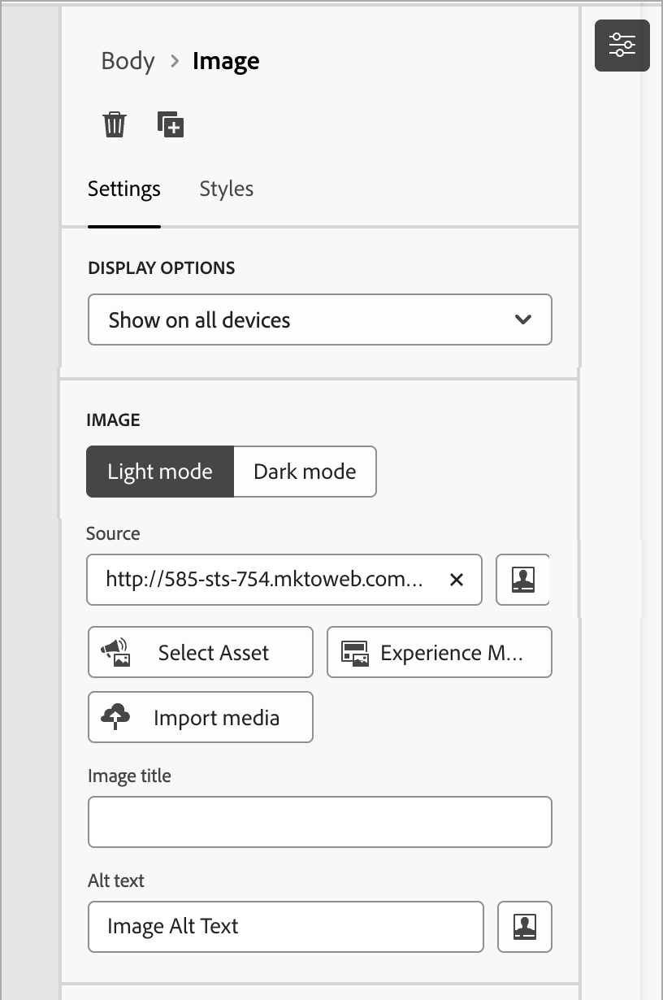
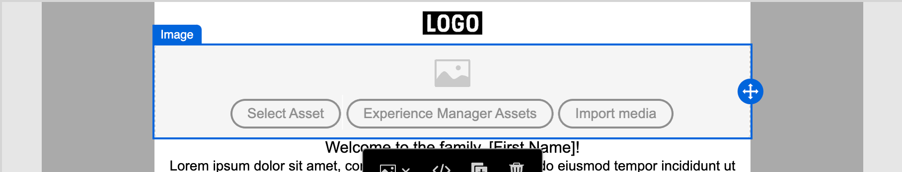
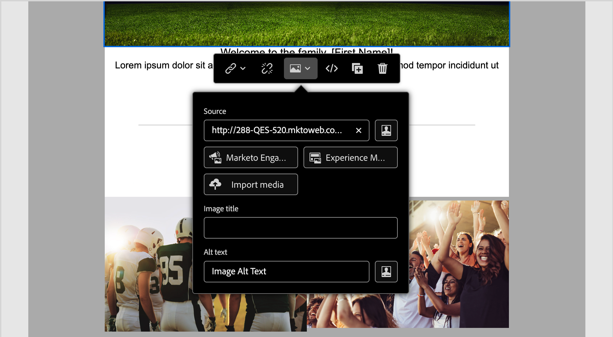
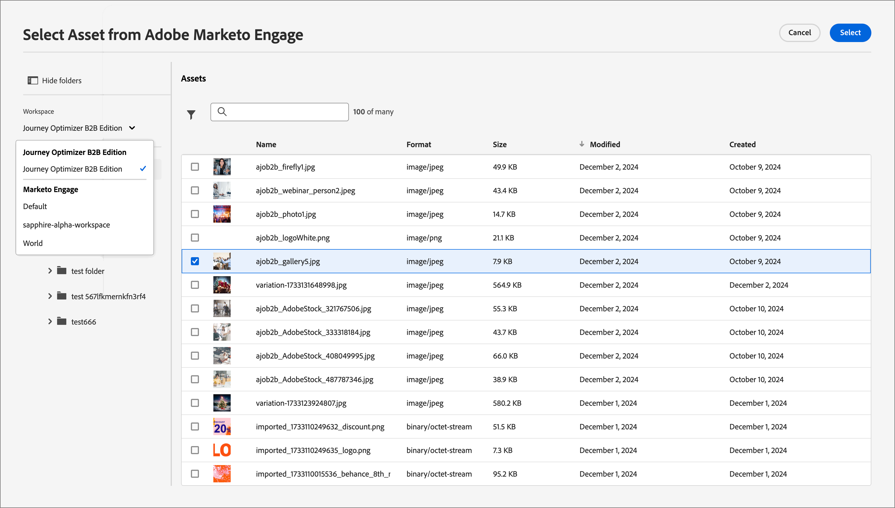
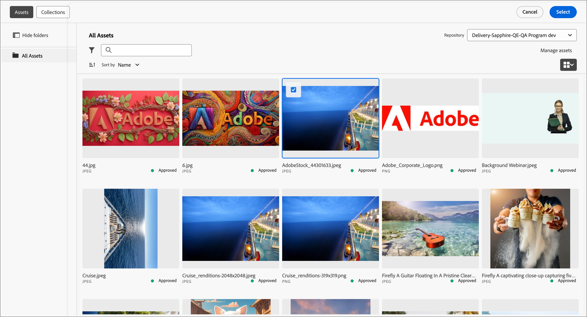
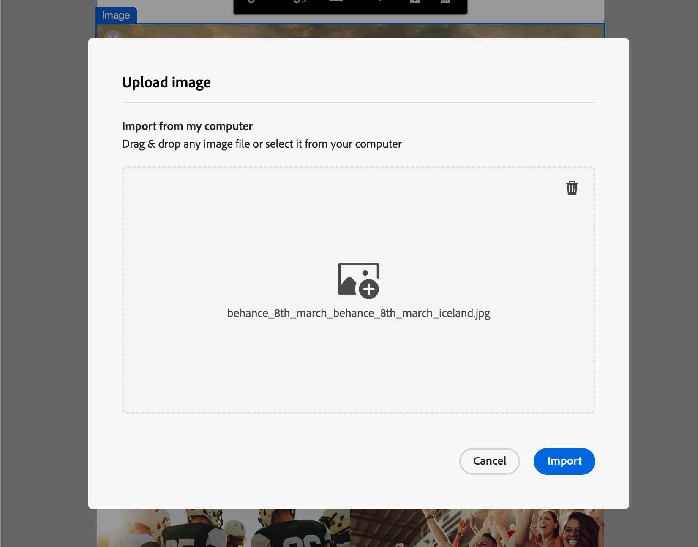

# 資產

在 Adobe Journey Optimizer B2B Edition 中，資產通常是設計支援帳戶歷程的內容時所使用的影像。您可以透過資產選擇器或視覺化內容編輯器中的簡易拖放介面，在電子郵件、電子郵件範本和片段內使用這些影像。

Adobe Journey Optimizer B2B Edition 提供行銷人員提供兩種資產庫的存取權：Adobe Marketo Engage Design 和 Adobe Experience Manager Assets as a Cloud Service。您可以僅使用 Adobe Marketo Engage Design Studio，或同時使用已設定的兩種資產庫 (根據您擁有的 AEM Assets 授權)。

## 資產管理

如果您已佈建 Adobe Experience Manager as a Cloud Service，當您的使用者帳戶具有所需的權限時，您即可同時存取 Marketo Engage Design Studio 和 Adobe Experience Manager Assets as a Cloud Service 的存放庫。這些存放庫是獨立的而且不會同步。您可以使用任一來源的影像。

### Adobe Marketo Engage 資產

每個 Journey Optimizer B2B Edition 訂閱均預設提供 Adobe Marketo Engage Design Studio 資產存放庫。這表示您可以存取儲存在 Adobe Marketo Engage (「[!UICONTROL Design Studio] > [!UICONTROL 影像和檔案]」) 中的任何影像資產。您可以使用此存放庫做為您的本機資產庫，包含上傳和下載資產功能。您也可以在歷程內容中使用這些資產。

內建護欄可防止從 Journey Optimizer B2B Edition 編輯 Marketo Engage 資產，以及刪除和移動作業。這些保護措施可確保來源資產 (Marketo Engage Design Studio) 獲得妥善維護，同時允許在 Journey Optimizer B2B Edition 中順暢讀取和重複使用。

支援的檔案格式：JPG、JPEG、GIF、PNG、EPS、SVG 以及 RGB

### Adobe Experience Manager Assets as a Cloud Service

使用 Adobe Experience Manager Assets 將行銷和創意工作流程相結合。該服務與 Adobe Journey Optimizer B2B Edition 原生整合，因此您可以輕鬆存取 Assets as a Cloud Service 來探索並使用數位資產。它提供 Assets 存放庫的存取權限，可讓您取得用於填入訊息的資產。

Adobe Journey Optimizer B2B Edition 可以連接至 Adobe Experience Manager Assets as a Cloud Service 並集中管理資產，可讓您擴展創意系統並統一數位資產以提供相關體驗。Adobe Experience Manager Assets as a Cloud Service 提供易於使用的雲端解決方案，可提高數位資產管理和 Dynamic Media 作業的效率。其與進階功能包括人工智慧和機器學習無縫整合。

請參閱 [Adobe Experience Manager as a Cloud Service 文件](https://experienceleague.adobe.com/zh-hant/docs/experience-manager-cloud-service/content/assets/overview){target="_blank"}以了解更多。

{{aem-assets-licensing-note}}

在 Journey Optimizer B2B Edition 內，可從內容設計左側導覽的「**[!UICONTROL Experience Manager Assets]**」項目直接存取 Adobe Experience Manager Assets。您亦可以在設計電子郵件、電子郵件範本及視覺片段內容時存取資產和資料夾。

目前，您僅可在 Adobe Journey Optimizer B2B Edition 中使用來自 Adobe Experience Manager Assets 的影像。

## 使用資產編寫內容

在製作電子郵件、電子郵件範本及視覺片段時使用資產。視覺化內容編輯器可讓您存取已連接的資產存放庫中的影像。如果您訂閱 Experience Manager Assets as a Cloud Service 以及預設的 Adobe Marketo Engage Design Studio，則可以從任一來源選擇影像資產。您亦可上傳影像資產，將其放置在已連接 Marketo Engage Design Studio 存放庫的 Journey Optimizer B2B Edition 工作區中。

您可以在編輯影像元件的設定或直接在畫布上選擇影像來源：

* **_影像元件設定_** - 當您在視覺化設計工具中已選取影像元件時，您可以在右側面板中檢視和編輯此設定。若要新增或變更元件中顯示的影像檔案，請選擇來源類型並選取一個影像檔案。

  {width="350"}

* **_空白元件_** - 當您在視覺化設計工具中新增影像元件時，元件為空白，並可讓您輕鬆選擇來源和影像檔案。

  {width="500"}

* **_影像元件工具列_** - 當您在視覺化設計工具中已選取影像元件時，可透過工具列輕鬆選擇一個來源再選取影像檔案。

  {width="500"}

您可以在編寫內容時新增影像資產，實際取決於影像資產來源。 您也可以在結構元件的背景設定中選擇影像資產。

>[!BEGINTABS]

>[!TAB Marketo Engage Assets]

按一下「**[!UICONTROL Marketo Engage Assets]**」以開啟資產選擇器。您可以透過此選擇器，從 Marketo Engage 工作區或 Journey Optimizer B2B Edition 工作區中選擇影像。

{width="700" zoomable="yes"}

您可以使用搜尋和篩選器來找到所需的影像資產。選取資產並按一下「**[!UICONTROL 選取]**」，以便用作影像元件。

請參閱「[在您的內容中使用資產](./marketo-engage-design-studio.md#use-assets-in-your-content)」，以了解更多有關使用 Marketo Engage 影像資產的詳細資訊。

>[!TAB Experience Manager Assets]

按一下「**[!UICONTROL Experience Manager Assets]**」以開啟資產選擇器，您可以從 Experience Manager Assets 存放庫中選擇一個影像。

{width="700" zoomable="yes"}

您可以使用搜尋和篩選器來找到所需的影像資產。選取資產並按一下「**[!UICONTROL 選取]**」，以便用作影像元件。

請參閱「[存取 AEM Assets 影像](./aem-assets.md#access-aem-assets-images)」，以了解更多有關使用 Experience Manager Assets 影像檔案的詳細資訊。

>[!TAB 匯入媒體]

按一下「**[!UICONTROL 匯入媒體]**」來選取影像檔案，並將其匯入為可用於 Journey Optimizer B2B Edition 內容的資產。

{width="500" zoomable="yes"}

拖放檔案或從檔案系統中選取檔案後，按一下「**[!UICONTROL 匯入]**」。匯入的資產會儲存在 Adobe Marketo Engage Design Studio 存放庫的 Journey Optimizer B2B Edition 工作區中。

>[!ENDTABS]
