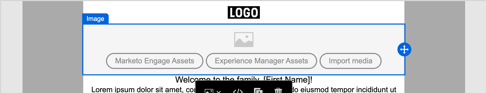

# 資產

在 [!DNL Adobe Journey Optimizer B2B Edition]中，資產通常是在設計內容時用於支援帳戶歷程的影像。您可以在電子郵件、電子郵件範本以及資產選擇器中的片段中，或在視覺化設計空間內的簡單拖放介面中使用這些影像。

[!DNL Journey Optimizer B2B Edition]讓設計人員和行銷人員能夠存取兩種型別的資產資料庫：內部[!DNL Journey Optimizer B2B Edition]資產存放庫和[!DNL Adobe Experience Manager Assets as a Cloud Service]。 您可能只會使用內建的存放庫，或同時使用這兩種資料庫型別（根據您擁有的[!DNL Experience Manager Assets]授權）。

## 資產管理

如果您已布建[!DNL Adobe Experience Manager as a Cloud Services]，且已在[!DNL Journey Optimizer B2B Edition]中將其設定為資產來源，則當您的使用者帳戶具有必要許可權時，您即可存取這兩種存放庫型別。 這些存放庫是獨立的而且不會同步。您可以使用任一來源的影像。

### 內部資產

預設會隨每[!DNL Journey Optimizer B2B Edition]個訂閱提供內部資產存放庫。 這表示您可以存取任何儲存在已連線[!DNL Adobe Marketo Engage]資產檔案系統中的影像資產。 您可以使用此存放庫做為您的本機資產庫，包含上傳和下載資產功能。您也可以在歷程內容中使用這些資產。

您可以[使用Adobe Express](./image-edit-adobe-express.md)編輯這些資產，並將其移至資料夾中以組織這些資產，以便在您的電子郵件、範本和片段中使用。

支援的檔案格式：JPG、JPEG、GIF、PNG、EPS、SVG 以及 RGB

### Adobe Experience Manager Assets as a Cloud Service

利用 [!DNL Adobe Experience Manager Assets] 將行銷與創意工作流程結合在一起。該服務與 [!DNL Journey Optimizer B2B Edition] 原生整合，因此您可以輕鬆存取 Assets as a Cloud Service 來探索及使用數位資產。其提供您存取 Assets 存放庫的權限，讓您可以取用資產並填入訊息中。

[!DNL Adobe Journey Optimizer B2B Edition] 可以連接到 [!DNL Adobe Experience Manager Assets as a Cloud Service] 以進行集中式資產管理，進一步擴展您的創意系統，並統一數位資產以實現傳遞體驗。[!DNL Adobe Experience Manager Assets as a Cloud Service] 提供一套易於使用的雲端解決方案，能提高數位資產管理與 Dynamic Media 作業的效率。其與進階功能包括人工智慧和機器學習無縫整合。

請參閱 [Adobe Experience Manager as a Cloud Service 文件](https://experienceleague.adobe.com/zh-hant/docs/experience-manager-cloud-service/content/assets/overview){target="_blank"}以了解更多。

{{aem-assets-licensing-note}}

從內容設計左側導覽中的 **[!UICONTROL Experience Manager Assets]** 項目，直接從 [!DNL Journey Optimizer B2B Edition] 內存取 [!DNL Adobe Experience Manager Assets]。您亦可以在設計電子郵件、電子郵件範本及視覺片段內容時存取資產和資料夾。

目前，您僅可在 Adobe Journey Optimizer B2B Edition 中使用來自 Adobe Experience Manager Assets 的影像。

## 使用資產編寫內容

在製作電子郵件、電子郵件範本及視覺片段時使用資產。視覺化內容編輯器可讓您存取已連接的資產存放庫中的影像。如果您也有Experience Manager Assets as a Cloud Service的訂閱，您可以從任一來源選擇影像資產。 您也可以上傳影像資產，將其置於內部資產存放庫中。

您可以在編輯影像元件的設定時，或直接在版面上選擇影像來源。

* **_影像元件設定_** - 當您在視覺化設計空間中選取某個影像元件時，便可以在右側面板中檢視和編輯此設定。若要新增或變更元件中顯示的影像檔案，請選擇來源類型並選取一個影像檔案。

  {width="350"}

* **_空白元件_** - 在視覺化設計空間中新增影像元件時，元件是空的並提供簡易途徑讓您選擇來源並選取一個影像檔案。

  {width="500"}

* **_影像元件工具列_** - 當您在視覺化設計空間中選取某個影像元件時，可透過工具列輕鬆選擇來源再選取影像檔案。

  {width="500"}

視影像資產來源而定，您可以在製作內容時新增影像資產。您也可以在結構元件的背景設定中選擇影像資產。

>[!BEGINTABS]

>[!TAB 選取資產]

按一下「**[!UICONTROL 選取資產]**」以開啟資產選擇器，您可在此從Journey Optimizer B2B edition資產存放庫中選擇影像。

{width="700" zoomable="yes"}

您可以使用搜尋和篩選器來找到所需的影像資產。選取資產並按一下「**[!UICONTROL 選取]**」，以便用作影像元件。

如需使用內部影像資產的詳細資訊，請參閱[在您的內容中使用資產](./internal-image-assets.md#use-assets-in-your-content)。

>[!TAB Experience Manager Assets]

按一下「**[!UICONTROL Experience Manager Assets]**」以開啟資產選擇器，您可以從 Experience Manager Assets 存放庫中選擇一個影像。

{width="700" zoomable="yes"}

您可以使用搜尋和篩選器來找到所需的影像資產。選取資產並按一下「**[!UICONTROL 選取]**」，以便用作影像元件。

若要了解有關使用來自 [!DNL Experience Manager Assets] 的影像檔案的詳細資訊，請參閱[存取 AEM Assets 影像](./aem-assets.md#access-aem-assets-images)。

>[!TAB 匯入媒體]

按一下「**[!UICONTROL 匯入媒體]**」來選取影像檔案，並將其匯入為可用於 Journey Optimizer B2B Edition 內容的資產。

{width="450" zoomable="yes"}

拖放檔案或從檔案系統中選取檔案後，按一下「**[!UICONTROL 匯入]**」。匯入的資產儲存在[!DNL Journey Optimizer B2B Edition]資產存放庫中。

>[!ENDTABS]
