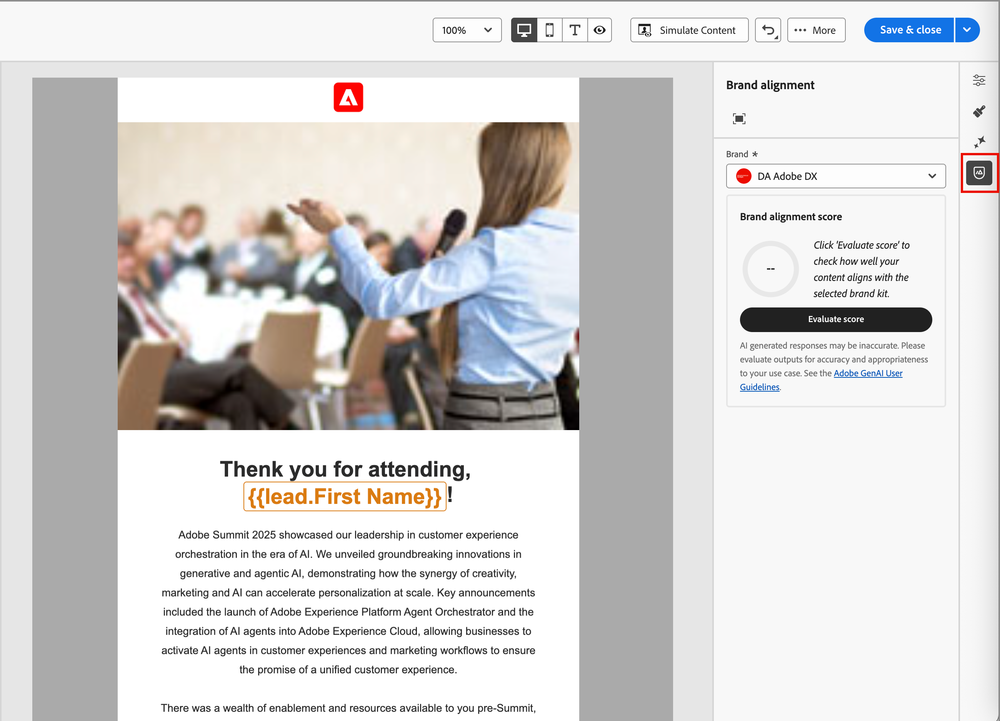
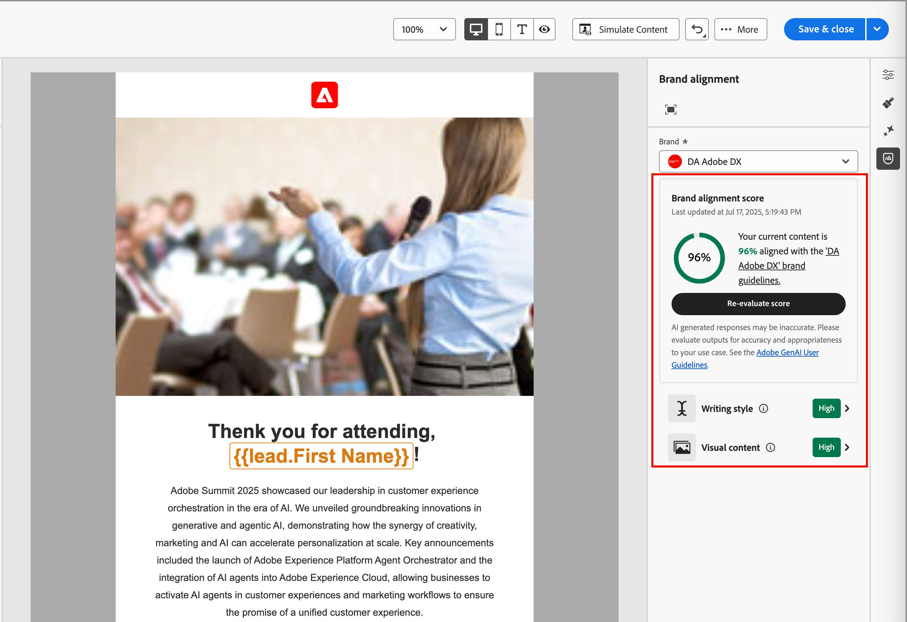

# 品牌一致性分數 {#brand-score}

>[!CONTEXTUALHELP]
>id="ajo-b2b_brand_score_overview"
>title="品牌選取項目"
>abstract="選取您的品牌以確保您的內容製作符合其特定的準則、標準和識別，從而維持一致性和品牌完整性。"

>[!CONTEXTUALHELP]
>id="ajo-b2b_brand_score"
>title="品牌一致性分數"
>abstract="您的品牌一致性分數會衡量您的內容遵守品牌指引的程度，以確保色彩、字型、標誌、影像和寫作風格的一致性。"

>[!CONTEXTUALHELP]
>id="ajo-b2b_brand_colors"
>title="色彩分數"
>abstract="色彩分數"

>[!CONTEXTUALHELP]
>id="ajo-b2b_brand_fonts"
>title="字體分數"
>abstract="字體分數"

>[!CONTEXTUALHELP]
>id="ajo-b2b_brand_logos"
>title="標誌分數"
>abstract="標誌分數"

品牌一致性評估與分數可協助您建立、檢閱和管理遵循所選品牌[中定義的准則](./brands-manage-create.md#brand-definitions)的內容。 它可確保您的電子郵件行銷活動的語調、訊息和視覺身分的一致性，同時在內容上線之前作為品質檢查。

>[!AVAILABILITY]
>
>此功能目前以私人測試版的形式提供，並計畫在未來版本中逐步提供給所有客戶。
>
>您必須先取得[使用者合約](https://www.adobe.com/tw/legal/licenses-terms/adobe-dx-gen-ai-user-guidelines.html){target="_blank"}，才能在Adobe Journey Optimizer B2B edition中使用AI支援的功能。 如需詳細資訊，請聯絡您的 Adobe 代表。
>
>如需有關產品管理員如何啟用這些功能的資訊，請參閱[品牌相關許可權](./brands-overview.md#brand-related-permissions)。

## 驗證您的品牌一致性

當您的品牌已妥善定義並發佈時，請直接在電子郵件設計空間評估您的品牌一致性分數，以確保內容符合您的品牌方針：

1. 建立電子郵件內容後，請按一下右側的&#x200B;_品牌一致性_ （ ）圖示，以開啟電子郵件設計空間中的&#x200B;_品牌一致性_&#x200B;右側面板。

   已自動選取[預設品牌](./brands-manage-create.md#default-brand)。

   {width="600" zoomable="yes"}

   您可以按一下面板頂端的&#x200B;_全熒幕_ （ ）圖示，以全熒幕模式顯示品牌對齊工具。

1. 如有需要，請按一下&#x200B;**[!UICONTROL 品牌]**&#x200B;功能表箭頭（）以選擇其他已發佈的品牌。

1. 按一下「**[!UICONTROL 評估分數]**」，為內容與所選品牌的一致性評分。

   系統會根據所選品牌的准則來評估內容，並顯示結果分數。

   {width="600" zoomable="yes"}

## 檢閱評估

此分數會根據評估後電子郵件內容中識別的違規進行計算：

* 100 =完美 — 找不到違規
* 80-99 =良好 — 僅輕微違規
* 60-79 =公平 — 某些重大違規
* 60以下=不良 — 重大違規需要注意

您可以更詳細地檢閱評估結果，以協助您識別違規並改善類別對齊分數(_高_、_Medium_&#x200B;和&#x200B;_低_)並檢閱詳細資料。 針對&#x200B;**[!UICONTROL 寫入樣式]**&#x200B;或&#x200B;**[!UICONTROL 視覺內容]**，按一下&#x200B;_展開_ （）箭頭以顯示評估的詳細資料。

{width="600" zoomable="yes"}

選取任何已標幟的指引以檢視特定意見和建議。

您可以變更內容，然後按一下[重新評估分數] **&#x200B;**，執行其他評估並檢查改善的結果。
