# 在電子郵件內容中使用品牌主題 {#email-brand-themes}

>[!CONTEXTUALHELP]
>id="ajo-b2b_email_brand_theme"
>title="將品牌主題套用至您的電子郵件或電子郵件範本"
>abstract="為您的電子郵件或電子郵件範本選取主題，以套用適合您的品牌和設計的樣式。"

透過主題，非技術性設計人員能夠建立符合特定品牌和樣式的可重複使用電子郵件內容設計准則。 主題可讓行銷人員更快且更省力地運用視覺上吸引人、品牌一致的電子郵件，並提供進階自訂選項以滿足獨特的設計需求。

## 主題指引和限制 {#themes-guidelines}

當您使用主題時，請牢記以下准則和限制：

* 當您從空白畫布（_從草稿開始設計_）建立電子郵件或電子郵件範本時，可以選擇&#x200B;_佈景主題模式_，以使用佈景主題開始建立您的內容，以套用符合您的品牌和設計的特定樣式。 如果您選擇&#x200B;_手動模式_，除非您重設電子郵件或電子郵件範本的設計，否則無法套用主題。

* [片段](./fragments.md)在電子郵件內容中的&#x200B;_主題模式_&#x200B;和&#x200B;_手動模式_&#x200B;之間不相容。 若要在套用了主題的電子郵件內容中使用片段，該片段也必須在&#x200B;_主題模式_&#x200B;中建立。

* 對自訂主題所做的變更不會自動重疊顯示至已使用該主題的所有電子郵件或電子郵件範本。 編輯每個主題的內容以重新整理主題。

* 如果您刪除主題，該主題不會影響已套用主題的任何電子郵件或電子郵件範本。
<!-- 
* If using a content created in HTML, you will be in [compatibility mode](existing-content.md) and you cannot apply themes to this content.
-->

## 建立品牌主題 {#create-theme}

定義您自己的品牌主題，以便套用至未來電子郵件內容中的電子郵件和電子郵件範本內容。

1. 使用下列其中一種方法來存取佈景主題工具：

   * [建立新的電子郵件範本](./email-templates.md#create-an-email-template)，然後按一下&#x200B;**[!UICONTROL 編輯電子郵件範本]**&#x200B;以啟動&#x200B;_[!UICONTROL 設計您的範本]_&#x200B;頁面。

   * 按一下&#x200B;**[!UICONTROL ...在電子郵件內容設計空間的右上角顯示更多]**，然後選擇&#x200B;**[!UICONTROL 變更您的設計]**。

     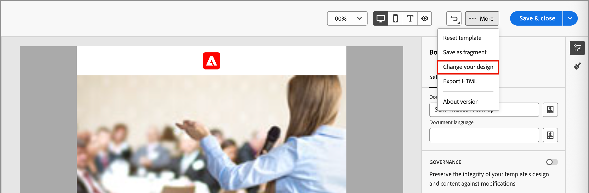{width="700" zoomable="yes"}

     在確認對話方塊中，按一下&#x200B;**[!UICONTROL 變更範本]**&#x200B;以開啟設計頁面。

1. 在設計頁面中，選擇&#x200B;**[!UICONTROL 建立或編輯主題]**。

   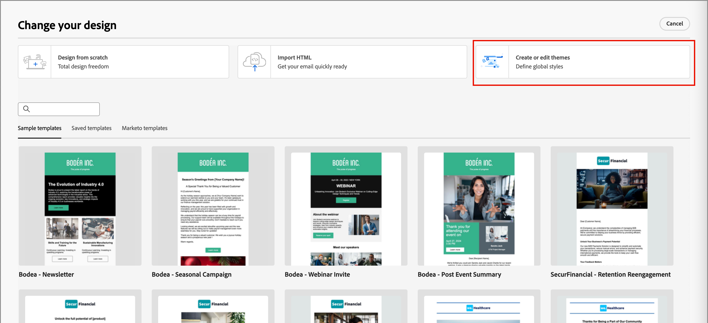{width="800" zoomable="yes"}

1. 選取預設佈景主題，或使用任何Adobe佈景主題作為起點。

   >[!NOTE]
   >
   >如果您想要使用其中一個自訂主題（_[!UICONTROL 我的主題]_）做為起點，您可以[複製它](#delete-or-duplicate-a-theme)，並在您[編輯主題](#edit-a-theme)時變更主題名稱。

1. 按一下&#x200B;**[!UICONTROL 建立]**。

   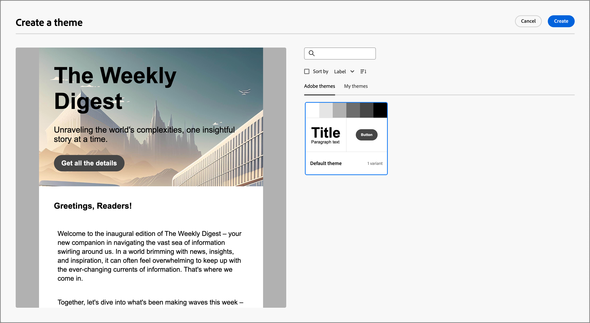{width="750" zoomable="yes"}

   「_[!UICONTROL 建立主題]_」頁面提供了一個畫布，其中包含起始主題中所有文字型別、按鈕和容器的現有元素。

1. 使用正確的導覽來存取不同的佈景主題樣式標籤，並變更佈景主題設定：

   * [一般設定](#general-settings)
   * [顏色](#colors)
   * [文字設定](#text-settings)
   * [間距與邊框](#spacing-and-border)
   * [按鈕](#button)
   * [分隔線](#divider)
   * [格線](#grid)

   當您定義新的主題設定時，畫布上的視覺元素會變更。 如果結果不是您想要的結果，您可以按一下右面板底部的&#x200B;_復原_ （ {width="16"} ）圖示。 按一下「_重做_」（「{width="16"}）圖示以重新套用變更。

1. 當您的佈景主題定義完成時，請按一下[儲存]。**&#x200B;**

1. 按一下&#x200B;**[!UICONTROL 關閉]**&#x200B;返回&#x200B;_[!UICONTROL 建立主題]_&#x200B;頁面，然後按&#x200B;**[!UICONTROL 取消]**&#x200B;返回設計頁面。

   然後，您可以選擇&#x200B;**[!UICONTROL 從草稿開始設計]**&#x200B;以開啟視覺化設計空間，並[使用主題](#use-your-theme-for-email-content-authoring)作為電子郵件或範本。

### 一般設定

在&#x200B;**[!UICONTROL 一般設定]**&#x200B;標籤中，定義主題的基本引數：

* 輸入唯一的&#x200B;**[!UICONTROL 主題名稱]**。

* 調整電子郵件內容（內文）的&#x200B;**[!UICONTROL 檢視區寬度]**。 使用向上和向下箭頭來增加或減少寬度，或輸入值（畫素）。

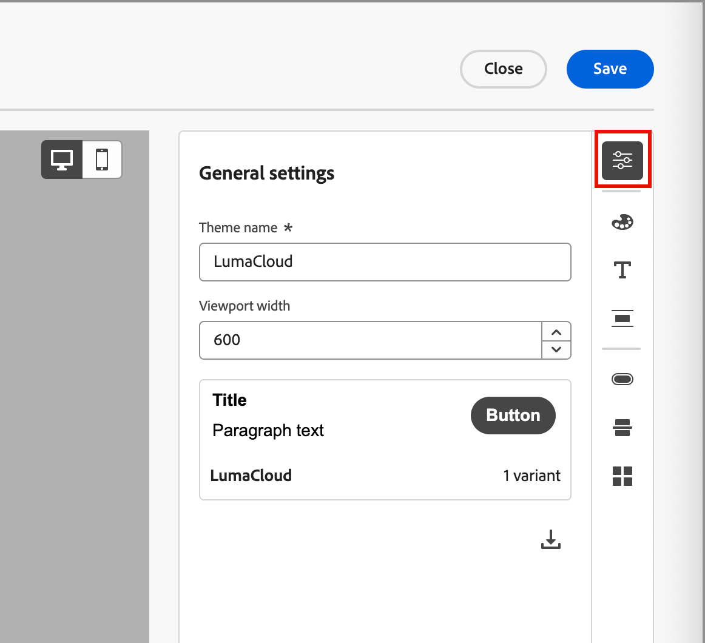{width="450"}
<!--  and also export the current theme to [share it across sandboxes](../configuration/copy-objects-to-sandbox.md).-->

### 顏色

選取&#x200B;**[!UICONTROL 色彩]**&#x200B;標籤，並使用設定來定義佈景主題調色盤。

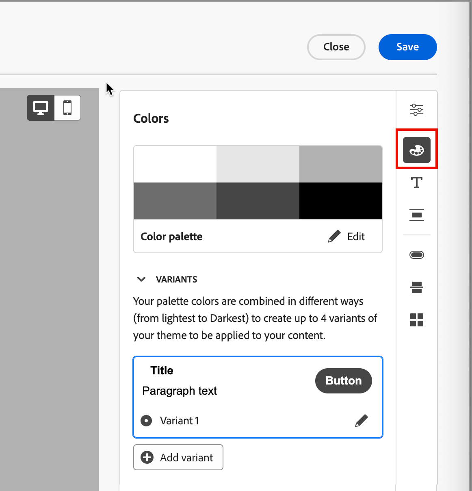{width="450"}

* 按一下&#x200B;**[!UICONTROL 編輯]**&#x200B;以顯示包含主題色彩的調色盤。

  選擇&#x200B;**[!UICONTROL 預設集]**&#x200B;以使用佈景主題的色彩配置，或調整集合中的每個色彩。 您也可以使用兩者的組合。

  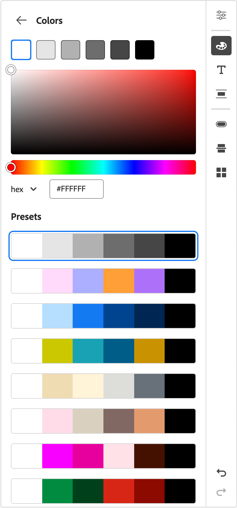{width="350"}

  對於頂端的選取顏色方塊，您可以輸入已知的RGB、HSL、HSB或十六進位值來設定顏色。 或者，您可以使用顏色滑桿和顏色欄位來選取顏色。

  按一下&#x200B;_上一步_&#x200B;箭頭以關閉調色盤工具。

* 按一下&#x200B;**[!UICONTROL 新增變體]**&#x200B;以建立多個色彩變體，例如&#x200B;_淺色_&#x200B;和&#x200B;_深色_&#x200B;模式，每個變體都有自己的調色盤和細微控制項。 您最多可以有六個變體。

  針對每個變體，按一下&#x200B;_編輯_ （  ）圖示。 您可以使用預設調色盤或任何自訂顏色。

  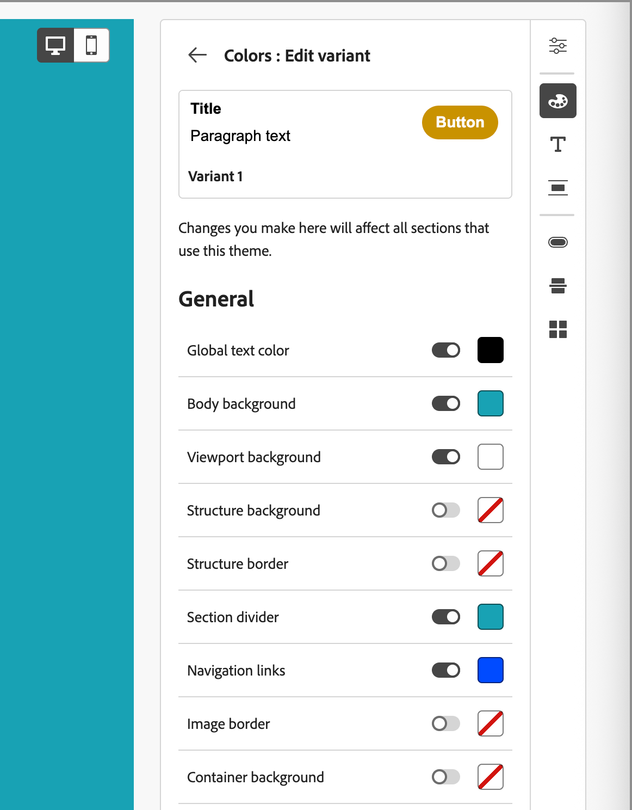{width="450"}

  針對您要針對變體變更的每個顏色，將切換開關向左或向右移動以停用或啟用它。 針對啟用的顏色設定，按一下顏色方塊以選擇顏色。

  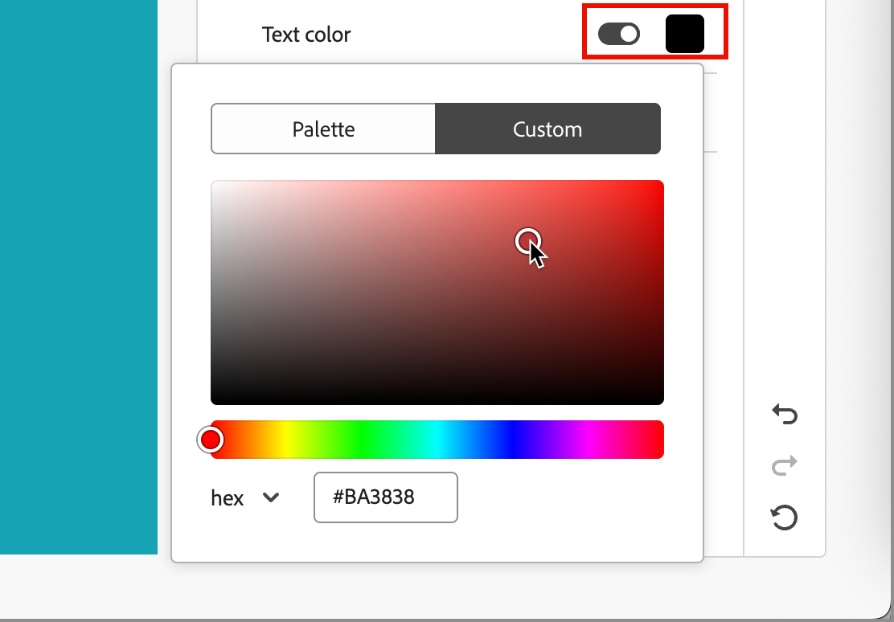{width="450"}

  +++變體色彩設定

  設定會根據型別分組：

  | 類型 | 設定 | 說明 |
  | ---- | -------- | ----------- |
  | [!UICONTROL 一般] | 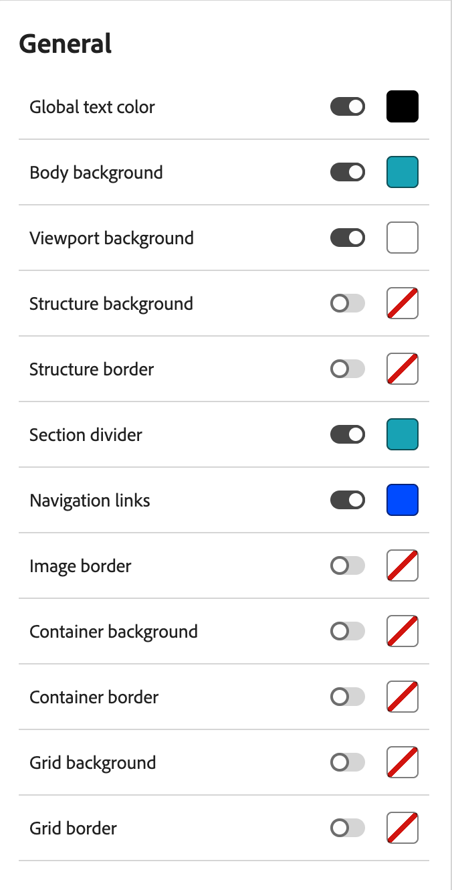{width="300"} | 這些設定決定主體、結構、容器、背景、連結、格點和框線的顏色。 |
  | [!UICONTROL 標題] | 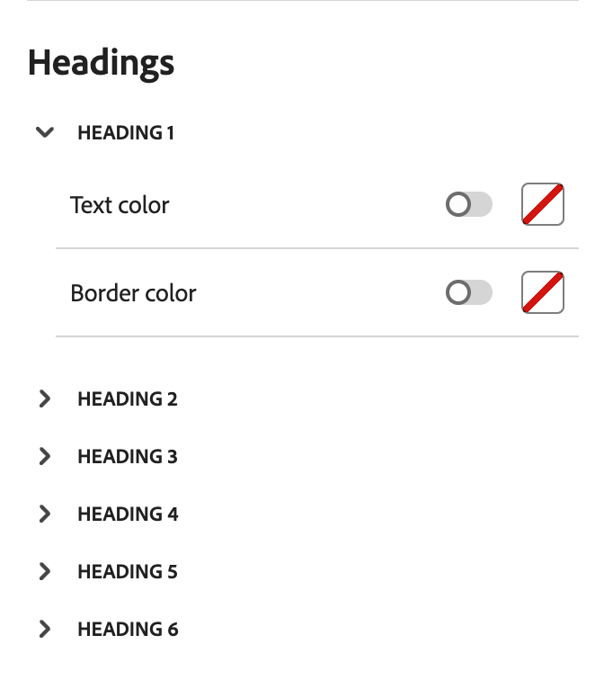{width="300"} | 這些設定會套用至`Heading`元素，您可以在其中為6個標題層級中的每一個層級設定文字和邊框顏色。 展開您要設定變體顏色的每個標題層級。 |
  | [!UICONTROL 段落] | 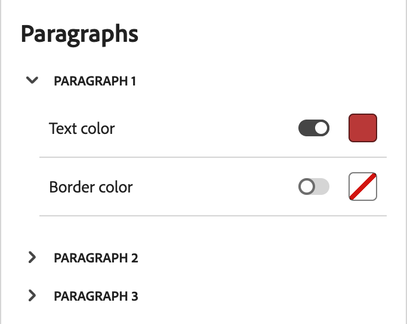{width="300"} | 這些設定會套用至`Paragraph`元素，您可以在其中為三種段落型別的每一種設定文字和邊框顏色。 展開您要為變體設定顏色的每個段落型別。 |
  | [!UICONTROL 按鈕] | 變體的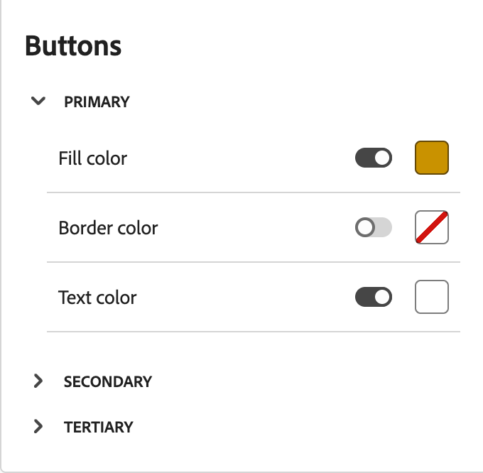{width="300"} | 這些設定會套用至按鈕元素，您可以在其中設定三個按鈕預設集的填色色彩、邊框色彩和文字色彩： _主要_、_次要_&#x200B;和&#x200B;_第三_。 |

  +++

### 文字設定

在&#x200B;**[!UICONTROL 文字設定]**&#x200B;索引標籤中，您可以設定要用於佈景主題的全域字型型別、樣式和大小。 如需更細微的控制，您也可以編輯標題和段落型別的這些引數。

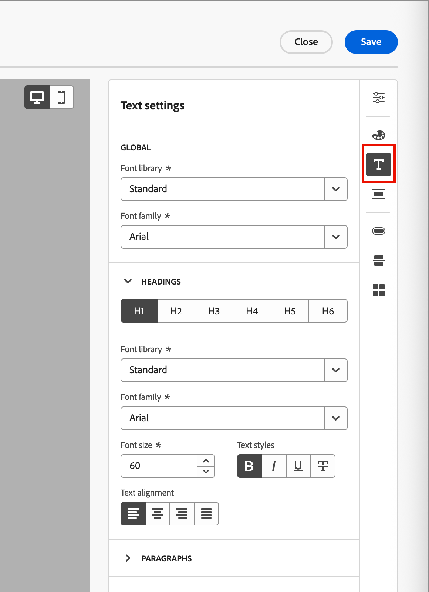{width="450"}

+++文字設定（依型別）

| 類型 | 設定 | 說明 |
| ---- | -------- | ----------- |
| [!UICONTROL 全域] | 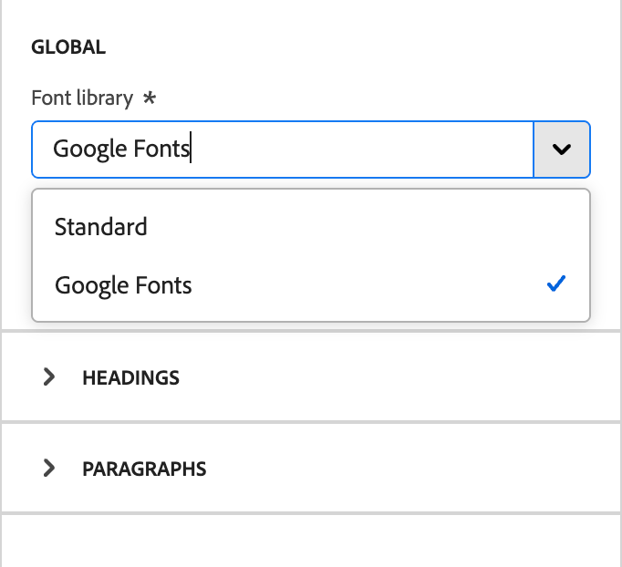{width="300"} | 將&#x200B;**[!UICONTROL 字型庫]**&#x200B;設定為&#x200B;_[!UICONTROL 標準]_&#x200B;或&#x200B;_[!UICONTROL Google字型]_。 然後，選擇您要使用的字型系列。 除非您為標題層級和段落型別設定不同的文字樣式，否則會套用這些全域文字設定。 |
| [!UICONTROL 標題] | 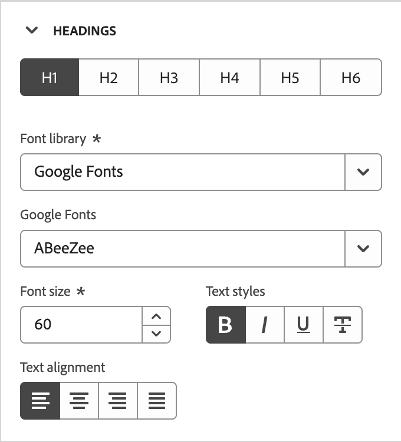{width="300"}的標題文字樣式 | 針對您要設定的標題層級，選取&#x200B;**[!UICONTROL H1]**、**[!UICONTROL H2]**&#x200B;等。 將&#x200B;**[!UICONTROL 字型庫]**&#x200B;設定為&#x200B;_[!UICONTROL 標準]_&#x200B;或&#x200B;_[!UICONTROL Google字型]_。 然後，選擇字型系列、大小和樣式。 選擇&#x200B;**[!UICONTROL 文字對齊]**： _靠左_、_置中_、_靠右_&#x200B;或&#x200B;_對齊_。 |
| [!UICONTROL 段落] | {width="300"}的段落文字樣式 | 對於您要設定的標題層級，請選取&#x200B;**[!UICONTROL P1]**、**[!UICONTROL HP]**&#x200B;等。 將&#x200B;**[!UICONTROL 字型庫]**&#x200B;設定為&#x200B;_[!UICONTROL 標準]_&#x200B;或&#x200B;_[!UICONTROL Google字型]_。 然後，選擇字型系列、大小和樣式。 視需要調整&#x200B;**[!UICONTROL 行高]**。 選擇&#x200B;**[!UICONTROL 文字對齊]**： _靠左_、_置中_、_靠右_&#x200B;或&#x200B;_對齊_。 |

+++

### 間距與邊框

在&#x200B;**[!UICONTROL 間距]**&#x200B;索引標籤中，您可以設定不同元素型別的內距和邊界。 針對&#x200B;**[!UICONTROL 選取型別]**，選擇內容型別。 然後，設定適用於該元素型別的邊框間距、邊界、邊角和邊界。

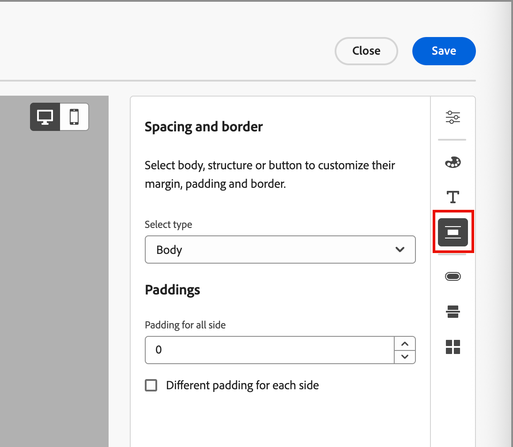{width="450"}

+++間距設定

| 類型 | 設定 | 說明 |
| ---- | -------- | ----------- |
| [!UICONTROL 邊界] | 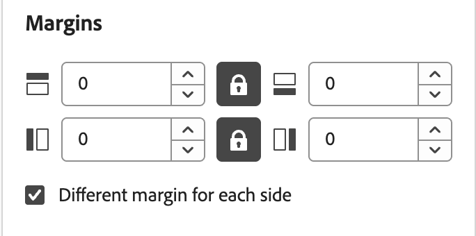{width="300"} | 選擇&#x200B;_邊界_&#x200B;圖示以顯示複製CSS `margin`引數的設定，該引數可控制元件邊界外的空間，並將其與其他元件/元素分開。 它會在元件周圍建立間隙，以影響其定位和周圍內容的版面。 根據您的設計需求設定邊界值（畫素）。 您可以單獨設定元件所有側、上邊框、左右邊或每一側的邊界。 按一下「_鎖定_」和「_解除鎖定_」圖示以同步或取消同步上下及左右邊界值。 |
| [!UICONTROL 內邊距] | 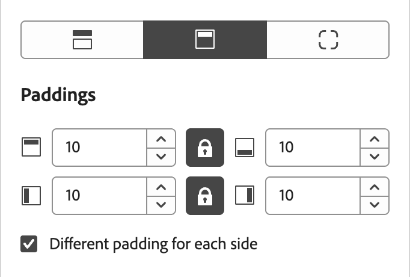{width="300"} | 選擇&#x200B;_內距_&#x200B;圖示以顯示復寫CSS `padding`引數的設定，此引數是元件/元素的內容與其邊框之間的空間。 內距提供內部間距，可用來控制內容與元件邊框之間的距離。 根據您的設計需求，設定以畫素為單位的填補值。 您可以單獨設定元件所有側、上邊框、左右邊或每一側的邊框間距。 按一下「_鎖定_」和「_解除鎖定_」圖示以同步或取消同步上下和左右邊框間距值。 |
| [!UICONTROL 角] | 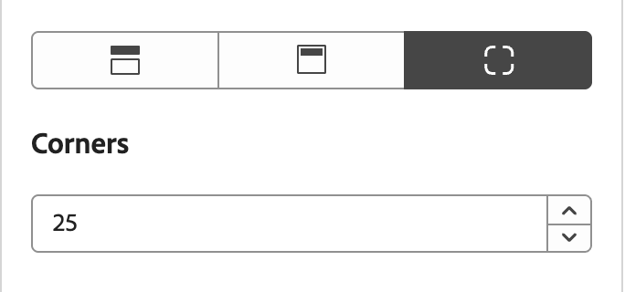{width="300"} | 選擇&#x200B;_轉角_&#x200B;圖示以顯示復寫CSS `border-radius`引數的設定，此引數定義元件/元素轉角的半徑。 根據您想要的轉角曲線設定數值。 值為0 （預設）會產生方形轉角。 |

+++

+++邊框設定

將&#x200B;**[!UICONTROL 邊框]**&#x200B;切換移動至右側，以啟用邊框顯示選項，並根據您的設計准則進行設定：

* 若要設定&#x200B;**[!UICONTROL 邊框大小]** （線條寬度），請按一下向上和向下箭頭圖示以增加或減少畫素數量。

* 若要設定&#x200B;**[!UICONTROL 邊框樣式]**，請從標準CSS `border-style`值清單中選擇一個值，例如&#x200B;_實線_、_點線_&#x200B;和&#x200B;_虛線_。

* 若要決定顯示邊框的位置，請選取每個&#x200B;**[!UICONTROL 邊框位置]**&#x200B;核取方塊。

{width="250"}

+++

### 按鈕

在&#x200B;**[!UICONTROL 按鈕]**&#x200B;標籤中，您可以為按鈕元素設定不同的屬性（顏色除外），例如邊框半徑（形狀）、文字和大小。 您可以變更三個按鈕預設集的設定： _[!UICONTROL 主要]_、_[!UICONTROL 次要]_&#x200B;和&#x200B;_[!UICONTROL 第三]_。

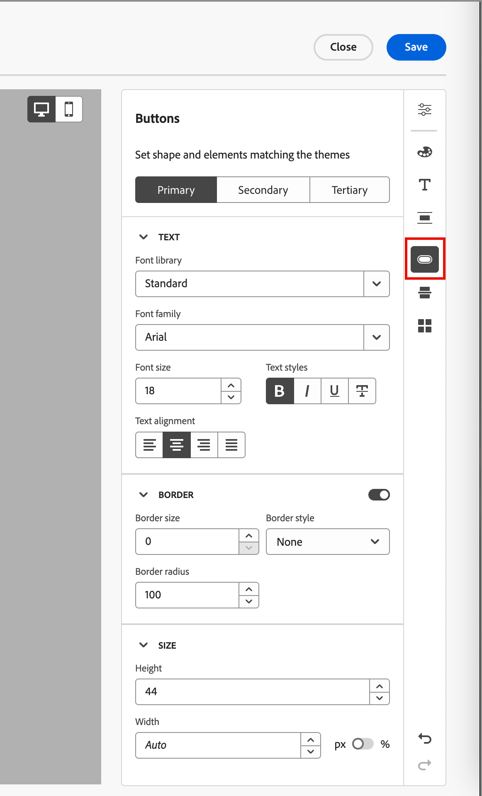{width="450"}

+++按鈕設定

| 類型 | 設定 | 說明 |
| ---- | -------- | ----------- |
| [!UICONTROL 文字] | 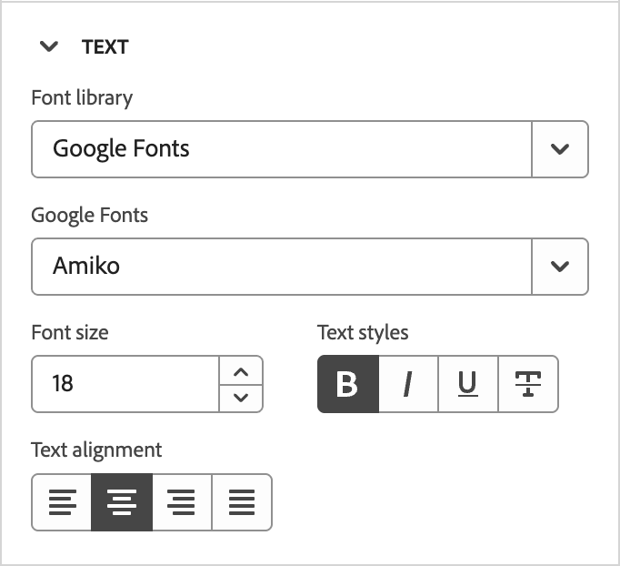{width="300"} | 將&#x200B;**[!UICONTROL 字型庫]**&#x200B;設定為&#x200B;_[!UICONTROL 標準]_&#x200B;或&#x200B;_[!UICONTROL Google字型]_。 然後，選擇字型系列、大小和樣式。 選擇&#x200B;**[!UICONTROL 文字對齊]**： _靠左_、_置中_、_靠右_&#x200B;或&#x200B;_對齊_。 |
| [!UICONTROL 邊框] | 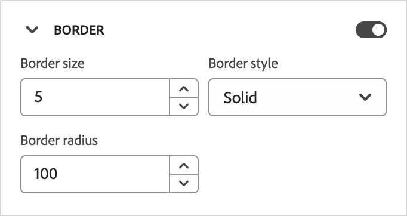{width="300"} | 將&#x200B;**[!UICONTROL 邊框]**&#x200B;切換移動至右側，以啟用按鈕邊框顯示選項，並根據您的設計准則進行設定。 增加或減少畫素數目，以設定&#x200B;**[!UICONTROL 邊框大小]** （線條寬度）。 從標準CSS **[!UICONTROL 值清單中選擇一個值，例如]**&#x200B;實線`border-style`、_點線_&#x200B;和&#x200B;_虛線_，以設定&#x200B;_邊框樣式_。 |
| [!UICONTROL 大小] | 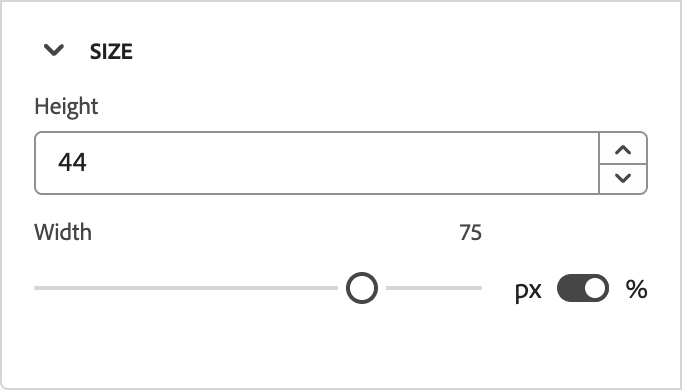{width="300"} | 對於&#x200B;**[!UICONTROL 高度]**&#x200B;選項，按一下向上和向下箭頭圖示以增加或減少畫素數量。 空白值(Auto)為預設值，會根據按鈕內容調整按鈕高度。 對於&#x200B;**[!UICONTROL 寬度]**，請使用切換功能以畫素或百分比設定寬度。 若為百分比寬度，請使用滑桿來設定百分比值。 百分比會根據包含區塊的內容方塊來決定按鈕大小，其中不包含邊框間距和邊框。 例如，值50會將按鈕寬度設定為其所包含區塊內容寬度的50%。 針對以畫素為基礎的寬度，按一下向上和向下箭頭圖示，以增加或減少畫素數量。 預設值是空值(_Auto_)，而且會根據按鈕的內容來調整按鈕的寬度。 |

+++

### 分隔線

在&#x200B;**[!UICONTROL 分隔線]**&#x200B;標籤中，您可以設定分隔線元件的線條樣式和容器設定。

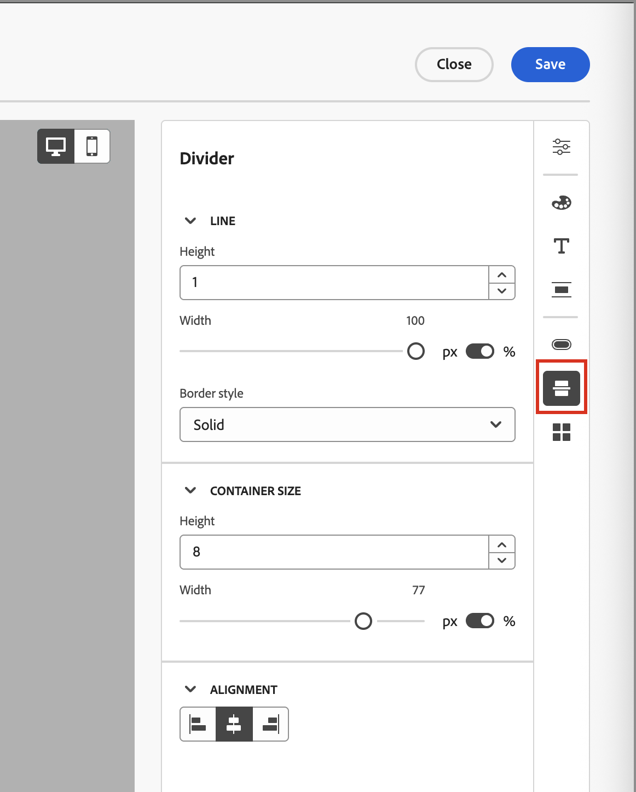{width="450"}

+++分隔線設定

| 類型 | 設定 | 說明 |
| ---- | -------- | ----------- |
| [!UICONTROL Line] | 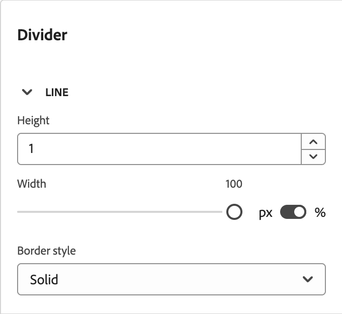{width="300"} | 從標準CSS **[!UICONTROL 值清單中選擇一個值，例如]**&#x200B;實線`border-style`、_點線_&#x200B;和&#x200B;_虛線_，以設定&#x200B;_邊框樣式_。 |
| [!UICONTROL 容器大小] | 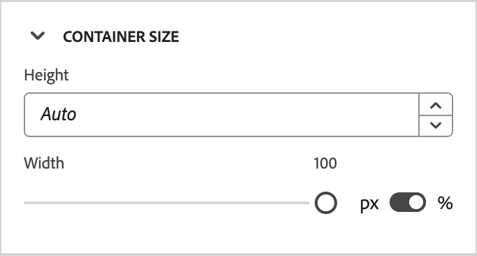{width="300"} | 在&#x200B;**[!UICONTROL 高度]**&#x200B;選項中，按一下向上和向下箭頭圖示，以增加或減少元件/元素的畫素數量。 空白值（自動）為預設值，並根據其內容（行樣式）調整高度。 對於&#x200B;**[!UICONTROL 寬度]**，請使用切換功能以畫素或百分比設定寬度。 若為百分比寬度，請使用滑桿來設定百分比值。 百分比會根據包含區塊的內容方塊來決定元素寬度。 例如，如果值為50，則會將分隔線寬度設定為其包含區塊內容寬度的50%。 針對以畫素為基礎的寬度，按一下向上和向下箭頭圖示，以增加或減少畫素數量。 空值(_Auto_)是預設值，而且會根據分隔線的內容調整其寬度。 |
| [!UICONTROL 對齊方式] | 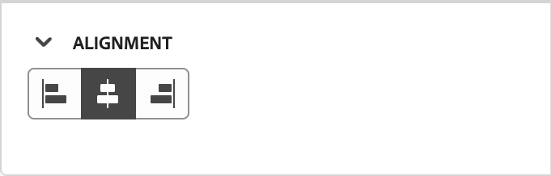{width="300"} | 選擇容納區塊內的水準對齊方式： _左_、_置中_&#x200B;或&#x200B;_右_。 |

+++

### 格線

在&#x200B;**[!UICONTROL 網格]**&#x200B;索引標籤中，您可以控制網格元素的欄與列間距：

* **[!UICONTROL 欄間隔]** — 按一下向上和向下箭號圖示，以增加或減少格線欄之間間隔的畫素數。 或者，您可以在欄位中輸入數字。

* **[!UICONTROL 列間距]** — 按一下向上和向下箭號圖示，以增加或減少格線列之間的間距。 或者，您可以在欄位中輸入數字。

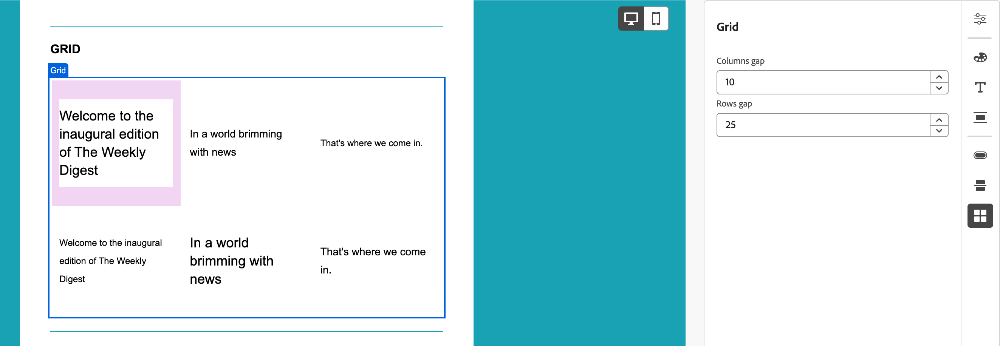{width="700" zoomable="yes"}

## 編輯主題

您可以使用建立主題時所用的相同工作流程和工具來編輯主題。 不同之處在於您選取&#x200B;**[!UICONTROL 我的主題]**&#x200B;標籤，並選取您要變更的自訂主題。

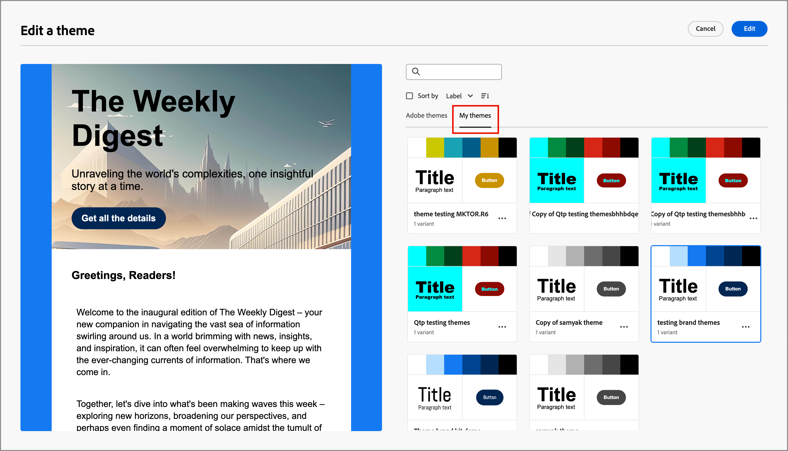{width="750" zoomable="yes"}

使用右側的邊欄來瀏覽不同的標籤並變更主題設定：

* [一般設定](#general-settings)
* [顏色](#colors)
* [文字設定](#text-settings)
* [間距與邊框](#spacing-and-border)
* [按鈕](#button)
* [分隔線](#divider)
* [格線](#grid)

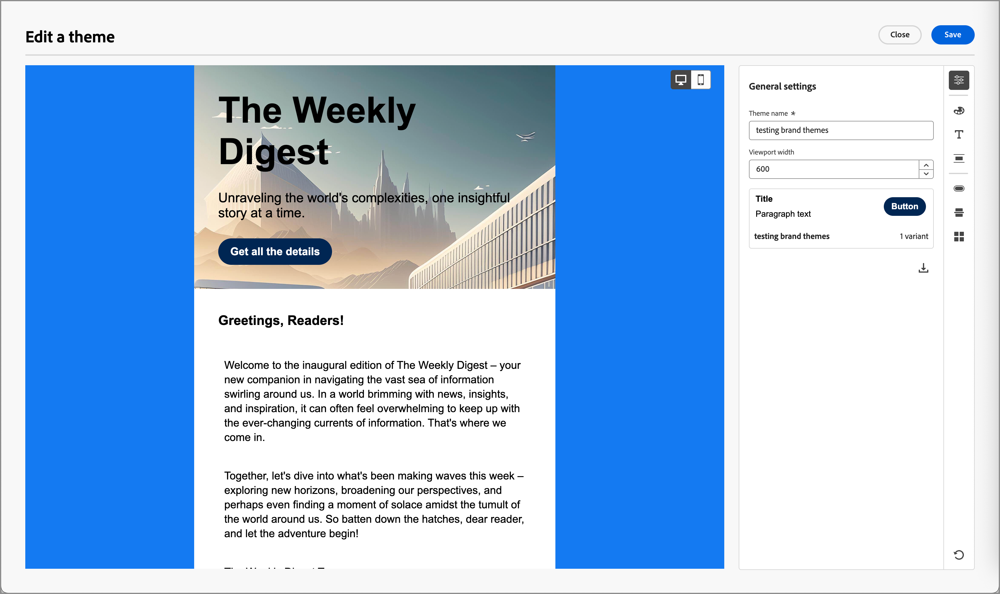{width="800" zoomable="yes"}

顯示的視覺元素會隨著您變更設定而變更。 如果畫布上的結果不是您想要的結果，您可以按一下右面板底部的&#x200B;_復原_ （ {width="16"} ）圖示。 按一下「_重做_」（「{width="16"}）圖示以重新套用變更。

當您的主題變更完成時，請按一下[儲存]。**&#x200B;**

>[!NOTE]
>
>儲存的變更不會自動重疊顯示至目前使用主題的所有電子郵件或電子郵件範本。 編輯每個主題的內容，以重新整理主題並符合更新的樣式。

## 管理自訂主題

您可以使用建立主題時所用的相同工作流程和工具來管理自訂主題。 不同之處在於您選取&#x200B;**[!UICONTROL 我的主題]**&#x200B;標籤，並在顯示的清單中管理您的主題。

如果您有大量的自訂主題清單，請使用&#x200B;_搜尋_&#x200B;欄位和其他篩選器來減少顯示的清單。 當您管理可用的主題清單時，可以隨時編輯、刪除或複製自訂主題。

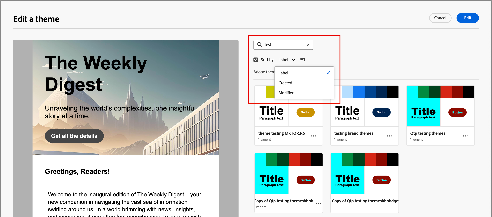{width="750" zoomable="yes"}

### 編輯主題

1. 選取您要變更的主題，然後按一下右上角的&#x200B;**[!UICONTROL 編輯]**。

   {width="750" zoomable="yes"}

1. 使用右側的導覽以使用不同的樣式標籤並變更主題設定：

   * [一般設定](#general-settings)
   * [顏色](#colors)
   * [文字設定](#text-settings)
   * [間距與邊框](#spacing-and-border)
   * [按鈕](#button)
   * [分隔線](#divider)
   * [格線](#grid)

   {width="800" zoomable="yes"}

   顯示的視覺元素會隨著您變更設定而變更。 如果畫布上的結果不是您想要的結果，您可以按一下右邊欄底部的&#x200B;_還原_&#x200B;圖示。 按一下&#x200B;_重做_&#x200B;圖示以重新套用變更。

1. 當您的主題變更完成時，請按一下[儲存]。**&#x200B;**

>[!NOTE]
>
>已儲存的主題變更不會自動重疊顯示至目前使用主題的所有電子郵件或電子郵件範本。 編輯每個主題的內容，以重新整理主題並符合更新的樣式。

### 刪除或複製主題

當您找到主題時，請按一下主題卡右下角的&#x200B;_更多功能表_ (**...**)圖示，然後選擇您要採取的動作：

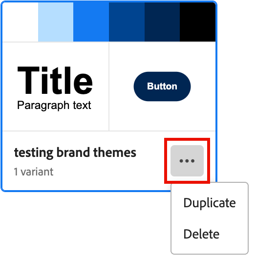{width="220"}

* **[!UICONTROL 複製]** — 選擇此動作以複製主題。 新主題與附加到原始名稱的&#x200B;_副本_&#x200B;相同。 當您[編輯佈景主題](#edit-a-theme)時，可以變更名稱。

* **[!UICONTROL 刪除]** — 選擇此動作以移除自訂主題。 在確認對話框中，按一下「**[!UICONTROL 刪除]**」。

  >[!NOTE]
  >
  >刪除主題不會影響已套用主題的任何電子郵件或電子郵件範本。

## 使用主題進行電子郵件內容製作 {#use-email-theme}

當您建立新的電子郵件或電子郵件範本時，您可以選擇使用品牌佈景主題，以簡化內容製作程式，並確保設計符合定義的標準。 針對新片段，您也可以在儲存片段之前套用主題。 片段從此點保持在&#x200B;_佈景主題模式_&#x200B;中，並相容於新增到同樣處於&#x200B;_佈景主題模式_&#x200B;的電子郵件和電子郵件範本。

1. 選取下列其中一個動作：

   * 選取合併佈景主題的電子郵件範本（在&#x200B;_佈景主題模式_&#x200B;中建立）。 系統會自動套用每個範本專屬的主題。

   * 使用&#x200B;_[!UICONTROL 從頭開始設計]_&#x200B;選項並選取&#x200B;**[!UICONTROL 使用主題]**&#x200B;以預先定義的樣式主題開始。

     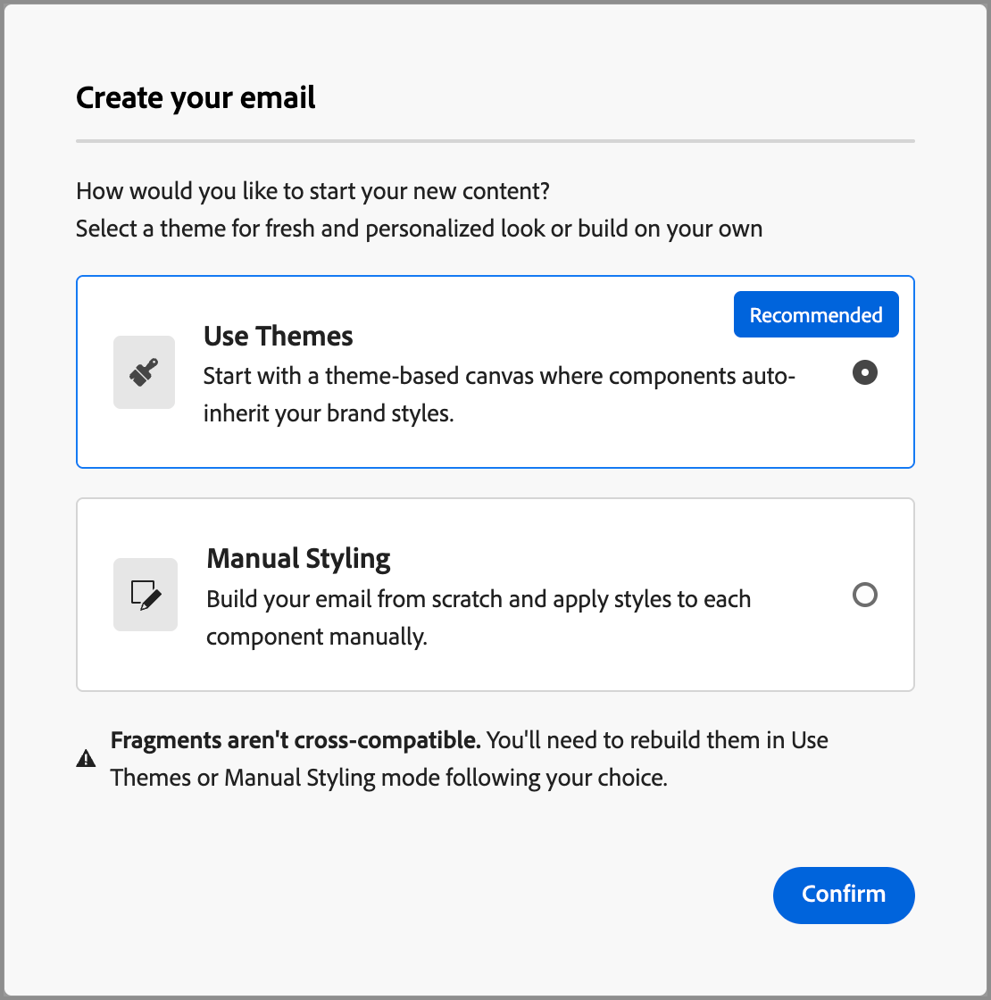{width="450"}

     >[!IMPORTANT]
     >
     >如果您選擇&#x200B;_[!UICONTROL 手動樣式]_&#x200B;模式，您必須重設電子郵件設計以套用主題。
     >
     >如果您選擇&#x200B;_[!UICONTROL 佈景主題]_&#x200B;模式，只有[同樣以](./fragments.md)佈景主題&#x200B;_模式建立的片段_&#x200B;可新增至電子郵件內容。

1. 在電子郵件設計空間中，按一下右側的&#x200B;_主題_ （  ）圖示。

   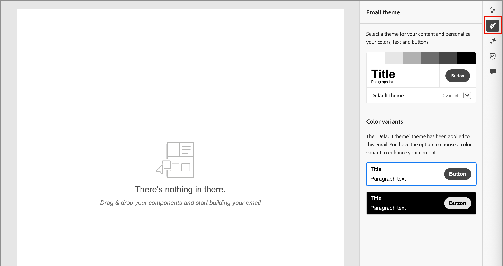{width="600" zoomable="yes"}

   顯示套用至範本的預設主題或主題。 您可以在此主題的顏色變體之間切換。

1. 按一下顯示的主題旁邊的箭頭，可檢視可用的自訂和Adobe主題清單。

1. 按一下&#x200B;**[!UICONTROL 我的佈景主題]**，然後選取您的自訂佈景主題。

   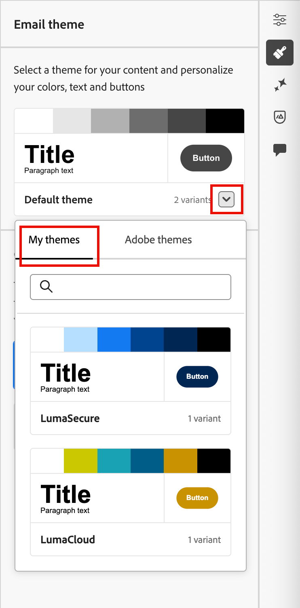{width="325"}

1. 按一下清單外部。

   新選取的自訂主題會將樣式套用至畫布中的所有電子郵件元件。 您可以在顏色變體之間切換。

1. 如果您需要覆寫所選元件的主題樣式，請按一下&#x200B;_解鎖元件樣式_ （ ）圖示。

   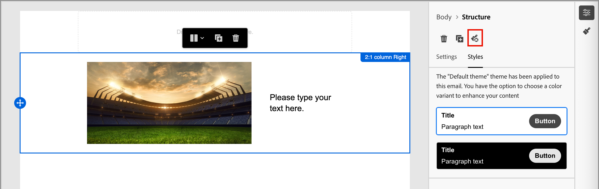{width="600" zoomable="yes"}的主題樣式

   在確認對話方塊中，按一下&#x200B;**[!UICONTROL 解除鎖定]**。

   選取右側面板中的&#x200B;**[!UICONTROL 樣式]**&#x200B;索引標籤以變更元件的設定。

   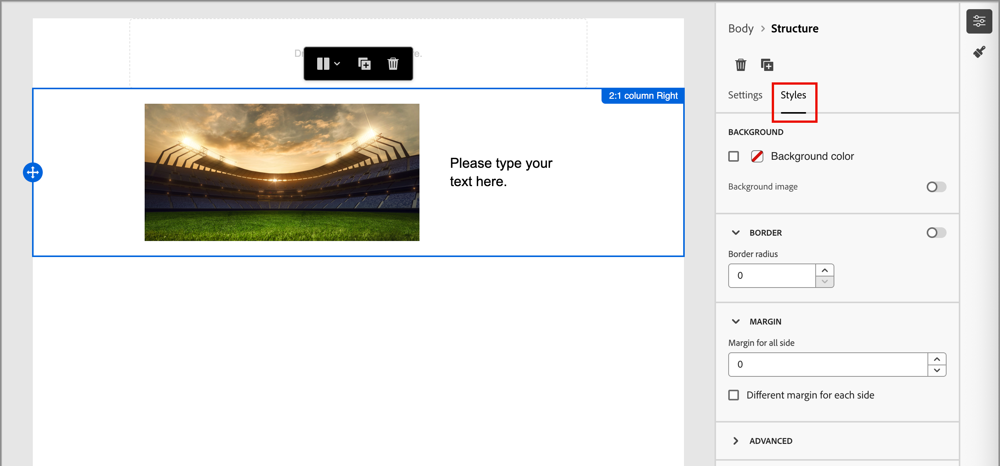{width="600" zoomable="yes"}的主題樣式

## 變更電子郵件內容的主題

對於在&#x200B;_佈景主題模式_&#x200B;中建立的電子郵件或電子郵件範本，您可以隨時變更佈景主題。 電子郵件內容保持不變，但樣式會更新以反映新主題。

1. 在設計空間中開啟電子郵件或電子郵件範本。

1. 按一下右側的&#x200B;_佈景主題_ （  ）圖示。

   套用的主題會顯示在右側面板中。

1. 按一下顯示的主題旁邊的箭頭，可檢視可用的自訂和Adobe主題清單。

1. 選取其他主題。

1. 按一下清單外部。

   選取的主題會將樣式套用至畫布中的所有電子郵件元件。 您可以在顏色變體之間切換。

<!--
>[!NOTE]
> - Themes apply styles globally. Ensure your theme is finalized before applying it to multiple emails.
> - Switching themes may override custom styles applied to individual components.

>[!CAUTION]
> - When using fragments, the email's theme will override the fragment's styles. A warning will be displayed in the editor if there is a conflict.

## Example Use Cases {#example-use-cases}

### 1. Creating a New Theme
- A designer creates a theme with their brand's colors, fonts, and button styles.
- The theme is saved and reused by marketers to author multiple emails.

### 2. Switching Themes
- A marketer applies a holiday-themed design to an existing email by switching to a pre-designed holiday theme.-->
