# 建立並管理您的品牌 {#brand-library}

定義品牌以提供建立視覺和語言識別的規則和標準詳細集合。 這些指引提供跨所有行銷和通訊平台維持一致品牌代表性的參考。 運用定義清晰的品牌指引，組織可確保所有內容建立的努力都與策略目標和整體品牌認同一致。 這種一致性不僅可提升品牌認知度和信任度，也有助於在所有接觸點提供更具凝聚力和影響力的客戶體驗。

在Journey Optimizer B2B edition中，您可以手動定義並組織您的品牌定義和資產，或上傳品牌指引檔案以自動擷取資訊和視覺資產。

>[!AVAILABILITY]
>
>此功能目前以私人測試版的形式提供，並計畫在未來版本中逐步提供給所有客戶。
>
> 
>
>您必須先取得[使用者合約](https://www.adobe.com/tw/legal/licenses-terms/adobe-dx-gen-ai-user-guidelines.html){target="_blank"}，才能在Adobe Journey Optimizer B2B edition中使用AI支援的功能。 如需詳細資訊，請聯絡您的 Adobe 代表。
>
> 
>
>如需有關產品管理員如何啟用這些功能的資訊，請參閱[品牌相關許可權](./brands-overview.md#brand-related-permissions)。

## 存取您的品牌資料庫

若要存取Adobe Journey Optimizer B2B edition中的品牌套件，請前往左側導覽並按一下&#x200B;**[!UICONTROL 內容管理]** > **[!UICONTROL 品牌]**。 此動作會開啟一個頁面，其中建立的品牌會顯示為卡片。

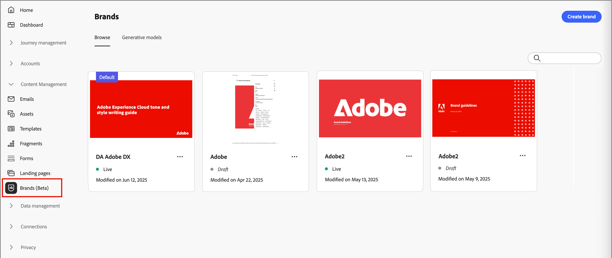{width="800" zoomable="yes"}

如果尚未建立任何品牌，則會顯示單一圖形，其中包含用於[建立您的第一個品牌](#create-and-define-a-brand)的按鈕。

### 品牌管理動作

對於每個卡片，您可以按一下&#x200B;_更多功能表_ （ ）圖示，並為品牌選擇動作：

* **[!UICONTROL 檢視品牌]** — 開啟品牌頁面並顯示定義。
* **[!UICONTROL 標籤為預設品牌]** （僅限上線） - [將品牌標籤為預設品牌](#default-brand)，以進行內容對齊和產生。
* **[!UICONTROL 編輯]** — 開啟品牌頁面，並編輯品牌准則、排除專案和範例。
* **[!UICONTROL 複製]** — 建立復本作為新的草稿品牌。
* **[!UICONTROL 發佈]** （僅限草稿） - [發佈品牌](#publish-the-brand)，使其可用於內容對齊和產生。
* **[!UICONTROL 取消發佈]** （僅供上線） — 取消發佈品牌以將其從內容對齊和產生的使用中移除。
* **[!UICONTROL 刪除]** — 從您的品牌庫中移除品牌。

{width="440"}

### 預設品牌

您可以指定在生成內容和計算內容建立期間對齊分數時自動應用的預設品牌。 預設值只能是已發佈(_Live_)品牌。

在「品牌」庫中，預設品牌卡顯示有標誌。

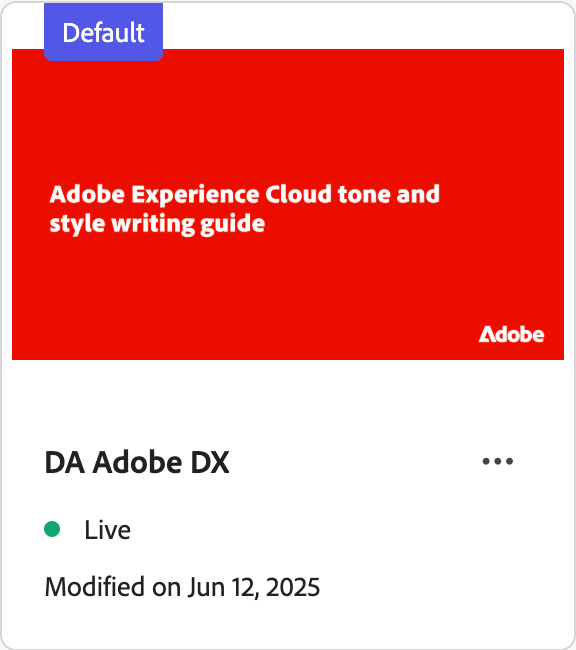{width="200"}

您可以將任何已發佈(_Live_)品牌設定為預設品牌。 在品牌卡上，按一下&#x200B;_更多菜單_（）表徵圖，然後選擇&#x200B;**[!UICONTROL 標籤為預設品牌]**。

{width="350"}

## 建立並定義品牌 {#create-brand}

>[!CONTEXTUALHELP]
>id="ajo-b2b_brands_create"
>title="建立您的品牌"
>abstract="輸入您的品牌名稱，並上傳您的品牌準則檔案。 此工具將自動擷取關鍵詳細資訊，讓您更輕鬆維持品牌識別。"

要建立和定義您的品牌指南，您可以輸入詳細資訊或上載您的品牌指南文檔以用於自動提取。

### 添加品牌

1. 在&#x200B;_[!UICONTROL 品牌]_&#x200B;頁面的右上角，按一下&#x200B;**[!UICONTROL 建立品牌]**。

1. 為您的品牌輸入&#x200B;**[!UICONTROL 名稱]**。

1. 拖放或選擇檔案以上載品牌指南並自動提取相關品牌資訊。

   {width="500"}

   >[!NOTE]
   >
   >如果您沒有以PDF格式保存的文檔，則可以在建立品牌後手動添加准則並上載單個視覺資產。

1. 按一下&#x200B;**[!UICONTROL 建立品牌]**。

   如果包含一個或多個檔案以建立品牌，則資訊提取過程將開始。 可能需要幾分鐘才能完成。

   提取過程完成後，將自動填充您的內容和可視化建立標準。

   {width="700" zoomable="yes"}

### 完善和更新品牌指南

1. 瀏覽不同的頁籤，根據需要調整和定義更詳細的資訊。

   * [!UICONTROL 概觀]

   * [[!UICONTROL 關於品牌]](#about-the-brand)

   * [[!UICONTROL 正在寫入樣式]](#writing-style)

   * [[!UICONTROL 視覺內容]](#visual-content)

   如果您在建立品牌時包含一或多個檔案，資訊擷取程式會建立標籤和區段的定義。 完整性取決於任何檔案中包含的範圍和詳細資訊。 檢閱結果時，您可以變更或移除任何資訊。

   您可以從每個索引標籤或類別的&#x200B;_更多功能表_ （ ）新增檔案，以自動擷取相關的品牌資訊。 您也可以清除現有內容。

   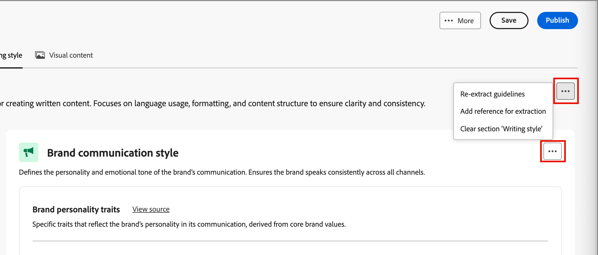{width="500" zoomable="yes"}

   如果您想要檢閱子區段中擷取資訊的來源，請按一下&#x200B;**[!UICONTROL 檢視來源]**&#x200B;連結。

   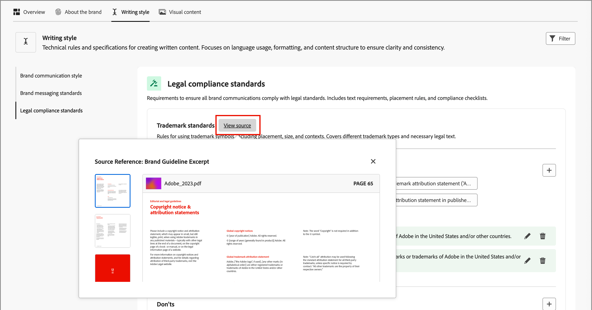{width="700" zoomable="yes"}

1. 在每個詳細資訊索引標籤中，檢閱類別並透過新增、移除和變更定義來改善品牌。

   標示為&#x200B;**[!UICONTROL Do&#39;s]**&#x200B;的子區段概述類別的准則。 使用此區域新增指引的說明和範例。

   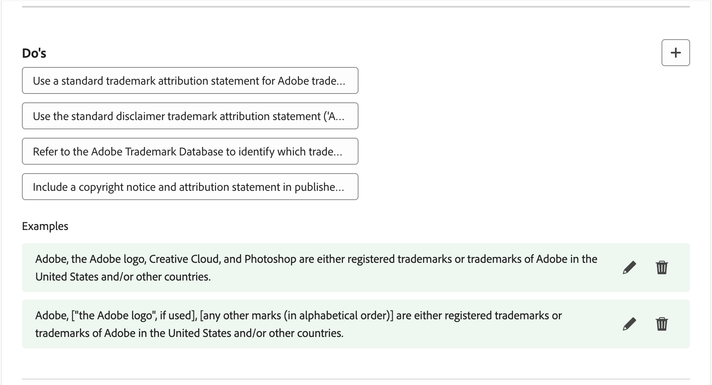{width="500" zoomable="yes"}

   標示為&#x200B;**[!UICONTROL 不要]**&#x200B;的子區段概述排除專案。 使用此區域新增排除專案的說明和範例。

   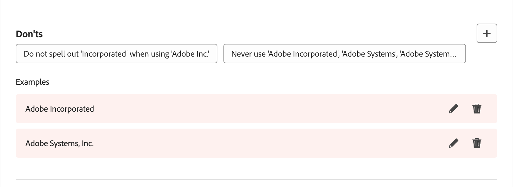{width="500" zoomable="yes"}

   * **新增指引或排除專案**。

     在您想要新增指引的區段中，按一下右側的&#x200B;_新增_ （  ）圖示。 在快顯對話方塊中，輸入指引並選取核取方塊，以指定該指引適用的管道和元素。 然後，按一下&#x200B;**[!UICONTROL 新增]**。

     {width="600" zoomable="yes"}

   * **變更指引或排除專案**。

     在您想要移除指引的區段中，按一下指引Widget。 在快顯對話方塊中，視需要變更指引的內容及選取的核取方塊。 接著，按一下&#x200B;**[!UICONTROL 更新]**。

     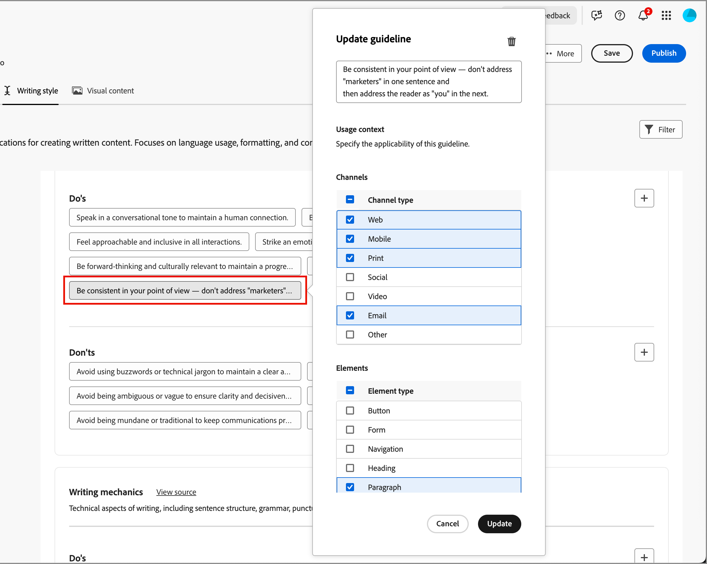{width="600" zoomable="yes"}

   * **Remove a guideline or exclusion**.

     In the section where you want to remove a guideline, click the guideline widget. In the popup dialog, click the _Delete_  (  ) icon at the top.

   * **Add or revise examples of your guidelines and exclusions**.

     In the displayed example tile, click the _Edit_ (  ) icon to change the example, or click the _Delete_ (  ) icon to remove it.

1. When you have everything defined, click **[!UICONTROL Save]**.

   You can continue to make changes to the draft brand until you decide it is ready to publish.

### Publish the brand

When your brand includes a complete set of definitions and meets your requirements, click **[!UICONTROL Publish]** to make your brand guidelines available for content alignment and generation.

Published brands are accessible from the **[!UICONTROL Brand]** option in the AI [brand alignment](./brand-alignment.md) and content generation tools. <!-- [Learn more about content generation](gs-generative.md) -->

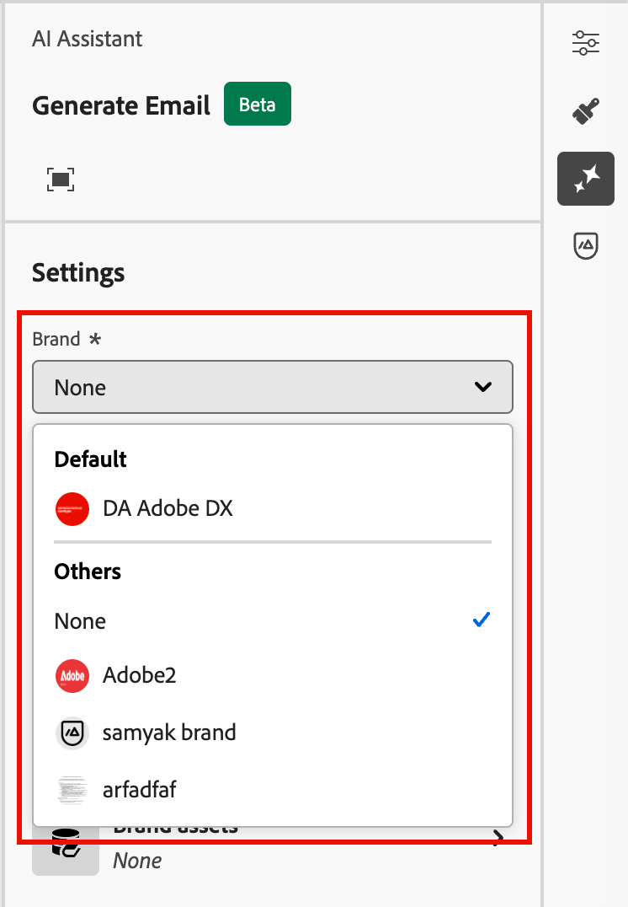{width="300"}

## Brand definitions

The brand definitions are organized into three categories, displayed as tabs. Select each tab to complete and update the brand guidelines.

### 關於品牌 {#about-brand}

Use the **[!UICONTROL About the brand]** tab to establish the core identity of your brand. This information outlines its purpose, personality, tagline, and other high-level attributes.

1. Add the foundational information for your brand in the **[!UICONTROL Key details]** category:

   * **[!UICONTROL Brand kit name]** - Update the brand name.

   * **[!UICONTROL When to use]** - Specify scenarios or contexts where this brand should be applied.

   * **[!UICONTROL Brand name]** - Enter the official name of the brand.

   * **[!UICONTROL Description of this brand]** - Provide an overview of what this brand represents.

   * **[!UICONTROL Tagline (Default)]** - Add the primary tagline associated with the brand.

   {width="600" zoomable="yes"}

1. In the **[!UICONTROL Guiding principles]** category, clarify the core direction and philosophy of your brand:

   * **[!UICONTROL Mission]** - Detail the brand purpose.

   * **[!UICONTROL Vision]** - Describe the long-term goal or desired future state.

   * **[!UICONTROL Market positioning]** - Explain how the brand is positioned in the market.

   {width="600" zoomable="yes"}

   From the **[!UICONTROL Core brand values]** category, review the defined brand values and adjust them as needed.

   * To define a new core value, click the _Add_ (  ) icon on the right and complete the details:

     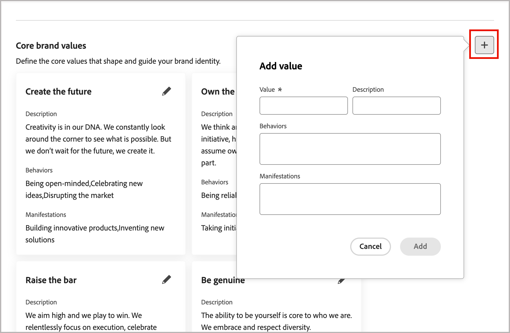{width="500" zoomable="yes"}

      * **[!UICONTROL Value]** - Enter the name for the core brand value.

      * **[!UICONTROL Description]** - Explain what this value means to your brand.

      * **[!UICONTROL Behaviors]** - Outline the actions or attitudes that reflect this value in practice.

      * **[!UICONTROL Manifestations]** - Provide examples of how this value is expressed in real-world branding.

   * To change or delete a core value, click the _Edit_ (  ) icon to update or delete a core brand value.

     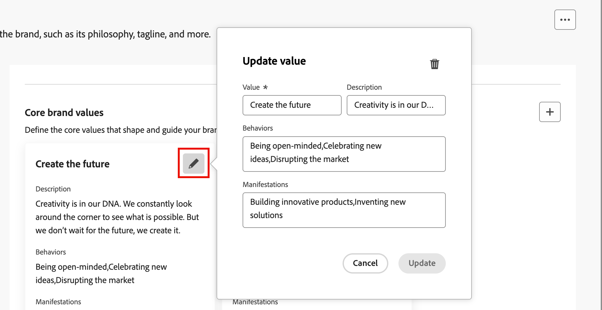{width="500" zoomable="yes"}

     Change the details and click **[!UICONTROL Update]**. Or, click the _Delete_ (  ) icon at the top to remove the core value.

1. In the **[!UICONTROL Brand guidelines documents]** category, review the documents used to generate the brand guidelines.

   Click the More menu icon and choose an option to update the brand guidelines using uploaded reference documents:

   * **[!UICONTROL Re-extract guidelines]** - Choose this action to run an extraction job using the current documents.
   * **[!UICONTROL Add reference for extraction]** - Choose this action to upload another document and run an extraction job.

   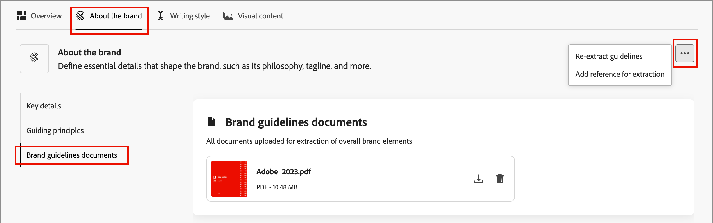{width="600" zoomable="yes"}

You can proceed to refine the [writing style](#writing-style) or [visual content](#visual-content) guidelines, exclusions, and examples, or you can [publish your brand](#publish-the-brand).

### 寫作風格 {#writing-style}

>[!CONTEXTUALHELP]
>id="ajo_brand_writing_style"
>title="寫作風格一致性分數"
>abstract="寫作風格區段會定義語言、格式及結構的標準，以確保內容清晰且一致。 一致性分數從高至低評分，會顯示您的內容對這些準則的遵循程度，並醒目提示需要改善的區域。"

The _[!UICONTROL Writing style]_ definitions outline the standards for writing content, and details how language, formatting, and structure should be used to maintain clarity, coherence, and consistency across all materials.

Select the **[!UICONTROL Writing Style]** tab, and review each category.

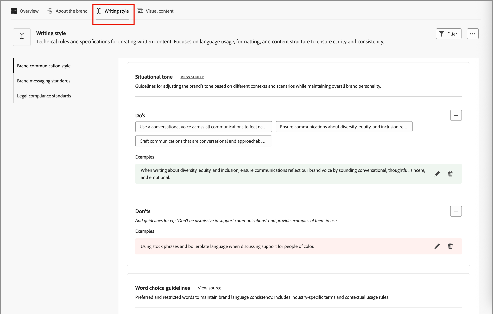{width="600" zoomable="yes"}

| 類別 | 子類別 | 指引範例 | 排除專案範例 |
|----------------------------|----------------|-----------------------|-----------------------|
| [!UICONTROL Brand communication style] | [!UICONTROL Brand Personality Traits] | 親切易懂。 | 不要失敗。 |
|                            | [!UICONTROL Writing Mechanics] | 讓句子儘量簡短並有影響力。 | 不要使用過多的行話。 |
|                            | [!UICONTROL Situational Tone] | 維持危機溝通的專業語調。 | 支援通訊時請勿不屑一顧。 |
|                            | [!UICONTROL Word Choice Guidelines] | Use words like _innovative_ and _smart_. | Avoid words like _cheap_ or _hack_. |
|                            | [!UICONTROL Language Standards] | 遵循美式英文慣例。 | 請勿混合使用英式及美式拼字。 |
| [!UICONTROL Brand messaging standards] | [!UICONTROL Brand messaging standards] | 強調創新和客戶至上的訊息。 | 請勿過度承諾產品功能。 |
|                            | [!UICONTROL Tagline usage] | 在所有數位行銷資產的標誌下方放置標語。 | 請勿修改或翻譯標語。 |
|                            | [!UICONTROL 核心訊息] | 強調主要優勢陳述，例如提高生產力。 | 請勿使用不相關的值主張。 |
|                            | [!UICONTROL 命名標準] | 使用簡單的描述性名稱，例如&#x200B;_ProScheduler_。 | 請勿使用複雜字元或特殊字元。 |
| [!UICONTROL 法規遵循標準] | [!UICONTROL 商標標準] | 請一律使用™或®符號。 | 必要時，請勿省略法定符號。 |
|                            | [!UICONTROL 版權標準] | 在行銷資料中加入版權注意事項。 | 未經許可請勿使用協力廠商內容。 |
|                            | [!UICONTROL 免責宣告標準] | 在數位資產上清楚顯示免責宣告。 | 請勿隱藏隱藏隱藏隱藏隱藏區域的免責宣告。 |

<!-- #### Preferred and avoided terms

Supplement your work choice guidelines by adding preferred and avoided terms. 

#### Primary tagline and variations

#### Brand names and variations

#### Approved and restricted statements
-->

### 視覺內容 {#visual-content}

>[!CONTEXTUALHELP]
>id="ajo-b2b_brand_imagery"
>title="視覺內容一致性分數"
>abstract="視覺內容一致性分數表示您的內容與設定之品牌準則的符合程度。 從高至低的評分可協助您總覽評估一致性。 探索不同的類別可找出需要改善的區域，並找出可能不符合品牌的元素。"

_[!UICONTROL 視覺內容]_&#x200B;定義概述影像和設計標準，並詳細說明維持統一一致的品牌外觀所需的規格。

選取&#x200B;**[!UICONTROL 視覺內容]**&#x200B;標籤，並檢閱每個類別。

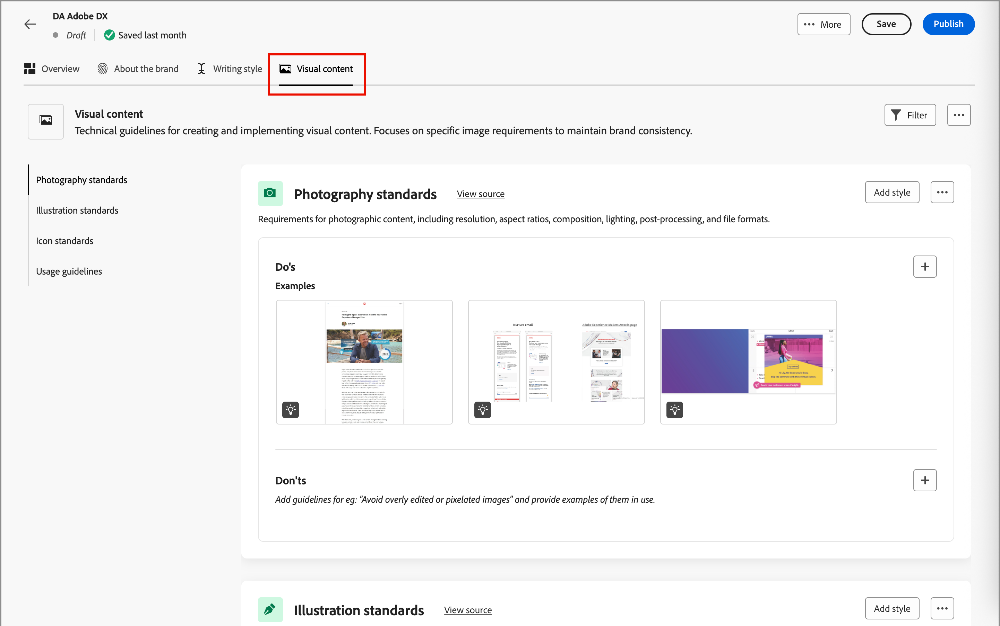{width="600" zoomable="yes"}

| 類別 | 准則範例 | 排除專案範例 |
|------------------------|---------------------|---------------------|
| [!UICONTROL 攝影標準] | 戶外鏡頭使用自然光線。 | 避免過度編輯或畫素化的影像。 |
| [!UICONTROL 插圖示準] | 使用簡潔的極簡風格。 | 避免過於複雜。 |
| [!UICONTROL 圖示標準] | 使用一致的24px格線系統。 | 請勿混合圖示尺寸、使用不一致的線條粗細，或偏離格線規則。 |
| [!UICONTROL 使用指南] | 選擇反映真實客戶在專業環境中使用該產品的生活方式影像。 | 請勿使用與品牌色調相抵觸或看起來與內容不符的影像。 |

<!-- #### Styles

To define the overall style for the category, click **[!UICONTROL Add style]**. In the popup dialog, enter the style type and description. 

{width="500" zoomable="yes"}

#### Specifications

-->

#### 影像範例

若要新增顯示正確或不正確使用方式的影像，請在&#x200B;_[!UICONTROL 新增指引]_&#x200B;或&#x200B;_[!UICONTROL 新增排除專案]_&#x200B;快顯對話方塊中選擇&#x200B;**[!UICONTROL 範例]**。 按一下&#x200B;**[!UICONTROL 選取影像]**，從您的系統選擇與影像檔案。 按一下&#x200B;**[!UICONTROL 新增]**&#x200B;以上傳影像並顯示區域的縮圖。

{width="500" zoomable="yes"}

## 編輯已發佈的品牌

您無法修改已發佈的（即時）品牌，但您可以建立草稿復本以編輯。 當您使用編輯內容發佈草稿時，該版本會取代即時版本。

1. 開啟品牌頁面，然後按一下右上方的&#x200B;**[!UICONTROL 編輯品牌]**。

1. 在確認對話方塊中，按一下&#x200B;**[!UICONTROL 編輯品牌]**。

   此動作會建立品牌的草稿復本。

1. 瀏覽不同的標籤，視需要更新品牌資訊。

   * 概觀

   * [關於品牌](#about-the-brand)

   * [寫作風格](#writing-style)

   * [視覺內容](#visual-content)

1. 按一下&#x200B;**[!UICONTROL 儲存]**&#x200B;處理草稿更新時，然後按一下&#x200B;**[!UICONTROL 發佈]** （當您準備好要取代&#x200B;_即時_&#x200B;版本）。
