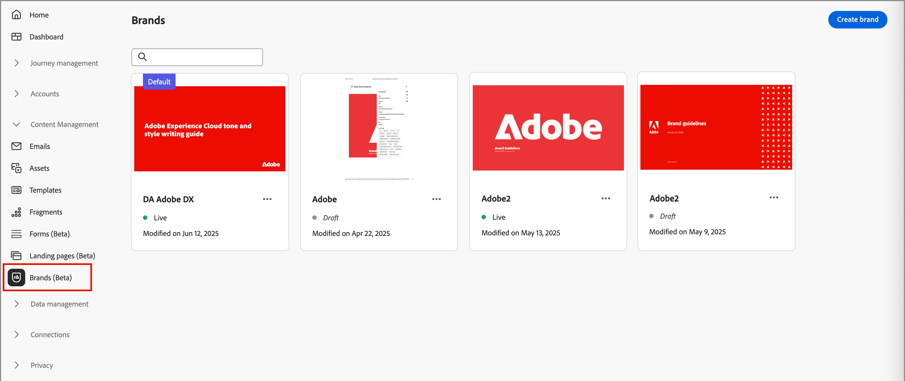

# 建立並管理您的品牌 {#brand-library}

定義品牌以提供建立視覺和語言識別的規則和標準詳細集合。 這些指引提供跨所有行銷和通訊平台維持一致品牌代表性的參考。 運用定義清晰的品牌指引，組織可確保所有內容建立的努力都與策略目標和整體品牌認同一致。 這種一致性不僅可提升品牌認知度和信任度，也有助於在所有接觸點提供更具凝聚力和影響力的客戶體驗。

在Journey Optimizer B2B edition中，您可以手動定義並組織您的品牌定義和資產，或上傳品牌指引檔案以自動擷取資訊和視覺資產。

>[!AVAILABILITY]
>
>此功能目前以私人測試版的形式提供，並計畫在未來版本中逐步提供給所有客戶。
>
> 
>
>您必須先取得[使用者合約](https://www.adobe.com/tw/legal/licenses-terms/adobe-dx-gen-ai-user-guidelines.html){target="_blank"}，才能在Adobe Journey Optimizer B2B edition中使用AI支援的功能。 如需詳細資訊，請聯絡您的 Adobe 代表。
>
> 
>
>如需有關產品管理員如何啟用這些功能的資訊，請參閱[品牌相關許可權](./brands-overview.md#brand-related-permissions)。

## 存取您的品牌資料庫

若要存取Adobe Journey Optimizer B2B edition中的品牌套件，請前往左側導覽並按一下&#x200B;**[!UICONTROL 內容管理]** > **[!UICONTROL 品牌]**。 此動作會開啟一個頁面，其中建立的品牌會顯示為卡片。

{width="800" zoomable="yes"}

如果尚未建立任何品牌，則會顯示單一圖形，其中包含用於[建立您的第一個品牌](#create-and-define-a-brand)的按鈕。

### 品牌管理動作

對於每個卡片，您可以按一下&#x200B;_更多功能表_ （ ）圖示，並為品牌選擇動作：

* **[!UICONTROL 檢視品牌]** — 開啟品牌頁面並顯示定義。
* **[!UICONTROL 標籤為預設品牌]** （僅限上線） - [將品牌標籤為預設品牌](#default-brand)，以進行內容對齊和產生。
* **[!UICONTROL 編輯]** — 開啟品牌頁面，並編輯品牌准則、排除專案和範例。
* **[!UICONTROL 複製]** — 建立復本作為新的草稿品牌。
* **[!UICONTROL 發佈]** （僅限草稿） - [發佈品牌](#publish-the-brand)，使其可用於內容對齊和產生。
* **[!UICONTROL 取消發佈]** （僅供上線） — 取消發佈品牌以將其從內容對齊和產生的使用中移除。
* **[!UICONTROL 刪除]** — 從您的品牌庫中移除品牌。

![存取品牌的[更多]功能表](./assets/brands-library-card-more-menu.png){width="440"}

### 預設品牌

您可以指定預設品牌，以便在內容建立期間產生內容並計算一致性分數時自動套用。 只能預設已發佈（_即時_）品牌。

在品牌資料庫中，預設品牌卡會顯示旗標。

{width="200"}

您可以將任何已發佈的（_即時_）品牌設定為預設品牌。 在品牌卡上，按一下&#x200B;_更多功能表_ （ ）圖示，然後選擇&#x200B;**[!UICONTROL 標示為預設品牌]**。

{width="350"}

## 建立和定義品牌 {#create-brand}

>[!CONTEXTUALHELP]
>id="ajo-b2b_brands_create"
>title="建立您的品牌"
>abstract="輸入您的品牌名稱，並上傳您的品牌準則檔案。此工具會自動擷取重要詳細資訊，讓您更輕鬆維護品牌識別。"

若要建立及定義您的品牌指引，您可以輸入詳細資料或上傳您的品牌指引檔案，以用於自動擷取。

### 新增品牌

1. 在&#x200B;_[!UICONTROL 品牌]_&#x200B;頁面的右上角，按一下&#x200B;**[!UICONTROL 建立品牌]**。

1. 輸入您品牌的&#x200B;**[!UICONTROL 名稱]**。

1. 拖放或選取您的檔案，以上傳您的品牌指引，並自動擷取相關的品牌資訊。

   {width="500"}

   >[!NOTE]
   >
   >如果您尚未以PDF格式儲存檔案，可在品牌建立後手動新增指引並上傳個別視覺資產。

1. 按一下&#x200B;**[!UICONTROL 建立品牌]**。

   如果您加入一或多個檔案來建立品牌，資訊擷取程式就會開始。 這可能需要幾分鐘才能完成。

   提取程式完成後，系統會自動填入您的內容和視覺化建立標準。

   {width="700" zoomable="yes"}

### 調整並更新品牌指引

1. 瀏覽不同的標籤，視需要調整並定義更詳細的資訊。

   * [!UICONTROL 概觀]

   * [[!UICONTROL 關於品牌]](#about-the-brand)

   * [[!UICONTROL 寫入樣式]](#writing-style)

   * [[!UICONTROL 視覺內容]](#visual-content)

   如果您在建立品牌時包含一或多個檔案，資訊擷取程式會建立標籤和區段的定義。 完整性取決於任何檔案中包含的範圍和詳細資訊。 檢閱結果時，您可以變更或移除任何資訊。

   從每個索引標籤或類別的&#x200B;_更多功能表_ （ ），您可以新增檔案以自動擷取相關品牌資訊。 您也可以清除現有內容。

   {width="500" zoomable="yes"}

   如果您要檢閱子區段中擷取資訊的來源，請按一下&#x200B;**[!UICONTROL 檢視來源]**&#x200B;連結。

   {width="700" zoomable="yes"}

1. 在每個詳細資訊索引標籤中，檢閱類別並透過新增、移除和變更定義來改善品牌。

   標示為&#x200B;**[!UICONTROL Do&#39;s]**&#x200B;的子區段概述類別的准則。 使用此區域新增指引的說明和範例。

   {width="500" zoomable="yes"}

   標示為&#x200B;**[!UICONTROL Don&#39;s]**&#x200B;的子區段概述排除專案。 使用此區域新增排除專案的說明和範例。

   {width="500" zoomable="yes"}

   * **新增指引或排除專案**。

     在您想要新增指引的區段中，按一下右側的&#x200B;_新增_ （  ）圖示。 在快顯對話方塊中，輸入指引並選取核取方塊，以指定該指引適用的管道和元素。 然後，按一下&#x200B;**[!UICONTROL 新增]**。

     {width="600" zoomable="yes"}

   * **變更指引或排除專案**。

     在您想要移除指引的區段中，按一下指引Widget。 在快顯對話方塊中，視需要變更指引的內容及選取的核取方塊。 然後，按一下&#x200B;**[!UICONTROL 更新]**。

     {width="600" zoomable="yes"}

   * **移除指引或排除專案**。

     在您想要移除指引的區段中，按一下指引Widget。 在快顯視窗對話方塊中，按一下頂端的&#x200B;_刪除_ （  ）圖示。

   * **新增或修訂您的指引和排除專案的範例**。

     在顯示的範例圖磚中，按一下&#x200B;_編輯_ （ ）以變更範例，或按一下&#x200B;_刪除_ （ ）圖示以移除範例。

1. 定義好所有專案後，按一下&#x200B;**[!UICONTROL 儲存]**。

   您可以繼續變更草稿品牌，直到決定準備好發佈為止。

### 發佈品牌

當您的品牌包含完整的定義集並符合您的需求時，請按一下[發佈] ****，讓您的品牌指引可用於內容對齊與產生。

已發佈的品牌可從AI **[!UICONTROL 品牌一致性]**&#x200B;和內容產生工具中的[品牌](./brand-alignment.md)選項存取。<!-- [Learn more about content generation](gs-generative.md) -->

內容的{width="300"}

## 品牌定義

品牌定義會組織為三個類別，以標籤顯示。 選取每個標籤以完成和更新品牌指引。

### 關於品牌 {#about-brand}

使用&#x200B;**[!UICONTROL 關於品牌]**&#x200B;標籤來建立品牌的核心識別。 此資訊概述其目的、個性、標語和其他高階屬性。

1. 在&#x200B;**[!UICONTROL 關鍵詳細資料]**&#x200B;類別中新增品牌的基本資訊：

   * **[!UICONTROL 品牌套件名稱]** — 更新品牌名稱。

   * **[!UICONTROL 何時使用]** — 指定應套用此品牌的案例或內容。

   * **[!UICONTROL 品牌名稱]** — 輸入品牌的正式名稱。

   * **[!UICONTROL 此品牌的描述]** — 提供此品牌代表的概觀。

   * **[!UICONTROL 標語（預設）]** — 新增與品牌相關聯的主要標語。

   {width="600" zoomable="yes"}

1. 在&#x200B;**[!UICONTROL 指導原則]**&#x200B;類別中，請釐清品牌的核心方向與理念：

   * **[!UICONTROL 任務]** — 詳細描述品牌用途。

   * **[!UICONTROL 願景]** — 說明長期目標或想要的未來狀態。

   * **[!UICONTROL 市場定位]** — 說明品牌在市場中的定位。

   {width="600" zoomable="yes"}

   從&#x200B;**[!UICONTROL 核心品牌值]**&#x200B;類別，檢閱定義的品牌值，並視需要加以調整。

   * 若要定義新的核心值，請按一下右側的&#x200B;_新增_ （  ）圖示，並完成詳細資料：

     {width="500" zoomable="yes"}

      * **[!UICONTROL 值]** — 輸入核心品牌值的名稱。

      * **[!UICONTROL 描述]** — 說明這個值對您品牌的意義。

      * **[!UICONTROL 行為]** — 概述實際中反映此值的動作或態度。

      * **[!UICONTROL 表現]** — 提供這個值在真實世界品牌中如何表示的範例。

   * 若要變更或刪除核心值，請按一下&#x200B;_編輯_ （  ）圖示，以更新或刪除核心品牌值。

     {width="500" zoomable="yes"}

     變更詳細資料，然後按一下&#x200B;**[!UICONTROL 更新]**。 或者，按一下頂端的&#x200B;_刪除_ （ ）圖示以移除核心值。

1. 在&#x200B;**[!UICONTROL 品牌指引檔案]**&#x200B;類別中，檢閱用來產生品牌指引的檔案。

   按一下「更多」選單圖示，然後選擇選項以使用上傳的參考檔案更新品牌指引：

   * **[!UICONTROL 重新擷取准則]** — 選擇此動作以使用目前檔案執行擷取工作。
   * **[!UICONTROL 新增擷取的參考]** — 選擇此動作可上傳其他檔案並執行擷取工作。

   {width="600" zoomable="yes"}

您可以繼續調整[撰寫樣式](#writing-style)或[視覺內容](#visual-content)指南、排除專案和範例，或是[發佈您的品牌](#publish-the-brand)。

### 寫作風格 {#writing-style}

>[!CONTEXTUALHELP]
>id="ajo_brand_writing_style"
>title="寫作風格一致性分數"
>abstract="寫作風格區段會定義語言、格式及結構的標準，以確保內容清晰且一致。一致性分數從高至低評分，會顯示您的內容對這些準則的遵循程度，並醒目提示需要改善的區域。"

_[!UICONTROL 撰寫樣式]_&#x200B;定義概述撰寫內容的標準，並詳細說明應如何使用語言、格式和結構來維持所有資料的清晰度、一致性和一致性。

選取&#x200B;**[!UICONTROL 寫入樣式]**&#x200B;索引標籤，並檢閱每個類別。

{width="600" zoomable="yes"}

| 類別 | 子類別 | 指引範例 | 排除專案範例 |
|----------------------------|----------------|-----------------------|-----------------------|
| [!UICONTROL 品牌通訊樣式] | [!UICONTROL 品牌個人特徵] | 親切易懂。 | 不要失敗。 |
|                            | [!UICONTROL 正在寫入機制] | 讓句子儘量簡短並有影響力。 | 不要使用過多的行話。 |
|                            | [!UICONTROL 情境色調] | 維持危機溝通的專業語調。 | 支援通訊時請勿不屑一顧。 |
|                            | [!UICONTROL Word選擇指南] | 使用&#x200B;_創新_&#x200B;和&#x200B;_智慧_&#x200B;之類的文字。 | 避免使用&#x200B;_便宜_&#x200B;或&#x200B;_駭客_&#x200B;之類的字詞。 |
|                            | [!UICONTROL 語言標準] | 遵循美式英文慣例。 | 請勿混合使用英式及美式拼字。 |
| [!UICONTROL 品牌訊息標準] | [!UICONTROL 品牌訊息標準] | 強調創新和客戶至上的訊息。 | 請勿過度承諾產品功能。 |
|                            | [!UICONTROL 標語使用方式] | 在所有數位行銷資產的標誌下方放置標語。 | 請勿修改或翻譯標語。 |
|                            | [!UICONTROL 核心訊息] | 強調主要優勢陳述，例如提高生產力。 | 請勿使用不相關的值主張。 |
|                            | [!UICONTROL 命名標準] | 使用簡單的描述性名稱，例如&#x200B;_ProScheduler_。 | 請勿使用複雜字元或特殊字元。 |
| [!UICONTROL 法律規範標準] | [!UICONTROL 商標標準] | 請一律使用™或®符號。 | 必要時，請勿省略法定符號。 |
|                            | [!UICONTROL 版權標準] | 在行銷資料中加入版權注意事項。 | 未經許可請勿使用協力廠商內容。 |
|                            | [!UICONTROL 免責宣告標準] | 在數位資產上清楚顯示免責宣告。 | 請勿隱藏隱藏隱藏隱藏隱藏區域的免責宣告。 |

<!-- #### Preferred and avoided terms

Supplement your work choice guidelines by adding preferred and avoided terms. 

#### Primary tagline and variations

#### Brand names and variations

#### Approved and restricted statements
-->

### 視覺內容 {#visual-content}

>[!CONTEXTUALHELP]
>id="ajo-b2b_brand_imagery"
>title="視覺內容一致性分數"
>abstract="視覺內容一致性分數表示您的內容與設定之品牌準則的符合程度。從高至低的評分可協助您總覽評估一致性。探索不同的類別可找出需要改善的區域，並找出可能不符合品牌的元素。"

_[!UICONTROL 視覺內容]_&#x200B;定義概述影像和設計標準，並詳細說明維持統一一致的品牌外觀所需的規格。

選取&#x200B;**[!UICONTROL 視覺內容]**&#x200B;標籤，並檢閱每個類別。

{width="600" zoomable="yes"}

| 類別 | 准則範例 | 排除專案範例 |
|------------------------|---------------------|---------------------|
| [!UICONTROL 攝影標準] | 戶外鏡頭使用自然光線。 | 避免過度編輯或畫素化的影像。 |
| [!UICONTROL 插圖示準] | 使用簡潔的極簡風格。 | 避免過於複雜。 |
| [!UICONTROL 圖示標準] | 使用一致的24px格線系統。 | 請勿混合圖示尺寸、使用不一致的線條粗細，或偏離格線規則。 |
| [!UICONTROL 使用准則] | 選擇反映真實客戶在專業環境中使用該產品的生活方式影像。 | 請勿使用與品牌色調相抵觸或看起來與內容不符的影像。 |

<!-- #### Styles

To define the overall style for the category, click **[!UICONTROL Add style]**. In the popup dialog, enter the style type and description. 

{width="500" zoomable="yes"}

#### Specifications

-->

#### 影像範例

若要新增顯示正確或不正確使用方式的影像，請在&#x200B;**[!UICONTROL 新增指引]**&#x200B;或&#x200B;_[!UICONTROL 新增排除專案]_&#x200B;快顯對話方塊中選擇&#x200B;_[!UICONTROL 範例]_。 按一下&#x200B;**[!UICONTROL 選取影像]**，從您的系統選擇影像檔案。 按一下&#x200B;**[!UICONTROL [新增]**]上傳影像並顯示區域的縮圖。

{width="500" zoomable="yes"}

## 編輯已發佈的品牌

您無法修改已發佈的（即時）品牌，但您可以建立草稿復本以編輯。 當您使用編輯內容發佈草稿時，該版本會取代即時版本。

1. 開啟品牌頁面，然後按一下右上方的&#x200B;**[!UICONTROL 編輯品牌]**。

1. 在確認對話方塊中，按一下&#x200B;**[!UICONTROL 編輯品牌]**。

   此動作會建立品牌的草稿復本。

1. 瀏覽不同的標籤，視需要更新品牌資訊。

   * 概觀

   * [關於品牌](#about-the-brand)

   * [寫作風格](#writing-style)

   * [視覺內容](#visual-content)

1. 使用草稿更新時，請按一下[儲存]。****，然後在準備取代&#x200B;**[!UICONTROL [即時]]**&#x200B;版本時，按一下[發佈]。__
