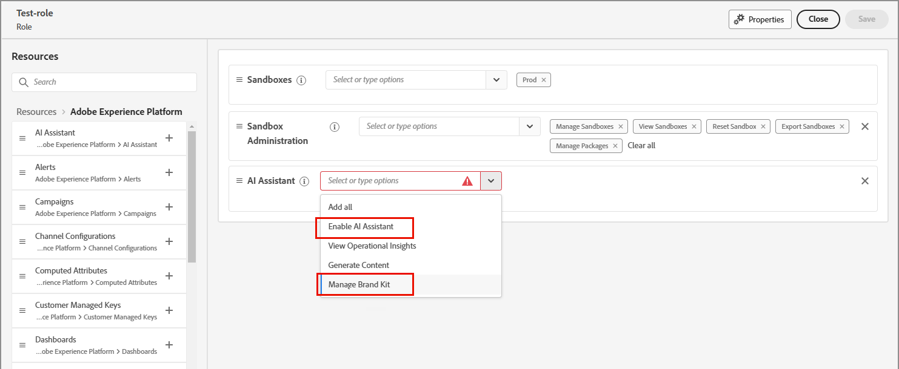

# 使用品牌來產生內容並維持一致性 {#brands}

>[!CONTEXTUALHELP]
>id="ajo-b2b_brand_overview"
>title="開始使用品牌"
>abstract="建立並自訂您的品牌來定義您獨特的視覺和語言識別，同時更輕鬆地產生與您品牌風格和語調相符的內容。"

>[!CONTEXTUALHELP]
>id="ajo-b2b_brand_ai_menu"
>title="選取您的品牌"
>abstract="選擇您的品牌，以確保所有 AI 產生的內容都是量身打造，符合您品牌的規格和準則。"

品牌有助於定義您的&#x200B;_品牌識別_，並在確保建立一致且有效的內容以準確代表您的品牌識別、價值和傳訊方面扮演重要角色。 透過遵循明確界定的品牌樣式，組織可以跨管道和接觸點維持一致和可辨識的品牌影響力，並強化其在目標受眾中的品牌認知度、信任度和忠誠度。

+++使用品牌的好處

您的組織可以透過在建立和評估內容中使用品牌來實現重大價值，例如：

* **一致的品牌識別** — 品牌指引是視覺和語言識別的基本藍圖。 它們定義讓品牌可辨識的核心元素，例如標誌、調色盤、印刷樣式、影像樣式和語調。 透過遵循這些准則，內容創作者可確保從網頁文案、社群媒體貼文到電子郵件行銷活動的所有行銷資料持續反映獨特的品牌個性和視覺識別。 這種一致性有助於加強品牌認知度，並在目標市場內建立信任。

* **一致的訊息和定位** — 品牌指引通常包含概述品牌價值主張、關鍵訊息支柱和定位宣告的訊息指引。 遵循這些方針，內容創作者就能確保其內容中的訊息符合整體品牌定位和價值主張。 這種訊息的一致性有助於強化其獨特的賣點和差異點，讓客戶更容易瞭解並連結品牌產品。

* **真實品牌語調和語調** — 品牌指引通常包含對語調、溝通風格和語言使用的詳細指引。 這些指引可協助內容創作者捕捉品牌個性，並打造正確的語調，不論是友好平易近人、專業且權威，或是有趣且機智。 在所有內容上維持一致的品牌語調，有助於為客戶提供更真實、更吸引人的品牌體驗。

* **視覺內聚力與品牌認知度** — 品牌指引為視覺元素（例如圖志、調色盤、印刷樣式、影像樣式和版面範本）提供清晰的規則和規格。 遵循這些准則可確保所有視覺內容保持一致和可識別的品牌美感。 這種視覺一致性有助於加強品牌認知度並與客戶建立信任，因為他們可以輕鬆識別內容並將內容與品牌建立關聯。

* **品牌權益與信譽維護** — 持續遵守品牌准則有助於維護和保護品牌的權益與聲譽。 當所有內容和行銷資料都準確地反映品牌識別、價值和訊息時，就會加強品牌可信度並鞏固其在市場中的地位。 這種公平性和聲譽可導致提高客戶忠誠度和宣傳活動，最終為品牌的長期成功做出貢獻。

+++

>[!AVAILABILITY]
>
>此功能目前以私人測試版的形式提供，並計畫在未來版本中逐步提供給所有客戶。
>
>您必須先取得[使用者合約](https://www.adobe.com/tw/legal/licenses-terms/adobe-dx-gen-ai-user-guidelines.html){target="_blank"}，才能在Adobe Journey Optimizer B2B edition中使用AI支援的功能。 如需詳細資訊，請聯絡您的 Adobe 代表。

已定義的品牌可為您的創意團隊提供當他們建立任何視覺或書面內容時使用的&#x200B;_真實來源_。 編譯這些准則並共用品牌資產時，任何團隊成員或共同作業人員都可以為您的產品建立品牌上內容。 若要在Journey Optimizer B2B edition中啟用品牌內內容建立，請完成下列工作：

1. 準備您的品牌定義。

   * 高階品牌特性
   * 寫作風格
   * 視覺元素

1. 在一個或多個PDF檔案中組合此資訊。

1. 使用PDF檔案在Journey Optimizer B2B edition中[建立品牌](./brands-manage-create.md#create-and-define-a-brand)。

1. 當它可以使用時，[發佈品牌](./brands-manage-create.md#publish-the-brand)。

1. 使用品牌進行[電子郵件內容對齊](./brand-alignment.md)。
<!-- 
1. Use the brand to generate content. -->

>[!BEGINSHADEBOX]

## 品牌相關許可權

產品管理員可以透過在Adobe Experience Cloud中透過&#x200B;**[!UICONTROL 許可權]** UI指派&#x200B;**[!UICONTROL 管理品牌套件]**&#x200B;或&#x200B;_啟用AI小幫手_&#x200B;資源許可權，來啟用品牌管理和品牌對齊功能的存取權。

1. 在許可權應用程式中，移至&#x200B;**[!UICONTROL 角色]**&#x200B;標籤，並選取所需的[角色](https://experienceleague.adobe.com/zh-hant/docs/experience-platform/access-control/abac/permissions-ui/roles){target="_blank"}。

1. 按一下&#x200B;**[!UICONTROL 編輯]**&#x200B;以修改權限。

1. 新增&#x200B;**[!UICONTROL AI小幫手]**&#x200B;資源，然後選取&#x200B;**[!UICONTROL 管理品牌套件]**&#x200B;或&#x200B;**[!UICONTROL 啟用AI小幫手]**

   >[!NOTE]
   >
   >**[!UICONTROL 啟用Ai小幫手]**&#x200B;許可權提供&#x200B;**[!UICONTROL 品牌]**&#x200B;資料庫的唯讀存取權。

   {width="700" zoomable="yes"}

1. 按一下[儲存]以套用變更。**&#x200B;**

   已指派給該角色的任何使用者的許可權都會自動更新。

1. 若要將此角色指派給新使用者，請選取&#x200B;**[!UICONTROL 角色]**&#x200B;儀表板中的&#x200B;_[!UICONTROL 使用者]_&#x200B;索引標籤，然後按一下&#x200B;**[!UICONTROL 新增使用者]**。

   * 輸入使用者名稱和電子郵件地址，或從清單中選擇現有使用者。

     如果尚未建立使用者，請參閱[Experience Platform檔案](https://experienceleague.adobe.com/zh-hant/docs/experience-platform/access-control/abac/permissions-ui/users){target="_blank"}。

   * 按一下[儲存]以套用變更。**&#x200B;**

>[!ENDSHADEBOX]
