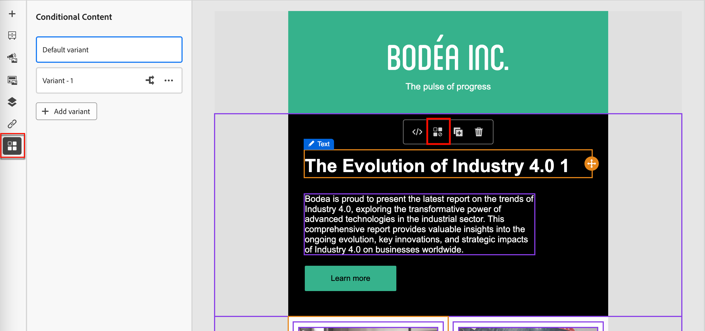
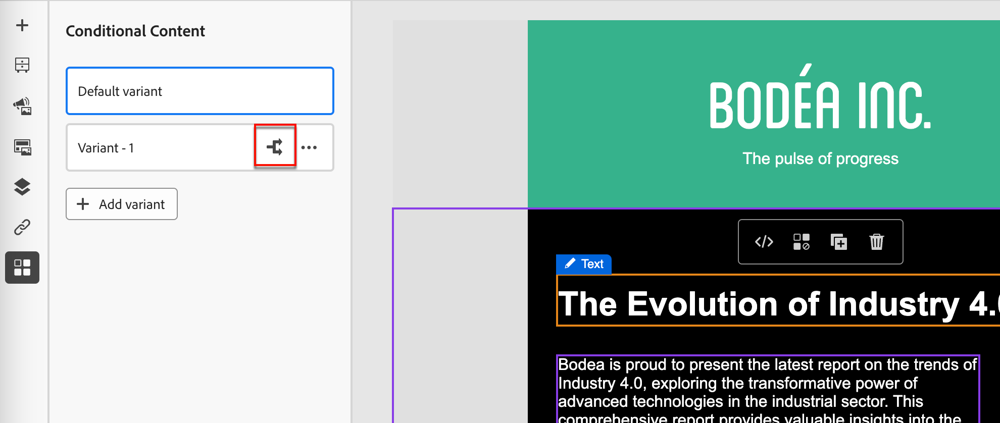
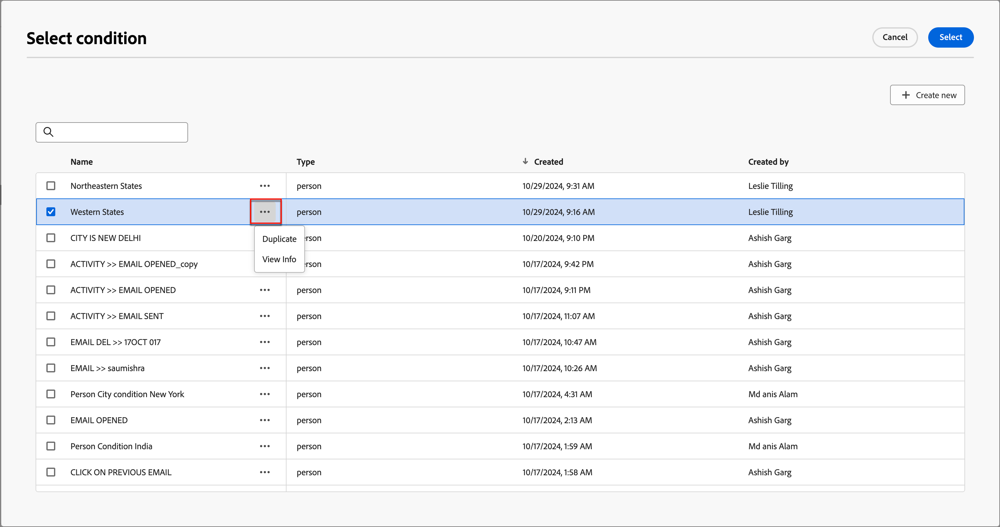
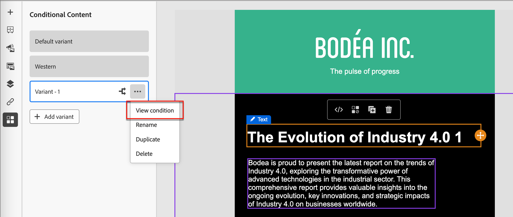
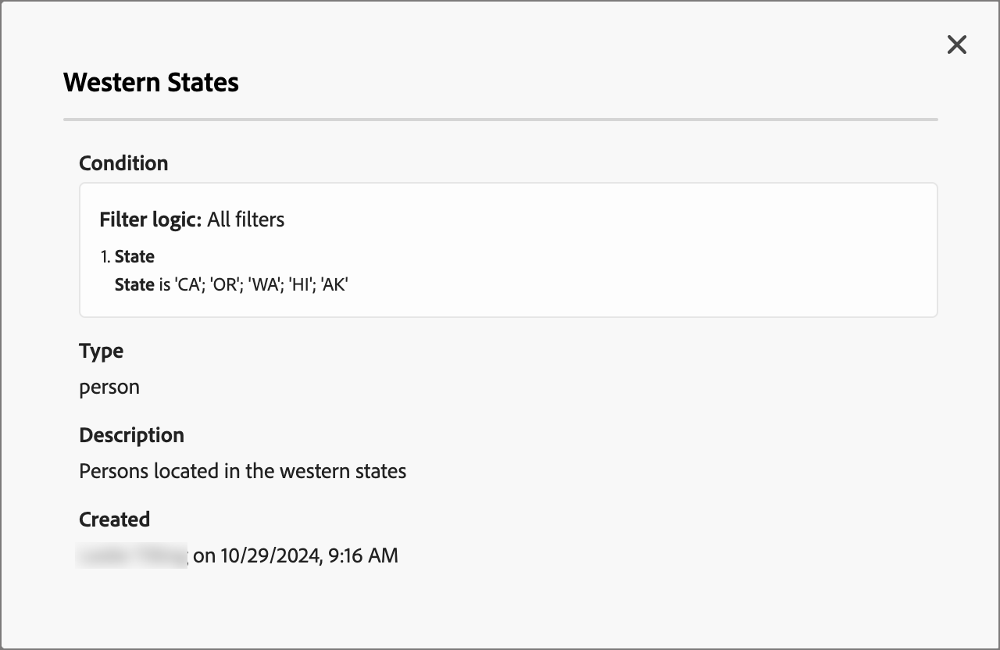
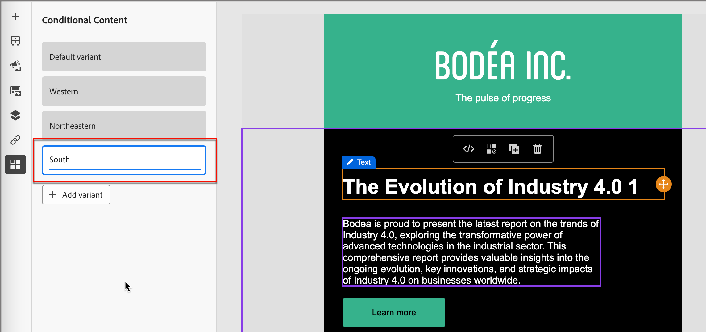
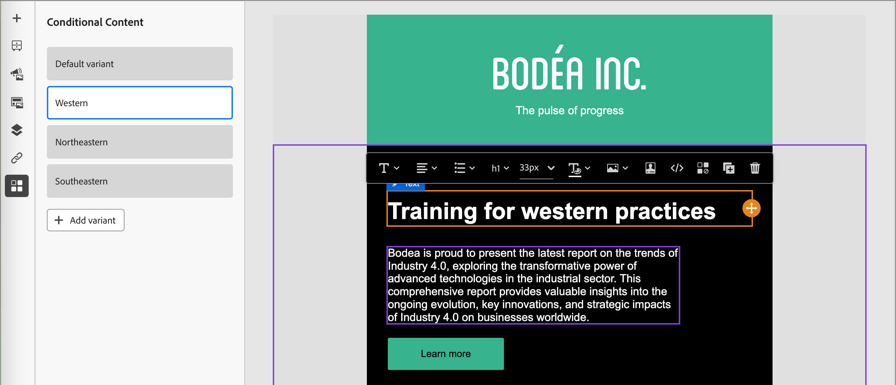
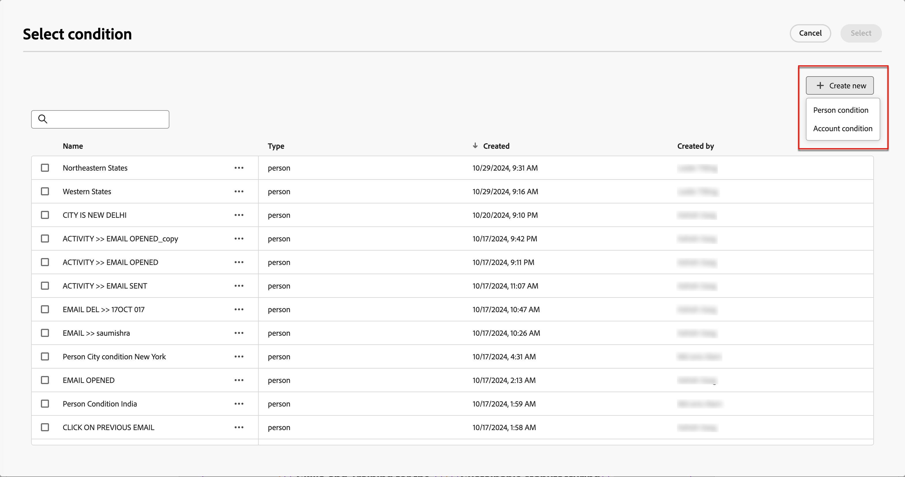
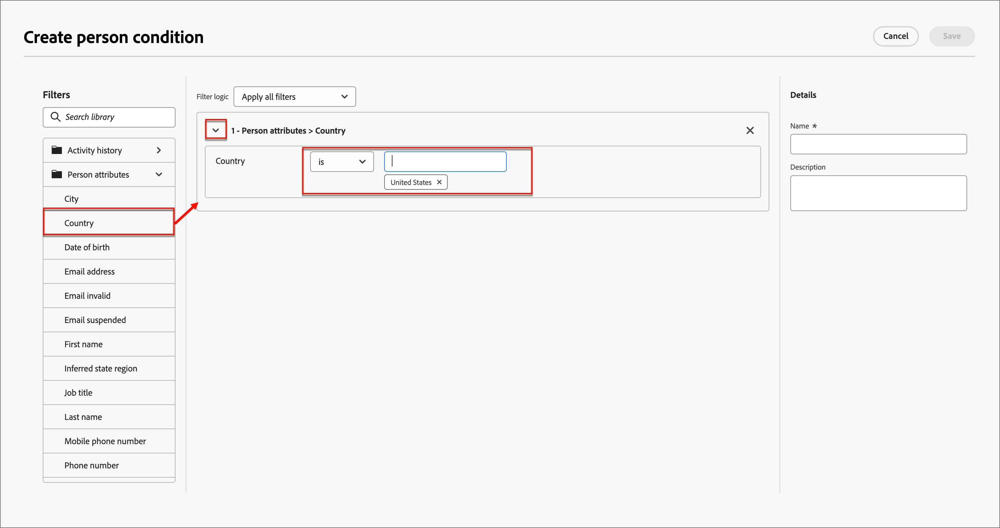
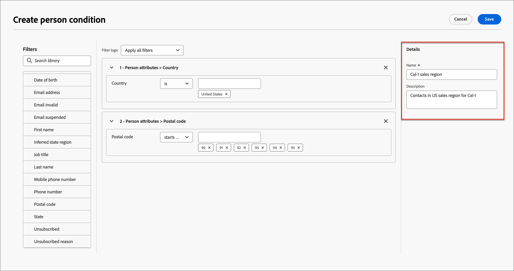

# 條件式內容

條件內容可讓您根據條件規則調整電子郵件和片段內容。 這些規則是使用設定檔屬性或內容事件定義的。 您可以在規則產生器中建立條件式規則，並將規則儲存起來，以便在您的帳戶歷程中重複使用。

若要新增條件式內容至您的片段與電子郵件訊息，Adobe Journey Optimizer可讓您套用儲存在&#x200B;_條件_&#x200B;資料庫中的條件式規則。 當您為帳戶歷程[或](./email-authoring.md)視覺片段[編寫](./fragment-authoring.md)電子郵件內容時，在視覺設計空間內套用條件規則。

## 新增條件式內容 {#email-fragment-content}

>[!CONTEXTUALHELP]
>id="ajo-b2b_conditional_content"
>title="條件式內容"
>abstract="使用條件式規則建立內容元件的多個變體。如果傳送訊息時未符合任何條件，會顯示預設變體的內容。"

>[!CONTEXTUALHELP]
>id="ajo-b2b_conditional_rule_select"
>title="條件式內容"
>abstract="使用儲存在資料庫中的條件式規則或建立新規則。"

在視覺設計空間中創作片段或電子郵件時，請使用條件規則來定義內容元件的多個變體。

1. 選取內容元件，然後按一下元件工具列中的&#x200B;**[!UICONTROL 啟用條件式內容]**&#x200B;圖示。

   元件外框顯示為橙色，表示元件已啟用為條件元件。 **[!UICONTROL 條件式內容]**&#x200B;窗格會以&#x200B;_預設變體_&#x200B;和&#x200B;_變體 — 1_&#x200B;顯示在左側。

   {width="700" zoomable="yes"}

   您選取並啟動的原始內容為預設內容，且會在您定義的任何變體都不符合任何條件規則時套用。

   在此窗格中，您可以使用條件規則為所選內容元件定義多個變體。

1. 將游標停留在第一個變體（_變體 — 1_）上，然後按一下&#x200B;_選取條件_&#x200B;圖示（）。

   {width="700" zoomable="yes"}的條件

   _[!UICONTROL 選取條件]_&#x200B;對話方塊會開啟並顯示條件程式庫。

   如果您想要檢視條件的詳細資訊，以確保它是您想要的，請按一下&#x200B;_更多功能表_&#x200B;圖示(**...**)，然後選擇&#x200B;**[!UICONTROL 檢視資訊]**。

   {width="600" zoomable="yes"}

   若您需要的條件不存在，請按一下[新建](#create-condition)以建立條件規則&#x200B;**[!UICONTROL 。]**

1. 選取條件式規則，然後按一下&#x200B;**[!UICONTROL 選取]**&#x200B;以將其與變體關聯。

   您可以按一下變體的&#x200B;_更多功能表_&#x200B;圖示(**...**)並選擇&#x200B;**[!UICONTROL 檢視條件]**&#x200B;來檢視關聯的條件。

   {width="600" zoomable="yes"}關聯的條件

   按一下右上方的X關閉快顯視窗。

   {width="500"}

1. 若要提高可讀性，請按一下變體的&#x200B;_更多功能表_&#x200B;圖示(**...**)，然後選擇&#x200B;**[!UICONTROL 重新命名]**，以重新命名變體。

   為變體輸入有意義的名稱，以協助您識別變體及其意圖。

   {width="600" zoomable="yes"}

1. 在左側窗格中選取變體後，變更元件，以在條件為真時變更其在電子郵件訊息中的顯示方式。

   在此範例中，文字元件的變體會根據收件者的地區使用不同的說明。

   {width="600" zoomable="yes"}

1. 如有需要，請按一下&#x200B;**[!UICONTROL 新增變體]**&#x200B;以定義另一個變體。

   重複步驟2至5以選取條件、重新命名變體並變更變體的元件。

   您可以視需要為內容元件新增任意數量的變體。 隨時變更左窗格中選取的變體，以檢查內容元件在條件中的顯示方式。

   >[!IMPORTANT]
   >
   >條件式內容會依照變體列出的順序，根據相關規則進行評估。 元件會使用第一個具有評估為true之條件的變體。
   >
   >如果傳送電子郵件時，沒有已定義的變體條件評估為true，則內容元件會根據&#x200B;**[!UICONTROL 預設變體]**&#x200B;顯示。

1. 若要刪除變體，請按一下變體的&#x200B;_更多功能表_&#x200B;圖示(**...**)，然後選擇&#x200B;**[!UICONTROL 刪除]**。

   在確認對話方塊中按一下&#x200B;**[!UICONTROL 刪除]**。

## 條件式規則

條件規則是一組條件運算式，可評估為true或false。 您可以使用這些規則，根據各種篩選器（例如設定檔屬性或內容事件）來決定要在電子郵件訊息中顯示的內容變體。
規則儲存在條件資料庫中，可在電子郵件和組織的片段內容中重複使用。
<!--
>[!NOTE]
>
>You need the [Manage Library Items](../administration/ootb-product-profiles.md) permission to save or delete conditional rules. Saved conditions are available for use by all users within an organization.-->

### 條件篩選器 {#condition-filters}

| 條件型別 | 篩選器 | 說明 |
| -------------- | ------- | ----------- |
| **帳戶** | 帳戶屬性 | 帳戶設定檔中的屬性，包括： <li>年收入</li><li>城市</li><li>國家/地區</li><li>員工人數</li><li>行業</li><li>名稱</li><li>SIC代碼</li><li>狀態</li> |
| | [!UICONTROL 特殊篩選器] > [!UICONTROL 有購買群組] | 帳戶是否擁有購買群組的成員。 篩選條件也可依據下列一或多個條件進行評估： <li>解決方案興趣</li><li>購買群組狀態</li><li>完整度分數</li><li>參與分數</li> |
| **人員** | [!UICONTROL 活動歷史記錄] > [!UICONTROL 電子郵件] | 與歷程相關聯的電子郵件活動： <li>[!UICONTROL 已點按電子郵件中的連結]</li><li>已開啟的電子郵件</li><li>已傳遞電子郵件</li><li>已傳送電子郵件</li> 會使用歷程中先前選取的電子郵件訊息評估這些條件。 |
|  | [!UICONTROL 個人屬性] | 個人設定檔中的屬性，包括： <li>城市</li><li>國家/地區</li><li>出生日期</li><li>電子郵件地址</li><li>電子郵件無效</li><li>電子郵件已暫停</li><li>名字</li><li>推斷的狀態區域</li><li>職稱</li><li>姓氏</li><li>行動電話號碼</li><li>電話號碼</li><li>郵遞區號</li><li>狀態</li><li>已取消訂閱</li><li>取消訂閱的原因</li> |
| | [!UICONTROL 特殊篩選器] > [!UICONTROL 購買團體成員] | 該人員是或不是根據下列一或多個條件評估的購買群組成員： <li>解決方案興趣</li><li>購買群組狀態</li><li>完整度分數</li><li>參與分數</li><li>角色</li> |

### 建立條件式規則 {#create-condition}

>[!CONTEXTUALHELP]
>id="ajo-b2b_conditions_rule_editor"
>title="建立條件"
>abstract="結合屬性和內容事件來建置規則，決定在電子郵件訊息中顯示哪些內容變體。"

選取元件變體的條件時，您可以從電子郵件設計空間存取條件規則產生器。

1. 在&#x200B;_[!UICONTROL 選取條件]_&#x200B;對話方塊中，按一下&#x200B;**[!UICONTROL 新建]**&#x200B;並選擇條件型別：

   * **[!UICONTROL 個人條件]** — 選擇此型別以使用個人屬性和內容事件建置條件規則。
   * **[!UICONTROL 帳戶條件]** — 選擇此型別以使用帳戶屬性建置條件規則。

   {width="600" zoomable="yes"}

1. 根據您的需求建置條件式規則。

   針對您想要納入規則的每個屬性或事件，將專案拖放至規則畫布上。 展開篩選器並完成運算式。

   {width="600" zoomable="yes"}

   如果您包含多個篩選器，請設定&#x200B;**[!UICONTROL 篩選器邏輯]**：

   * **[!UICONTROL 套用所有篩選器]** — 如果&#x200B;**所有**&#x200B;篩選器為True，則規則會評估為True。
   * **[!UICONTROL 套用任何篩選器]** — 如果&#x200B;**任何**&#x200B;個篩選器為true，則規則會評估為true。

1. 在右側，輸入規則的&#x200B;**[!UICONTROL Name]**&#x200B;和&#x200B;**[!UICONTROL Description]** （選擇性）。

   使用有意義的名稱和有用的說明來協助組織中的其他人，讓他們可以重複使用它，而不是建立另一個重複條件。

   {width="600" zoomable="yes"}

1. 完成條件式規則後，按一下&#x200B;**[!UICONTROL 儲存]**。

   條件規則會儲存至程式庫，您可以為目前變體選取它。 它也包含在程式庫中，以由帳戶歷程中的任何其他動態內容變體使用。

### 複製規則

無法修改儲存至程式庫的條件式規則。 不過，您可以複製現有規則並加以變更，以建立新規則。

1. 按一下變體的&#x200B;_更多功能表_&#x200B;圖示(**...**)，然後選擇&#x200B;**[!UICONTROL 複製]**。

   規則的副本會在規則產生器中開啟。 使用重複專案作為您要建立之規則的起點。

   {width="600" zoomable="yes"}

1. 在規則產生器中，視需要變更、新增或刪除條件。

1. 變更名稱和說明，以符合規則中的用途或專案。

1. 完成條件式規則後，按一下&#x200B;**[!UICONTROL 儲存]**。
