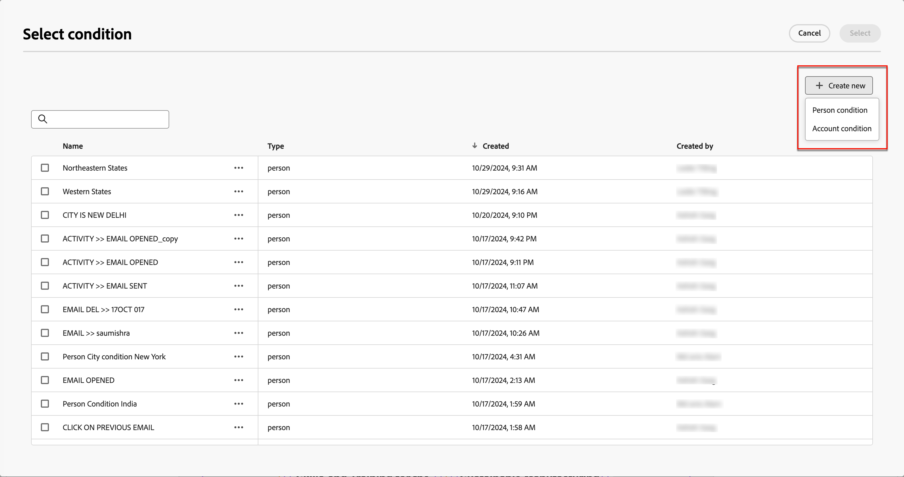
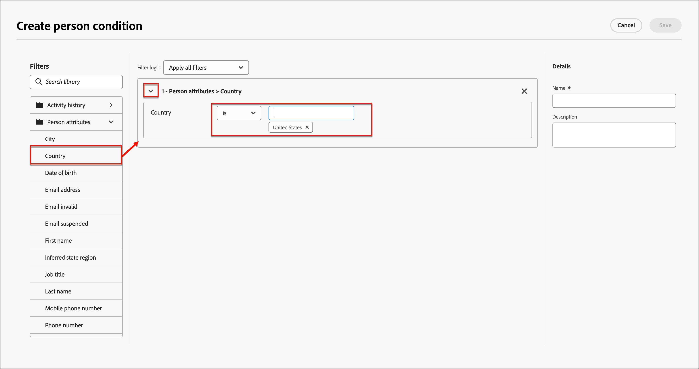

# 條件式內容

條件內容允許您根據條件規則調整電子郵件和片段內容。 這些規則是使用配置檔案屬性或上下文事件定義的。 您可以在規則產生器中建立條件式規則，並將規則儲存起來，以便在您的帳戶歷程中重複使用。

若要向片段和電子郵件添加條件內容，Adobe Journey Optimizer允許您應用儲存在&#x200B;_條件_&#x200B;庫中的條件規則。 在為帳戶行程](./email-authoring.md)或[可視片段](./fragment-authoring.md)編寫[電子郵件內容時，在可視設計空間中應用條件規則。

## 新增條件式內容 {#email-fragment-content}

>[!CONTEXTUALHELP]
>id="ajo-b2b_conditional_content"
>title="條件式內容"
>abstract="使用條件式規則建立內容元件的多個變體。 如果傳送訊息時未符合任何條件，會顯示預設變體的內容。"

>[!CONTEXTUALHELP]
>id="ajo-b2b_conditional_rule_select"
>title="條件式內容"
>abstract="使用儲存在資料庫中的條件式規則或建立新規則。"

在可視設計空間中建立片段或電子郵件時，請使用條件規則為內容元件定義多個變體。

1. 選擇內容元件，然後按一下元件工具欄中的&#x200B;**[!UICONTROL 啟用條件內容]**&#x200B;表徵圖。

   該元件以橙色形式概述，以指示其作為條件元件被激活。 左側顯示&#x200B;**[!UICONTROL 條件內容]**&#x200B;窗格，其中&#x200B;_預設變型_&#x200B;和&#x200B;_變型 — 1_。

   {width="700" zoomable="yes"}

   您選擇並激活的原始內容是預設內容，當您定義的任何變型均不滿足任何條件規則時，該內容將應用。

   在此窗格中，您可以使用條件規則為所選內容元件定義多個變型。

1. 將滑鼠懸停在第一個變型（_變型 — 1_）上，然後按一下&#x200B;_選擇條件_&#x200B;表徵圖（）。

   {width="700" zoomable="yes"}選擇條件

   _[!UICONTROL 選擇條件]_&#x200B;對話框開啟並顯示條件庫。

   如果要查看條件的詳細資訊以確保條件是您想要的，請按一下「_更多」菜單_&#x200B;表徵圖(**...**) 並選擇&#x200B;**[!UICONTROL 查看資訊]**。

   {width="600" zoomable="yes"}

   如果您需要的條件不存在，[通過按一下&#x200B;**[!UICONTROL 新建]**&#x200B;建立條件規則](#create-condition)。

1. 選擇條件規則，然後按一下&#x200B;**[!UICONTROL 選擇]**&#x200B;將其與變數關聯。

   您可以通過按一下「_更多」菜單_&#x200B;表徵圖(**...**)來查看關聯條件 為變數選擇&#x200B;**[!UICONTROL 視圖條件]**。

   {width="600" zoomable="yes"}

   按一下右上角的X關閉彈出窗口。

   {width="500"}

1. 為了更好的可讀性，請按一下「_更多」菜單_&#x200B;表徵圖(**...**)更名變數 為變數選擇&#x200B;**[!UICONTROL 更名]**。

   為變型輸入有意義的名稱，以幫助您識別變型及其意圖。

   {width="600" zoomable="yes"}

1. 在左窗格中選擇變型時，更改元件以在條件為true時更改它在電子郵件中的顯示方式。

   在本示例中，文本元件的變型使用基於收件人區域的不同說明。

   {width="600" zoomable="yes"}

1. 如果需要，請按一下&#x200B;**[!UICONTROL 添加變型]**&#x200B;來定義其他變型。

   重複步驟2-5以選擇條件、更名變型並更改變型的元件。

   您可以根據需要為內容元件添加任意多個變型。 隨時在左窗格中更改所選變數，以檢查條件的內容元件顯示方式。

   >[!IMPORTANT]
   >
   >根據關聯規則按變型的列出順序計算條件內容。 該元件使用具有計算為true條件的第一個變數。
   >
   >如果在發送電子郵件時沒有定義的變型條件評估為true，則內容元件將根據&#x200B;**[!UICONTROL 預設變型]**&#x200B;顯示。

1. 要刪除變數，請按一下「_更多」菜單_&#x200B;表徵圖(**...**) 為變型選擇&#x200B;**[!UICONTROL 刪除]**。

   在確認對話框中按一下&#x200B;**[!UICONTROL 刪除]**。

## 條件規則

條件規則是一組條件表達式，可計算為true或false。 您可以使用這些規則根據各種篩選器（如配置檔案屬性或上下文事件）來確定在電子郵件中顯示哪些內容變數。
規則儲存在條件庫中，在該庫中，規則可在您的組織的電子郵件和碎片內容中重複使用。
<!--
>[!NOTE]
>
>You need the [Manage Library Items](../administration/ootb-product-profiles.md) permission to save or delete conditional rules. Saved conditions are available for use by all users within an organization.-->

### 條件篩選器 {#condition-filters}

| 條件類型 | 篩選器 | 說明 |
| -------------- | ------- | ----------- |
| **帳戶** | 帳戶屬性 | 帳戶配置檔案的屬性，包括： <li>年收入</li><li>城市</li><li>國家</li><li>員工大小</li><li>行業</li><li>名稱</li><li>SIC代碼</li><li>狀態</li> |
| | [!UICONTROL 特殊篩選器] > [!UICONTROL 有購買組] | 該帳戶沒有或沒有購買組的成員。 也可以根據以下一個或多個標準來評估過濾器： <li>解決方案興趣</li><li>採購組狀態</li><li>完整性分數</li><li>參與分數</li> |
| **人** | [!UICONTROL 活動歷史記錄] > [!UICONTROL 電子郵件] | 與行程關聯的電子郵件活動： <li>[!UICONTROL 已在電子郵件中按一下連結]</li><li>已開啟電子郵件</li><li>已發送電子郵件</li><li>已發送電子郵件</li> 這些條件是使用旅程早期的選定電子郵件進行評估的。 |
|  | [!UICONTROL 人員屬性] | 人員配置檔案的屬性，包括： <li>城市</li><li>國家</li><li>出生日期</li><li>電子郵件地址</li><li>電子郵件無效</li><li>電子郵件已掛起</li><li>名字</li><li>推斷狀態區域</li><li>職稱</li><li>姓氏</li><li>手機號碼</li><li>電話號碼</li><li>郵遞區號</li><li>州別</li><li>已取消訂閱</li><li>未訂閱原因</li> |
| | [!UICONTROL 特殊篩選器] > [!UICONTROL 購買組成員] | 該人員是或不是根據下列一或多個條件評估的購買群組成員： <li>解決方案興趣</li><li>購買群組狀態</li><li>完整度分數</li><li>參與分數</li><li>已移除</li><li>角色</li> |

### 建立條件式規則 {#create-condition}

>[!CONTEXTUALHELP]
>id="ajo-b2b_conditions_rule_editor"
>title="建立條件"
>abstract="結合屬性和內容事件來建置規則，決定在電子郵件訊息中顯示哪些內容變體。"

選取元件變體的條件時，您可以從電子郵件設計空間存取條件規則產生器。

1. 在&#x200B;_[!UICONTROL 選取條件]_&#x200B;對話方塊中，按一下&#x200B;**[!UICONTROL 新建]**&#x200B;並選擇條件型別：

   * **[!UICONTROL 個人條件]** — 選擇此型別以使用個人屬性和內容事件建置條件規則。
   * **[!UICONTROL 帳戶條件]** — 選擇此型別以使用帳戶屬性建置條件規則。

   {width="600" zoomable="yes"}

1. 根據您的需求建置條件式規則。

   針對您想要納入規則的每個屬性或事件，將專案拖放至規則畫布上。 展開篩選器並完成運算式。

   {width="600" zoomable="yes"}

   如果您包含多個篩選器，請設定&#x200B;**[!UICONTROL 篩選器邏輯]**：

   * **[!UICONTROL 套用所有篩選器]** — 如果&#x200B;**所有**&#x200B;篩選器為True，則規則會評估為True。
   * **[!UICONTROL 套用任何篩選器]** — 如果&#x200B;**任何**&#x200B;個篩選器為true，則規則會評估為true。

1. 在右側，輸入規則的&#x200B;**[!UICONTROL Name]**&#x200B;和&#x200B;**[!UICONTROL Description]** （選擇性）。

   使用有意義的名稱和有用的說明來協助組織中的其他人，讓他們可以重複使用它，而不是建立另一個重複條件。

   {width="600" zoomable="yes"}

1. 完成條件式規則後，按一下&#x200B;**[!UICONTROL 儲存]**。

   條件規則會儲存至程式庫，您可以為目前變體選取它。 它也包含在程式庫中，以由帳戶歷程中的任何其他動態內容變體使用。

### 複製規則

無法修改儲存至程式庫的條件式規則。 不過，您可以複製現有規則並加以變更，以建立新規則。

1. 按一下&#x200B;_更多功能表_&#x200B;圖示(**...**) 針對變體，請選擇&#x200B;**[!UICONTROL 複製]**。

   規則的副本會在規則產生器中開啟。 使用重複專案作為您要建立之規則的起點。

   {width="600" zoomable="yes"}

1. 在規則產生器中，視需要變更、新增或刪除條件。

1. 變更名稱和說明，以符合規則中的用途或專案。

1. 完成條件式規則後，按一下&#x200B;**[!UICONTROL 儲存]**。
