# 內容元件 {#content-components}

>[!CONTEXTUALHELP]
>id="ajo-b2b_content_components_email"
>title="關於內容元件"
>abstract="內容元件是指設計電子郵件時可以使用的空白內容預留位置。"

>[!CONTEXTUALHELP]
>id="ajo-b2b_content_components_landing_page"
>title="關於內容元件"
>abstract="內容元件是指設計登陸頁面時可以使用的空白內容預留位置。"

>[!CONTEXTUALHELP]
>id="ajo-b2b_content_components_fragment"
>title="關於內容元件"
>abstract="內容元件是指設計片段時可以使用的空白內容預留位置。"

>[!CONTEXTUALHELP]
>id="ajo-b2b_content_components_template"
>title="關於內容元件"
>abstract="內容元件是指設計範本時可以使用的空白內容預留位置。"

當您設計電子郵件、登入頁面、範本及視覺化片段的內容時，請使用[!UICONTROL 內容元件]來新增視覺化設計元素。 您可以視需要在定義配置圖的一或多個結構元件內新增任意數量的內容元件。

## 內容庫

元件庫底部的&#x200B;**[!UICONTROL 內容]**&#x200B;區段會顯示可用的內容元件：

| 圖示 | 元件 | 說明 |
| --------- | ---- | ----------- |
| 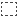 | [容器](#container) | 將此元件新增到您的設計，以包含可用來將元件分組或將背景或邊框樣式套用至區域的矩形容器。 |
|  | [按鈕](#button) | 將此元件新增至您的設計，以包含可點按的按鈕元素。 |
|  | [文字](#text) | 將此元件新增至您的設計，以包含文字內文。 |
| 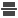 | [分隔線](#divider) | 將此元件新增到您的設計，加入水平線以分隔內容的區域。 |
|  | [HTML](#html) | 將此元件新增至您的設計，以複製並貼上現有HTML的不同部分。 使用此元件來建立免費的模組化HTML區塊，以重複使用某些外部內容。 |
|  | [影像](#image) | 將此元件新增到您的設計以插入影像檔案。 |
|  | [社交](#social) | 將此元件新增到您的設計，以插入指向社群媒體頁面的連結。 |
|  | [表單](#form) | **_僅適用於登陸頁面。_**&#x200B;將此元件新增到您的設計以插入建立的表單。 |

## 內容元件工具列

當您在畫布中選取工具列時，每個內容元件型別都會顯示工具列。 可用的工具會因元件型別而異，提供直接在演算內容中處理元件的簡單方法。 其中包含適用於元件型別的格式化和功能功能。

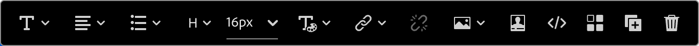{width="450"}

### 格式化工具

+++變更文字樣式

<table>
    <tr>
        <th style="width: 30%;">工具</th>
        <th style="width: 50%;">使用情況</th>
        <th style="width: 20%;">元件</th>
    </tr>
    <tr>
        <td>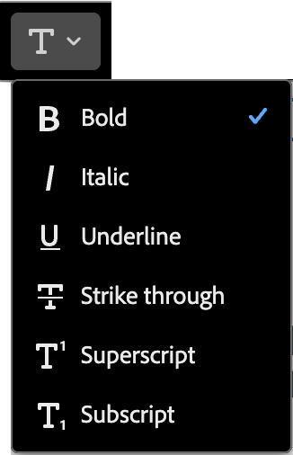</td>
        <td>將粗體、斜體、底線或刪除線、上標或下標套用至選取的文字字串。</td>
        <td><li>按鈕 <li>文字</td>
    </tr>
</table>

+++

+++水準對齊方式

<table>
    <tr>
        <th style="width: 30%;">工具</th>
        <th style="width: 50%;">使用情況</th>
        <th style="width: 20%;">元件</th>
    </tr>
    <tr>
        <td>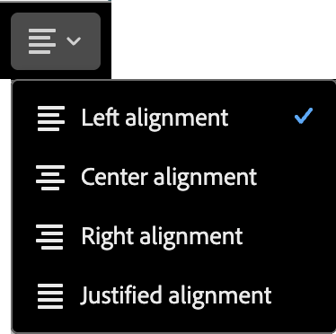</td>
        <td>將水準對齊方式型別套用至元件內容。 選擇左、中、右或左右對齊。 </td>
        <td><li>按鈕 <li>文字</td>
    </tr>
</table>

+++

+++建立清單

<table>
    <tr>
        <th style="width: 30%;">工具</th>
        <th style="width: 50%;">使用情況</th>
        <th style="width: 20%;">元件</th>
    </tr>
    <tr>
        <td>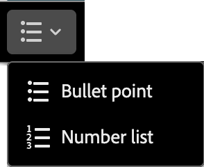</td>
        <td>將排序或無排序的清單格式套用至元件文字。</td>
        <td><li>文字</td>
    </tr>
</table>

+++

+++設定標題

<table>
    <tr>
        <th style="width: 20%;">工具</th>
        <th style="width: 60%;">使用情況</th>
        <th style="width: 20%;">元件</th>
    </tr>
    <tr>
        <td>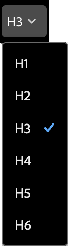</td>
        <td>在游標位置的段落套用標題層級格式。</td>
        <td><li>按鈕 <li>文字</td>
    </tr>
</table>

+++

+++字型大小

<table>
    <tr>
        <th style="width: 20%;">工具</th>
        <th style="width: 60%;">使用情況</th>
        <th style="width: 20%;">元件</th>
    </tr>
    <tr>
        <td>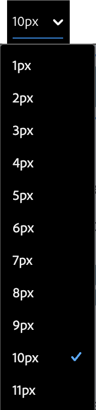</td>
        <td>將字型大小套用至選取的文字。 按一下工具並選擇大小或輸入畫素值。</td>
        <td><li>按鈕 <li>文字</td>
    </tr>
</table>

+++

+++字型顏色

<table>
    <tr>
        <th style="width: 40%;">工具</th>
        <th style="width: 40%;">使用情況</th>
        <th style="width: 20%;">元件</th>
    </tr>
    <tr>
        <td>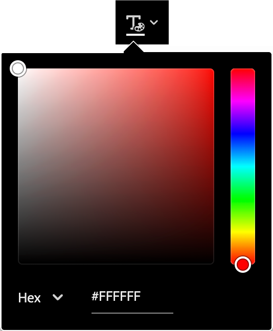</td>
        <td>將字型顏色套用至選取的文字。 從選擇器中選擇顏色，並使用顏色滑桿和顏色欄位來選取顏色。 或者，您可以輸入已知的RGB、HSL、HSB或十六進位值。 </td>
        <td><li>按鈕 <li>文字</td>
    </tr>
</table>

+++

+++插入連結

<table>
    <tr>
        <th style="width: 40%;">工具</th>
        <th style="width: 40%;">使用情況</th>
        <th style="width: 20%;">元件</th>
    </tr>
    <tr>
        <td>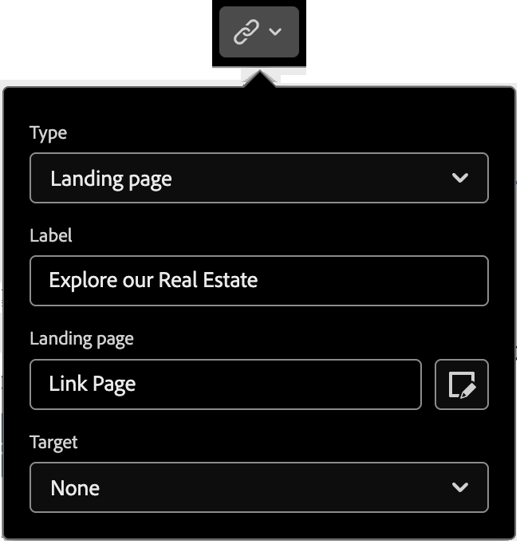</td>
        <td>為選取的文字或元素建立可點按的連結（外部URL或登陸頁面）。</td>
        <td><li>按鈕 <li>文字 <li>影像 </td>
    </tr>
</table>

+++

+++移除連結

<table>
    <tr>
        <th style="width: 15%;">工具</th>
        <th style="width: 60%;">使用情況</th>
        <th style="width: 25%;">元件</th>
    </tr>
    <tr>
        <td>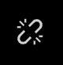</td>
        <td> 移除所選文字或元素的可點按連結（外部URL或登陸頁面）。</td>
        <td><li>按鈕 <li>文字 <li>影像 </td>
    </tr>
</table>

+++

### 功能工具

| 工具 | 名稱 | 使用情況 |
| ---- | ---- | ----- |
| {width="40"} | 新增個人化 | 使用個人化編輯器在元件內容中插入個人化代號。 [了解更多](./email-authoring.md#personalize-content) |
| 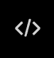{width="40"} | 顯示原始程式碼 | 以唯讀快顯視窗顯示元件的HTML原始碼。  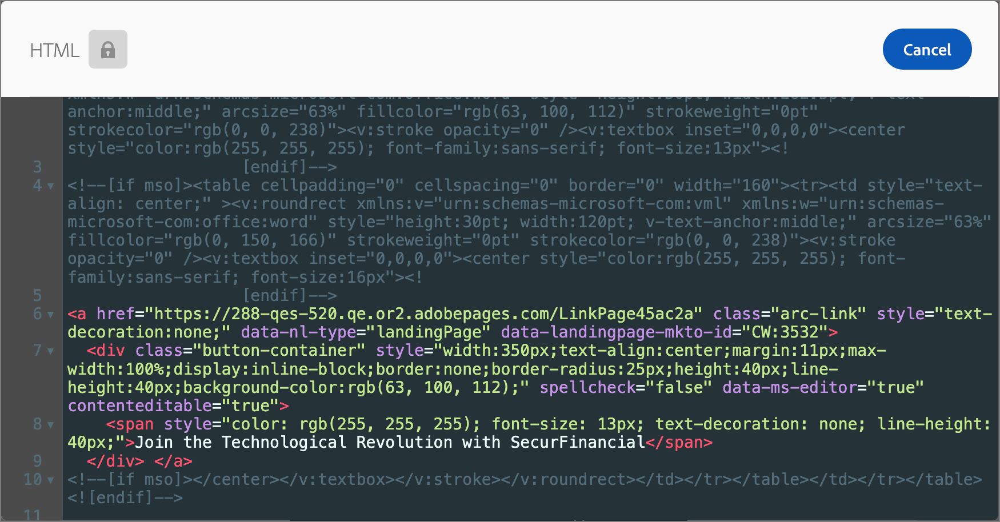{width="200"} |
| {width="40"} | 啟用條件式內容 | （電子郵件和片段）啟用元件的條件變體。 [了解更多](./conditional-content.md) |
| {width="40"} | 重複 | 建立元件的復本，並直接將其新增到下方。 |
| {width="40"} | 刪除 | 移除元件。 |

## 將內容元件新增至您的設計

1. 在視覺設計空間中，使用現有範本或將所需的結構元件新增至空白畫布以定義版面。

1. 在&#x200B;**[!UICONTROL 元件]**&#x200B;資料庫中，抓取您所選內容元件的&#x200B;_拖曳控點_ ，然後將其拖放到結構元件上。

   您可以將數個元件加入單一結構元件中，並加入結構元件的每個欄中。

   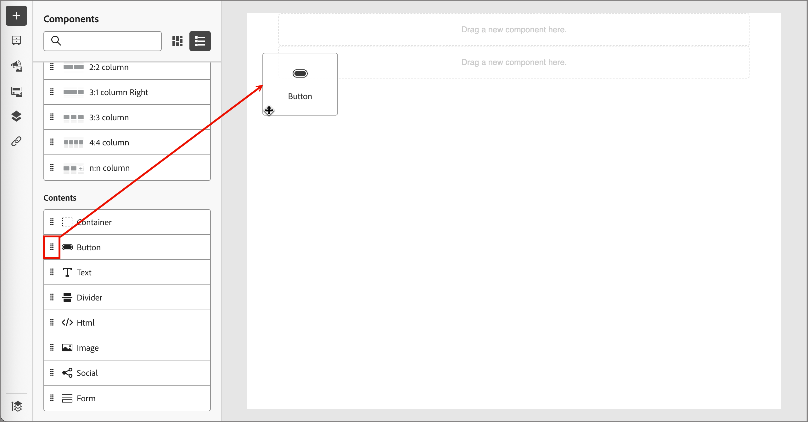{width="600" zoomable="yes"}

1. 使用右側的&#x200B;**[!UICONTROL 設定]**&#x200B;和&#x200B;**[!UICONTROL 樣式]**&#x200B;標籤，或畫布中顯示的內容工具列，調整元件顯示。

   例如，您可以變更元件的文字樣式、邊框間距或邊界。

   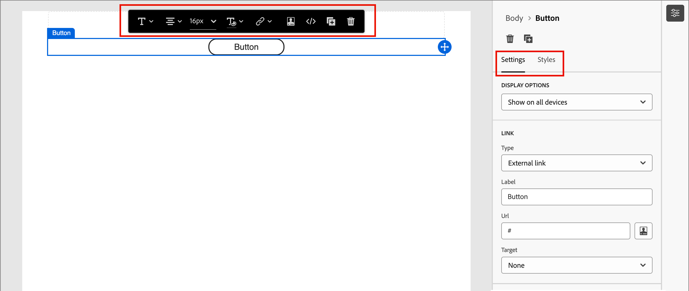{width="600" zoomable="yes"}

使用設計時，您也可以[移除](#remove-a-content-component)或[複製](#duplicate-a-content-component)元件。

## 內容元件設定和樣式

新增元件後，會在視覺設計空間選取元件，其屬性會顯示在右側面板中。 您也可以隨時選取元件以變更設定和樣式。 許多設定和樣式都是元件專屬的，但有一些標準設定和樣式可套用至任何選取的內容元件。

### 顯示選項

若要從案頭或行動裝置顯示中排除元件，請變更&#x200B;**[!UICONTROL 顯示選項]**&#x200B;設定。 預設值&#x200B;_[!UICONTROL 在所有裝置上顯示]_，可跨所有裝置顯示。 選擇其他設定以依裝置型別排除元件：

* _[!UICONTROL 僅在桌上型裝置上顯示]_ — 當您想要在桌上型裝置上顯示元件，並將它排除在行動裝置上時，請選擇此設定。
* _[!UICONTROL 僅在行動裝置上顯示]_ — 當您想要在行動裝置（例如手機和平板電腦）上顯示元件時，請選擇此設定，並將它排除在桌上型裝置之外。

{width="400" zoomable="yes"}

### 容器

使用容器將特定樣式套用至一組內容元件。 新增[!UICONTROL Container]元件，然後在其中新增其他內容元件。 此元件類似於您在HTML中使用`div`元素的方式。 您可以將不同的樣式套用至容器，使其與套用至其所包含內容元件的樣式不同。

例如，新增&#x200B;_[!UICONTROL Container]_&#x200B;元件，然後在該容器中新增&#x200B;_[!UICONTROL Button]_&#x200B;元件。 您可以使用容器的特定區域樣式，並視需要設定按鈕及其背景的樣式。

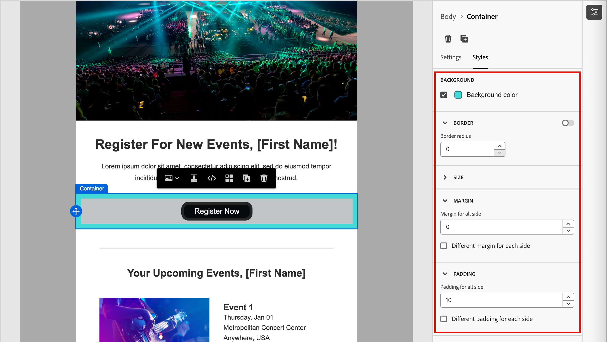{width="600" zoomable="yes"}

+++背景

{{styles-background}}

+++

+++邊框

{{styles-border}}

+++

+++大小

{{styles-size}}

+++

+++邊距

{{styles-margin}}

+++

+++內距

{{styles-padding}}

+++

### 按鈕

使用[!UICONTROL Button]元件將一或多個可點按的按鈕插入您的內容。 使用按鈕將頁面檢視器或電子郵件收件者重新導向至支援內容（已發佈的登陸頁面或外部連結）。

#### 新增按鈕文字

當畫布中顯示按鈕元件時，工具列會包含文字格式設定選項，以及個人化和條件變體。 如需有關編輯器工具列選項的詳細資訊，請參閱#。

當您輸入按鈕標籤文字並設定格式時，按鈕會調整大小以符合內容。

與工具列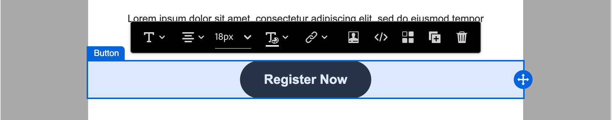{width="500" zoomable="yes"}按鈕元件

#### 設定連結選項

在&#x200B;_[!UICONTROL 設定]_&#x200B;索引標籤上，使用&#x200B;**[!UICONTROL 連結]**&#x200B;選項來定義按鈕文字、連結目的地，以及載入目標頁面的瀏覽器行為。

1. 設定連結的&#x200B;**[!UICONTROL 型別]**：

   * **[!UICONTROL 外部連結]** — 選擇此型別以使用標準URL作為連結目的地。

     在&#x200B;**[!UICONTROL Url]**&#x200B;中，輸入連結目的地的URL。 按一下「_個人化_」（「」）圖示，使用個人化權杖作為URL中的引數。

     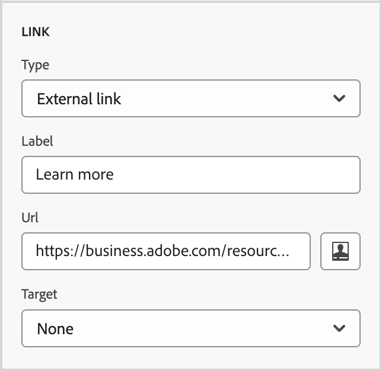{width="200"}

   * **登陸頁面** — 選擇此型別，在<!-- Journey Optimizer B2B Edition (_Beta_) or -->連線的Marketo Engage執行個體中選取已發佈的登陸頁面。

     針對&#x200B;**[!UICONTROL 登陸頁面]**&#x200B;選項，請選取已發佈的登陸頁面。 按一下&#x200B;_選取頁面_&#x200B;圖示（）和[選取已發佈的登陸頁面](./landing-pages.md#link-to-a-landing-page)。

     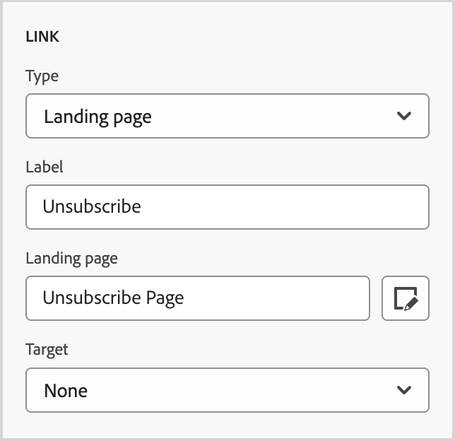{width="200"}

1. 針對&#x200B;**[!UICONTROL 標籤]**，請輸入您要在按鈕內顯示的文字。

   按鈕大小會根據設定的文字和樣式進行調整。

1. 對於&#x200B;**[!UICONTROL Target**]，請選擇如何從電子郵件或頁面重新導向連結的目的地：

   * _[!UICONTROL 無]_ — 使用預設瀏覽器或使用者端行為（預設）開啟連結。
   * _[!UICONTROL 空白]_ — 在新視窗或索引標籤中開啟連結。
   * _[!UICONTROL Self]_ — 在相同框架中開啟連結。
   * _[!UICONTROL 父系]_ — 在父框架中開啟連結。
   * _[!UICONTROL Top]_ — 在視窗的整個內文中開啟連結。

#### 設定樣式

在&#x200B;**[!UICONTROL 樣式]**&#x200B;索引標籤中自訂按鈕樣式。

+++背景

{{styles-background}}

+++

+++文字

{{styles-text}}

+++

+++邊框

{{styles-border}}

+++

+++大小

{{styles-size}}

+++

+++對齊方式

+++

+++按鈕邊界

+++

+++容器邊界

{{styles-margin}}

+++

+++內距

{{styles-padding}}

+++

+++進階

{{styles-advanced}}

+++

### 文字

使用文字元件，將文字區塊插入內容中。 在畫布中選取文字元件時，輸入文字並使用工具列選項來新增內嵌格式和選項，包括個人化代號和條件變體。<!-- For detailed information about crafting text, including inline styling and options, in the design space, see [Text authoring](#). -->

在&#x200B;**[!UICONTROL 樣式]**&#x200B;索引標籤中自訂文字元件樣式。

+++背景

{{styles-background}}

+++

+++文字

這些樣式會套用至整個文字區塊。 您可以將內嵌樣式套用至選取的文字字串。

{{styles-text}}

+++

+++邊框

{{styles-border}}

+++

+++大小

{{styles-size}}

+++

+++邊距

{{styles-margin}}

+++

+++內距

{{styles-padding}}

+++

+++進階

{{styles-advanced}}

+++

### 分隔線

新增&#x200B;_分隔線_&#x200B;元件，在內容區段之間納入線性分隔。

+++背景

{{styles-background}}

+++

+++折線圖

+++

+++大小

{{styles-size}}

+++

+++對齊方式

{{styles-alignment-h}}

+++

+++邊距

{{styles-margin}}

+++

+++內距

{{styles-padding}}

+++

+++進階

{{styles-advanced}}

+++

### HTML

使用HTML元件來新增部分現有HTML。 此元件可讓您輕鬆建立重複使用外部內容的模組化HTML元素。

1. 在畫布上選取元件，然後按一下工具列中的「_顯示原始程式碼_」圖示。

   [開啟程式碼編輯器以新增HTML](./assets/content-components-html-show-code.png){width="450"}

1. 在文字方塊中貼上HTML，然後按一下[儲存]。**&#x200B;**

   [編輯HTML對話方塊](./assets/content-components-html-edit-dialog.png){width="600" zoomable="yes"}

   如果HTML有效，它會在畫布上呈現元素。 如果是對映至其他內容元件的元素，您可以根據元件型別變更右側面板中的設定和樣式。 如果不適用，則會保留為HTML元件。

對於HTML元件，您可以在右側面板中為整個HTML元件設定下列樣式：

+++背景

{{styles-background}}

+++

+++邊框

{{styles-border}}

+++

+++大小

{{styles-size}}

+++

+++對齊方式

{{styles-alignment-h-v}}

+++

+++邊距

{{styles-margin}}

+++

+++內距

{{styles-padding}}

+++

+++進階

{{styles-advanced}}

+++

### 影像

使用[!UICONTROL 影像]元件將影像資產插入您的內容。 在畫布中選取&#x200B;_影像_&#x200B;元件時，您可以新增或變更顯示的影像資產檔案。

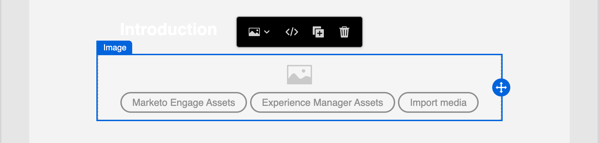{width="400" zoomable="yes"}

#### 新增影像資產

選擇[資產來源型別](./assets-overview.md)並選取影像檔：

* **[!UICONTROL Marketo Engage Assets]** — 選擇此型別以從Journey Optimizer B2B edition資料庫或連線的Market Engage執行個體瀏覽及選取影像資產。

  {width="700" zoomable="yes"}

  從對話方塊中，您可以從選取的存放庫中選擇影像。 按一下&#x200B;**[!UICONTROL 選取]**&#x200B;以新增資產。

  有多種工具可協助您找到所需的資產：

   * 按一下左上方的&#x200B;_篩選器_&#x200B;圖示，以根據您的條件篩選顯示的專案。

   * 在&#x200B;_搜尋_&#x200B;欄位中輸入文字，以篩選顯示的專案以符合資產名稱。

     {width="700" zoomable="yes"}

* **[!UICONTROL Experience Manager Assets]** — 選擇此型別以瀏覽並從[已設定的Experience Manage Assets存放庫](../admin/configure-aem-repositories.md)中選取影像資產。

  在&#x200B;_[!UICONTROL 選取Assets]_&#x200B;對話方塊中，使用可用的工具選擇影像，以找出您需要的資產，然後按一下&#x200B;**[!UICONTROL 選取]**：

   * 變更右上角的&#x200B;**[!UICONTROL 存放庫]**。

   * 按一下右上角的「**[!UICONTROL 管理資產]**」，在其他瀏覽器分頁中開啟Assets存放庫，並使用AEM Assets管理工具。

   * 按一下右上角的&#x200B;_檢視型別_&#x200B;選擇器，將顯示變更為&#x200B;**[!UICONTROL 清單檢視]**、**[!UICONTROL 格線檢視]**、**[!UICONTROL 相簿檢視]**&#x200B;或&#x200B;**[!UICONTROL 瀑布檢視]**。

   * 按一下&#x200B;_排序順序_&#x200B;圖示，以變更升序與降序之間的排序順序。

     {width="700" zoomable="yes"}

   * 按一下&#x200B;**[!UICONTROL 排序依據]**&#x200B;功能表箭頭，將排序條件變更為&#x200B;**[!UICONTROL 名稱]**、**[!UICONTROL 大小]**&#x200B;或&#x200B;**[!UICONTROL 已修改]**。

   * 按一下左上方的&#x200B;_篩選器_&#x200B;圖示，以根據您的條件篩選顯示的專案。

   * 在&#x200B;_搜尋_&#x200B;欄位中輸入文字，以篩選顯示的專案以符合資產名稱。

  {width="700" zoomable="yes"}

* **[!UICONTROL 匯入媒體]** — 選擇此型別，從您的系統選取檔案，並將其匯入Journey Optimizer B2B edition資產庫。

  在&#x200B;_[!UICONTROL 上傳影像]_&#x200B;對話方塊中，將檔案從您的系統拖放至檔案方塊。 檔案大小上限為100 MB。

  {width="450"}

  所選影像的檔案名稱會顯示在對話方塊中。 資產檔案名稱必須是唯一的（跨資料夾），如果已存在同名的檔案，則會顯示訊息。 名稱最多可包含100個字元，且不能包含特殊字元（例如`;`、`:`、`\`和`|`）。

  按一下&#x200B;**[!UICONTROL 匯入]**。

您可以在右側面板中為影像新增影像標題和替代文字。

{width="250"}

#### 設定連結選項

在&#x200B;_[!UICONTROL 設定]_&#x200B;索引標籤上，使用&#x200B;**[!UICONTROL 連結]**&#x200B;選項將影像與載入目標頁面的目的地和瀏覽器行為連結。

1. 設定連結的&#x200B;**[!UICONTROL 型別]**：

   * **[!UICONTROL 外部連結]** — 選擇此型別以使用標準URL作為連結目的地。

     在&#x200B;**[!UICONTROL Url]**&#x200B;中，輸入連結目的地的URL。 按一下「_個人化_」（「」）圖示，使用個人化權杖作為URL中的引數。

     {width="250"}

   * **登陸頁面** — 選擇此型別，在<!-- Journey Optimizer B2B Edition (_Beta_) or -->連線的Marketo Engage執行個體中選取已發佈的登陸頁面。

     針對&#x200B;**[!UICONTROL 登陸頁面]**&#x200B;選項，請選取已發佈的登陸頁面。 按一下&#x200B;_選取頁面_&#x200B;圖示（）和[選取已發佈的登陸頁面](./landing-pages.md#link-to-a-landing-page)。

     {width="250"}

1. 針對&#x200B;**[!UICONTROL 標籤]**，請輸入您要在按鈕內顯示的文字。

   按鈕大小會根據設定的文字和樣式進行調整。

1. 對於&#x200B;**[!UICONTROL Target**]，請選擇如何從電子郵件或頁面重新導向連結的目的地：

   * _[!UICONTROL 無]_ — 使用預設瀏覽器或使用者端行為（預設）開啟連結。
   * _[!UICONTROL 空白]_ — 在新視窗或索引標籤中開啟連結。
   * _[!UICONTROL Self]_ — 在相同框架中開啟連結。
   * _[!UICONTROL 父系]_ — 在父框架中開啟連結。
   * _[!UICONTROL Top]_ — 在視窗的整個內文中開啟連結。

#### 設定樣式

在右側面板中設定影像元件的樣式。

+++背景

{{styles-background}}

+++

+++邊框

{{styles-border}}

+++

+++大小

{{styles-size}}

+++

+++對齊方式

{{styles-alignment-h}}

+++

+++邊距

{{styles-margin}}

+++

+++內距

{{styles-padding}}

+++

+++進階

{{styles-advanced}}

+++

### 社交

使用&#x200B;_社交_&#x200B;元件，將社群媒體頁面的連結插入您的內容中。 其中包含三種預設的社群媒體型別，但您可以視需求新增或移除這些型別。

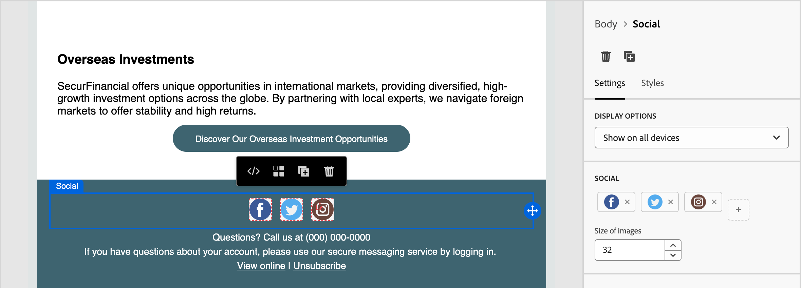{width="600" zoomable="yes"}

* 若要新增社群媒體型別，請按一下&#x200B;_新增_ ( **+** )圖示，然後選擇要新增的社群媒體型別。

  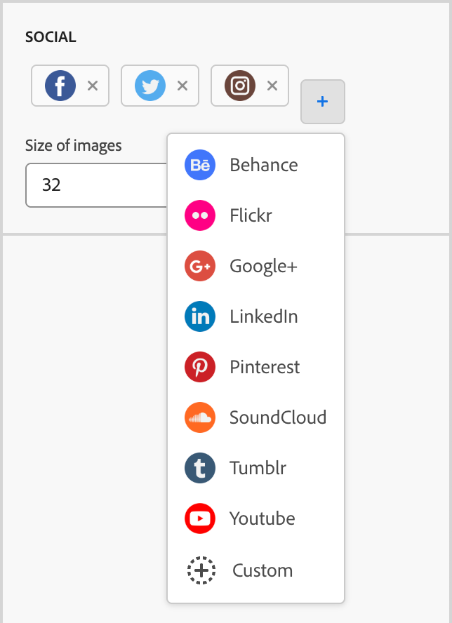{width="250"}

* 若要移除社群媒體型別，請按一下社群媒體圖示旁的&#x200B;**X**。

在選取了社群媒體型別後，設定該型別的選項：

* **[!UICONTROL URL]** — 輸入您要連結至社群媒體圖形或圖示的社群媒體URL。
* **[!UICONTROL Source]** — 如果您想使用自己的影像，而不是預設影像，請選擇和影像資產。 您可以從已連線的Marketo Engage資產存放庫或Experience Manager Assets存放庫（如果已設定）中選取影像，或從您的系統匯入影像檔案。 如需選取和匯入影像資產的詳細資訊，請參閱[影像元件資訊](#add-the-image-asset)。
* **[!UICONTROL 替代文字]** — 為顯示的影像輸入替代文字。

  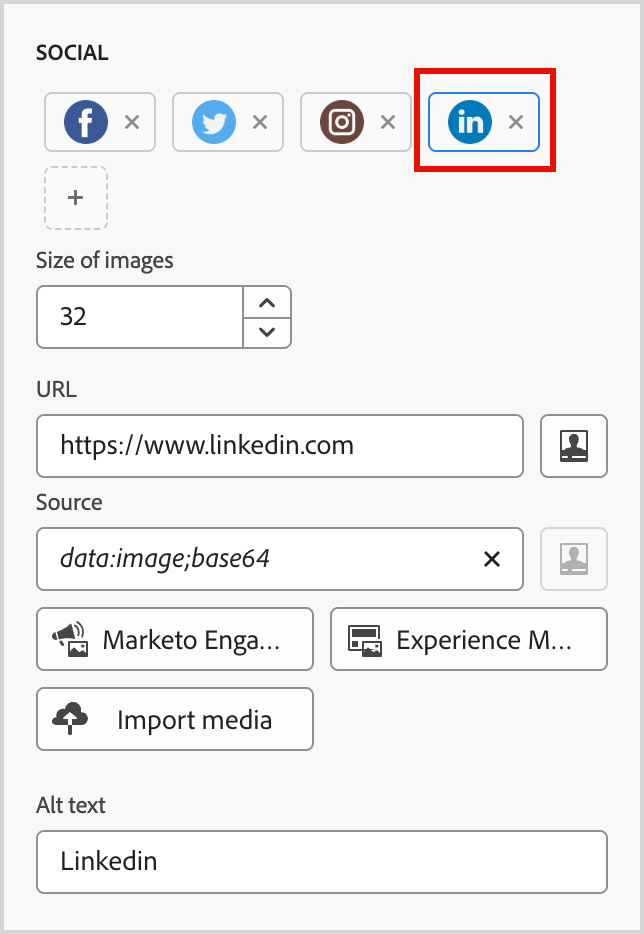{width="250"}

若要定義所有社群媒體圖形的一致顯示大小，請設定&#x200B;**[!UICONTROL 影像大小]**。

您可以為&#x200B;_Social_&#x200B;元件設定下列樣式選項：

+++背景

{{styles-background}}

+++

+++邊框

{{styles-border}}

+++

+++大小

{{styles-size}}

+++

+++對齊方式

{{styles-alignment-h}}

+++

+++邊距

{{styles-margin}}

+++

+++內距

{{styles-padding}}

+++

+++進階

{{styles-advanced}}

+++

### 表單（登陸頁面）

[!BADGE Beta]{type=Informative url="/help/user/content/forms.md" tooltip="Beta功能"}

使用&#x200B;_表單_&#x200B;元件，將已發佈的表單新增至登入頁面或登入頁面範本。 如需建立和發佈表單的詳細資訊，請參閱[Forms](./forms.md)。

1. 按一下元件工具列中的&#x200B;_表單_&#x200B;工具，或使用右側的&#x200B;**[!UICONTROL 內嵌表單]**&#x200B;屬性來選取已發佈的表單。

   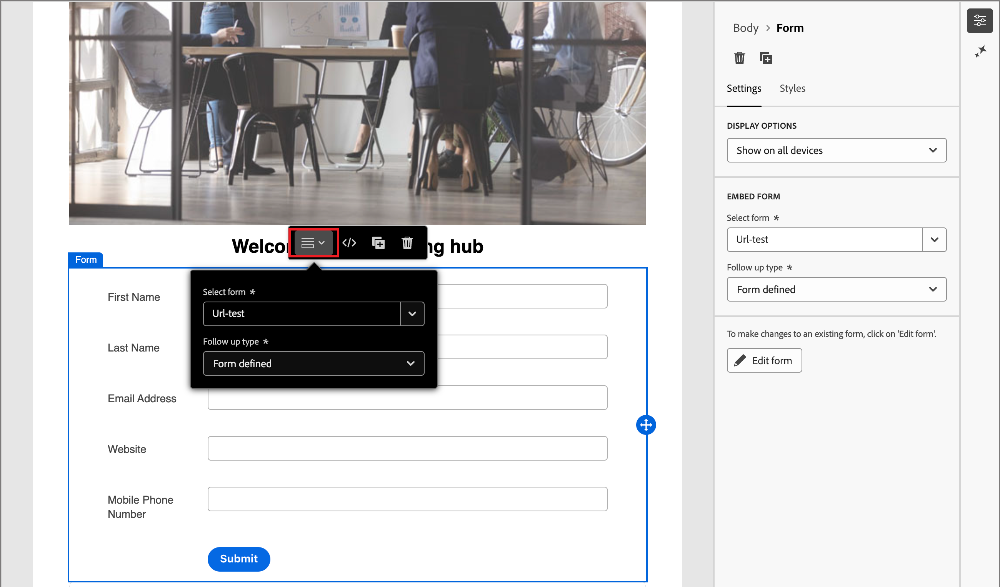{width="600"}

1. 如果您要覆寫表單的預設&#x200B;**[!UICONTROL 後續追蹤型別]**，請根據您的頁面或範本需求變更設定。

   此頁面也稱為表單的&#x200B;_感謝頁面_，此設定會決定訪客提交表單時會發生什麼情況：

   * **[!UICONTROL 停留在頁面]** — 選擇此選項可在提交表單時讓訪客停留在相同頁面。

   * **[!UICONTROL 登陸頁面]** — 選擇此選項可選取任何Journey Optimizer B2B edition或Marketo Engage登陸頁面作為後續追蹤。

   * **[!UICONTROL 外部URL]** — 選擇此選項可指定任何URL作為後續頁面。 訪客提交表單後，瀏覽器會載入指定的URL。

     >[!TIP]
     >
     >如果您希望使用表單下載檔案，您可以指定託管檔案的URL。 透過此設定，提交按鈕可作為下載按鈕運作。

     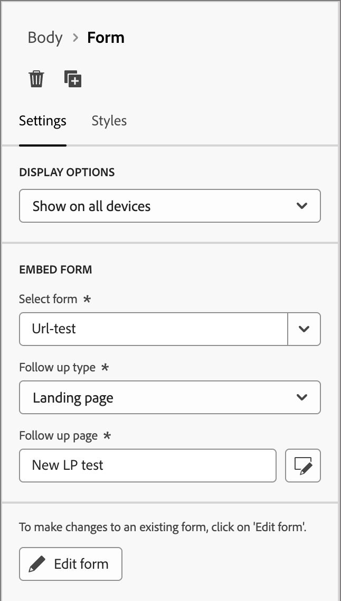{width="280"}

如有需要，請選取右側面板中的&#x200B;**[!UICONTROL 樣式]**&#x200B;索引標籤，以設定結構元件內的表單邊界。

{{styles-margin}}
