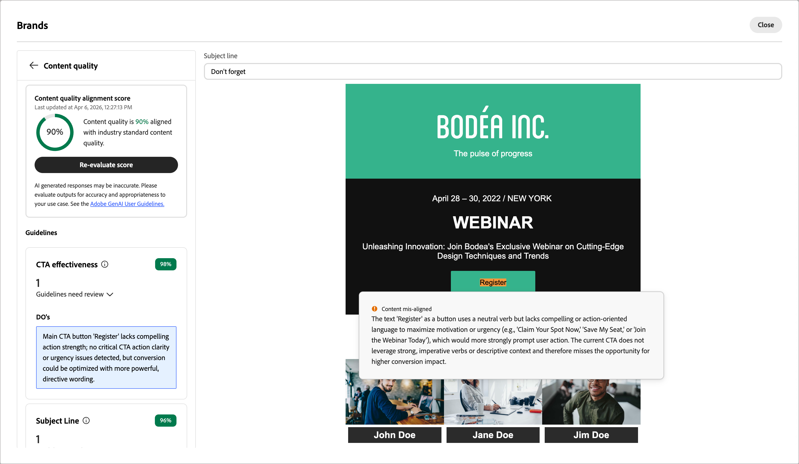

# 內容評估與評分 {#content-scoring}

內容評估與評分可協助您建立、檢閱和管理遵循所選品牌[&#128279;](./brands-manage-create.md#brand-definitions)中定義的准則和一般品質標準的內容。 執行評估可確保電子郵件行銷活動的語氣、訊息和視覺身分的一致性，同時在內容上線之前作為品質檢查。

>[!AVAILABILITY]
>
>您必須先取得[使用者合約](https://www.adobe.com/tw/legal/licenses-terms/adobe-dx-gen-ai-user-guidelines.html){target="_blank"}，才能在Adobe Journey Optimizer B2B Edition中使用AI支援的功能。 如需詳細資訊，請聯絡您的 Adobe 代表。
>
>如需有關產品管理員如何啟用這些功能的資訊，請參閱[品牌相關許可權](./brands-overview.md#brand-related-permissions)。

## 執行評估

1. 建立電子郵件內容後，請按一下右側的&#x200B;_品牌一致性_ （ ）圖示，以開啟電子郵件設計空間中的&#x200B;_品牌一致性_&#x200B;右側面板。

   已自動選取[預設品牌](./brands-manage-create.md#default-brand)。

   {width="600" zoomable="yes"}

   您可以按一下面板頂端的&#x200B;_全熒幕_ （ ）圖示，以全熒幕模式顯示品牌對齊工具。

1. 如有需要，請按一下&#x200B;**[!UICONTROL 品牌]**&#x200B;功能表箭頭（）以選擇其他已發佈的品牌。

1. 按一下「**[!UICONTROL 評估分數]**」，為內容與所選品牌的一致性評分。

   系統會根據所選品牌的准則來評估內容，並顯示結果分數。

   {width="600" zoomable="yes"}

## 品牌一致性分數 {#brand-alignment-score}

>[!CONTEXTUALHELP]
>id="ajo-b2b_brand_score_overview"
>title="品牌選取項目"
>abstract="選取您的品牌以確保您的內容製作符合其特定的準則、標準和識別，從而維持一致性和品牌完整性。"

>[!CONTEXTUALHELP]
>id="ajo-b2b_brand_score"
>title="品牌一致性分數"
>abstract="您的品牌一致性分數會衡量您的內容與品牌準則的符合程度，以確保顏色、字體、標誌、影像及寫作風格的一致性。"

>[!CONTEXTUALHELP]
>id="ajo-b2b_brand_colors_score"
>title="色彩分數"
>abstract="色彩分數"

>[!CONTEXTUALHELP]
>id="ajo-b2b_brand_fonts_score"
>title="字體分數"
>abstract="字體分數"

>[!CONTEXTUALHELP]
>id="ajo-b2b_brand_logos_score"
>title="標誌分數"
>abstract="標誌分數"

>[!AVAILABILITY]
>
>此功能目前以公開測試版的形式提供。

當您的品牌已妥善定義並發佈時，請直接在電子郵件設計空間評估您的品牌一致性分數，以確保內容符合您的品牌方針：

此分數會根據評估後電子郵件內容中識別的違規進行計算：

* 100 =完美 — 找不到違規
* 80-99 =良好 — 僅輕微違規
* 60-79 =公平 — 某些重大違規
* 60以下=不良 — 重大違規需要注意

您可以更詳細地檢閱評估結果，協助您識別違規並改善類別對齊方式分數（_高_、_Medium_&#x200B;和&#x200B;_低_）。

針對&#x200B;**[!UICONTROL 寫入樣式]**&#x200B;或&#x200B;**[!UICONTROL 視覺內容]**，按一下&#x200B;_展開_ （）箭頭以顯示評估的詳細資料。

{width="600" zoomable="yes"}

按一下&#x200B;_全熒幕_ （ ）圖示，以取得每個分數insight的詳細檢視。

選取任何已標幟的指引以檢視特定意見和建議。

{width="700" zoomable="yes"}

您可以變更內容，然後按一下[重新評估分數] **&#x200B;**，執行其他評估並檢查改善的結果。

## 內容品質分數 {#quality-score}

>[!CONTEXTUALHELP]
>id="ajo-b2b_quality_score_overview"
>title="內容品質"
>abstract="評估整體內容品質，找出易讀性、內容一致性和有效性方面的潛在問題。 品質評估不受您的品牌準則影響。"

>[!NOTE]
>
>內容品質評估不受品牌指引影響。 即使選取了品牌，其指引也不會套用至品質檢查。 品牌選擇僅與品牌一致性評分相關。

除了品牌一致性之外，您還可以評估一般內容品質，以找出可讀性、內容一致性和有效性方面的潛在問題，不受品牌指南影響。

捲動至&#x200B;**[!UICONTROL 內容品質]**&#x200B;區段以檢閱品質深入分析和建議。

{width="600" zoomable="yes"}

選取任何已標幟的專案，以檢視特定意見和可操作的改進建議。 分數以下列類別為基礎：

* **[!UICONTROL CTA有效性]**：評估您的call-to-action激勵讀者採取所需動作的效果。
* **[!UICONTROL 主旨列]**：評估清晰度、相關性和吸引注意力的品質，以鼓勵電子郵件開啟。
* **[!UICONTROL 可讀性]**：衡量內容是否容易及吸引人，讓讀者瞭解。
* **[!UICONTROL 垃圾郵件檢查]**：識別可能影響傳遞能力的常見垃圾郵件觸發器。
* **[!UICONTROL 內容一致性]**：確保您的內容流暢流暢並停留在主題上。
* **[!UICONTROL 校訂]**：檢查拼字、語法和清晰度問題。

按一下&#x200B;_全熒幕_ （ ）圖示，以取得您品質分數的詳細檢視。

{width="700" zoomable="yes"}

您可以根據建議編輯內容，以增強可讀性、內容凝聚力和整體品質。 進行變更以重新整理品質分數後，按一下&#x200B;**[!UICONTROL 重新評估分數]**。
