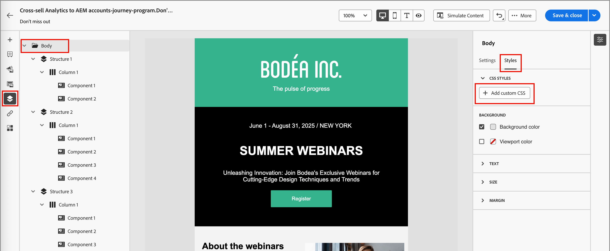
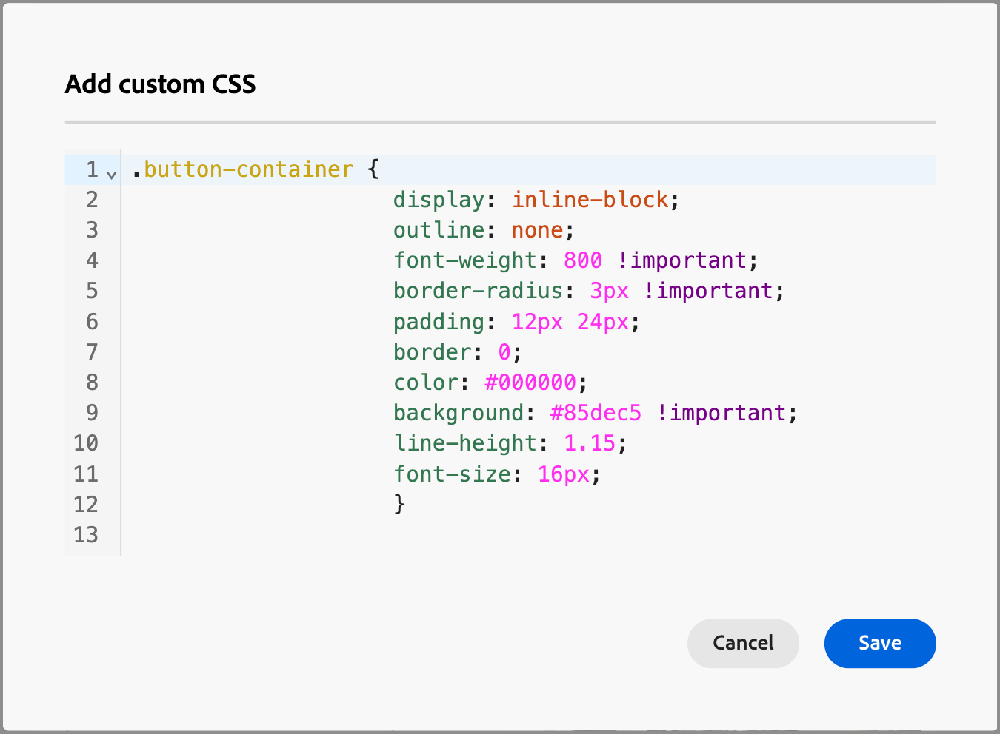
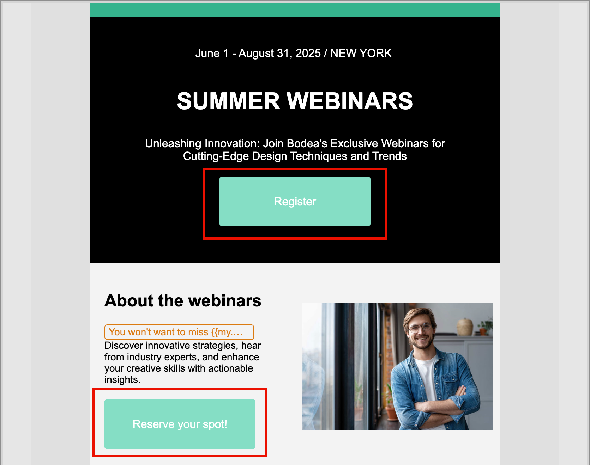

# 為內容新增自訂CSS

您可以直接在電子郵件或登入頁面設計空間新增自己的自訂CSS。 使用自訂CSS套用進階和特定的樣式，以擁有更大的彈性並控制內容的外觀。

自訂CSS已使用`<head>`屬性附加至`<style>`標籤內的`data-name="global-custom"`區段。 此結構可確保將自訂樣式全域套用至內容。

+++ 實作範例

```html
<!DOCTYPE html>
<html>
  <head>
    <meta charset="utf-8">
    <meta name="content-version" content="3.3.31">
    <meta name="x-apple-disable-message-reformatting">
    <meta name="viewport" content="width=device-width,initial-scale=1.0">
    <style data-name="default" type="text/css">
      td { padding: 0; }
      th { font-weight: normal; }
    </style>
    <style data-name="grid" type="text/css">
      .acr-grid-table { width: 100%; }
    </style>
    <style data-name="acr-theme" type="text/css" data-theme="default" data-variant="0">
      body { margin: 0; font-family: Arial; }
    </style>
    <style data-name="media-default-max-width-500px" type="text/css">
      @media screen and (max-width: 500px) {
        body { width: 100% !important; }
      }
    </style>
    <style data-name="global-custom" type="text/css">
      /* Add you custom CSS here */
    </style>
  </head>
  <body>
    <!-- Minimal content -->
  </body>
</html>
```

+++

>[!NOTE]
>
>自訂CSS未反映或驗證在所選元件的&#x200B;_[!UICONTROL 樣式]_&#x200B;面板中。 它完全獨立，而且只能透過Body元件層級的[!UICONTROL 新增自訂CSS]選項進行修改。

## 新增您的自訂CSS

1. 在畫布中至少新增一個內容元件時，請在左側導覽中選取&#x200B;**[!UICONTROL 內文]**&#x200B;元件。

1. 選取右側的&#x200B;_樣式_&#x200B;索引標籤，然後按一下&#x200B;**[!UICONTROL 新增自訂CSS]**。

   {width="800" zoomable="yes"}

   >[!NOTE]
   >
   >_[!UICONTROL 新增自訂CSS]_&#x200B;按鈕只有在選取&#x200B;_[!UICONTROL 內文]_&#x200B;元件時才能使用。 不過，您可以將自訂CSS樣式套用至其中的所有元件。

   _[!UICONTROL 新增自訂CSS]_&#x200B;彈出式編輯器會顯示預留位置代碼註解。

1. 在編輯器中輸入CSS程式碼。

   請確定自訂CSS有效並遵循正確語法。 如果輸入的CSS無效，會顯示錯誤訊息且無法儲存CSS。 若要深入瞭解，請參閱[CSS有效性](#css-validity)。

   {width="450"}

1. 按一下[儲存]儲存自訂CSS。**&#x200B;**

   自訂樣式表會套用至現有內容。 您可以檢查自訂CSS是否已根據您的需求套用。 如需如何進行變更及調整樣式表應用程式的詳細資訊，請參閱[疑難排解](#troubleshooting)。

   {width="600" zoomable="yes"}

## CSS有效性

>[!CAUTION]
>
>使用者須負責其自訂CSS的安全性。 確保您的CSS不會引進漏洞或與現有內容衝突。
>
>避免使用可能無意中破壞內容版面或功能的CSS。

+++ 有效CSS的範例

```css
.acr-component[data-component-id="form"] {
  display: flex;
  justify-content: center;
  background: none;
}

.acr-Form {
  width: 100%;
  padding: 20px 100px;
  border-spacing: 0px 8px;
  box-sizing: border-box;
  margin: 0;
}

.acr-Form .spectrum-FieldLabel {
  width: 20%;
}

.acr-Form.spectrum-Form--labelsAbove .spectrum-FieldLabel,
.acr-Form [data-form-item="checkbox"] .spectrum-FieldLabel {
  width: auto;
}

.acr-Form .spectrum-Textfield {
  width: 100%;
}

#acr-form-error,
#acr-form-confirmation {
  width: 100%;
  padding: var(--spectrum-global-dimension-static-size-500);
  display: flex;
  align-items: center;
  flex-direction: column;
  justify-content: center;
  gap: var(--spectrum-global-dimension-static-size-200);
}

.spectrum-Form-item.is-required .spectrum-FieldLabel:after{
  content: '*';
  font-size: 1.25rem;
  margin-left: 5px;
  position: absolute;
}

/* Error field placeholder */
.spectrum-HelpText {
  display: none !important;
}

.spectrum-HelpText.is-invalid,
.is-invalid ~ .spectrum-HelpText {
  display: flex !important;
}
```

```css
@media only screen and (min-width: 600px) {
  .acr-paragraph-1 {
    width: 100% !important;
  }
}
```

+++

+++ 無效CSS的範例

不接受使用`<style>`標籤：

```html
<style type="text/css">
  .acr-Form {
    width: 100%;
    padding: 20px 100px;
    border-spacing: 0px 8px;
    box-sizing: border-box;
    margin: 0;
  }
</style>
```

不接受無效語法，例如缺少大括弧：

```css
body {
  background: red;
```

+++

## 匯入內容中的CSS

如果您想要搭配匯入電子郵件或登入頁面設計空間的內容使用自訂CSS，請考慮下列事項：

* 如果您匯入包含CSS的外部HTML內容，則會以<!-- unless converting that content, -->相容性模式[!UICONTROL 填入該內容，且無法使用]CSS樣式[!UICONTROL 區段。]

* 如果您匯入原本使用[!UICONTROL 新增自訂CSS]選項在電子郵件或登入頁面設計空間建立的內容，則套用的CSS會透過相同選項顯示及編輯。

## 疑難排解

如果您的自訂CSS未如預期套用，請使用瀏覽器開發人員工具來檢查內容，並確認您的CSS是否鎖定正確的選取器。 檢閱樣式程式碼時，請考量下列事項：

* 請檢查您的CSS是否有效且沒有語法錯誤（例如缺少大括弧、屬性名稱不正確）。

* 檢查您的CSS是否已新增至具有`<style>`屬性的`data-name="global-custom"`標籤。

* 檢查`global-custom`樣式標籤是否已將屬性`data-disabled`設定為true，例如：

  `<style data-name="global-custom" type="text/css" data-disabled="true"> body: { color: red; } </style>`

* 檢查您的CSS是否未覆寫於內容中的某個位置，例如套用的內嵌樣式。

* 將`!important`新增至您的宣告以確保它們優先，例如：

  ```
  .acr-Form {
  background: red !important;
  }
  ```
