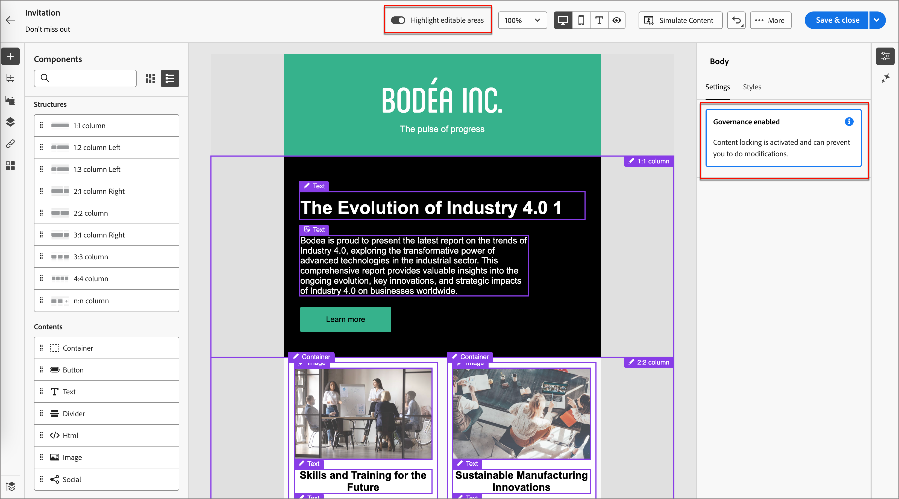
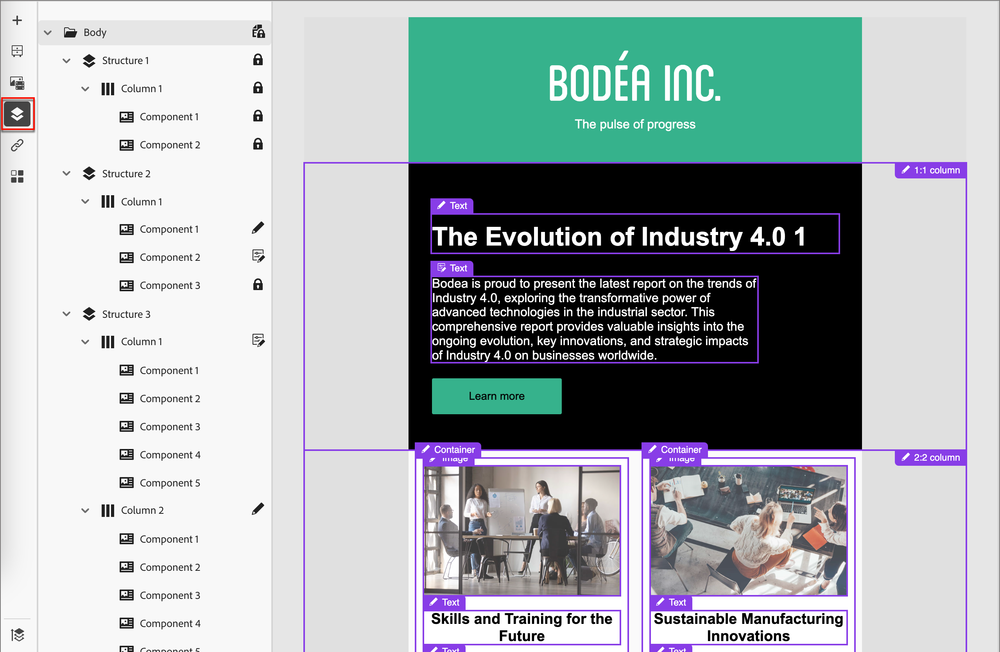

# 從控管範本中作者

內容設計工具可以在建立電子郵件範本時啟用[治理（_內容鎖定_）](./template-content-governance.md)。 治理功能可讓他們指定在帳戶歷程中使用時無法變更的設計部分。 當您[選取已儲存的範本](./email-authoring.md#select-a-template)來製作電子郵件時，視覺化設計工具會載入範本，以便您能將其用作電子郵件的基礎。

如果範本已啟用治理，右側的「屬性」面板中會顯示警報。 您可以開啟畫布頂端的&#x200B;**[!UICONTROL 反白可編輯區域]**，以檢視哪些元件和內容元素可以在您的歷程中使用。

{width="800" zoomable="yes"}

您也可以使用&#x200B;_導覽樹狀結構_&#x200B;來判斷已鎖定或可編輯的元素。 按一下畫布左側的&#x200B;_導覽樹狀結構_&#x200B;圖示（）以顯示樹狀結構。

{width="600" zoomable="yes"}

這些圖示會指出套用的內容鎖定設定。

| 圖示 | 名稱 | 說明 |
|------|------|-------------|
|  | 唯讀 | 元件已鎖定，無法編輯。 在根(_[!UICONTROL Body]_)層級套用時，所有子元件都已鎖定且無法編輯。 |
|  | 內容鎖定 | 在元件層級套用內容鎖定。 |
|  | 可編輯 | 元件完全可編輯。 不過，您可能無法刪除元素。 |
|  | 可編輯 — 僅內容 | 元件和樣式為靜態，但您可以變更內容（例如文字或影像）。 |
