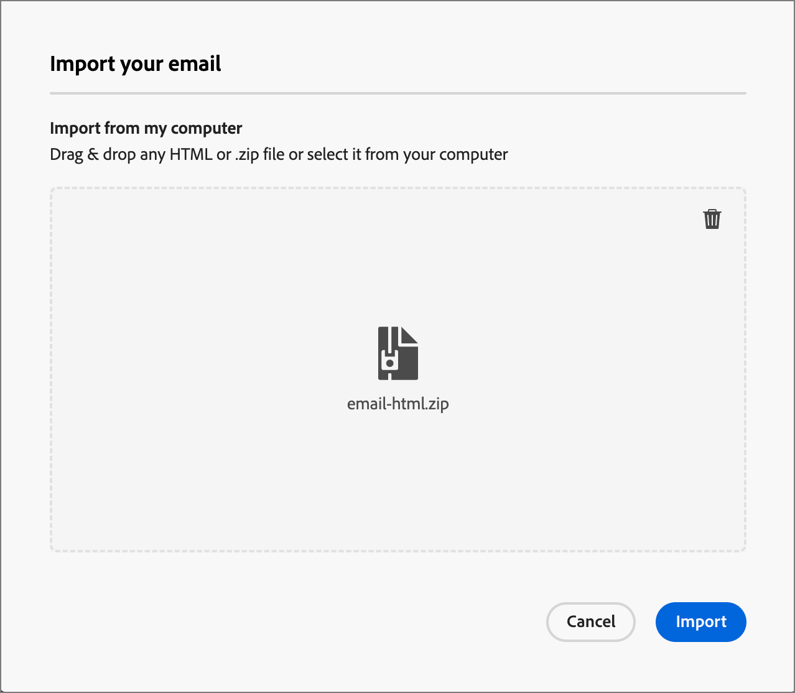
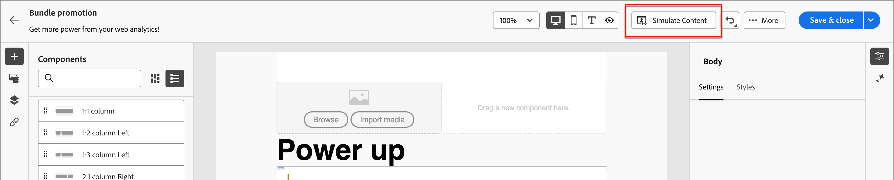

# 電子郵件訊息製作

在您&lbrack;新增新的<!-- or duplicated -->電子郵件資產至歷程動作節點&rbrack;(./add-email.md)後，您可以定義電子郵件訊息的內容。

按一下右側面板上&#x200B;**[!UICONTROL 詳細資料]**&#x200B;索引標籤中的&#x200B;_[!UICONTROL 編輯電子郵件內容]_。

![按一下[編輯電子郵件內容] ](./assets/add-email-content.png){width="700" zoomable="yes"}

此動作會啟動電子郵件設計工具，您可在其中從下列選項中選擇要如何設計電子郵件：

* [使用電子郵件Designer介面，從草稿開始設計電子郵件](#design-your-email-from-scratch)。

* [從檔案或.zip資料夾匯入現有的HTML內容](#import-existing-html-content)。

* [從內建或自訂電子郵件範本清單中選取現有的範本](#select-a-template)。

建立並個人化電子郵件內容後，您可以匯出內容以供驗證或稍後使用。 按一下&#x200B;**[!UICONTROL 匯出HTML]**，將內容儲存為.zip檔案，其中包含您的HTML和資產。

>[!TIP]
>
>使用由generative AI支援的Adobe Journey Optimizer B2B edition中的AI助理，將您的內容提升到新的境界。 AI Assistant可以產生整封電子郵件、鎖定目標文字內容，並針對與對象產生迴響的影像取得AI Assistant建議，協助您最佳化傳送的影響。 [了解更多](./ai-assistant-emails.md)

## 從頭開始設計您的電子郵件 {#design-from-scratch}

>[!CONTEXTUALHELP]
>id="ajo-b2b_structure_components_landing_page"
>title="新增結構元件"
>abstract="結構元件會定義登陸頁面的版面。將&#x200B;**結構**&#x200B;元件拖放到畫布中開始設計您的登入頁面內容。"

>[!CONTEXTUALHELP]
>id="ajo-b2b_content_components_landing_page"
>title="關於內容元件"
>abstract="內容元件是可以用來建立登陸頁面版面的空白內容預留位置。"

使用視覺內容設計空間來定義電子郵件的結構和內容。 透過使用簡單的拖放動作新增和移動結構元件，您可以在數秒內設計可重複使用電子郵件內容的形狀。

1. 從&#x200B;_[!UICONTROL 設計您的範本]_&#x200B;首頁，選取&#x200B;**[!UICONTROL 從頭開始設計]**&#x200B;選項。
1. [新增結構和內容](#add-structure-and-content)至電子郵件訊息。
1. [新增影像資產](#add-assets)至電子郵件訊息。
1. [個人化電子郵件內容](#personalize-content)。
1. [檢閱和更新連結](#preview-and-edit-linked-urls)。
1. [測試電子郵件](#check-and-test-the-email)。

<!-- If needed, you can further personalize your email by clicking **[!UICONTROL Switch to code editor]** from the advanced menu. The code editor allows you to edit the email source code, such as adding tracking or custom HTML tags.

>[!CAUTION]
>
>You cannot revert back to the visual designer for this email after switching to the code editor. -->

當您滿意內容時，請按一下[儲存]。**&#x200B;**

## 匯入現有的HTML內容

{{$include /help/_includes/content-design-import.md}}

{width="500"}

>[!NOTE]
>
>在HTML檔案中使用`<table>`標籤做為第一個圖層可能會造成樣式遺失，包括上層圖層標籤中的背景和寬度設定。

您可以視需要使用視覺化電子郵件編輯器工具個人化匯入的內容。

## 選取範本

{{$include /help/_includes/content-design-select-template.md}}

>[!NOTE]
>
> 儲存的範本可能會套用至一或多個元件的治理（內容鎖定）設定。 當您[從受控制的範本](./email-authoring-governance.md)撰寫電子郵件時，視覺化設計工具會提供鎖定元件的相關准則。

## 新增結構和內容 {#structure-content}

>[!CONTEXTUALHELP]
>id="ajo-b2b_structure_components_email"
>title="新增結構元件"
>abstract="結構元件會定義電子郵件的版面。將&#x200B;**結構**&#x200B;元件拖放到畫布中開始設計您的電子郵件內容。"

>[!CONTEXTUALHELP]
>id="ajo-b2b_content_components_email"
>title="關於內容元件"
>abstract="內容元件指可用於建立電子郵件版面的空白內容預留位置。"

{{$include /help/_includes/content-design-components.md}}

### 新增自訂 CSS

您可以直接在電子郵件設計空間新增自己的自訂CSS。 使用自訂CSS套用進階和特定的樣式，以擁有更大的彈性並控制內容的外觀。 最佳實務是在加入影像、按鈕和文字等元件前，先新增此最高層級的樣式。

如果畫布中至少有一個內容元件，請在左側導覽樹狀結構中選取&#x200B;**[!UICONTROL Body]**&#x200B;元件，以存取自訂CSS編輯器。

>[!NOTE]
>
>如果您的電子郵件訊息是使用具有鎖定內容[的](./template-content-governance.md)範本設計，則無法將自訂CSS新增至您的內容。 按鈕標籤變更為&#x200B;**[!UICONTROL 檢視自訂CSS]**，而且內容中已存在的任何自訂CSS都是唯讀的。

{width="800" zoomable="yes"}

{{$include /help/_includes/content-design-custom-css.md}}

### 新增片段

{{$include /help/_includes/content-design-use-fragments.md}}

儲存電子郵件後，當您在摘要中選取&#x200B;_[!UICONTROL 使用者]_&#x200B;索引標籤時，它就會顯示在片段詳細資訊頁面中。

### 新增資產

{{$include /help/_includes/content-design-assets.md}}

### 導覽圖層、設定和樣式

{{$include /help/_includes/content-design-navigation.md}}

### 將內容個人化

{{$include /help/_includes/content-design-personalization-email.md}}

>[!NOTE]
>
>如果針對帳戶歷程定義了&#x200B;_[!UICONTROL 我的Token]_，您也可以將這些歷程專屬的Token用於電子郵件內容。 如需詳細資訊，請參閱電子郵件個人化的[自訂權杖](./personalization-my-tokens.md)。

### 編輯連結的URL追蹤

{{$include /help/_includes/content-design-links.md}}

### 檢視選項

善用視覺化電子郵件編輯器中可用的檢視和內容驗證選項。

* 透過預設縮放選項放大/縮小內容。

* 切換在案頭、行動裝置或純文字/純文字間檢視內容。
   * 按一下&#x200B;_檢視_&#x200B;圖示，即可跨裝置預覽內容。
   * 選取其中一個現成可用的裝置，或輸入自訂維度以預覽內容。

## 更多選項

從電子郵件設計空間頂端的&#x200B;_[!UICONTROL 更多……]_&#x200B;功能表，您可以執行下列動作：

![按一下[更多]以存取範本動作](./assets/email-designer-more-menu.png){width="500"}

* **[!UICONTROL 重設電子郵件]** — 按一下此選項，將視覺化電子郵件設計工具畫布清除為空白並重新啟動內容建置。
* **[!UICONTROL 另存為片段]** — 將電子郵件的全部或部份另存為片段，以便在多個電子郵件或電子郵件範本中重複使用。 您提供片段的名稱和說明，並將其儲存到可用片段清單中。
* **[!UICONTROL 變更您的設計]** — 返回&#x200B;_設計您的電子郵件_&#x200B;頁面。 從那裡，您可以選擇另一個範本以重新啟動設計程式，或選擇在黑色畫布中從頭開始設計內容。\
* **[!UICONTROL 另存為內容範本]** — 將電子郵件內文另存為電子郵件範本，以便在多個電子郵件或電子郵件範本中重複使用。 您可以提供範本的名稱和說明，並將其儲存至已儲存電子郵件範本的清單。
* **[!UICONTROL 匯出HTML]** — 將視覺畫布中的內容以HTML格式下載到您的本機系統，並封裝成zip檔。

## 檢查和測試電子郵件 {#email-testing}

>[!CONTEXTUALHELP]
>id="ajo-b2b_email_preview_simulate"
>title="檢查您內容的呈現方式"
>abstract="定義內容後，您可以進行預覽，並檢查所使用的頻道是否正確呈現。"

定義訊息內容時，您可以使用測試設定檔來預覽內容、傳送校樣，以及檢閱其在桌上型電腦和行動外觀比例中的呈現。 如果您已插入個人化內容，您可以使用測試設定檔資料預覽此內容在訊息中的顯示方式。

若要[預覽電子郵件內容](./email-simulate-content.md)，請按一下&#x200B;**[!UICONTROL 模擬內容]**&#x200B;並選取測試設定檔，以使用人員設定檔資料檢查您的訊息。

{width="700" zoomable="yes"}

您可以存取其他工具來驗證和檢閱電子郵件內容：

* [傳送證明](./email-simulate-content.md#send-proofs)
* [測試電子郵件使用者端中的轉譯](./email-test-rendering.md)
<!-- * Generate a spam report -->
