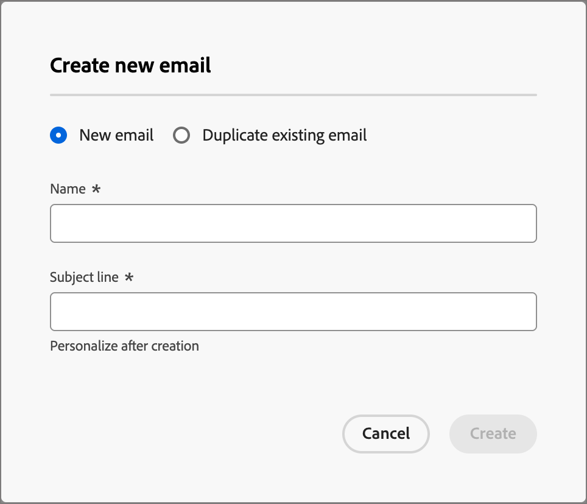

# 電子郵件製作

使用Adobe Journey Optimizer B2B Edition傳送電子郵件訊息給您的客戶。 您可以在電子郵件設計工具建立、個人化以及預覽訊息。

## 在帳戶歷程中新增電子郵件動作

當您新增&#x200B;_[!UICONTROL 採取動作]_&#x200B;節點並執行下列動作時，可以在帳戶歷程中設定電子郵件傳遞：

1. 針對&#x200B;]_目標上的_[!UICONTROL &#x200B;動作，請選擇&#x200B;**[!UICONTROL 人員]**。
1. 針對人員&#x200B;]_的_[!UICONTROL &#x200B;動作，請選擇&#x200B;**[!UICONTROL 傳送電子郵件]**。
1. 針對&#x200B;_[!UICONTROL 電子郵件來源]_，請選擇&#x200B;**[!UICONTROL 建立新電子郵件]**。

   或者，您也可以選取「_[!UICONTROL 從Adobe Marketo Engage選取電子郵件]_」選項，在Marketo Engage中使用其中一個預先撰寫的電子郵件，並將其作為帳戶歷程的一部分傳送。

   >[!NOTE]
   >
   >如果您是第一次建立電子郵件，請務必從Adobe Marketo Engage中設定電子郵件頻道。 若要深入瞭解，請參閱Marketo Engage檔案中的[確定電子郵件傳遞能力](https://experienceleague.adobe.com/en/docs/marketo/using/getting-started/initial-setup/setup-steps#ensure-email-deliverability)。

   {width="700" zoomable="yes"}

1. 在&#x200B;_[!UICONTROL 執行動作]_&#x200B;面板底部，按一下&#x200B;**[!UICONTROL 建立電子郵件]**。

1. 在對話方塊中，輸入電子郵件的唯一&#x200B;**[!UICONTROL 名稱]**，以及&#x200B;**[!UICONTROL 主旨列]**。

   {width="400"}

1. 按一下&#x200B;**[!UICONTROL 建立]**。

   在電子郵件內容頁面的&#x200B;_[!UICONTROL 電子郵件屬性]_&#x200B;區段中，_[!UICONTROL 寄件者電子郵件]_&#x200B;與&#x200B;_[!UICONTROL 回覆地址]_&#x200B;欄位已設定。 您可以輸入&#x200B;_[!UICONTROL From name]_&#x200B;和&#x200B;_[!UICONTROL Description]_ （選擇性）欄位的值。

## 建立該電子郵件內容

按一下&#x200B;_[!UICONTROL 電子郵件]_&#x200B;預覽面板頂端的&#x200B;**[!UICONTROL 新增電子郵件內容]**。

![按一下[新增電子郵件內容] ](./assets/add-email-content.png){width="700" zoomable="yes"}

此動作會啟動電子郵件Designer，您可在其中從下列選項選擇設計電子郵件的方式：

* [使用電子郵件Designer介面，從草稿開始設計電子郵件](#design-your-email-from-scratch)。

* [從檔案或.zip資料夾匯入現有的HTML內容](#import-existing-html-content)。

* [從內建或自訂電子郵件範本清單中選取現有的範本](#select-a-template)。

若要使用運算式編輯器設定並個人化主旨列，請按一下&#x200B;_Personalization_&#x200B;圖示並新增任何Marketo Engage權杖。

建立並個人化電子郵件內容後，您可以匯出內容以供驗證或稍後使用。 按一下&#x200B;**[!UICONTROL 匯出HTML]**，將內容儲存為.zip檔案，其中包含您的HTML和資產。

>[!TIP]
>
>使用由generative AI支援的Adobe Journey Optimizer B2B Edition AI Assistant，將您的內容提升到新的境界。 AI Assistant可以產生整封電子郵件、鎖定目標文字內容，並針對與對象產生迴響的影像取得AI Assistant建議，協助您最佳化傳送的影響。 [了解更多](./ai-assistant-emails.md)

### 從草稿開始設計您的電子郵件

1. 從Designer首頁，選取&#x200B;**[!UICONTROL 從頭開始設計]**&#x200B;選項。

1. 若要開始您的內容設計，請從&#x200B;**[!UICONTROL 結構]**&#x200B;拖曳一個專案，然後將其放到畫布上。

   對每個結構元件重複此步驟，以建構電子郵件的版面。

1. 視需要從&#x200B;_結構_&#x200B;新增任意數目的專案，並編輯右側窗格中每個專案的設定。

   選取n：n欄元件以定義您選擇的欄數（介於3到10之間）。 您也可以移動欄下方的箭頭來定義每欄的寬度。

   每個欄大小不能小於結構元件總寬度的10%。 只能移除空白欄。

1. 展開&#x200B;**[!UICONTROL 內容]**&#x200B;區段，並新增您所需數量的元素至一或多個結構元件。

1. 如有需要，您可以在&#x200B;_[!UICONTROL 設定]_&#x200B;或&#x200B;_[!UICONTROL 樣式]_&#x200B;標籤中為每個元件進行其他自訂。

   例如，您可以變更文字樣式、每個元件的邊框間距或邊界。

1. 從資產選擇器中，您可以直接選取儲存在Assets資料庫中的資產。

   連按兩下包含資產的資料夾。 將專案拖放至結構元件中。

1. 插入個人化欄位，從設定檔屬性、對象成員資格、內容屬性等自訂內容。

<!-- 1. Click **[!UICONTROL Enable condition content]** to add dynamic content and adapt the content to the targeted profiles based on conditional rules.
-->
1. 從左窗格中選取&#x200B;**[!UICONTROL 連結]**&#x200B;索引標籤，以顯示您所追蹤內容的所有URL。

   您可以修改&#x200B;_追蹤型別_&#x200B;或&#x200B;_標籤_，並視需要新增標籤。

如有需要，您可以按一下進階功能表中的&#x200B;**[!UICONTROL 切換到程式碼編輯器]**，以進一步個人化您的電子郵件。 程式碼編輯器可讓您編輯電子郵件原始程式碼，例如新增追蹤或自訂HTML標籤。

>[!CAUTION]
>
>切換到程式碼編輯器後，您無法返回此電子郵件的視覺化設計工具。

內容完成時，請按一下頂端的&#x200B;**[!UICONTROL 模擬內容]**&#x200B;以檢查轉譯。 您可以選擇案頭或行動檢視。

準備就緒後，按一下「儲存」。

### 匯入現有的HTML內容

匯入的內容可以是：

* 包含內建樣式表的HTML檔案
* 包含HTML檔案、樣式表(.css)和影像檔案的.zip資料夾

>[!NOTE]
>
>.zip檔案結構沒有限制。 不過，參照必須是相對參照，而且符合.zip資料夾的樹狀結構。

_若要匯入包含HTML內容的檔案：_

1. 從電子郵件Designer首頁，選取&#x200B;**[!UICONTROL 匯入HTML]**。

1. 拖放包含HTML內容的HTML或.zip檔案，然後按一下[!UICONTROL 匯入]。

   當HTML內容上載完成時，您的內容處於&#x200B;_相容性模式_。 在此模式中，您只能個人化您的文字、新增連結或包含資產至您的內容。

### 選取範本

您可以選擇以下選項：

* 範例範本。 Journey Optimizer介面提供20個立即可用的電子郵件範本，供您選擇。

* 已儲存的範本。

* 您使用&#x200B;_範本_&#x200B;功能表從頭建立自訂範本，或使用&#x200B;_[!UICONTROL 另存為內容範本]_&#x200B;選項從歷程中的電子郵件儲存自訂範本。

_若要使用範例或儲存的範本之一開始建立您的內容：_

1. 從電子郵件內容編輯工作區存取&#x200B;_電子郵件Designer_。

   在&#x200B;_[!UICONTROL 建立您的電子郵件]_&#x200B;頁面上，預設會選取&#x200B;**[!UICONTROL 範本範例]**&#x200B;索引標籤。

1. 若要使用自訂範本，請選取&#x200B;**[!UICONTROL 儲存的範本]**&#x200B;索引標籤。

   隨即顯示在目前沙箱中建立的所有內容範本清單。 您可以依名稱、上次修改時間或上次建立時間來排序。

1. 從清單中選取您選擇的範本。

1. 選取類別後，您可以使用向右和向左箭頭在該類別的所有範本之間導覽（範例或視您的選擇而儲存）。

1. 按一下頁面右上角的&#x200B;**[!UICONTROL 使用此範本]**。

1. 視需要在&#x200B;_電子郵件Designer_&#x200B;中編輯內容。

## 檢查警報

當您設計電子郵件訊息內容時，當關鍵設定遺失時，警示會顯示在介面（頁面右上方）中。

如果沒有看見此按鈕，表示沒有偵測到的問題。

可偵測到兩種型別的警報：

* **_警告_**&#x200B;參考建議與最佳實務的警告，例如：

   * `The opt-out link is not present in the email body`：將取消訂閱連結新增至您的電子郵件內文為最佳做法。

     >[!NOTE]
     >
     >行銷樣式的電子郵件訊息必須包含選擇退出連結，異動訊息不需要此連結。

   * `Text version of HTML is empty`：別忘了定義電子郵件內文的文字版本，此文字版本會在HTML內容無法顯示時使用。

   * `Empty link is present in email body`：檢查您電子郵件中的所有連結是否正確。

   * `Email size has exceeded the limit of 100KB`：若要取得最佳傳遞，請確定您的電子郵件大小不超過100KB。

* **_錯誤_**&#x200B;會阻止您測試或啟用歷程/行銷活動，只要這些錯誤尚未解決，例如：

   * `The subject line is missing`：電子郵件主旨列是必填欄位。

   * `The email version of the message is empty`：尚未設定電子郵件內容時，會顯示此錯誤。

## 檢查及測試電子郵件

定義訊息內容後，您可以使用測試設定檔來預覽、傳送校樣，以及在熱門的案頭、行動及網頁型使用者端中控制其呈現。 如果您已插入個人化內容，您可以使用測試設定檔資料預覽此內容在訊息中的顯示方式。

若要預覽電子郵件內容，請按一下[模擬內容] ****，然後新增測試設定檔，以使用測試設定檔資料檢查您的訊息。

{width="700" zoomable="yes"}
