# 電子郵件共同作業工具

[電子郵件設計空間](./email-authoring.md)包括用於發表評論和解決問題的共同作業工具，以便行銷團隊能夠直接在[!DNL Journey Optimizer B2B Edition]內順暢地檢閱、討論及完成電子郵件資產。 使用者無須透過外部工具 (如聊天室、電子郵件對話串或試算表) 共用草稿，而是在電子郵件設計空間內進行註解、提出編輯建議和解決意見回饋提出的問題。使用這些工具簡化工作流程、減少錯誤，並確保利害關係人在帳戶歷程中啟動電子郵件行銷活動之前保持一致：

* **_集中式意見反應_** — 在一個地方收集和追蹤所有意見反應。

* **_更快的稽核_** — 共同作業人員可以在編寫環境中稽核電子郵件副本和資產。

* **_改善準確性_** — 將所有編輯內容與電子郵件本身保持連結，以降低錯誤通訊的風險。

* **_透明度_** — 所有評論和解決方法都會保持記錄狀態，清楚說明建議和實施哪些變更。

* **_內容中的Collaboration_** — 檢閱版面配置中的電子郵件內文復本、影像和call-to-action (CTA)元素。

<!-- Enable asynchronous collaboration between team members for an email asset
Allow users to attach comments to specific design elements
Provide a unified interface for viewing and managing all comments within a project
Support comment placement, editing, deleting, and navigation
Display visual indicators (badges) for elements with associated comments -->

## 為檢閱者啟用電子郵件共同作業工具

產品管理員可透過Adobe Experience Cloud中的&#x200B;**[!UICONTROL 許可權]** UI指派&#x200B;_管理B2B電子郵件_&#x200B;許可權，以啟用電子郵件共同作業工具的存取權。

+++ 啟用電子郵件許可權

1. 在許可權應用程式中，移至&#x200B;**[!UICONTROL 角色]**&#x200B;標籤，並選取所需的[角色](https://experienceleague.adobe.com/zh-hant/docs/experience-platform/access-control/abac/permissions-ui/roles){target="_blank"}。

1. 按一下&#x200B;**[!UICONTROL 編輯]**&#x200B;以修改權限。

1. 新增&#x200B;**[!UICONTROL B2B Assets]**&#x200B;資源，然後選取&#x200B;**[!UICONTROL 管理B2B電子郵件]**。

   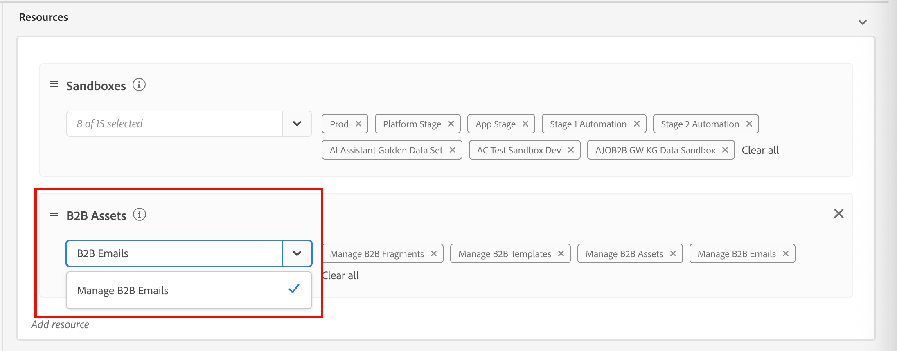{width="700" zoomable="yes"}

1. 按一下[儲存]以套用變更。**&#x200B;**

   已指派給該角色的任何使用者的許可權都會自動更新。

1. 若要將此角色指派給新使用者，請選取&#x200B;**[!UICONTROL 角色]**&#x200B;儀表板中的&#x200B;_[!UICONTROL 使用者]_&#x200B;索引標籤，然後按一下&#x200B;**[!UICONTROL 新增使用者]**。

   * 輸入使用者名稱和電子郵件地址，或從清單中選擇現有使用者。

     如果尚未建立使用者，請參閱[Experience Platform檔案](https://experienceleague.adobe.com/zh-hant/docs/experience-platform/access-control/abac/permissions-ui/users){target="_blank"}。

   * 按一下[儲存]以套用變更。**&#x200B;**

+++

## 顯示共同作業工具和註解

在電子郵件設計空間建立、編輯或檢閱內容時，您可以存取&#x200B;_Collaboration_&#x200B;面板，以新增或管理電子郵件內容的註解。

按一下右側導覽中的&#x200B;_Collaboration_ (  )圖示。

電子郵件設計右側導覽中的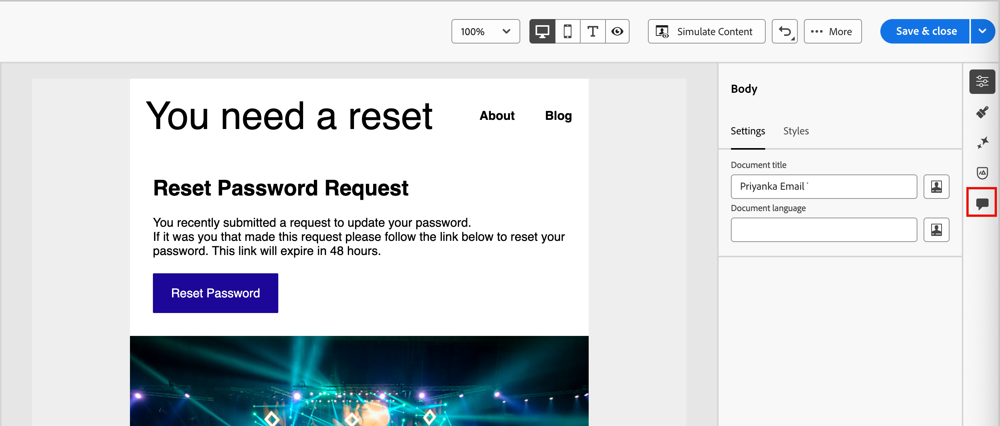{width="700" zoomable="yes"}

## Collaboration工作流程

您可以使用共同作業工具來遵循標準內容工作流程：

1. [邀請](#invite-collaborators-and-reviewers)您的共同作業人員和檢閱者。
1. 檢閱者[新增註解](#add-comments)。
1. 閱讀評論，[新增回覆](#reply-to-a-comment)以討論意見反應，並進行必要的編輯。
1. 檢閱者或作者[解析註解](#resolve-comments)。

>[!BEGINSHADEBOX]

**使用共同作業工具的最佳實務**

* 使用`@`標籤，讓意見可以快速到達正確的團隊成員。

* 將相關的意見反應分組為單一註解對話串，而非多個分散的註解。

* 一有備註時，請務必加以解決，以維持簡潔的工作流程。

* 儲存最終核准的版本，以供遵循性/稽核之用。

>[!ENDSHADEBOX]

### 邀請共同作業人員和檢閱者

1. 選取電子郵件內文。

1. 按一下右側導覽中的&#x200B;_Collaboration_ (  )圖示。

1. 在右側面板的頂端，輸入您的邀請文字，讓使用者進行共同作業並提供意見回饋。

   使用`@`符號處理並通知使用者。 這些使用者會收到電子郵件和產品內脈衝通知。

   當您在符號後面輸入名稱的前幾個字母時，彈出式清單會顯示相符的使用者名稱。 您可以在名稱中輸入更多字母以改善結果。

   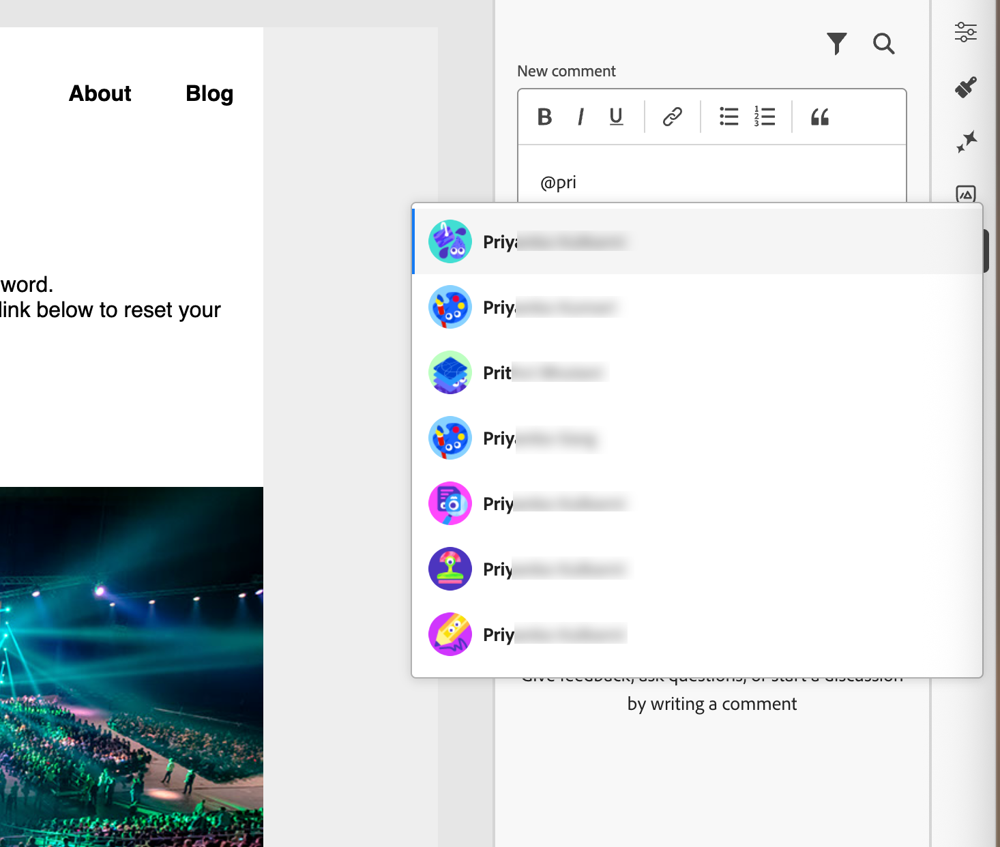{width="550"}

   選取要新增以傳送通知的名稱。

   新增您要在邀請中包含的儘可能多的共同作業人員或稽核者。

   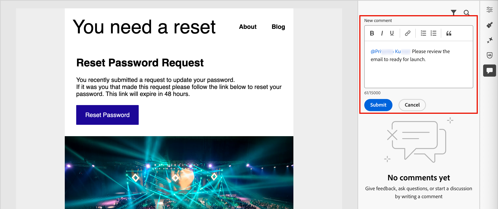{width="700" zoomable="yes"}

1. 按一下&#x200B;**[!UICONTROL 提交]**。

### 新增註解

以電子郵件共同作業人員或檢閱者的身分，在設計空間開啟電子郵件並新增您的意見回饋。 您可以在&#x200B;_Collaboration_&#x200B;面板中輸入一般意見回饋，也可以在畫布中選取元件，並新增該設計元素專屬的註解。 使用`@` (例如&#x200B;_@John的標籤團隊成員，請更新CTA副本_。

每個新註解都會啟動一個對話串，共同作業人員可以使用&#x200B;_回覆_&#x200B;來繼續討論。 與設計元素相關聯的每個註解/對話串都進行編號，以便您輕鬆識別其套用的元素。

#### 一般評論和回饋

在&#x200B;_Collaboration_&#x200B;面板中，使用頂端的文字欄位來輸入有關電子郵件內容的一般註解。 使用`@`符號處理並通知使用者。

用於電子郵件回饋和使用者標籤的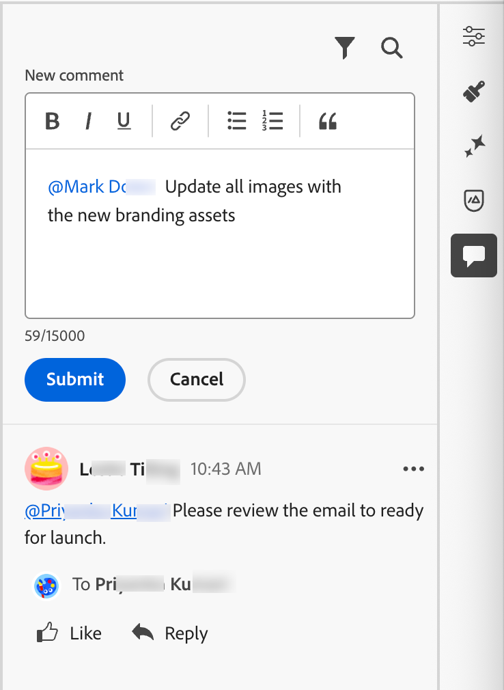{width="400"}

按一下&#x200B;**[!UICONTROL 提交]**&#x200B;以記錄註解並傳送通知給任何已標籤的使用者。

#### 元件註解

1. 選取結構或內容元件。

1. 在工具列中按一下&#x200B;_Collaboration_&#x200B;工具。

   電子郵件編輯器工具列中的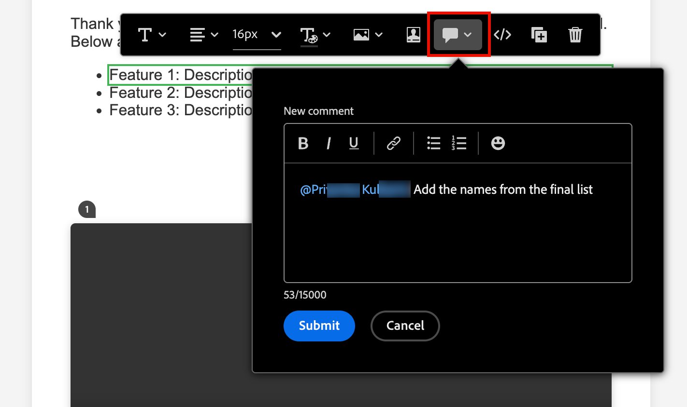{width="600"}

1. 在文字欄位中輸入您的註解。

1. 按一下&#x200B;**[!UICONTROL 提交]**。

共同作業人員可以按一下電子郵件畫布上的編號圖示來檢視註解。

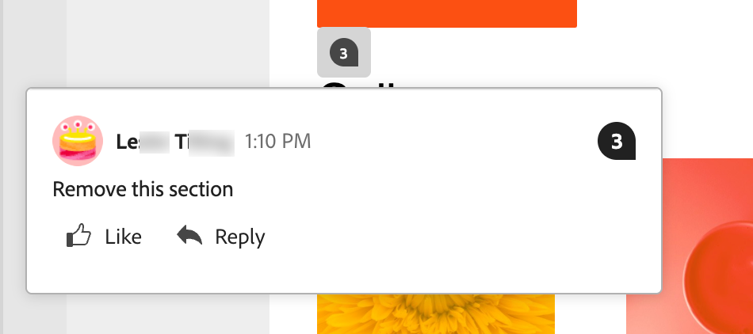{width="450"}

#### 回複評論

對於每個註解，您可以使用&#x200B;_[!UICONTROL 回覆]_&#x200B;功能來繼續討論或回答問題。

按一下評論底部的&#x200B;**[!UICONTROL 回覆]**，然後輸入回覆的文字。 若要在回覆中加入目前註解的引號，請按一下&#x200B;_更多功能表_ ( **...** )圖示，然後選擇&#x200B;**[!UICONTROL 引號回覆]**。

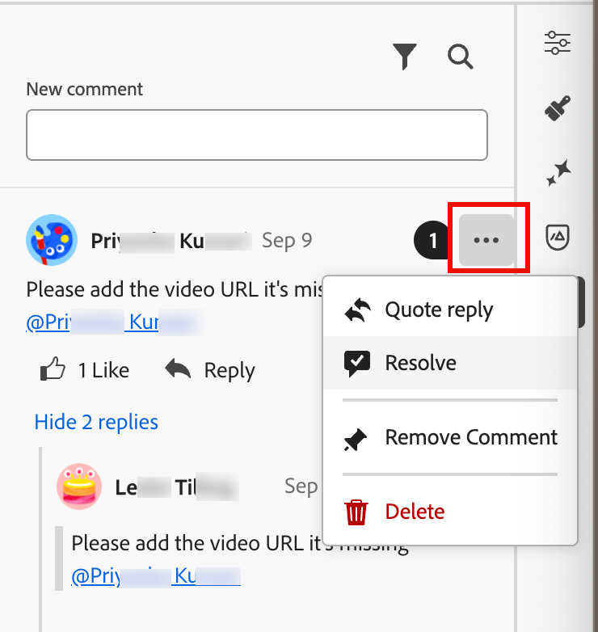{width="350"}

### 解決評論

身為作者或設計人員，請評估稽核者的意見反應，並決定您要進行的變更。 完成變更且滿足要求時，請按一下&#x200B;_更多功能表_ ( **...** )圖示，然後選擇&#x200B;**[!UICONTROL 解決]**。

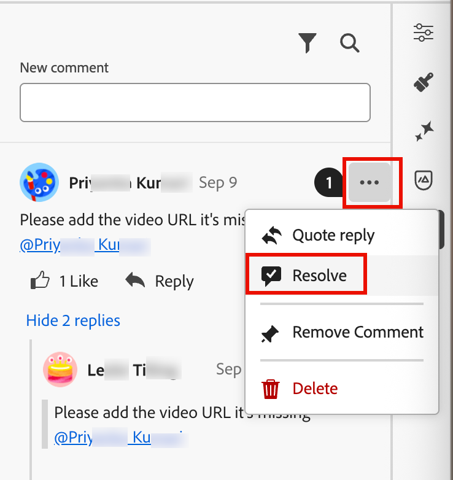{width="350"}

在確認對話方塊中，按一下&#x200B;**[!UICONTROL 解決]**。

## 管理評論

管理評論和執行緒以評估您的共同作業狀態。

### 發表評論

如果註解未與電子郵件畫布上的元素相關聯，您可以視需要&#x200B;_將註解_&#x200B;釘選到元素。 按一下&#x200B;_更多功能表_ ( **...** )圖示，然後選擇&#x200B;**[!UICONTROL 置入註解]**。 然後，在畫布上選取設計元件。

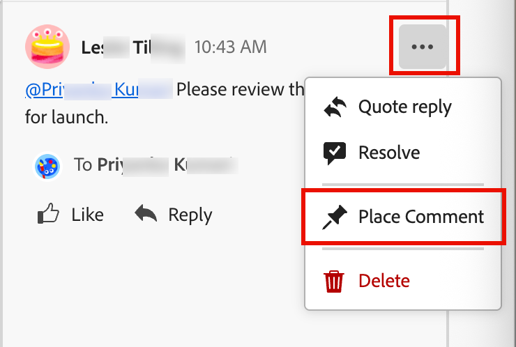{width="350"}

### 移除或刪除註解

您可以透過移除和刪除註釋來清理註釋記錄。 按一下&#x200B;_更多功能表_ ( **...** )圖示，然後選擇&#x200B;**[!UICONTROL 移除註解]**&#x200B;或&#x200B;**[!UICONTROL 刪除]**。

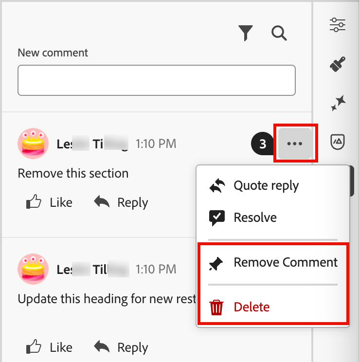{width="350"}

* 移除註解時，該動作會將該註解與設計元素（在建立註解時選取）分離。 註解仍是電子郵件註解記錄的一部分。

* 當您刪除評論時，該動作會將其從記錄中永久刪除。

### 已解決的評論

依預設，已解析的註解會隱藏在&#x200B;_Collaboration_&#x200B;面板中。 您可以隨時透過清除篩選器來顯示已解析的註解。 按一下&#x200B;_篩選器_ （ ）圖示，並清除&#x200B;**[!UICONTROL 隱藏已解析評論]**&#x200B;核取方塊。

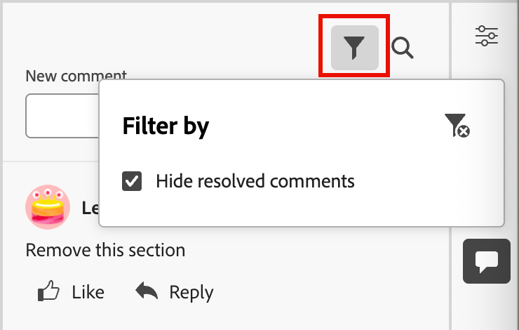{width="350"}

已解析的評論包括&#x200B;_取消解析_ （ ）圖示。 如果您判斷註解/執行緒未解析且需要進一步變更，請按一下圖示以移除&#x200B;_[!UICONTROL 已解析]_&#x200B;指定。

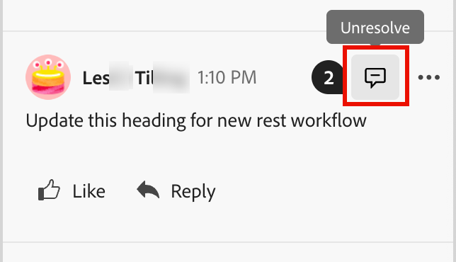{width="300"}
