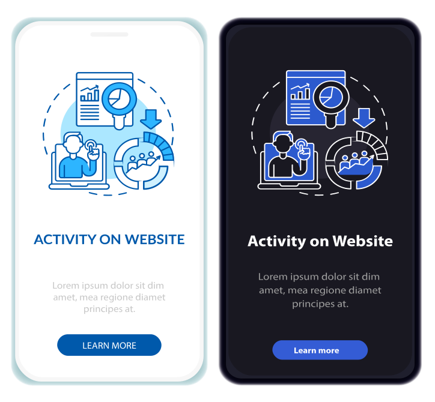
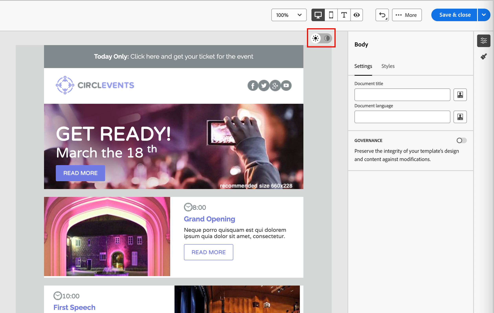
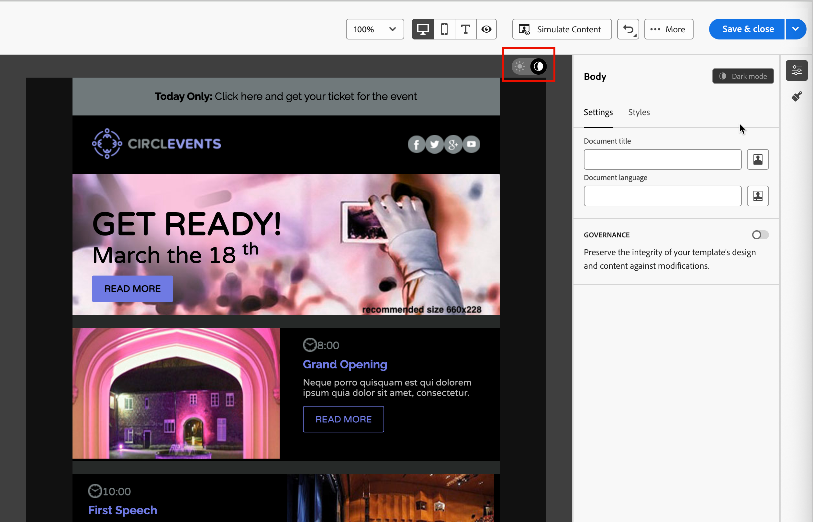
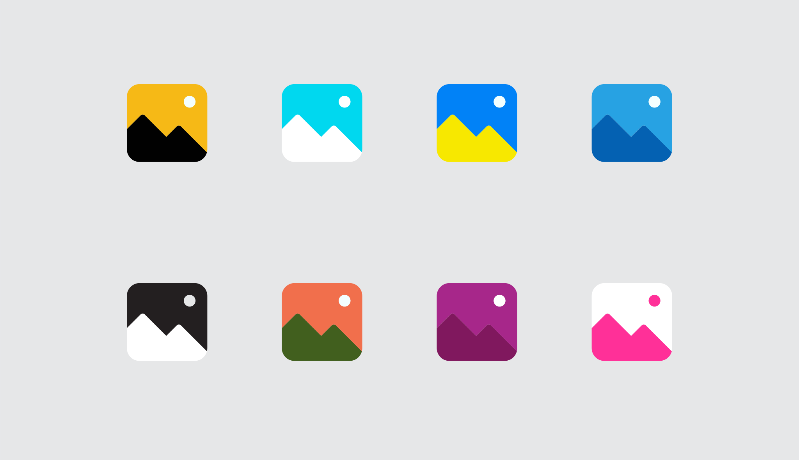
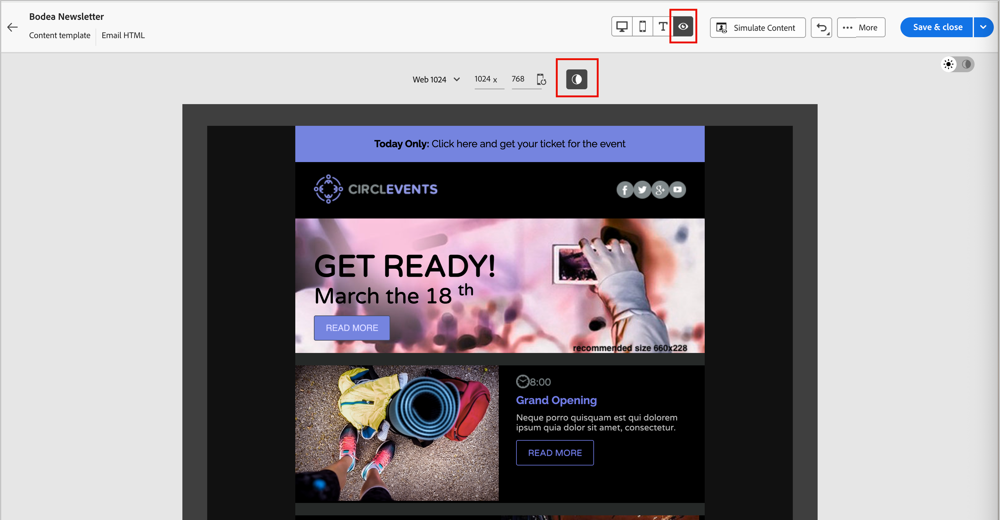

# 電子郵件內容的深色模式 {#dark-mode}

>[!CONTEXTUALHELP]
>id="ajo-b2b_dark_mode"
>title="切換至深色模式"
>abstract="切換至深色模式，而您可以預覽其轉譯方式並定義特定的自訂設定。 最終的轉譯結果取決於收件者的電子郵件用戶端。請注意，所有電子郵件用戶端都不支援自訂深色模式。"

>[!CONTEXTUALHELP]
>id="ajo-b2b_dark_mode_preview"
>title="切換至深色模式"
>abstract="切換至深色模式，以預覽它在支援的電子郵件用戶端上的呈現方式。 最終的轉譯結果取決於收件者的電子郵件用戶端。請注意，所有電子郵件用戶端都不支援深色模式。"

_深色模式_&#x200B;可讓支援的電子郵件使用者端或應用程式針對文字、按鈕和其他視覺元素，顯示背景較暗且顏色較淺的電子郵件。 這種顯示器可減輕眼睛疲勞、節省電池壽命，並改善低光環境的可讀性，提供更舒適的觀賞體驗。 隨著主要作業系統和應用程式呈上升趨勢，這是現代電子郵件設計的重要考量，能確保內容清晰易懂，而且視覺上吸引所有使用者。

{width="50%"}

當您在[視覺化設計空間中](./email-authoring.md)建立您的電子郵件內容[!DNL Journey Optimizer B2B Edition]時，您可以切換至&#x200B;_**[!UICONTROL 深色模式]**_&#x200B;檢視。 在此檢視中，您也可以定義特定的自訂設定，以便在啟用電子郵件使用者端的深色模式時支援這些使用者端。

## 電子郵件使用者端注意事項

不同的電子郵件使用者端和應用程式套用深色模式的方式存在重大差異。 因此，您應謹慎考量對於深色模式演算的期望。 在電子郵件設計空間中使用深色模式之前，請考慮以下電子郵件使用者端使用案例：
<!--
* Check out the list of [email clients supporting dark mode](https://www.caniemail.com/search/?s=dark){target="_blank"}

* Learn more on Dark mode in this [Litmus blog post](https://www.litmus.com/blog/the-ultimate-guide-to-dark-mode-for-email-marketers){target="_blank"}
-->

+++不支援深色模式的使用者端

有些電子郵件使用者端完全不支援此功能，例如：

* [!DNL Yahoo! Mail]
* [!DNL AOL]

如果您在電子郵件設計中定義深色模式自訂設定，這些電子郵件使用者端無法顯示任何深色模式呈現。<!--Regardless of whether the interface is in light or dark mode, your email will render the same.-->

+++

+++使用者端套用自己的深色模式{#default-support}

有些電子郵件使用者端會系統地將其本身的預設深色模式套用至所有收到的電子郵件。 它們會根據其深色模式設定和無法使用的外部設定，自動調整顏色、背景、影像和其他元素。 這些使用者端包括：

* Gmail (案頭網頁郵件、iOS、Android™、行動網頁郵件)
* Outlook Windows
* Outlook Windows Mail

<!--It is important to note that less than 25% of email clients offer customization options for dark mode. Clients such as Gmail implement their own dark mode rendering, which is not subject to external modification.-->
在此情況下，使用者端深色模式設定會覆寫您在[!DNL Journey Optimizer B2B Edition]中定義的自訂深色模式設定

+++

+++支援自訂深色模式的使用者端

許多最熱門的電子郵件使用者端都提供使用`@media (prefers-color-scheme: dark)`查詢來呈現自訂深色模式的選項，這是[!DNL Journey Optimizer B2B Edition]電子郵件樣式所使用的方法。 此使用者端清單包括：

* Apple Mail macOS
* Apple Mail iOS
* Outlook macOS
* Outlook.com
* Outlook iOS
* Outlook Android™

在此情況下，將會轉譯您在[!DNL Journey Optimizer B2B Edition]中定義的特定設定。 不過，某些限制可能會根據每個電子郵件使用者端而適用。 例如，如果電子郵件內容中出現影像，部分使用者端(例如Apple Mail 16 (macOS 13))就不會產生深色模式。

為了獲得最佳結果，請使用您定位的電子郵件使用者端測試您的內容。 若要檢視儘可能接近每個使用者端最終結果的模擬，請在電子郵件設計空間中使用[Litmus電子郵件測試轉譯](./email-test-rendering.md)整合。

+++

## 深色模式設計

當您在[!DNL Journey Optimizer B2B Edition]中設定深色模式的電子郵件內容樣式時，視覺化設計空間提供兩種工具：

* 使用[預覽函式](#preview-default-dark-mode)檢閱大部分支援電子郵件使用者端的預設深色模式轉譯。

* 如果您想要覆寫支援電子郵件使用者端的預設設定，請定義自訂深色模式設定並套用至您的電子郵件內容。 [了解更多](#define-custom-dark-mode)

### 預覽預設深色模式 {#preview-dark-mode}

<!-- Should work with templates and themes, NOT for LP and fragments - but TBC with eng. 
>[!NOTE]
>
>Currently you may not be able to switch to dark mode if you select an [email template](use-email-templates.md) or if you apply a [theme](apply-email-themes.md).-->

1. 在電子郵件設計空間中開啟電子郵件內容。

   在畫布的右上方，有一個淺色與深色選取器，可切換淺色（預設）與深色模式之間的內容顯示。

   {width="700" zoomable="yes"}

1. 將選取器變更為&#x200B;_深色模式_ （  ）。

   畫布使用預設深色模式preview.x來顯示內容

   根據預設，深色模式預覽會將`full color invert`色彩配置套用至影像和圖示以外的所有元素。 此色彩配置會偵測包含明暗元素的區域，並加以反轉。 淺色背景變成深色，深色文字變成淺色，或深色背景變成淺色，淺色文字變成深色。

   {width="700" zoomable="yes"}

>[!CAUTION]
>
>最終轉譯可能會因收件者的電子郵件使用者端而異。 若要檢視儘可能接近每個電子郵件使用者端最終結果的模擬，請使用[Litmus測試電子郵件呈現](./email-test-rendering.md)整合。

### 定義自訂深色模式設定 {#custom-dark-mode}

>[!CONTEXTUALHELP]
>id="ajo-b2b_dark_mode_image"
>title="將特定影像用於深色模式"
>abstract="您可以選取在深色模式開啟時顯示的另一個影像。  新增深色模式的特定影像無法保證在所有電子郵件使用者端中都能正確轉譯。 請注意，所有電子郵件用戶端都不支援自訂深色模式。"

切換至深色模式後，您可以選擇編輯內容的特定樣式元素，這些元素僅在收件者的電子郵件使用者端中啟用深色模式（前提是它支援該功能）時才會顯示。

>[!NOTE]
>
>深色模式的最終呈現取決於每個電子郵件使用者端，因此結果可能因人而異。 如需詳細資訊，請參閱[電子郵件使用者端考量事項](#email-client-considerations)。

電子郵件設計空間中的自訂深色模式樣式使用<!-- `@media (prefers-color-scheme: dark)` method--> `@media (prefers-color-scheme: dark)` CSS查詢，它會偵測電子郵件使用者端是否已設為深色模式，並套用您電子郵件中定義的深色主題設計。

若要定義自訂深色模式設定(_T):_

1. 如有需要，請將選取器移至設計畫布右上角的&#x200B;_深色模式_ （  ）。

1. 編輯任何樣式色彩屬性，例如文字、背景或按鈕。

   {width="700" zoomable="yes"}

1. 針對影像和圖示，僅針對深色模式定義特定資產。

   您無法變更影像和圖示的顏色，但可以定義用於深色模式的替代資產。 您可以嘗試圖示的不同顏色組合，或調整像片影像的顏色和飽和度。

   {width="80%"}

   選取任何影像，並使用&#x200B;**[!UICONTROL 設定]**&#x200B;窗格中的專用切換切換功能切換至&#x200B;**[!UICONTROL 深色模式]**。 然後，選取其他影像資產。

   {width="700" zoomable="yes"}

   如需選取影像資產的詳細資訊，請參閱[新增影像資產](./email-authoring.md#add-image-assets)。

1. 在您的設計變更期間，隨時選取&#x200B;**[!UICONTROL 切換到即時檢視]**，以檢查您的內容在各種裝置大小上的呈現方式。

   從這個檢視，將選擇器變更為&#x200B;_深色模式_ （  ），以預覽不同裝置上的深色模式內容版本。

   {width="800" zoomable="yes"}

   >[!CAUTION]
   >
   >即時檢視是通用的預覽，用來比較各種裝置大小下的轉譯效果。 最終呈現內容可能會因收件者的電子郵件使用者端而異。

1. 當您的深色模式變更完成時，請按一下&#x200B;**[!UICONTROL 模擬內容]**。

   ![電子郵件設計畫布上反白顯示[模擬內容]按鈕以測試深色模式](./assets/email-color-mode-dark-simulate-content.png){width="700" zoomable="yes"}

   使用預覽和校訂工具來測試您的電子郵件設計。 如需詳細資訊，請參閱[預覽和測試您的電子郵件內容](./email-simulate-content.md)。

1. 如果您有Litmus Enterprise帳戶，請選取&#x200B;**[!UICONTROL 轉譯電子郵件]**，以檢視Litmus中各種電子郵件使用者端的最終深色模式轉譯。

   如需詳細資訊，請參閱[使用Litmus](./email-test-rendering.md)測試電子郵件呈現。

   >[!CAUTION]
   >
   >雖然模擬非常接近電子郵件在深色模式中的顯示方式，但由於電子郵件服務提供者或裝置層級設定的差異，實際呈現可能會有所不同。

## 最佳做法 {#best-practices}

隨著主要電子郵件使用者端採用深色模式的人數增加，您必須考量您的電子郵件在明暗環境中呈現的方式，不論您是否使用[自訂深色模式](#define-custom-dark-mode)。

深色模式可以改變顏色、背景和影像 — 有時會覆寫設計選擇。 為確保視覺一致性、協助工具及品牌完整性，請遵循下列最佳實務：

| 實務 |            |
| -------- | ---------- |
| 最佳化您的影像和標誌 | 檢查清單：<ul><li>將圖志和圖示儲存為具有透明背景的PNG檔案，以避免在深色模式中看到白色方塊。 <li>避免使用硬式編碼白色或淺色背景的影像。 <li>如果無法使用透明度，請在設計中將影像置於純色背景上，以防止發生尷尬的顏色倒轉。 |
| 觀看您的背景 | 檢查清單：<ul><li>確保文字和背景顏色之間有足夠的對比，以便在淺色和深色模式中都能閱讀。 <li>避免僅依賴背景顏色處理重要內容。 有些使用者端會以深色模式覆寫背景顏色，因此請確定關鍵資訊仍然可見。 |
| 在深色模式中設計可存取的內容 | 檢查清單：<ul><li>使用顏色組合，可輕鬆區別色盲人士。 <li>使用中間調調色盤，確保與淺色和深色背景的對比。 <li>使用具有高對比度的無障礙色彩組合，以改善可讀性並符合[!DNL Web Content Accessibility Guidelines (WCAG)]標準。 使用[!DNL WebAIM Contrast Checker]之類的工具來驗證色彩對比。 <li>避免使用精簡字型，因為這會影響可讀性。 如果您的品牌需要細字型，請在深色模式中將其粗體。 <li>略過純黑色的純白色，這可能會導致眼睛疲勞，而且在某些電子郵件使用者端中可能會自動反轉。 <li>如果深色模式不受支援，請提供可存取的遞補樣式。 |
| 在深色模式環境中測試您的電子郵件 | 檢查清單：<ul><li>使用電子郵件設計空間中的[深色模式預覽](#preview-dark-mode)，它會使用反轉的色彩配置來提早發現問題。 <li>使用具有[[!UICONTROL 轉譯電子郵件]](./email-test-rendering.md)選項的Litmus Enterprise帳戶，在主要電子郵件使用者端(例如Apple Mail、Gmail和Outlook)間模擬您的設計，並瞭解色彩和影像在深色模式下的行為。 |

<!--KEEP dark mode accessibility best practices IN ONE SINGLE LOCATION - for now listed on this page.
If needed, it can be moved to the Design accessible content page:
The best practices for designing accesible content in dark mode are listed in [this section](accessible-content.md#dark-mode).-->

<!--**Inline critical styles**

Inline CSS helps maintain more control over styling, as some clients strip external styles in dark mode.-->
