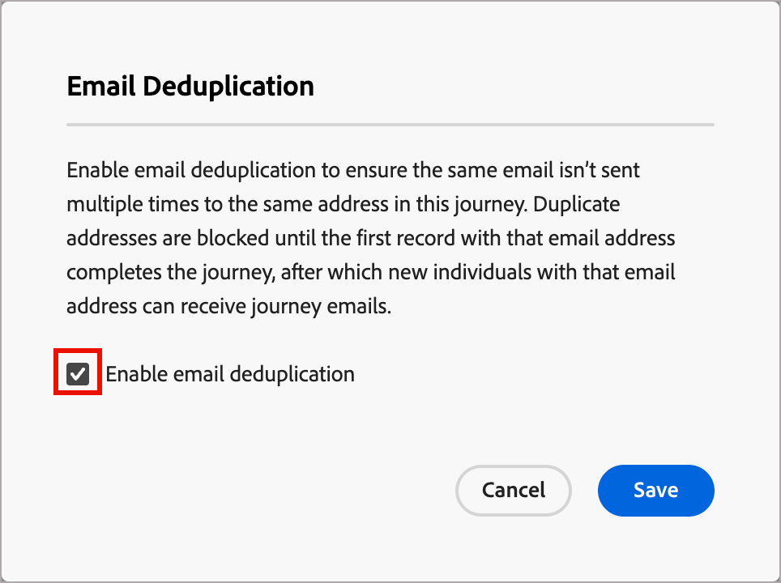

# 電子郵件重複資料刪除

為了確保同一個電子郵件不會在歷程中多次傳送至相同的電子郵件地址，請在帳戶歷程中使用電子郵件重複資料刪除。 當您啟用此功能時，重複的電子郵件地址會被封鎖，直到該電子郵件地址的第一個記錄完成歷程為止。 帳戶完成歷程後，作為進入歷程的新帳戶的一部分，個人將可再次收到電子郵件。

## 何時使用電子郵件重複資料刪除

在啟用電子郵件重複資料刪除時，需要考慮一些重要情況：

* **電子郵件未在Real-Time CDP中作為身分使用** — 同一個電子郵件地址可能會出現在多個人員設定檔中。 如果這些重複的設定檔符合相同歷程的條件，並且您想要防止傳送電子郵件多次，請啟用此功能。

* **與多個帳戶相關聯的單一人員** — 如果您的[!DNL Real-Time CDP]資料模型將單一人員與多個帳戶相關聯，啟用此功能可避免當具有相同電子郵件地址的多個設定檔符合相同歷程的資格時，傳送相同電子郵件兩次。

>[!NOTE]
>
>電子郵件重複資料刪除適用於歷程層級。 如果具有相同電子郵件地址的人員符合不同歷程的資格，他們仍可接收來自每個歷程的電子郵件。

## 為歷程啟用電子郵件重複資料刪除

若要為帳戶歷程啟用電子郵件重複資料刪除：

1. 開啟帳戶歷程。

1. 按一下&#x200B;**[!UICONTROL 更多]** (**...**) 位於歷程工作區的右上角。

   {width="450"}

1. 選擇&#x200B;**[!UICONTROL 電子郵件重複資料刪除]**。

1. 在對話方塊中，選取&#x200B;**[!UICONTROL 電子郵件重複資料刪除]**&#x200B;核取方塊。

   {width="400"}

1. 按一下&#x200B;**[!UICONTROL 儲存]**。

啟用電子郵件重複資料刪除時，歷程會在傳送電子郵件之前檢查每個電子郵件地址。 如果具有相同電子郵件地址的記錄已進入該歷程節點，則新專案會遭到封鎖，直到第一筆記錄完成該歷程為止。
