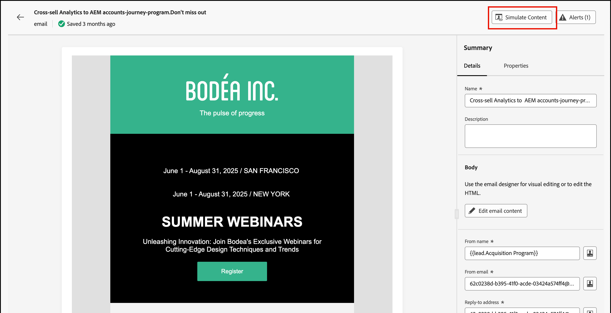
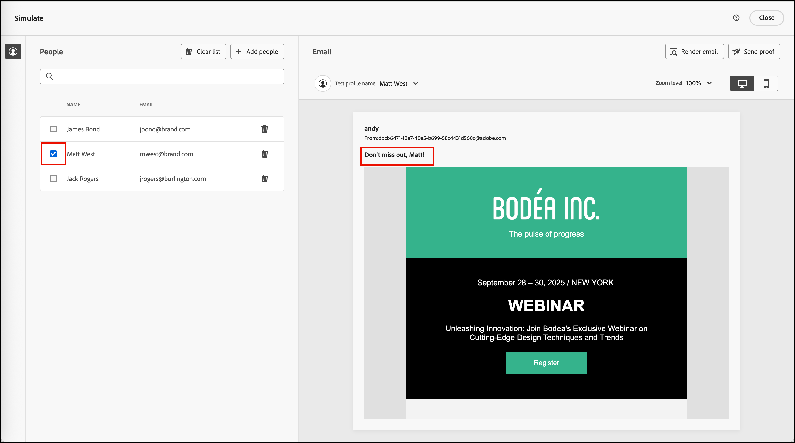
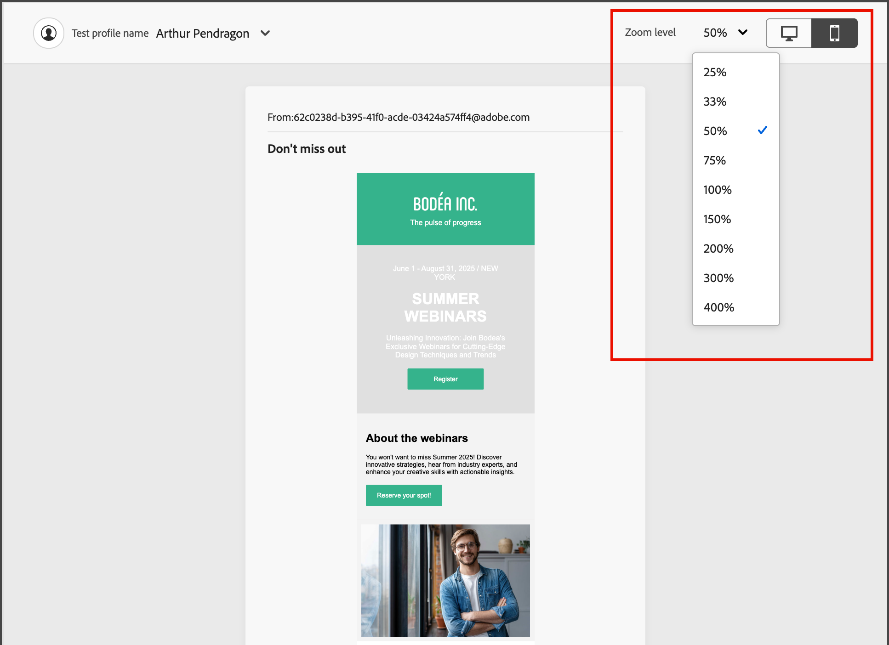
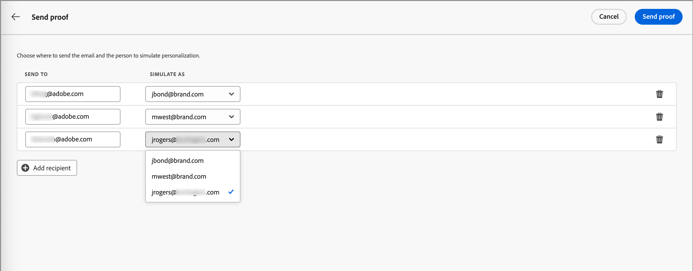
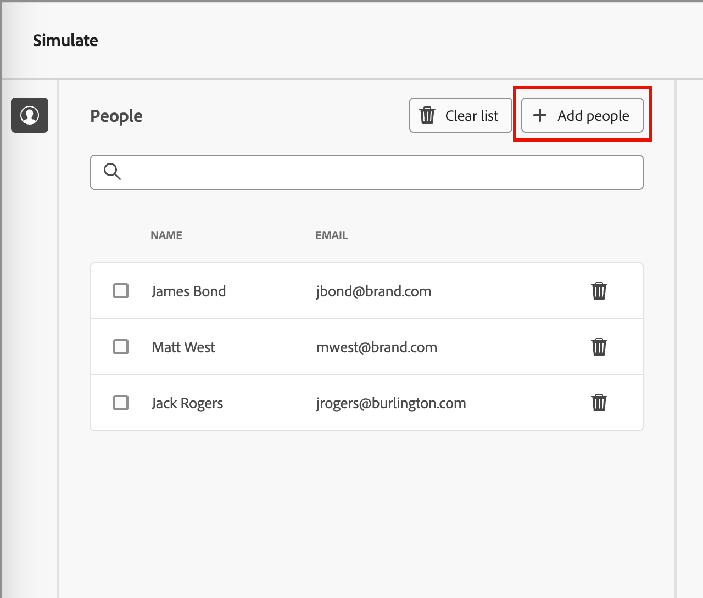
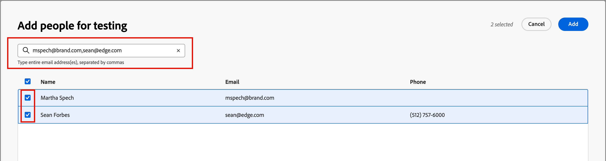

# 預覽和測試您的電子郵件內容 {#preview-simulate}

>[!CONTEXTUALHELP]
>id="ajo-b2b_email_preview_simulate"
>title="檢查您內容的呈現方式"
>abstract="定義內容後，您可以預覽內容，並檢查您使用的管道的演算是否正確。"

使用&#x200B;_模擬內容_&#x200B;功能來預覽電子郵件內容，並將測試傳遞傳送給特定收件者。 必須定義必要的電子郵件欄位，包括&#x200B;_[!UICONTROL 寄件者姓名]_、_[!UICONTROL 寄件者地址]_、_[!UICONTROL 回覆地址]_&#x200B;和&#x200B;_[!UICONTROL 主旨列]_，才能存取預覽和測試功能。

>[!IMPORTANT]
>
>發生錯誤時，您無法預覽電子郵件。 檢查&#x200B;_警示_&#x200B;以確定沒有任何錯誤會封鎖預覽功能。 警告不會阻止預覽，但您應在發佈觸發電子郵件傳送的歷程之前解決這些問題。

## 顯示電子郵件預覽

您可以從[電子郵件設計空間](./email-authoring.md)，或是&#x200B;_[!UICONTROL 摘要]_&#x200B;存取演算預覽，當您[從電子郵件清單](./emails-list.md#edit-emails)開啟電子郵件時。

1. 按一下頂端的&#x200B;**[!UICONTROL 模擬內容]**。

   {width="800" zoomable="yes"}

   >[!NOTE]
   >
   >如果發生錯誤或未定義電子郵件的必填欄位，則此按鈕不可用。

1. 在&#x200B;_[!UICONTROL 模擬]_&#x200B;頁面中，選取&#x200B;**[!UICONTROL 人員]**&#x200B;清單中的人員設定檔，以用於呈現電子郵件。

   在內容預覽中，個人化元素會根據選取的人員設定檔填入。

   {width="800" zoomable="yes"}

   如果左側的&#x200B;_[!UICONTROL 人員]_&#x200B;清單是空的，請使用連線的Marketo Engage執行個體的連絡人[新增人員](#add-people-to-the-profiles-list)。

   >[!TIP]
   >
   >您也可以使用[Litmus測試轉譯整合](./email-test-rendering.md)來檢查常見案頭、行動及網頁型使用者端中的電子郵件轉譯。

## 調整顯示選項

使用顯示工具根據裝置型別或縮放等級來變更預覽：

* 選取&#x200B;_案頭_ （ ）圖示，以使用案頭樣式與外觀比例來顯示預覽。
* 選取&#x200B;_行動裝置_ （ ）圖示，以使用行動裝置樣式和外觀比例來顯示預覽。
* 按一下&#x200B;_縮放等級_&#x200B;箭頭並選取縮放百分比，以檢視內容如何根據縮放等級變更。

{width="600" zoomable="yes"}

## 發送校訂

校樣是已傳送的測試訊息，可讓您和您的團隊成員在將電子郵件傳送給對象成員之前先檢閱該電子郵件。 校樣的收件者可以檢查訊息呈現、內容、個人化設定和配置。 您可以使用選取的測試設定檔傳送校樣。

1. 按一下右上方的&#x200B;**[!UICONTROL 傳送校樣]**。

   ![按一下[傳送校樣]](assets/email-simulate-content-preview-send-proof.png){width="500"}

1. 在&#x200B;_傳送校樣_&#x200B;頁面中，輸入第一個收件者的電子郵件地址。

1. 對於您想要加入檢閱的每個其他收件者，請按一下[新增收件者]，然後在[傳送至] **[!UICONTROL 欄位中輸入其電子郵件地址。]**&#x200B;**&#x200B;**

   您最多可以為校樣傳遞新增10個收件者。

1. 選取要用於個人化郵件內容的測試設定檔，為每個收件者設定&#x200B;**[!UICONTROL 模擬為]**&#x200B;欄位。

   {width="700" zoomable="yes"}

1. 按一下&#x200B;**[!UICONTROL 傳送證明]**。

## 將人員新增至設定檔清單

1. 按一下&#x200B;_[!UICONTROL 人員]_&#x200B;清單頂端的&#x200B;**[!UICONTROL 新增人員]**。

   {width="500"}

1. 在&#x200B;_[!UICONTROL 新增測試人員]_&#x200B;對話方塊中，輸入連絡人的完整電子郵件地址。

   若要新增多個連絡人，請輸入多個位址（以逗號分隔）。

1. 針對您想要新增至測試設定檔清單的每個相符連絡人，選取核取方塊。

   {width="700" zoomable="yes"}

1. 按一下右上方的&#x200B;**[!UICONTROL [新增]]**。
