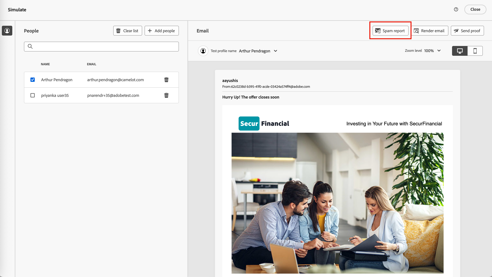
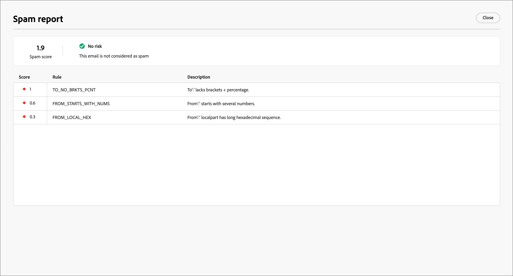
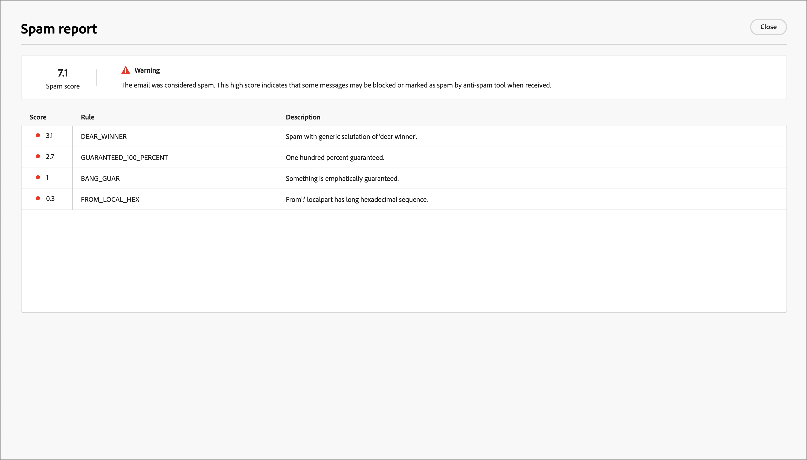

# 檢閱垃圾郵件報告

許多電子郵件收件匣提供者和大部分企業系統都採用垃圾郵件篩選程式。 傳送觸發這些篩選器的電子郵件可能會嚴重影響傳遞能力。 在Journey Optimizer B2B edition中，您可以透過產生垃圾郵件報告來檢查電子郵件內容垃圾郵件評分。 此報表使用[[!DNL SpamAssassin]](https://spamassassin.apache.org/)測試電子郵件，並協助您判斷反垃圾郵件工具是否會將郵件視為垃圾郵件。 您可以使用報告中的資訊來採取改善電子郵件內容分數和傳遞能力的動作。

當您檢閱電子郵件設定或編輯內容時，請開啟&#x200B;_[!UICONTROL 模擬]_&#x200B;頁面並產生&#x200B;_垃圾郵件報告_，以檢閱可觸發反垃圾郵件篩選的評分和標幟元素。

1. 從&#x200B;_[!UICONTROL 模擬]_&#x200B;頁面，按一下右上角的&#x200B;**[!UICONTROL 垃圾郵件報告]**。

   {width="700" zoomable="yes"}

   報告程式會掃描電子郵件內容，並使用用來產生分數的觸發篩選規則清單來產生分數。 因素包括內文版面配置、結構、影像大小、垃圾郵件觸發字詞和其他元素。 如需電子郵件元素的規則評估測試清單，請參閱[[!DNL SpamAssassin] 測試清單](https://spamassassin.apache.org/old/tests_3_0_x.html)。

1. 檢查每個專案的分數和說明。

   >[!NOTE]
   >
   >垃圾郵件分數是透過SpamAssassin計算，而Adobe並不擁有規則或評分邏輯。 如需[!DNL SpamAssassin]開放原始碼專案的詳細資訊，請參閱[[!DNL SpamAssassin] 檔案](https://cwiki.apache.org/confluence/display/SPAMASSASSIN/)。

   分數越低，電子郵件被標籤為垃圾郵件的可能性就越低。

   {width="600" zoomable="yes"}

   分數大於5的報表會包含警告，指出部分訊息在收到時可能會遭到封鎖或標籤為垃圾訊息。 最佳實務是確保分數低於2。

   {width="600" zoomable="yes"}

1. 如果電子郵件內容中有些元素可以改善，請編輯您的內容以套用必要的更新。

1. 完成變更後，請返回&#x200B;_[!UICONTROL 模擬]_&#x200B;頁面，然後再次按一下&#x200B;**[!UICONTROL 垃圾郵件報告]**&#x200B;以檢查產生的分數改善。

