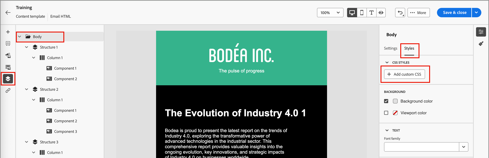

# 電子郵件範本編寫

在您[建立電子郵件範本](./email-templates.md#create-an-email-template)之後，請使用視覺化設計空間來編寫電子郵件範本中的結構和內容元件。

## 新增結構和內容 {#structure-content}

{{$include /help/_includes/content-design-components.md}}

### 新增自訂 CSS

您可以直接在電子郵件範本設計空間新增自己的自訂CSS。 使用自訂CSS套用進階和特定的樣式，以擁有更大的彈性並控制內容的外觀。 最佳實務是在加入影像、按鈕和文字等元件前，先新增此最高層級的樣式。

如果畫布中至少有一個內容元件，請在左側導覽樹狀結構中選取&#x200B;**[!UICONTROL Body]**&#x200B;元件，以存取自訂CSS編輯器。

{width="800" zoomable="yes"}

{{$include /help/_includes/content-design-custom-css.md}}

### 新增片段

{{$include /help/_includes/content-design-use-fragments.md}}

儲存範本後，當您在摘要中選取&#x200B;_[!UICONTROL 使用者]_&#x200B;索引標籤時，範本會顯示在片段詳細資訊頁面中。

### 新增資產

{{$include /help/_includes/content-design-assets.md}}

### 導覽圖層、設定和樣式

{{$include /help/_includes/content-design-navigation.md}}

### 將內容個人化

{{$include /help/_includes/content-design-personalization-email.md}}

### 編輯連結的URL追蹤

{{$include /help/_includes/content-design-links.md}}

## 檢視選項

善用視覺化設計空間中可用的檢視和內容驗證選項。

* 透過預設縮放選項放大/縮小內容。

* 切換在案頭、行動裝置或純文字/純文字間檢視內容。
   * 按一下&#x200B;_眼睛_&#x200B;圖示，即可跨裝置預覽內容。
   * 選取其中一個現成可用的裝置，或輸入自訂維度以預覽內容。

### 更多選項

從電子郵件設計空間頂端的&#x200B;_[!UICONTROL 更多……]_&#x200B;功能表，您可以執行下列動作：

![按一下[更多]以存取範本動作](./assets/visual-designer-more-menu.png){width="500"}

* **[!UICONTROL 重設範本]** — 按一下此選項，將設計畫布清除為空白並重新啟動建立內容。
* **[!UICONTROL 另存為片段]** — 將範本的所有或部份另存為片段，以便在多個電子郵件或電子郵件範本中重複使用。 您提供片段的名稱和說明，並將其儲存到可用片段清單中。
* **[!UICONTROL 變更您的設計]** — 返回&#x200B;_設計您的範本_&#x200B;頁面。 從那裡，您可以選擇從頭開始設計範本，或使用現有的範本來重新啟動設計流程。
* **[!UICONTROL 匯出HTML]** — 將視覺畫布中的內容以HTML格式下載到您的本機系統，並封裝成zip檔。
