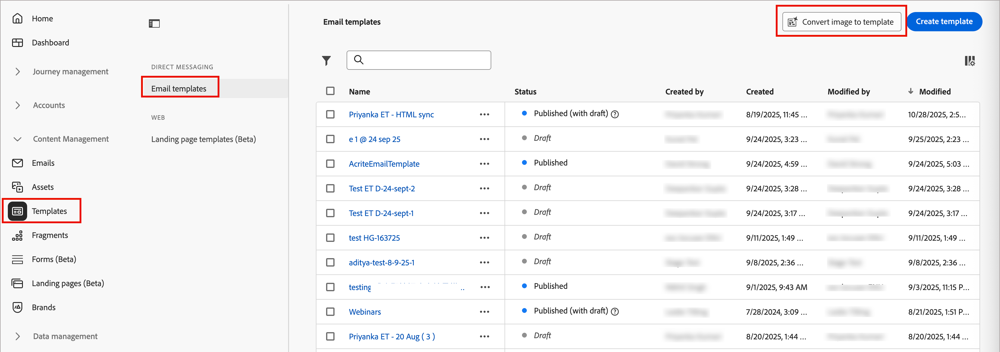
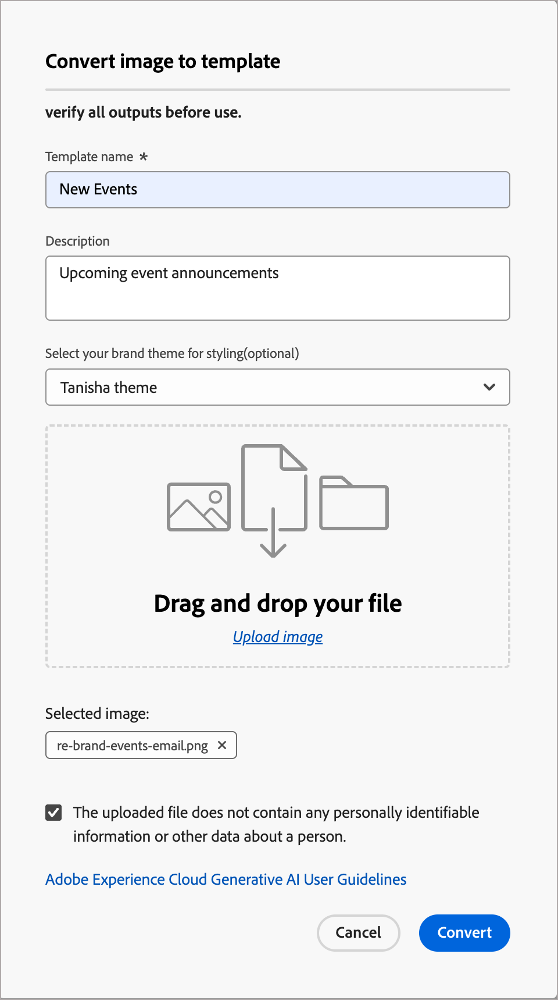

# 將影像轉換為電子郵件範本

您可以輕鬆地將儲存為影像的設計檔案(PNG或JPEG)轉換為可透過電子郵件使用範本的HTML，節省您的網路團隊寶貴的時間和資源。

建立和更新電子郵件範本是行銷內容supply chain中的基本元件，但由於HTML的手動編碼，這些工作通常需要相當的時間和資源。 傳統上，行銷團隊會仰賴代理商或IT團隊開發這些範本。 新的電子郵件範本影像 — HTML工具可讓行銷人員將設計檔案轉換為HTML程式碼範本，藉此簡化此程式。 轉換後的HTML已準備好在電子郵件設計空間中進行進一步編輯。 此工具支援JPEG和PNG檔案型別，並具備拖放介面。

直覺式範本產生器會將影像轉換為HTML程式碼範本，以便使用電子郵件設計工具進行修改。 行銷人員或設計專業人士可以上傳影像並快速產生電子郵件範本，無需手動HTML編碼。 此工具支援從JPEG和PNG檔案型別轉換為HTML編碼的電子郵件範本。

>[!BEGINSHADEBOX]

**使用品牌主題**

如果您的組織在Journey Optimizer B2B edition中定義了[品牌主題](./brand-themes.md)，您可以選取品牌主題作為輸入，以便產生的輸出HTML會根據品牌主題引數來設定樣式。 使用此輸入，樣式如背景顏色、按鈕顏色、字型、行距、邊界、邊框間距等將套用至產生的範本。  使用品牌主題有助於消除樣式和格式化的額外設計工作，並產生能以最少編輯次數使用的範本。

>[!ENDSHADEBOX]

1. 在左側導覽列中，移至&#x200B;**[!UICONTROL 內容管理]** > **[!UICONTROL 範本]**。

   此動作會開啟清單頁面，其中包含表格中所列執行處理的所有已建立電子郵件範本。

1. 在清單上方的標題中，按一下&#x200B;**[!UICONTROL 將影像轉換為範本]**。

   {width="800" zoomable="yes"}

1. 在對話方塊中，針對產生的電子郵件範本，輸入實用的&#x200B;**[!UICONTROL 範本名稱]**&#x200B;和&#x200B;**[!UICONTROL 描述]** （選擇性）。

1. （選擇性）選取&#x200B;**[!UICONTROL 品牌主題]**，以根據主題規格將特定樣式套用至產生的HTML。

1. 使用下列其中一種方法來上傳影像檔案：

   * 將影像檔案拖放至對話方塊檔案區域。
   * 按一下&#x200B;**[!UICONTROL 上傳影像]**&#x200B;以使用您的本機檔案系統來尋找並選取影像檔案。

1. 確認影像檔案未包含任何個人識別資訊或個人資料，然後選取對話方塊底部的核取方塊進行確認。

   若要檢閱准則，請按一下&#x200B;**[!UICONTROL Adobe Experience Cloud Generative AI使用者准則]**&#x200B;連結。

   {width="400" zoomable="yes"}

1. 按一下&#x200B;**[!UICONTROL 轉換]**。

   對話方塊關閉，新範本名稱顯示在清單中，狀態為&#x200B;_[!UICONTROL 正在轉換為範本……]_。 轉換程式可能需要一些時間，視來源影像和套用品牌主題（如果使用）的複雜度而定。

1. 程式完成後，按一下範本名稱以預覽轉譯的電子郵件內容並進行任何必要的編輯。
