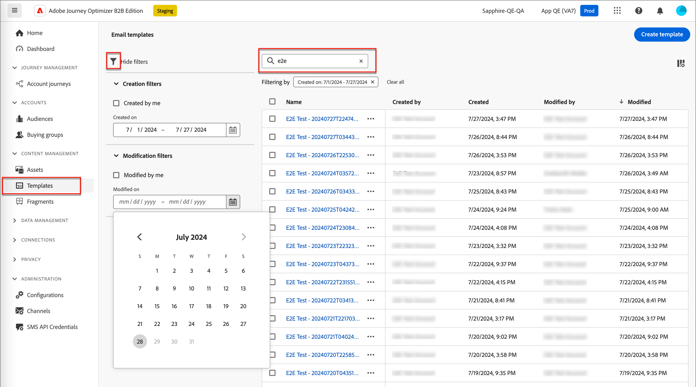
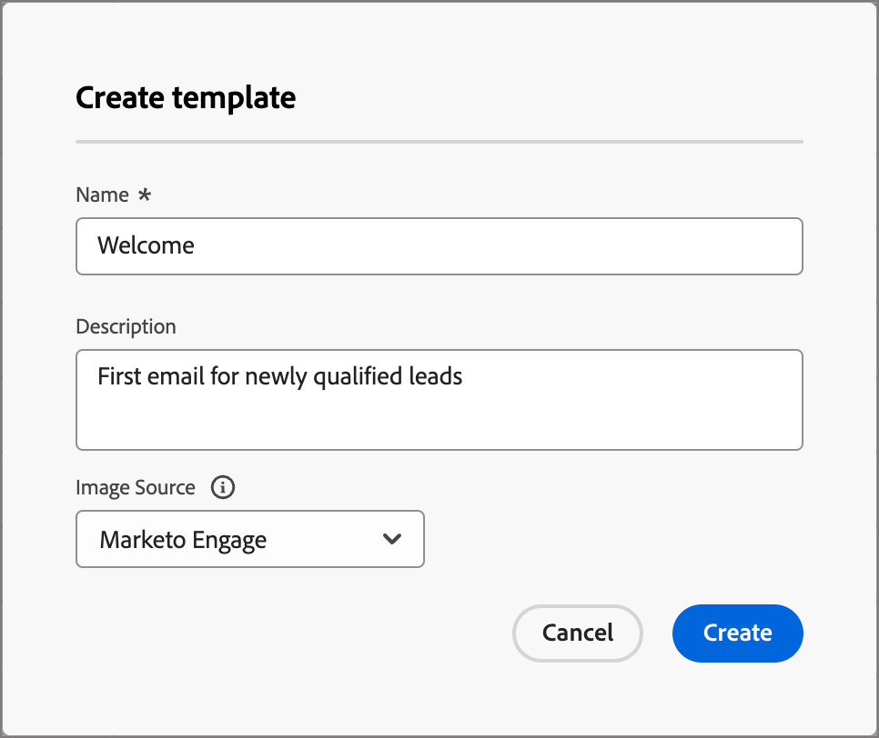
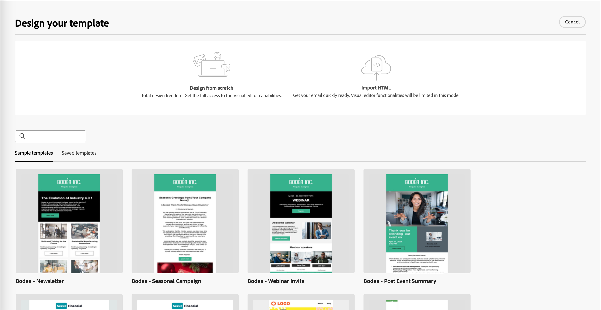
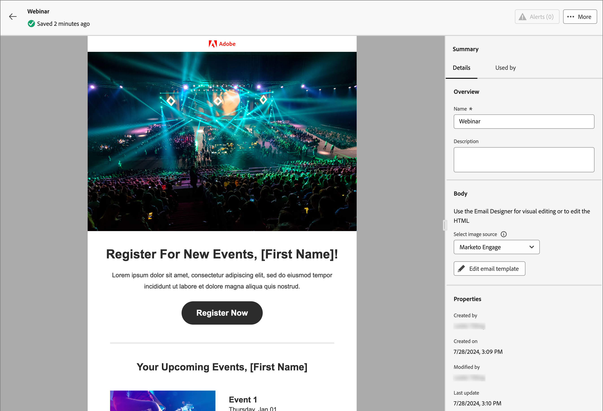
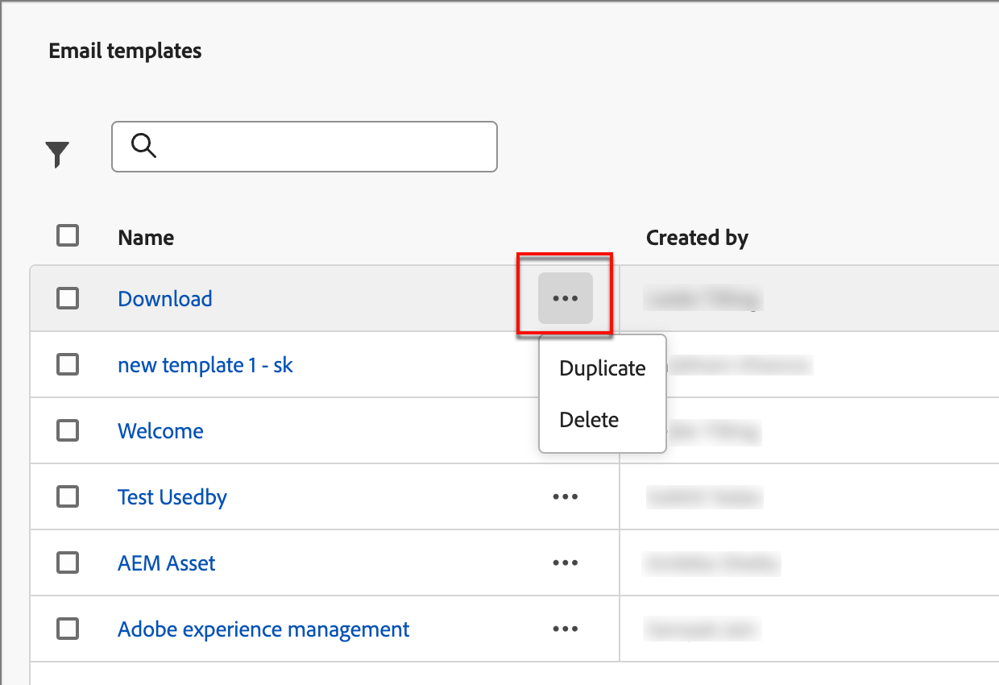
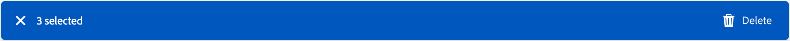

# 電子郵件範本

為了加快並改善設計流程，您可以建立獨立的電子郵件範本，以在整個Adobe Journey Optimizer B2B Edition帳戶歷程中重複使用自訂內容。 透過範本，您的內容導向團隊成員可以在歷程之外處理電子郵件內容。 行銷策略師隨後可在其帳戶歷程中重複使用這些獨立範本，並加以調整。 例如，一個團隊成員只負責內容，無權存取帳戶歷程。 但是，他們可以建立電子郵件範本，行銷人員可以選取作為電子郵件通訊的起點，並根據歷程的需求進行自訂。

## 存取和管理電子郵件範本

若要存取Adobe Journey Optimizer B2B版本中的電子郵件範本，請前往左側導覽並按一下&#x200B;**[!UICONTROL 內容管理]** > **[!UICONTROL 範本]**。 此動作會開啟一個清單頁面，其中包含在表格中列出的執行處理中建立的所有電子郵件範本。

表格是依&#x200B;_[!UICONTROL 已修改]_&#x200B;欄排序，最近更新的範本預設會位於清單頂端。 按一下欄標題，在升序和降序之間變更。

若要依名稱搜尋範本，請在搜尋列中輸入文字字串。 按一下左上方的&#x200B;_篩選器_&#x200B;圖示，以根據建立或修改日期以及您已建立或修改的範本來篩選清單。

{width="700" zoomable="yes"}

按一下右上角的&#x200B;_自訂表格_&#x200B;圖示，自訂您要顯示在表格中的欄。 選取要顯示的資料行，然後按一下&#x200B;**[!UICONTROL 套用]**。

從清單頁面中，您可以執行下列各節所述的動作。

## 建立電子郵件範本

您可以按一下右上角的&#x200B;**[!UICONTROL 建立範本]**，從電子郵件範本清單頁面建立新的電子郵件範本。

1. 在對話方塊中，輸入有用的&#x200B;**[!UICONTROL 名稱]**&#x200B;和&#x200B;**[!UICONTROL 描述]** （選擇性）。

   {width="400"}

1. 設定初始&#x200B;**[!UICONTROL 影像來源]**。

   如果您有Experience Manager Assetsas a Cloud Service以及預設Adobe Marketo Engage Design Studio的訂閱，您可以從任一來源選擇影像資產。 若要這麼做，您必須在建立電子郵件範本或視覺化片段時選取影像來源。 不過，您也可以在編輯內容時選取影像來源。

   如需影像來源的詳細資訊，請參閱[Assets](./assets-overview.md)。

1. 按一下&#x200B;**[!UICONTROL 建立]**。

_[!UICONTROL 設計您的範本]_&#x200B;頁面會開啟，並提供多個建立範本的選項： _[!UICONTROL 從頭開始設計]_、_[!UICONTROL 匯入HTML]_&#x200B;或&#x200B;_[!UICONTROL 選取設計範本]_。

{width="800" zoomable="yes"}

### 從頭開始設計

使用視覺內容編輯器來定義電子郵件內容的結構。 透過使用簡單的拖放動作新增和移動結構元件，您可以在數秒內設計可重複使用電子郵件內容的形狀。

>[!NOTE]
>
>可用的設計工具等同於用於[電子郵件編寫](./email-authoring.md)的工具。 其差異在於此內容會儲存為範本，可在帳戶歷程中的多個傳送電子郵件節點重複使用。

1. 從&#x200B;_[!UICONTROL 設計您的範本]_&#x200B;首頁，選取&#x200B;**[!UICONTROL 從頭開始設計]**&#x200B;選項。

1. [將結構和內容](#add-structure-and-content)新增到範本。

### 匯入HTML

Adobe Journey Optimizer B2B Edition可讓您匯入現有的HTML內容，以設計您的電子郵件範本。

{{$include /help/_includes/content-design-import.md}}

{width="500"}

>[!NOTE]
>
>使用`<table>`標籤做為HTML檔案中的第一個圖層可能會造成樣式遺失，包括上層圖層標籤中的背景和寬度設定。

您可以視需要使用視覺化電子郵件編輯器工具個人化匯入的內容。

### 選取設計範本

{{$include /help/_includes/content-design-select-template.md}}

## 新增結構和內容 {#structure-content}

>[!CONTEXTUALHELP]
>id="ajo-b2b_structure_components_template"
>title="新增結構元件"
>abstract="結構元件會定義範本的版面。將&#x200B;**Structure**&#x200B;元件拖放至畫布中，以開始設計範本的內容。"

>[!CONTEXTUALHELP]
>id="ajo-b2b_content_components_template"
>title="關於內容元件"
>abstract="內容元件指可用於建立範本版面的空白內容預留位置。"

{{$include /help/_includes/content-design-components.md}}

### 新增片段

在視覺內容編輯器中，_片段_&#x200B;圖示會顯示在左側。 以下範例概述將片段新增至範本內容的步驟。

1. 若要開啟片段清單，請按一下&#x200B;_片段_&#x200B;圖示。

   您可以：

   * 排序清單。
   * 瀏覽、搜尋或篩選清單。
   * 在縮圖和清單檢視之間切換。
   * 重新整理清單以反映任何最近建立的片段。

   {width="700" zoomable="yes"}

1. 將任何片段拖放至結構元件的預留位置。

   編輯器會在電子郵件結構的區段/元素中轉譯片段。

片段的內容會在結構內動態更新，以顯示內容在電子郵件中的顯示方式。

>[!TIP]
>
>如果要新增片段以佔據電子郵件內的整個水準版面，請新增1:1欄結構，然後將片段拖放至其中。

儲存電子郵件後，當您在摘要中選取&#x200B;_[!UICONTROL 使用者]_&#x200B;索引標籤時，它就會顯示在片段詳細資訊頁面中。 新增到電子郵件範本的片段在範本中無法編輯 — 內容由來源片段定義。

### 新增資產

{{$include /help/_includes/content-design-assets.md}}

### 導覽圖層、設定和樣式

{{$include /help/_includes/content-design-navigation.md}}

### 個人化內容

{{$include /help/_includes/content-design-personalization.md}}

### 編輯連結的URL追蹤

{{$include /help/_includes/content-design-links.md}}

### 檢視選項

善用視覺化電子郵件編輯器中可用的檢視和內容驗證選項。

* 透過預設縮放選項放大/縮小內容。

* 切換在案頭、行動裝置或純文字/純文字間檢視內容。
   * 按一下&#x200B;_眼睛_&#x200B;圖示，即可跨裝置預覽內容。
   * 選取其中一個現成可用的裝置，或輸入自訂維度以預覽內容。

### 更多選項

在視覺內容編輯器的&#x200B;_更多選項_&#x200B;選取器中，您可以執行下列動作：

![按一下[更多]以存取範本動作](./assets/visual-designer-more-menu.png){width="500"}

* **重設範本** — 按一下此選項，將視覺化電子郵件設計工具畫布清除為空白並重新啟動建立內容。
* **另存為片段** — 將其全部或部份另存為片段，以便在多個電子郵件或電子郵件範本中重複使用。 您可以提供片段的名稱和說明，並將其加入可用片段清單。
* **變更您的設計** — 返回&#x200B;_設計您的範本_&#x200B;頁面。 從這裡，您可以採取在「建立電子郵件範本」一節中概述的任何行動。
* **匯出HTML** — 將視覺畫布中的內容以HTML格式下載到您的本機系統，並封裝成zip檔。

## 檢視電子郵件範本詳細資訊

在「範本」清單頁面中，按一下電子郵件範本的名稱，以開啟電子郵件範本詳細資訊頁面。 從這裡，您可以檢視電子郵件範本的基本屬性，並存取視覺化內容編輯器，以變更範本內容。

{width="700" zoomable="yes"}

* 檢視電子郵件範本詳細資訊，例如名稱和說明。 您可以編輯這些設定。 按一下說明方塊外部以自動儲存變更。

* 檢視電子郵件範本屬性，例如，建立者、建立時間、上次更新時間和修改者。

* 按一下右上角的&#x200B;**[!UICONTROL 更多]**，對電子郵件範本採取快速動作，例如&#x200B;_複製_&#x200B;和&#x200B;_刪除_。

* 如果存在使用中的警示（電子郵件範本的錯誤和警告），請按一下右上方的&#x200B;**[!UICONTROL 警示]**&#x200B;以檢視資訊。

  雖然這些警報不會禁止使用電子郵件範本來建立電子郵件，但此資訊可讓您的團隊中的行銷人員檢視哪些內容可能無效以及需要哪些更新，才能用於傳送。

## 檢視參考使用的電子郵件範本

在電子郵件範本詳細資訊頁面中，按一下&#x200B;**[!UICONTROL 使用者]**&#x200B;索引標籤，以檢視跨帳戶歷程電子郵件中此電子郵件範本使用位置的詳細資訊。

![按一下[使用者]索引標籤以檢查範本使用情形](./assets/template-details-used-by.png){width="400"}

Journey Optimizer B2B Edition中的電子郵件會嵌入並在歷程中撰寫，因此使用範本之電子郵件的父歷程會顯示在參考中。

* 按一下連結會前往使用電子郵件範本的對應歷程電子郵件。

* 按一下「上一步」箭頭可隨時結束檢視，此箭頭可讓您返回清單頁面。

## 編輯電子郵件範本

此動作可從以下位置執行：

* 詳細資訊頁面 — 按一下&#x200B;**[!UICONTROL 編輯電子郵件範本]**。
* 清單頁面 — 按一下電子郵件範本旁的省略符號(**...**)，然後選擇&#x200B;**[!UICONTROL 編輯]**。

此動作會根據電子郵件範本的上次儲存狀態，帶您前往&#x200B;_設計您的範本_&#x200B;頁面或視覺內容編輯器頁面。 您可以在此處視需要編輯您的電子郵件範本內容。 請參閱[建立電子郵件範本](#create-email-templates)，以取得有關編輯選項的資訊。

## 重複的電子郵件範本

您可以使用下列其中一種方法來複製電子郵件範本：

* 從右側的電子郵件範本詳細資料中，展開&#x200B;**[!UICONTROL 更多]**&#x200B;並按一下&#x200B;**[!UICONTROL 複製]**。

  ![按一下[更多]以存取[刪除]和[複製]動作](./assets/template-details-more-menu.png){width="400"}

* 從&#x200B;_電子郵件範本_&#x200B;清單頁面，按一下範本旁邊的省略符號(...)，然後選擇&#x200B;**[!UICONTROL 複製]**。

在對話方塊中，輸入有用的名稱（唯一）和說明。 按一下&#x200B;**[!UICONTROL 複製]**&#x200B;以完成動作。

然後，重複的（新）電子郵件範本會出現在&#x200B;_電子郵件範本_&#x200B;清單中。

## 刪除電子郵件範本

電子郵件範本移除無法復原，因此在起始刪除動作前請先檢查。 您可以使用下列其中一種方法來刪除電子郵件範本：

* 從右側的範本詳細資料中，展開&#x200B;**[!UICONTROL 更多]**&#x200B;並按一下&#x200B;**[!UICONTROL 刪除]**。
* 從&#x200B;_電子郵件範本_&#x200B;清單頁面，按一下範本旁邊的省略符號(...)，然後選擇&#x200B;**[!UICONTROL 刪除]**。

  {width="500"}

此動作會開啟確認對話方塊。 您可以按一下&#x200B;**[!UICONTROL 取消]**，或按一下&#x200B;**[!UICONTROL 刪除]**&#x200B;確認移除，以中止程式。

## 執行大量動作

在電子郵件範本清單頁面中，選取左邊的核取方塊來一次選取多個範本。 當您選取多個範本時，底部會出現橫幅。

{width="600"}

**[!UICONTROL 刪除]** — 一次最多可以刪除20個範本。 確認對話方塊可讓您中止動作或確認移除範本。

## 從儲存的範本製作電子郵件

從&#x200B;_建立您的電子郵件_&#x200B;畫面，使用&#x200B;_選取設計範本_&#x200B;區段來開始從範本建立您的內容。

若要使用已建立的其中一個電子郵件範本開始建立您的內容，請使用下列步驟：

1. 從&#x200B;_編輯內容_&#x200B;頁面存取電子郵件Designer。

   在&#x200B;_建立您的電子郵件_&#x200B;頁面上，預設會選取&#x200B;_範本範例_&#x200B;索引標籤。

1. 若要使用自訂電子郵件範本，請選取&#x200B;**[!UICONTROL 已儲存的範本]**&#x200B;索引標籤。

   此索引標籤會顯示沙箱中建立的所有電子郵件範本清單。 您可以依名稱&#x200B;_、_&#x200B;上次修改時間&#x200B;_和_&#x200B;上次建立時間&#x200B;_來排序它們_。

1. 從清單中選取您選擇的範本。

   選取後，這會顯示範本的預覽。 在預覽模式中，您可以使用向右和向左箭頭，在單一類別的所有範本（範例或已儲存，視您的選擇而定）之間導覽。

1. 按一下右上角的&#x200B;**[!UICONTROL 使用此範本]**。

1. 在視覺內容設計工具中，視需要編輯您的內容。
