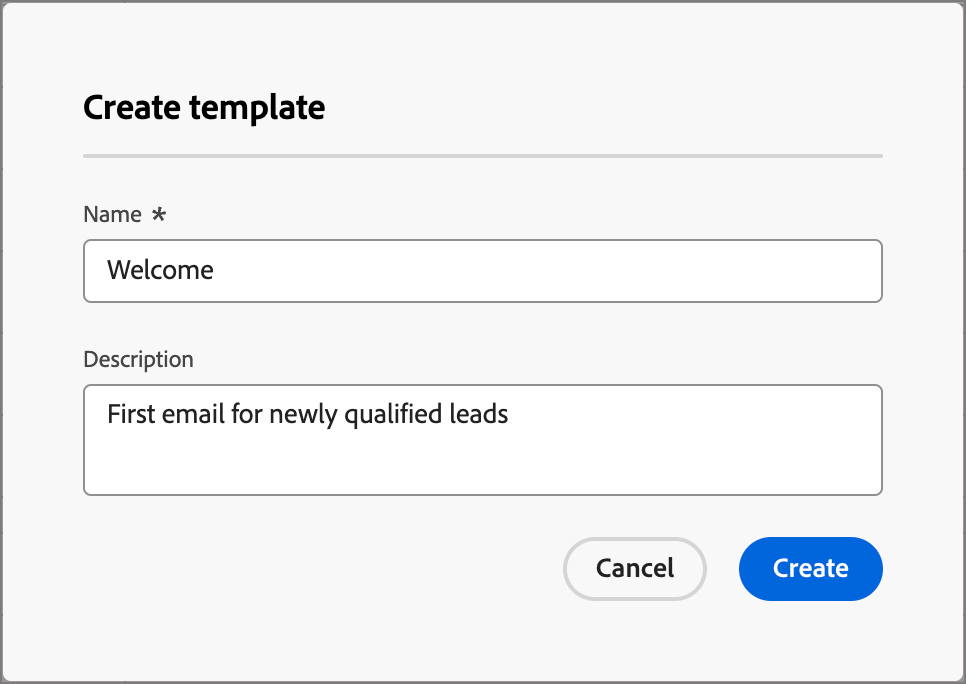

# 電子郵件範本

為了加快並改善設計流程，您可以建立獨立的電子郵件範本，以在整個Adobe Journey Optimizer B2B Edition帳戶歷程中重複使用自訂內容。 透過範本，您的內容導向團隊成員可以在歷程之外處理電子郵件內容。 行銷策略師隨後可在其帳戶歷程中重複使用這些獨立範本，並加以調整。 例如，一個團隊成員只負責內容，無權存取帳戶歷程。 但是，他們可以建立電子郵件範本，行銷人員可以選取作為電子郵件通訊的起點，並根據歷程的需求進行自訂。

## 存取和管理電子郵件範本

若要存取Adobe Journey Optimizer B2B版本中的電子郵件範本，請前往左側導覽並按一下&#x200B;**[!UICONTROL 內容管理]** > **[!UICONTROL 範本]**。 此動作會開啟一個清單頁面，其中包含在表格中列出的執行處理中建立的所有電子郵件範本。

表格是依&#x200B;_[!UICONTROL 已修改]_&#x200B;欄排序，最近更新的範本預設會位於清單頂端。 按一下欄標題，在升序和降序之間變更。

若要依名稱搜尋範本，請在搜尋列中輸入文字字串。 按一下左上方的&#x200B;_篩選器_&#x200B;圖示，以根據建立或修改日期以及您已建立或修改的範本來篩選清單。

{width="700" zoomable="yes"}

按一下右上角的&#x200B;_自訂表格_&#x200B;圖示，自訂您要顯示在表格中的欄。 選取要顯示的資料行，然後按一下&#x200B;**[!UICONTROL 套用]**。

從清單頁面中，您可以執行下列各節所述的動作。

## 建立電子郵件範本

您可以按一下右上角的&#x200B;**[!UICONTROL 建立範本]**，從電子郵件範本清單頁面建立新的電子郵件範本。

1. 在對話方塊中，輸入有用的&#x200B;**[!UICONTROL 名稱]**&#x200B;和&#x200B;**[!UICONTROL 描述]** （選擇性）。

   {width="400"}

1. 設定初始&#x200B;**[!UICONTROL 影像來源]**。

   如果您有Experience Manager Assetsas a Cloud Service以及預設Adobe Marketo Engage Design Studio的訂閱，您可以從任一來源選擇影像資產。 若要這麼做，您必須在建立電子郵件範本或視覺化片段時選取影像來源。 不過，您也可以在編輯內容時選取影像來源。

   如需影像來源的詳細資訊，請參閱[Assets](./assets-overview.md)。

1. 按一下&#x200B;**[!UICONTROL 建立]**。

_[!UICONTROL 設計您的範本]_&#x200B;頁面會開啟，並提供多個建立範本的選項： _[!UICONTROL 從頭開始設計]_、_[!UICONTROL 匯入HTML]_&#x200B;或&#x200B;_[!UICONTROL 選取設計範本]_。

{width="800" zoomable="yes"}

### 從頭開始設計 {#design-from-scratch}

>[!CONTEXTUALHELP]
>id="ajo-b2b_structure_components_template"
>title="新增結構元件"
>abstract="結構元件會定義範本的版面。將&#x200B;**結構**&#x200B;元件拖放到畫布中開始設計您的範本內容。"

>[!CONTEXTUALHELP]
>id="ajo-b2b_content_components_template"
>title="關於內容元件"
>abstract="內容元件指可用於建立範本版面的空白內容預留位置。"

使用電子郵件設計工具來定義電子郵件內容的結構。 透過使用簡單的拖放動作新增和移動結構元件，您可以在數秒內設計可重複使用電子郵件內容的形狀。

1. 從&#x200B;_[!UICONTROL 設計您的範本]_&#x200B;首頁，選取&#x200B;**[!UICONTROL 從頭開始設計]**&#x200B;選項。

1. 將元件拖放至畫布以定義電子郵件的結構版面，開始設計內容。

   可用的設計工具等同於用於[電子郵件編寫](./email-authoring.md)的工具。 其差異在於此內容會儲存為範本，可在帳戶歷程中的多個傳送電子郵件節點重複使用。

### 匯入HTML

Adobe Journey Optimizer B2B Edition可讓您匯入現有的HTML內容，以設計您的電子郵件範本。 此內容可以是：

* 包含合併樣式表的HTML檔案。
* 包含HTML檔案、樣式表(.css)和影像的.zip檔案

  >[!NOTE]
  >
  >.zip檔案結構沒有限制。 不過，參照必須是相對參照，而且符合.zip資料夾的樹狀結構。

_若要匯入包含HTML內容的檔案：_

1. 從&#x200B;_[!UICONTROL 設計您的範本]_&#x200B;首頁，選取&#x200B;**[!UICONTROL 匯入HTML]**&#x200B;選項。

1. 拖放包含HTML內容的HTML或.zip檔案，然後按一下&#x200B;**[!UICONTROL 匯入]**。

   上傳HTML內容後，您的內容處於&#x200B;_相容性模式_。 在此模式中，您只能個人化您的文字、新增連結或包含資產至您的內容。

1. 若要使用電子郵件設計工具內容元件，請按一下&#x200B;**[!UICONTROL HTML轉換器]**&#x200B;索引標籤，然後按一下&#x200B;**[!UICONTROL 轉換]**。

>[!NOTE]
>
>使用`<table>`標籤做為HTML檔案中的第一個圖層可能會造成樣式遺失，包括上層圖層標籤中的背景和寬度設定。

您可以視需要使用視覺化電子郵件編輯器工具個人化匯入的內容。

### 選取設計範本

從&#x200B;_[!UICONTROL 設計您的範本]_&#x200B;首頁，使用[選取設計範本]區段來開始從範本建立您的內容。 您可以使用範例範本或從Journey Optimizer B2B Edition執行個體儲存的電子郵件範本。

>[!BEGINTABS]

>[!TAB 儲存的範本]

在&#x200B;_設計您的範本_&#x200B;首頁上，預設會選取&#x200B;_範例範本_&#x200B;索引標籤。 若要使用自訂範本，請選取&#x200B;**[!UICONTROL 儲存的範本]**&#x200B;索引標籤。

隨即顯示在目前沙箱中建立的所有電子郵件範本清單。 您可以依&#x200B;_[!UICONTROL 名稱]_、_[!UICONTROL 上次修改時間]_&#x200B;和&#x200B;_[!UICONTROL 上次建立時間]_&#x200B;來排序它們。

{width="800" zoomable="yes"}

從清單中選取您想要的範本。

選取後，這會顯示範本的預覽。 在預覽模式中，您可以使用向右和向左箭頭，在單一類別的所有範本（範例或已儲存，視您的選擇而定）之間導覽。

{width="800" zoomable="yes"}

當顯示符合您要使用的內容時，請按一下預覽視窗右上角的&#x200B;**[!UICONTROL 使用此範本]**。

此動作會將內容複製到視覺化內容設計工具中，以便您視需要編輯內容。

>[!TAB 範例範本]

Adobe Journey Optimizer B2B Edition提供&#x200B;_現成可用的電子郵件範本_&#x200B;選項，可用來建立電子郵件和電子郵件範本。

{width="800" zoomable="yes"}

>[!ENDTABS]

## 新增結構和內容

從&#x200B;**[!UICONTROL 元件]**&#x200B;功能表將結構拖放至畫布以定義電子郵件的配置，開始設計您的內容。

視需要新增結構，並在右側的元素屬性中編輯其設定。

選取&#x200B;_[!UICONTROL n：n欄]_&#x200B;元件以定義您選擇的欄數（介於3到10之間）。 移動底部的箭頭來定義每欄的寬度。

>[!NOTE]
>
>每個欄大小不能低於結構元件總寬度的10%。 您只能移除空白欄。

展開&#x200B;**[!UICONTROL 內容]**&#x200B;區段，並新增您所需數量的元素至一或多個結構元件。

每個元件都可以使用右側面板中的&#x200B;_[!UICONTROL Settings]_&#x200B;或&#x200B;_[!UICONTROL Style]_&#x200B;標籤進一步自訂。 例如，您可以變更每個元件的文字樣式、邊框間距或邊界。

### 瀏覽圖層、設定和樣式

下列範例概述在包含三欄的結構元件內調整邊框間距和垂直對齊的步驟。

1. 直接在電子郵件中選取結構元件，或使用左側功能表中可用的導覽樹狀結構。

1. 在工具列中按一下&#x200B;**[!UICONTROL 選取資料行]**，然後選擇您要編輯的資料行。

   畫布中顯示的{width="800" zoomable="yes"}

   您也可以從結構樹中選取它。 該欄的可編輯引數會顯示在&#x200B;_[!UICONTROL 樣式]_&#x200B;索引標籤中。

1. 在&#x200B;**[!UICONTROL 對齊方式]**&#x200B;下，選取&#x200B;_上_、_中_&#x200B;或&#x200B;_下_&#x200B;圖示。

1. 在&#x200B;**[!UICONTROL 內距]**&#x200B;下，定義所有邊的內距。

   若要微調內距，請選取&#x200B;**[!UICONTROL 每一邊不同的內距]**。 按一下鎖定圖示以中斷同步。

1. 如有需要，請調整其他欄的對齊與邊框間距。

1. 儲存您的變更。

### 個人化內容

以下範例概述使用銷售機會/帳戶屬性和系統權杖個人化範本內容的步驟。

1. 選取文字元件，然後按一下工具列中的&#x200B;_新增個人化_&#x200B;圖示。

   {width="500"}

   此動作會開啟&#x200B;_編輯Personalization_&#x200B;對話方塊。

1. 按一下&#x200B;**+**&#x200B;或&#x200B;**...**，將權杖新增至空白空間。

   {width="700" zoomable="yes"}

1. 按一下&#x200B;**[!UICONTROL 儲存]**。

### 新增片段

在視覺內容編輯器中，_片段_&#x200B;圖示會顯示在左側。 以下範例概述將片段新增至範本內容的步驟。

1. 若要開啟片段清單，請按一下&#x200B;_片段_&#x200B;圖示。

   您可以：

   * 排序清單。
   * 瀏覽、搜尋或篩選清單。
   * 在縮圖和清單檢視之間切換。
   * 重新整理清單以反映任何最近建立的片段。

   {width="700" zoomable="yes"}

1. 將任何片段拖放至結構元件預留位置。

   編輯器會在電子郵件結構的區段/元素中轉譯片段。

片段的內容會在結構內動態更新，以呈現內容在電子郵件中如何顯示的視覺效果。

如果要新增片段以佔據電子郵件內的整個水準版面，請新增1:1欄結構，然後將片段拖放至其中。

儲存電子郵件後，當您在摘要中選取&#x200B;_[!UICONTROL 使用者]_&#x200B;索引標籤時，它就會顯示在片段詳細資訊頁面中。 新增到電子郵件範本的片段在範本中無法編輯 — 內容由來源片段定義。

### 新增資產

在視覺內容編輯器中，選取左側顯示的&#x200B;_Assets_&#x200B;圖示。

>[!NOTE]
>
>如果您有Experience Manager Assetsas a Cloud Service以及預設Adobe Marketo Engage Design Studio的訂閱，您可以從範本詳細資訊頁面中選取的來源選擇影像資產。

下列範例概述將資產新增至範本內容的步驟：

1. 若要開啟資產庫，請按一下&#x200B;_Assets_&#x200B;圖示。

   從資產選取器中，您可以直接選取儲存在來源資料庫中的資產。

1. 將影像資產拖放至結構元件中，以新增資產。

1. 在畫布上選取影像資產，然後按一下影像來源工具中的&#x200B;**[!UICONTROL 選取資產]**，即可取代影像資產。

   {width="700" zoomable="yes"}

### 預覽和編輯URL

1. 按一下左側的&#x200B;_[!UICONTROL 連結]_&#x200B;圖示，以顯示您要追蹤之內容的所有URL。

1. 如有需要，請按一下&#x200B;_編輯_ （鉛筆）圖示並修改&#x200B;_追蹤型別_&#x200B;或&#x200B;_標籤_，然後為連結新增&#x200B;_標籤_。

![按一下[更多]以存取範本動作](./assets/visual-designer-links.png){width="500"}

### 檢視選項

善用視覺化電子郵件編輯器中可用的檢視和內容驗證選項。

* 透過預設縮放選項放大/縮小內容。

* 切換在案頭、行動裝置或純文字/純文字間檢視內容。
   * 按一下&#x200B;_眼睛_&#x200B;圖示，即可跨裝置預覽內容。
   * 選取其中一個現成可用的裝置，或輸入自訂維度以預覽內容。

### 更多選項

在視覺內容編輯器的&#x200B;_更多選項_&#x200B;選取器中，您可以執行下列動作：

![按一下[更多]以存取範本動作](./assets/visual-designer-more-menu.png){width="500"}

* **重設範本** — 按一下此選項，將視覺化電子郵件設計工具畫布清除為空白並重新啟動建立內容。
* **另存為片段** — 將其全部或部份另存為片段，以便在多個電子郵件或電子郵件範本中重複使用。 您可以提供片段的名稱和說明，並將其加入可用片段清單。
* **變更您的設計** — 返回&#x200B;_設計您的範本_&#x200B;頁面。 從這裡，您可以採取在「建立電子郵件範本」一節中概述的任何行動。
* **匯出HTML** — 將視覺畫布中的內容以HTML格式下載到您的本機系統，並封裝成zip檔。

## 檢視電子郵件範本詳細資訊

在「範本」清單頁面中，按一下電子郵件範本的名稱，以開啟電子郵件範本詳細資訊頁面。 從這裡，您可以檢視電子郵件範本的基本屬性，並存取視覺化內容編輯器，以變更範本內容。

{width="700" zoomable="yes"}

* 檢視電子郵件範本詳細資訊，例如名稱和說明。 您可以編輯這些設定。 按一下說明方塊外部以自動儲存變更。

* 檢視電子郵件範本屬性，例如，建立者、建立時間、上次更新時間和修改者。

* 按一下右上角的&#x200B;**[!UICONTROL 更多]**，對電子郵件範本採取快速動作，例如&#x200B;_複製_&#x200B;和&#x200B;_刪除_。

* 如果存在使用中的警示（電子郵件範本的錯誤和警告），請按一下右上方的&#x200B;**[!UICONTROL 警示]**&#x200B;以檢視資訊。

  雖然這些警報不會禁止使用電子郵件範本來建立電子郵件，但此資訊可讓您的團隊中的行銷人員檢視哪些內容可能無效以及需要哪些更新，才能用於傳送。

## 檢視參考使用的電子郵件範本

在電子郵件範本詳細資訊頁面中，按一下&#x200B;**[!UICONTROL 使用者]**&#x200B;索引標籤，以檢視跨帳戶歷程電子郵件中此電子郵件範本使用位置的詳細資訊。

![按一下[使用者]索引標籤以檢查範本使用情形](./assets/template-details-used-by.png){width="400"}

Journey Optimizer B2B Edition中的電子郵件會嵌入並在歷程中撰寫，因此使用範本之電子郵件的父歷程會顯示在參考中。

* 按一下連結會前往使用電子郵件範本的對應歷程電子郵件。

* 按一下「上一步」箭頭可隨時結束檢視，此箭頭可讓您返回清單頁面。

## 編輯電子郵件範本

此動作可從以下位置執行：

* 詳細資訊頁面 — 按一下&#x200B;**[!UICONTROL 編輯電子郵件範本]**。
* 清單頁面 — 按一下電子郵件範本旁的省略符號(**...**)，然後選擇&#x200B;**[!UICONTROL 編輯]**。

此動作會根據電子郵件範本的上次儲存狀態，帶您前往&#x200B;_設計您的範本_&#x200B;頁面或視覺內容編輯器頁面。 您可以在此處視需要編輯您的電子郵件範本內容。 請參閱[建立電子郵件範本](#create-email-templates)，以取得有關編輯選項的資訊。

## 重複的電子郵件範本

您可以使用下列其中一種方法來複製電子郵件範本：

* 從右側的電子郵件範本詳細資料中，展開&#x200B;**[!UICONTROL 更多]**&#x200B;並按一下&#x200B;**[!UICONTROL 複製]**。

  ![按一下[更多]以存取[刪除]和[複製]動作](./assets/template-details-more-menu.png){width="400"}

* 從&#x200B;_電子郵件範本_&#x200B;清單頁面，按一下範本旁邊的省略符號(...)，然後選擇&#x200B;**[!UICONTROL 複製]**。

在對話方塊中，輸入有用的名稱（唯一）和說明。 按一下&#x200B;**[!UICONTROL 複製]**&#x200B;以完成動作。

然後，重複的（新）電子郵件範本會出現在&#x200B;_電子郵件範本_&#x200B;清單中。

## 刪除電子郵件範本

電子郵件範本移除無法復原，因此在起始刪除動作前請先檢查。 您可以使用下列其中一種方法來刪除電子郵件範本：

* 從右側的範本詳細資料中，展開&#x200B;**[!UICONTROL 更多]**&#x200B;並按一下&#x200B;**[!UICONTROL 刪除]**。
* 從&#x200B;_電子郵件範本_&#x200B;清單頁面，按一下範本旁邊的省略符號(...)，然後選擇&#x200B;**[!UICONTROL 刪除]**。

  {width="500"}

此動作會開啟確認對話方塊。 您可以按一下&#x200B;**[!UICONTROL 取消]**，或按一下&#x200B;**[!UICONTROL 刪除]**&#x200B;確認移除，以中止程式。

## 執行大量動作

在電子郵件範本清單頁面中，選取左邊的核取方塊來一次選取多個範本。 當您選取多個範本時，底部會出現橫幅。

{width="600"}

**[!UICONTROL 刪除]** — 一次最多可以刪除20個範本。 確認對話方塊可讓您中止動作或確認移除範本。

## 從儲存的範本製作電子郵件

從&#x200B;_建立您的電子郵件_&#x200B;畫面，使用&#x200B;_選取設計範本_&#x200B;區段來開始從範本建立您的內容。

若要使用已建立的其中一個電子郵件範本開始建立您的內容，請使用下列步驟：

1. 從&#x200B;_編輯內容_&#x200B;頁面存取電子郵件Designer。

   在&#x200B;_建立您的電子郵件_&#x200B;頁面上，預設會選取&#x200B;_範本範例_&#x200B;索引標籤。

1. 若要使用自訂電子郵件範本，請選取&#x200B;**[!UICONTROL 已儲存的範本]**&#x200B;索引標籤。

   此索引標籤會顯示沙箱中建立的所有電子郵件範本清單。 您可以依名稱&#x200B;_、_&#x200B;上次修改時間&#x200B;_和_&#x200B;上次建立時間&#x200B;_來排序它們_。

1. 從清單中選取您選擇的範本。

   選取後，這會顯示範本的預覽。 在預覽模式中，您可以使用向右和向左箭頭，在單一類別的所有範本（範例或已儲存，視您的選擇而定）之間導覽。

1. 按一下右上角的&#x200B;**[!UICONTROL 使用此範本]**。

1. 在視覺內容設計工具中，視需要編輯您的內容。
