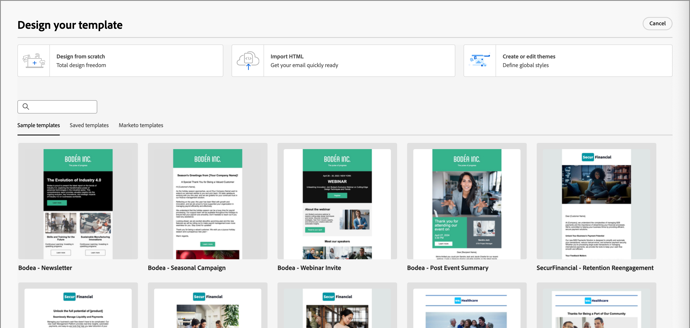

# 電子郵件範本

為了加速並改善設計流程，您可以建立獨立的電子郵件範本，以重複使用[!DNL Adobe Journey Optimizer B2B Edition]帳戶歷程中的自訂內容。 透過範本，您的內容導向團隊成員可以在歷程之外處理電子郵件內容。 行銷策略師隨後可在其帳戶歷程中重複使用這些獨立範本，並加以調整。 例如，一個團隊成員只負責內容，無權存取帳戶歷程。 但是，他們可以建立電子郵件範本，行銷人員可以選取作為電子郵件通訊的起點，並根據歷程的需求進行自訂。

## 存取和管理電子郵件範本

若要在[!DNL Journey Optimizer B2B Edition]中存取電子郵件範本，請前往左側導覽並按一下&#x200B;**[!UICONTROL 內容管理]** > **[!UICONTROL 範本]**。 在側面板中，選取&#x200B;**[!UICONTROL 電子郵件範本]**。

此動作會開啟一個清單頁面，其中包含以表格格式列出的執行個體中建立的所有電子郵件範本。

清單預設會依&#x200B;_[!UICONTROL 已修改]_&#x200B;欄排序，最近更新的範本會位於頂端。 按一下欄標題，在升序和降序之間變更。

若要依名稱搜尋範本，請在搜尋列中輸入文字字串。 按一下左上方的&#x200B;_篩選器_&#x200B;圖示，以根據建立或修改日期以及您已建立或修改的範本來篩選清單。

{width="800" zoomable="yes"}

按一下右上角的&#x200B;_自訂表格_&#x200B;圖示（），自訂您要顯示在表格中的欄。 選取要顯示的資料行，然後按一下&#x200B;**[!UICONTROL 套用]**。

從顯示的範本清單中，您可以執行下列各節所述的動作。

## 建立電子郵件範本

您可以按一下右上角的&#x200B;**[!UICONTROL 建立範本]**，從電子郵件範本清單頁面建立電子郵件範本。

1. 在對話方塊中，輸入有用的&#x200B;**[!UICONTROL 名稱]**&#x200B;和&#x200B;**[!UICONTROL 描述]** （選擇性）。

   {width="400"}

1. 按一下&#x200B;**[!UICONTROL 建立]**。

_[!UICONTROL 設計您的範本]_&#x200B;頁面會開啟，並提供多個建立範本的選項： _[!UICONTROL 從頭開始設計]_、_[!UICONTROL 匯入HTML]_&#x200B;或&#x200B;_[!UICONTROL 選取設計範本]_。

{width="800" zoomable="yes"}

選取您要用來開始電子郵件範本設計的方法之後，請使用視覺化設計空間[編寫您的電子郵件範本內容](./email-template-authoring.md)。

### 從頭開始設計

使用視覺內容編輯器來定義電子郵件內容的結構。 透過使用簡單的拖放動作新增和移動結構元件，您可以在數秒內設計可重複使用電子郵件內容的形狀。

>[!NOTE]
>
>可用的設計工具等同於用於[電子郵件編寫](./email-authoring.md)的工具。 不同之處在於，此內容隨後會儲存為範本，可在帳戶歷程中的多個&#x200B;_傳送電子郵件_&#x200B;節點間重複使用。

1. 從&#x200B;_[!UICONTROL 設計您的範本]_&#x200B;首頁，選取&#x200B;**[!UICONTROL 從頭開始設計]**&#x200B;選項。

1. 在&#x200B;_[!UICONTROL 建立電子郵件]_&#x200B;對話方塊中，選擇您要用於範本的電子郵件內容型別。

   * **[!UICONTROL 使用佈景主題]** — 選擇此選項可在&#x200B;_佈景主題模式_&#x200B;中建立電子郵件範本。 在此模式中，您可以使用已定義的品牌主題來簡化內容製作程式，並確保設計符合已定義的標準。

   {width="450"}

   * **[!UICONTROL 手動樣式]** — 選擇此選項可在&#x200B;_手動模式_&#x200B;中建立電子郵件範本。 在此模式中，您可以手動設定新增至空白畫布的所有結構和內容元件的樣式。

1. （_主題模式_&#x200B;僅限）套用主題。

   在電子郵件設計空間中，按一下右側的&#x200B;_主題_ （  ）圖示。

   {width="600" zoomable="yes"}

   顯示套用至範本的預設主題或主題。 您可以在此主題的顏色變體之間切換。

   按一下顯示的主題旁邊的箭頭，可檢視可用的自訂和Adobe主題清單。 選取&#x200B;**[!UICONTROL 我的佈景主題]**&#x200B;以使用為您的組織建立的自訂佈景主題。

   當您按一下清單外部時，選取的主題會套用樣式。 您可以在顏色變體之間切換。

1. [將結構和內容](./email-authoring.md#add-structure-and-content)新增到範本。

   如果有套用的主題，新增的元件會自動繼承主題中定義的樣式。

### 匯入HTML

Adobe Journey Optimizer B2B edition可讓您匯入現有的HTML內容，以設計您的電子郵件範本。

{{$include /help/_includes/content-design-import.md}}

{width="500"}

>[!NOTE]
>
>在HTML檔案中使用`<table>`標籤做為第一個圖層可能會造成樣式遺失，包括上層圖層標籤中的背景和寬度設定。

您可以視需要在視覺化設計空間中個人化匯入的內容。

### 選取設計範本

{{$include /help/_includes/content-design-select-template.md}}

## 檢視電子郵件範本詳細資訊

在「範本」清單頁面中，按一下電子郵件範本的名稱，以開啟電子郵件範本詳細資訊頁面。 從這裡，您可以檢視電子郵件範本的基本屬性，並存取視覺化內容編輯器，以變更範本內容。

{width="700" zoomable="yes"}

* 檢視電子郵件範本詳細資訊，例如名稱和說明。 您可以編輯這些設定。 按一下說明方塊外部以自動儲存變更。

* 檢視電子郵件範本屬性，例如，建立者、建立時間、上次更新時間和修改者。

* 按一下右上角的&#x200B;**[!UICONTROL 更多]**，對電子郵件範本採取快速動作，例如&#x200B;_複製_&#x200B;和&#x200B;_刪除_。

* 如果存在使用中的警示（電子郵件範本的錯誤和警告），請按一下右上方的&#x200B;**[!UICONTROL 警示]**&#x200B;以檢視資訊。

  這些警報不會禁止使用電子郵件範本來建立電子郵件。 此資訊可讓您團隊中的行銷人員檢視可能無法使用的專案，以及在可用於傳送之前所需的更新。

## 檢視參考使用的電子郵件範本

在電子郵件範本詳細資訊頁面中，按一下&#x200B;**[!UICONTROL 使用者]**&#x200B;索引標籤，以檢視跨帳戶歷程電子郵件中此電子郵件範本使用位置的詳細資訊。

![按一下[使用者]索引標籤以檢查範本使用情形](./assets/template-details-used-by.png){width="400"}

Journey Optimizer B2B edition中的電子郵件會在歷程中內嵌及編寫，因此使用範本之電子郵件的父歷程會顯示在參考中。

* 按一下連結會前往使用電子郵件範本的對應歷程電子郵件。

* 按一下「上一步」箭頭可隨時結束檢視，此箭頭可讓您返回清單頁面。

## 編輯電子郵件範本

此動作可從以下位置執行：

* 詳細資訊頁面 — 按一下&#x200B;**[!UICONTROL 編輯電子郵件範本]**。
* 清單頁面 — 按一下電子郵件範本旁的省略符號(**...**)，然後選擇&#x200B;**[!UICONTROL 編輯]**。

此動作會將您帶往&#x200B;_設計您的範本_&#x200B;頁面或視覺內容編輯器頁面（根據上次儲存的電子郵件範本狀態）。 您可以在此處視需要編輯您的電子郵件範本內容。 請參閱[建立電子郵件範本](#create-email-templates)，以取得有關編輯選項的資訊。

## 重複的電子郵件範本

您可以使用下列其中一種方法來複製電子郵件範本：

* 從右側的電子郵件範本詳細資料中，展開&#x200B;**[!UICONTROL 更多]**&#x200B;並按一下&#x200B;**[!UICONTROL 複製]**。

  ![按一下[更多]以存取[刪除]和[複製]動作](./assets/template-details-more-menu.png){width="400"}

* 從&#x200B;_[!UICONTROL 電子郵件範本]_&#x200B;清單頁面，按一下範本旁邊的省略符號(...)，然後選擇&#x200B;**[!UICONTROL 複製]**。

在對話方塊中，輸入有用的名稱（唯一）和說明。 按一下&#x200B;**[!UICONTROL 複製]**&#x200B;以完成動作。

然後，重複的（新）電子郵件範本會出現在&#x200B;_[!UICONTROL 電子郵件範本]_&#x200B;清單中。

## 刪除電子郵件範本

電子郵件範本移除無法復原，因此在起始刪除動作前請先檢查。 您可以使用下列其中一種方法來刪除電子郵件範本：

* 從右側的範本詳細資料中，展開&#x200B;**[!UICONTROL 更多]**&#x200B;並按一下&#x200B;**[!UICONTROL 刪除]**。
* 從&#x200B;_[!UICONTROL 電子郵件範本]_&#x200B;清單頁面，按一下範本旁邊的省略符號(...)，然後選擇&#x200B;**[!UICONTROL 刪除]**。

  {width="500"}

此動作會開啟確認對話方塊。 您可以按一下&#x200B;**[!UICONTROL 取消]**，或按一下&#x200B;**[!UICONTROL 刪除]**&#x200B;確認移除，以中止程式。

## 執行大量動作

在電子郵件範本清單頁面中，選取左邊的核取方塊來一次選取多個範本。 當您選取多個範本時，底部會出現橫幅。

{width="600"}

**[!UICONTROL 刪除]** — 一次最多可以刪除20個範本。 確認對話方塊可讓您中止動作或確認移除範本。

## 從儲存的範本撰寫電子郵件

從&#x200B;_建立您的電子郵件_&#x200B;畫面，使用&#x200B;_選取設計範本_&#x200B;區段來開始從範本建立您的內容。

若要使用已建立的其中一個電子郵件範本開始建立您的內容，請使用下列步驟：

1. 從&#x200B;_編輯內容_&#x200B;頁面存取電子郵件Designer。

   在&#x200B;_建立您的電子郵件_&#x200B;頁面上，預設會選取&#x200B;_範本範例_&#x200B;索引標籤。

1. 若要使用自訂電子郵件範本，請選取&#x200B;**[!UICONTROL 已儲存的範本]**&#x200B;索引標籤。

   此索引標籤會顯示沙箱中建立的所有電子郵件範本清單。 您可以依名稱&#x200B;_、_&#x200B;上次修改時間&#x200B;_和_&#x200B;上次建立時間&#x200B;_來排序它們_。

1. 從清單中選取您選擇的範本。

   選取後，這會顯示範本的預覽。 在預覽模式中，您可以使用向右和向左箭頭，在單一類別的所有範本（範例或已儲存，視您的選擇而定）之間導覽。

1. 按一下右上角的&#x200B;**[!UICONTROL 使用此範本]**。

1. 在視覺化設計空間中，視需要編輯您的內容。
