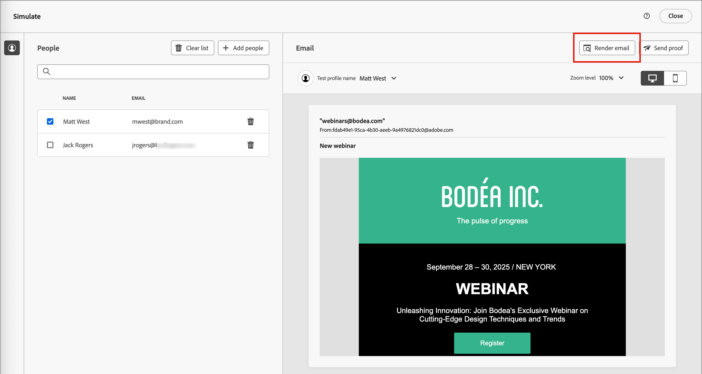
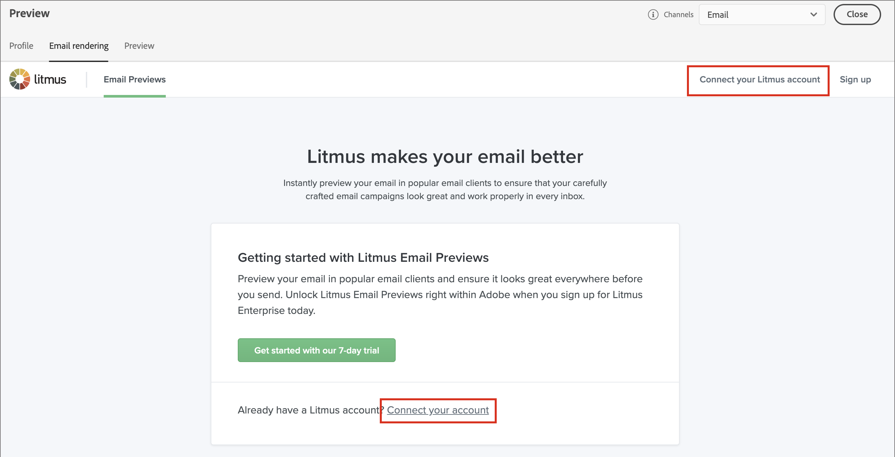
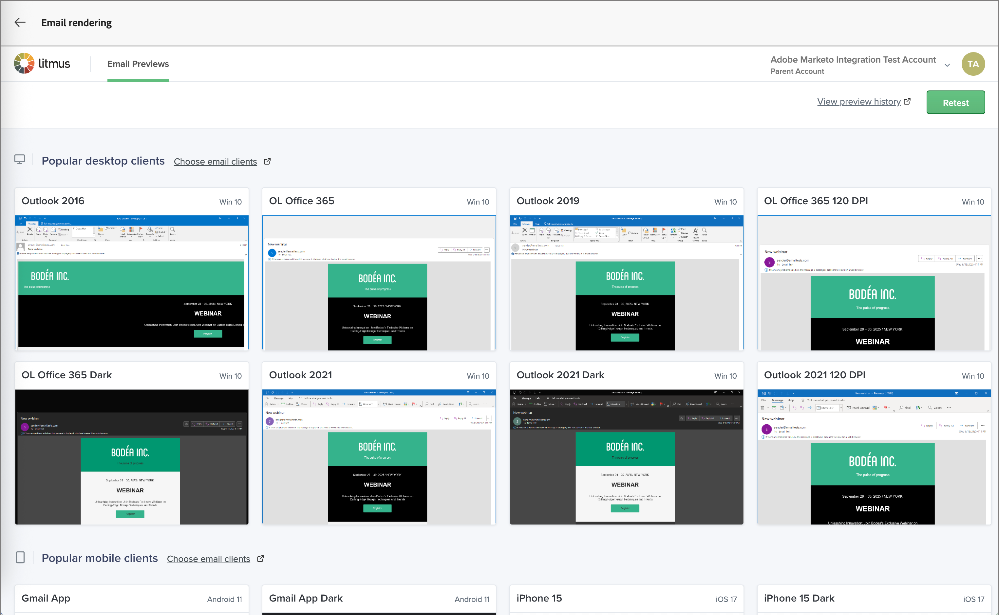

# 使用 Litmus 測試電子郵件轉譯

若要測試您的電子郵件，您可以利用Journey Optimizer B2B edition的[Litmus](https://www.litmus.com/email-testing){target="_blank"}企業帳戶。 透過這項整合，您可以在常用的電子郵件使用者端中預覽電子郵件呈現。 此工具可協助您確保電子郵件內容看起來不錯，並在每個收件匣中依設計運作。

>[!AVAILABILITY]
>
>這項整合僅適用於擁有Litmus Enterprise帳戶的Journey Optimizer B2B edition使用者。 如需詳細資訊，請參閱Litmus網站](https://www.litmus.com/solutions/esp/adobe-journey-optimizer){target="_blank"}上的[解決方案頁面。

1. 當您的電子郵件設計完成並準備好進行測試時，請在電子郵件設計空間按一下&#x200B;**[!UICONTROL 模擬內容]**。

1. 按一下右上角的&#x200B;**[!UICONTROL 轉譯電子郵件]**。

   {width="700" zoomable="yes"}

   如果您尚未從Journey Optimizer B2B edition連線至您的Litmus帳戶，則顯示的頁面會提供啟動試用帳戶或連線至現有帳戶的選項。

1. 按一下右上角的&#x200B;**[!UICONTROL 連線您的Litmus帳戶]**，或使用頁面內的連結。

   {width="700" zoomable="yes"}

1. 輸入您的Litmus帳戶認證，然後按一下&#x200B;**[!UICONTROL 登入]**。

1. 按一下「**[!UICONTROL 連線]**」以確認Litmus與Journey Optimizer B2B edition之間的連線，並傳送電子郵件內容以進行呈現。

   >[!IMPORTANT]
   >
   >將Litmus帳戶與Journey Optimizer B2B edition連線時，您同意將測試訊息傳送至Litmus。 然後，此內容會由Litmus管理，而非Adobe。 因此，Litmus資料保留電子郵件原則會套用至這些電子郵件，包括可能包含在測試訊息中的個人化資料。

1. 按一下右上角的&#x200B;**[!UICONTROL 執行測試]**&#x200B;以產生電子郵件預覽。

   {width="700" zoomable="yes"}

1. 在熱門的桌上型電腦、行動裝置和網頁型使用者端中檢查您的電子郵件內容。

   按一下顯示的縮圖可檢視任何演算後使用者端測試的詳細資料。

   {width="700" zoomable="yes"}

1. 當您完成檢閱時，請按一下左上方的向後箭頭（  ）以返回「模擬內容」頁面。

   您可以選取其他設定檔並執行另一個演算測試，或返回電子郵件設計空間根據您的稽核進行任何需要的調整。
